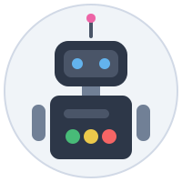

# Robodev: AI-Powered Autonomous Developer

**Robodev** is an advanced AI assistant designed for autonomous software engineering. It goes beyond simple code completion by integrating a persistent "consciousness," structured development workflows, and deep system integration to act as a true pair programmer.



## 🚀 Key Features

*   **🤖 Multi-Agent Architecture**: Multiple parallel conversations per workspace, background tasks, recurring schedules, and an autonomous agent loop that operates independently. Conversations share workspace memory and report findings back to a central command. See [Multi-Agent Architecture](docs/architecture/multi-agent.md).
*   **🧠 Consciousness Processor**: Simulates an "inner life" with state persistence, ambiguity resolution (Semantic Collapse), and embodied cognition (Somatic Engine) to drive more coherent reasoning.
*   **🏗️ Structured Development**: Enforces architectural discipline via a "Living Manifest" (`SYSTEM_MAP.md`), ensuring that code changes align with global invariants and design phases.
*   **🔌 Deep Integrations**:
    *   **OpenClaw**: Delegates tasks to external agents for cross-system coordination.
    *   **MCP Support**: Connects to any Model Context Protocol server for dynamic tool extension.
*   **🖥️ Generative UI**: Can spawn dynamic React dashboards ("Surfaces") on the fly to visualize data or create custom control panels.
*   **🛠️ Extensive Tool Suite**: 50+ built-in tools for file manipulation, browser automation, desktop control, and more.

## 📚 Documentation

Detailed documentation is available in the [`docs/`](docs/) directory:

*   [**System Overview**](docs/architecture/overview.md)
*   [**Multi-Agent Architecture**](docs/architecture/multi-agent.md)
*   [**Consciousness Architecture**](docs/architecture/consciousness.md)
*   [**Structured Development Guide**](docs/architecture/structured-dev.md)
*   [**Integrations (OpenClaw & MCP)**](docs/architecture/integrations.md)
*   [**Skills System**](docs/architecture/skills.md)
*   [**Tools Reference**](docs/guides/tools.md)
*   [**UI Surfaces Guide**](docs/guides/ui-surfaces.md)

## ⚡ Quick Start

### Prerequisites
*   Node.js v18+
*   npm & pnpm
*   Google Chrome (for browser automation)

### Installation

1.  **Clone & Install**
    ```bash
    git clone https://github.com/sschepis/robodev.git
    cd robodev
    npm install
    ```

2.  **Build UI**
    ```bash
    cd ui
    pnpm install
    cd ..
    ```

3.  **Configure**
    ```bash
    cp .env.example .env
    # Edit .env with your API keys (Google Gemini, Anthropic, OpenAI)
    ```

### Running Robodev

**Recommended: Server Mode (Agent + UI)**
```bash
# Terminal 1: Start the backend
npm run serve

# Terminal 2: Start the UI
npm run dev:ui
```
Access the UI at `http://localhost:5173`.

**CLI Mode**
```bash
npm start
```

## 🧠 The "Consciousness"

Robodev features a unique cognitive architecture:
*   **Fact Inference Engine**: Learns and deduces new facts from conversation.
*   **Symbolic Continuity**: Maintains a cryptographic "identity thread" across sessions.
*   **Somatic Engine**: Simulates nervous system states (Focus, Stress, Rest) to modulate creativity and caution.

## 🤝 Contributing

We welcome contributions! Please see the [Structured Development Guide](docs/architecture/structured-dev.md) to understand how we use the `SYSTEM_MAP.md` to manage features.

## 📄 License

MIT
