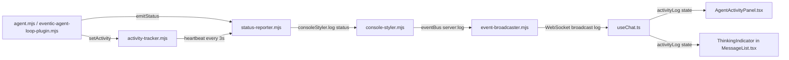

# Agent Status Reporting Redesign

## Problem Statement

The agent's status reporting is **opaque** — the user sees repetitive, content-free messages like:

```
📡 [STATUS] Thinking… (iteration 2) (3s)
📡 [STATUS] Thinking… (iteration 2) (6s)
📡 [STATUS] Thinking… (iteration 2) (9s)
... (repeats for 96+ seconds)
```

This gives **zero visibility** into what the agent is actually doing. The user cannot determine:
- Whether the agent is making progress or stuck in a loop
- What tool was called and why
- What data is being read or analyzed
- Whether to intervene or let it continue

This destroys user trust and makes the system feel broken even when it's working correctly.

## Current Architecture



### Key Files and Their Roles

| File | Role | Problem |
|------|------|---------|
| [`src/core/agentic/cognitive/agent.mjs`](src/core/agentic/cognitive/agent.mjs) | CognitiveAgent — orchestrates the 11-step cognitive loop | Emits vague statuses: `Thinking…`, `Processing input…`, `Thinking… (iteration N)` |
| [`src/core/eventic-agent-loop-plugin.mjs`](src/core/eventic-agent-loop-plugin.mjs) | EventicAgentLoopPlugin — the ACTOR_CRITIC_LOOP / EXECUTE_TOOLS handlers | Emits `Analyzing request…` or `Working (turn N)…` and `Executing: toolName` with no context |
| [`src/core/activity-tracker.mjs`](src/core/activity-tracker.mjs) | ActivityTracker — heartbeat that re-emits the current activity description every 3s with elapsed time | Only appends `(Ns)` to whatever vague string was set — `Thinking… (3s)`, `Thinking… (6s)` |
| [`src/core/status-reporter.mjs`](src/core/status-reporter.mjs) | StatusReporter — maps tool names to human-readable descriptions and emits them | Good tool descriptions exist but are only used when tools execute — not during reasoning phases |
| [`src/ui/console-styler.mjs`](src/ui/console-styler.mjs) | ConsoleStyler — formats and emits log events to eventBus | Pass-through, no changes needed |
| [`src/server/event-broadcaster.mjs`](src/server/event-broadcaster.mjs) | EventBroadcaster — subscribes to eventBus and broadcasts to WebSocket clients | Pass-through, no changes needed |
| [`ui/src/hooks/useChat.ts`](ui/src/hooks/useChat.ts) | useChat hook — receives `log` events and pushes to `activityLog` state | Pass-through, no changes needed |
| [`ui/src/components/chat/AgentActivityPanel.tsx`](ui/src/components/chat/AgentActivityPanel.tsx) | AgentActivityPanel — renders the latest status and expandable log | Already renders whatever text comes through; no changes needed |

## Root Cause Analysis

The problem is entirely **server-side in the status emission points**. The UI pipeline faithfully renders whatever text is emitted. The issue is that the emitted text is meaningless.

### Specific Emission Points and Their Problems

#### 1. CognitiveAgent.turn() — lmscript path (lines 207, 264-265, 278, 342)
```javascript
this._tracker.setActivity('Processing input…');       // → What input? How long?
emitStatus('Thinking…');                               // → About what?
this._tracker.setActivity('Thinking…');                // → Same thing, no context
this._tracker.setActivity(`Thinking… (iteration ${iteration})`); // → iteration of what?
```

#### 2. CognitiveAgent._turnLegacy() (lines 537, 644, 1082)
```javascript
this._tracker.setActivity('Processing input…');         // → Same problem
this._tracker.setActivity('Thinking…');                 // → Same problem
this._tracker.setActivity(`Thinking… (round ${toolRounds + 1})`); // → Better but still vague
```

#### 3. EventicAgentLoopPlugin — ACTOR_CRITIC_LOOP (line 240)
```javascript
emitStatus(ctx.turnNumber === 1 ? 'Analyzing request…' : `Working (turn ${ctx.turnNumber})…`);
```
Good that it differentiates turn 1, but `Working (turn 3)…` tells the user nothing.

#### 4. EventicAgentLoopPlugin — EXECUTE_TOOLS (lines 388-389)
```javascript
emitStatus(`Executing: ${toolNamesStr}`);  // → Lists tool names but not arguments
```
"Executing: read_conversation_history" is slightly better but doesn't say WHY or with what parameters.

## Design: Narrated Agent Loop

### Principle: Every status update should answer "What is the agent doing and why?"

The user should be able to read the activity log like a narration:

```
📡 [STATUS] Analyzing your request: "if you read through our conversation..."
📡 [STATUS] Selecting relevant plugins for this task
📡 [STATUS] Checking safety constraints — passed
📡 [STATUS] Building context with 3 recalled memories
📡 [STATUS] Sending request to Claude claude-opus-4-6 — waiting for response…
📡 [STATUS] Waiting for AI response… (12s)
📡 [STATUS] AI decided to call tool: read_conversation_history (limit: 50)
📡 [STATUS] Running Read Conversation History — fetching last 50 messages…
📡 [STATUS] Tool completed: read_conversation_history — got 50 messages
📡 [STATUS] Sending tool results back to AI for analysis… (round 2)
📡 [STATUS] Waiting for AI response… (8s)
📡 [STATUS] AI is composing final response
📡 [STATUS] Validating response quality — R=0.82, passed
📡 [STATUS] Response ready
```

Compare with current output:
```
📡 [STATUS] Processing input…
📡 [STATUS] Checking safety constraints
📡 [STATUS] Building context
📡 [STATUS] Thinking…
📡 [STATUS] Thinking… (3s)
📡 [STATUS] Thinking… (6s)
... (96 seconds of this)
📡 [STATUS] Executing tool: read_conversation_history
📡 [STATUS] Executing: read_conversation_history (3s)
... (99 seconds of this)
📡 [STATUS] Thinking… (iteration 2)
📡 [STATUS] Thinking… (iteration 2) (3s)
... (another 96 seconds)
```

### Changes Required

All changes are **server-side only**. The UI pipeline is already correct — it renders whatever text it receives. We just need to send better text.

---

### Change 1: `status-reporter.mjs` — Add `summarizeInput()` helper

Add a utility function that creates a short, safe summary of user input for inclusion in status messages. This is used throughout the agent loop to provide context.

```javascript
/**
 * Create a short summary of user input for status messages.
 * Truncates to ~60 chars, removes newlines, adds quotes.
 * @param {string} input
 * @returns {string} — e.g. '"read through our conversation and..."'
 */
export function summarizeInput(input) {
    if (!input) return '';
    const clean = input.replace(/[\r\n]+/g, ' ').trim();
    if (clean.length <= 60) return `"${clean}"`;
    return `"${clean.substring(0, 57)}…"`;
}
```

Also add a `describeToolCall()` helper that produces richer descriptions than `emitToolStatus()` by including key argument values:

```javascript
/**
 * Produce a descriptive narration for a tool call including key arguments.
 * More verbose than emitToolStatus — designed for the activity log narration.
 * @param {string} toolName
 * @param {Object} args
 * @returns {string}
 */
export function describeToolCall(toolName, args) {
    // Use existing TOOL_STATUS_MAP for base description
    const generator = TOOL_STATUS_MAP[toolName];
    let base;
    if (generator) {
        try { base = generator(args || {}); } catch { base = `Running ${_humanize(toolName)}`; }
    } else if (toolName.startsWith('mcp_')) {
        const parts = toolName.replace(/^mcp_/, '').split('_');
        base = `Using MCP tool: ${parts.slice(1).join('_')} (${parts[0]})`;
    } else {
        base = `Running ${_humanize(toolName)}`;
    }

    // Append key argument details for common tools
    const details = [];
    if (args) {
        if (args.query && !base.includes(args.query)) details.push(`query: "${_truncate(args.query, 40)}"`);
        if (args.limit) details.push(`limit: ${args.limit}`);
        if (args.path && !base.includes(args.path)) details.push(`path: ${_short(args.path)}`);
    }

    return details.length > 0 ? `${base} (${details.join(', ')})` : base;
}
```

---

### Change 2: `activity-tracker.mjs` — Add phase context to heartbeat

The heartbeat currently appends only elapsed time. Enhance it to also track a `phase` so the heartbeat messages are more informative.

```javascript
/**
 * Set the current activity description with an optional phase context.
 * @param {string} description — e.g. "Waiting for AI response"
 * @param {Object} [opts]
 * @param {string} [opts.phase] — high-level phase: 'llm-call', 'tool-exec', 'processing'
 */
setActivity(description, opts = {}) {
    this._stopped = false;
    this._activity = description;
    this._phase = opts.phase || null;
    this._startedAt = Date.now();
    
    emitStatus(description);
    
    this._clearTimer();
    this._timer = setInterval(() => this._tick(), this.intervalMs);
    if (this._timer.unref) this._timer.unref();
}
```

Update `_tick()` to use phase-aware messaging:

```javascript
_tick() {
    if (this._stopped || !this._activity) return;
    const elapsed = Math.round((Date.now() - this._startedAt) / 1000);
    
    // For LLM calls, indicate we're waiting rather than "thinking"
    if (this._phase === 'llm-call') {
        emitStatus(`Waiting for AI response… (${elapsed}s)`);
    } else if (this._phase === 'tool-exec') {
        emitStatus(`${this._activity} (${elapsed}s)`);
    } else {
        emitStatus(`${this._activity} (${elapsed}s)`);
    }
}
```

---

### Change 3: `cognitive/agent.mjs` — Narrate the cognitive loop

Replace all vague status messages with descriptive narrations. Here is a complete mapping of every `emitStatus()` / `_tracker.setActivity()` call and what it should become:

#### `turn()` method — lmscript path

| Line | Current | Proposed |
|------|---------|----------|
| 207 | `Processing input…` | `Analyzing your request: ${summarizeInput(input)}` |
| 211 | `Checking safety constraints` | `Checking safety constraints` — OK as-is, but add outcome: `Safety check passed` or `Safety warning: ${violation}` |
| 232 | `Building context` | `Building context — selecting relevant plugins and memories` |
| 264 | `Thinking…` | `Sending request to AI model — waiting for response…` with `phase: 'llm-call'` |
| 265 | `Thinking…` | `Waiting for AI response…` with `phase: 'llm-call'` |
| 271 | `Executing tool: ${toolCall.name}` | `AI called tool: ${describeToolCall(toolCall.name, toolCall.args)}` |
| 272 | `Executing: ${toolCall.name}` | Same as above, with `phase: 'tool-exec'` |
| 278 | `Thinking… (iteration ${iteration})` | `AI processing tool results — iteration ${iteration}` with `phase: 'llm-call'` |
| 305 | `Continuing work… (continuation ${continuations})` | `Response incomplete — continuing work (${continuations}/${maxContinuations})` |
| 306 | `Response appears incomplete — continuing (${continuations}/${maxContinuations})` | Keep as-is — already good |
| 338 | `Executing tool: ${toolCall.name}` | `AI called tool: ${describeToolCall(toolCall.name, toolCall.args)}` |
| 342 | `Thinking… (continuation ${continuations}, iteration ${iteration})` | `AI processing results — continuation ${continuations}, iteration ${iteration}` with `phase: 'llm-call'` |
| 365 | `Validating response quality` | `Validating response quality` — OK |
| 384 | `Storing interaction in memory` | `Storing interaction in memory` — OK |
| 388 | `Evolving cognitive state` | Remove — this is internal noise, users don't care |
| 398 | `Response ready` | `Response ready` — OK |
| 424 | `Synthesizing from tool results…` | `AI iteration limit reached — synthesizing response from ${collectedToolCalls.length} tool results` |

#### `_turnLegacy()` method

| Line | Current | Proposed |
|------|---------|----------|
| 537 | `Processing input…` | `Analyzing your request: ${summarizeInput(input)}` |
| 557 | `Recalling relevant memories` | `Searching memory for relevant context` |
| 569 | `Building context` | `Building context with ${memories.length} memories and ${toolDefs.length} available tools` |
| 644 | `Thinking…` | `Sending request to AI model — waiting for response…` with `phase: 'llm-call'` |
| 1064 | `Executing tools: ${roundToolNames.join(', ')}` | `AI requested ${roundToolNames.length} tool(s): ${roundToolNames.join(', ')}` |
| 1082 | `Thinking… (round ${toolRounds + 1})` | `Sending tool results to AI — round ${toolRounds + 1}` with `phase: 'llm-call'` |

#### `_processToolCalls()` method

After each tool execution, add a completion status:
```javascript
emitStatus(`Tool completed: ${toolCall.function.name}`);
```

#### `_executeTool()` method — line 1504

| Line | Current | Proposed |
|------|---------|----------|
| 1504 | `Executing: ${name}` | `Executing tool: ${describeToolCall(name, parsedArgs)}` with `phase: 'tool-exec'` |

---

### Change 4: `eventic-agent-loop-plugin.mjs` — Narrate the actor-critic loop

#### `ACTOR_CRITIC_LOOP` handler

| Line | Current | Proposed |
|------|---------|----------|
| 240 | `Analyzing request…` (turn 1) or `Working (turn N)…` | Turn 1: `Analyzing request: ${summarizeInput(input)}` / Turn N: `Continuing work — turn ${ctx.turnNumber}/${ctx.maxTurns}, ${ctx.toolCallCount} tools called so far` |

Add status after tool calls branch detection (line 345-346):
```javascript
emitStatus(`AI requested ${response.toolCalls.length} tool call(s) — executing…`);
```

Add status for text response quality check (line 352):
```javascript
emitStatus('AI provided a text response — checking quality…');
```

#### `EXECUTE_TOOLS` handler

| Line | Current | Proposed |
|------|---------|----------|
| 389 | `Executing: ${toolNamesStr}` | `Executing ${toolCalls.length} tool(s): ${toolNamesStr}` |

Add per-tool start/completion status inside the loop:
```javascript
// Before each tool (line 400+):
emitStatus(`Running tool ${i+1}/${toolCalls.length}: ${describeToolCall(functionName, args)}`);

// After each tool completion:
const isError = /^error:/i.test(toolResultText.trim());
emitStatus(`Tool ${functionName} ${isError ? 'failed' : 'completed'}`);
```

| Line | Current | Proposed |
|------|---------|----------|
| 466 | `Completed ${toolCalls.length} tool(s), continuing…` | `All ${toolCalls.length} tool(s) completed — sending results back to AI` |

---

### Change 5: Remove internal-only status noise

Some status messages are about internal cognitive mechanics that the user doesn't care about and only add noise:

- `Evolving cognitive state` — Remove. Internal physics tick.
- `Storing interaction in memory` — Keep but move to lower log level or make conditional.

---

## Implementation Order

1. **`status-reporter.mjs`** — Add `summarizeInput()` and `describeToolCall()` exports
2. **`activity-tracker.mjs`** — Add `phase` support to `setActivity()` and phase-aware `_tick()`
3. **`cognitive/agent.mjs`** — Replace all vague status messages using the new helpers
4. **`eventic-agent-loop-plugin.mjs`** — Replace all vague status messages using the new helpers
5. **Test** — Run the agent and verify the log output is narrated

## Expected Result

After implementation, the user will see a narrated activity log like:

```
10:15:32 STATUS Analyzing your request: "if you read through our conversation..."
10:15:32 STATUS Checking safety constraints — passed
10:15:33 STATUS Selecting relevant plugins for this task
10:15:33 STATUS Building context with 3 memories and 47 available tools
10:15:34 STATUS Sending request to AI model — waiting for response…
10:15:37 STATUS Waiting for AI response… (3s)
10:15:40 STATUS Waiting for AI response… (6s)
10:15:41 STATUS AI called tool: Reading conversation history (limit: 50)
10:15:42 STATUS Executing tool: read_conversation_history (limit: 50)
10:15:45 STATUS Executing tool: read_conversation_history (3s)
10:16:39 STATUS Tool completed: read_conversation_history
10:16:39 STATUS All tools completed — sending results back to AI
10:16:39 STATUS Sending tool results to AI — iteration 2
10:16:42 STATUS Waiting for AI response… (3s)
10:17:35 STATUS AI is composing final response
10:17:36 STATUS Validating response quality — R=0.82, passed
10:17:36 STATUS Response ready
```

vs. current:
```
10:15:32 STATUS Processing input…
10:15:32 STATUS Checking safety constraints
10:15:33 STATUS Building context
10:15:34 STATUS Thinking…
10:15:37 STATUS Thinking… (3s)
10:15:40 STATUS Thinking… (6s)
10:15:41 STATUS Executing tool: read_conversation_history
10:15:45 STATUS Executing: read_conversation_history (3s)
... (96 seconds)
10:16:39 STATUS Thinking… (iteration 2)
10:16:42 STATUS Thinking… (iteration 2) (3s)
... (96 seconds)
```

## Files Modified (Summary)

| File | Change Type | Scope |
|------|------------|-------|
| [`src/core/status-reporter.mjs`](src/core/status-reporter.mjs) | Add functions | `summarizeInput()`, `describeToolCall()` |
| [`src/core/activity-tracker.mjs`](src/core/activity-tracker.mjs) | Modify | Add `phase` to `setActivity()`, phase-aware `_tick()` |
| [`src/core/agentic/cognitive/agent.mjs`](src/core/agentic/cognitive/agent.mjs) | Modify | ~20 status message replacements across `turn()`, `_turnLegacy()`, `_processToolCalls()`, `_executeTool()` |
| [`src/core/eventic-agent-loop-plugin.mjs`](src/core/eventic-agent-loop-plugin.mjs) | Modify | ~8 status message replacements across `ACTOR_CRITIC_LOOP`, `EXECUTE_TOOLS` |

**No UI changes required.** The pipeline from status emission to screen is already correct — the problem is entirely in the quality of emitted text.
