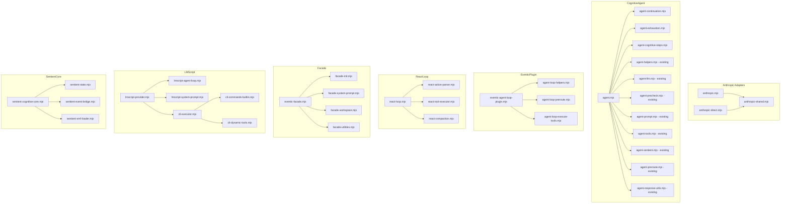

# Agentic Loop Decomposition Plan

> Design document for refactoring all agentic loop files over 500 lines into smaller, well-organized modules.

## Guiding Principles

1. **ONE path, no fallbacks.** lmscript is a guaranteed dependency. Remove ALL `_turnLegacy()`, `if (!this._runtime)` checks, and `try/catch → legacy` patterns.
2. **~200–400 lines per file max.** Each file should have a single, clear responsibility.
3. **Deduplicate shared code.** Especially the two Anthropic adapters which share ~300 lines of identical logic.

---

## Table of Contents

1. [agent.mjs — Legacy Removal & Split](#1-agentmjs--1076-lines)
2. [eventic-agent-loop-plugin.mjs — Handler Extraction](#2-eventic-agent-loop-pluginmjs--1178-lines)
3. [react-loop.mjs — Method Extraction](#3-react-loopmjs--935-lines)
4. [eventic-facade.mjs — Responsibility Separation](#4-eventic-facademjs--878-lines)
5. [lmscript-provider.mjs — Loop & Prompt Extraction](#5-lmscript-providermjs--819-lines)
6. [cli-executor.mjs — Command Handler Extraction](#6-cli-executormjs--728-lines)
7. [sentient-cognitive-core.mjs — API Surface Splitting](#7-sentient-cognitive-coremjs--714-lines)
8. [Anthropic Adapters — Deduplication](#8-anthropic-adapters--580--558-lines)
9. [Dependency Graph](#dependency-graph)
10. [Migration Strategy](#migration-strategy)

---

## 1. `agent.mjs` — 1076 lines

**Location:** `src/core/agentic/cognitive/agent.mjs`

### Problem

- `_turnLegacy()` (lines 648–885) is ~240 lines of duplicated hand-rolled agent loop
- `turn()` has a `if (!this._runtime)` fallback to `_turnLegacy()` at line 287
- `catch` block at line 614 falls back to `_turnLegacy()` on any lmscript error
- `_adaptLegacyResult()` only exists to bridge legacy return shape
- ~100 lines of thin wrapper methods (lines 887–1023) that just delegate to sub-modules

### Changes

#### A. Remove Legacy Code (delete ~280 lines)

| What to remove | Lines | Rationale |
|---|---|---|
| `_turnLegacy()` method | 648–885 | lmscript is guaranteed — no fallback needed |
| `if (!this._runtime)` check in `turn()` | 287–291 | Runtime is always present |
| `catch → _turnLegacy()` fallback | 614–625 | Keep iteration-exhaustion recovery, remove general legacy fallback |
| `_adaptLegacyResult()` wrapper | 982–984 | No legacy results to adapt |
| `import { _adaptLegacyResult }` | 59 | Dead import |

#### B. Extract `agent-continuation.mjs` (~120 lines)

**New file:** `src/core/agentic/cognitive/agent-continuation.mjs`

```
export function runContinuationLoop(agent, runtime, agentFn, result, options)
```

Extracts lines 414–489 from `turn()` — the continuation logic that detects intent-announcement responses and nudges the model to take action. Returns `{ responseText, result }`.

#### C. Extract `agent-exhaustion.mjs` (~100 lines)

**New file:** `src/core/agentic/cognitive/agent-exhaustion.mjs`

```
export async function synthesizeFromExhaustion(agent, input, collectedToolCalls, options)
```

Extracts lines 532–611 from the `catch` block — the iteration-exhaustion recovery that synthesizes a response from tool results when lmscript hits the iteration limit.

#### D. Extract `agent-cognitive-steps.mjs` (~80 lines)

**New file:** `src/core/agentic/cognitive/agent-cognitive-steps.mjs`

```
export function runCognitivePreSteps(agent, input, options)
export function runCognitivePostSteps(agent, input, responseText)
```

Extracts the cognitive pipeline steps that bookend the LLM call:
- Pre-steps: `processInput()`, `checkSafety()`, trait selection, system prompt build (lines 301–348)
- Post-steps: `validateOutput()`, history update, `remember()`, `tick()` (lines 492–522)

#### E. Resulting `agent.mjs` (~350 lines)

The refactored file retains:
- Constructor (~60 lines)
- `initRuntime()` (~6 lines)
- `turn()` — streamlined to ~120 lines calling extracted helpers
- Sentient wrappers (~30 lines)
- Thin delegation wrappers (~80 lines) — these stay because they bind `this`
- Lifecycle methods: `stopTracking()`, `getStats()`, `reset()`, `dispose()` (~40 lines)

### New File Summary

| New File | Lines | Exports |
|---|---|---|
| `agent-continuation.mjs` | ~120 | `runContinuationLoop()` |
| `agent-exhaustion.mjs` | ~100 | `synthesizeFromExhaustion()` |
| `agent-cognitive-steps.mjs` | ~80 | `runCognitivePreSteps()`, `runCognitivePostSteps()` |
| **agent.mjs (refactored)** | **~350** | `CognitiveAgent` (unchanged export) |

---

## 2. `eventic-agent-loop-plugin.mjs` — 1178 lines

**Location:** `src/core/eventic-agent-loop-plugin.mjs`

### Problem

Three massive handler registrations in a single `install()` function, plus ~300 lines of helper functions at module scope. The `AGENT_START` handler alone is ~200 lines.

### Changes

#### A. Extract `agent-loop-helpers.mjs` (~200 lines)

**New file:** `src/core/agent-loop-helpers.mjs`

```
export function purgeTransientMessages(engine)
export async function gracefulCleanup(ctx, engine)
export function setupErrorListener(ctx)
export function cleanupErrorListener(ctx)
export function evaluateTextResponse(content, input, retryCount)
export function evaluateToolResults(ctx, toolNames, results)
export function hasToolError(content)
export const PROCEED_SENTINEL
export const PRECHECK_PROMPT
```

Extracts all module-level helper functions (lines 14–220).

#### B. Extract `agent-loop-preroute.mjs` (~200 lines)

**New file:** `src/core/agent-loop-preroute.mjs`

```
export async function preRouteFiles(input, tools)
export function detectSurfaceUpdateIntent(input)
export async function preRouteSurfaces(input, tools, surfaceIntent)
export function classifyInputComplexity(input)
```

Extracts pre-routing and classification logic (lines 231–475).

#### C. Extract `agent-loop-execute-tools.mjs` (~180 lines)

**New file:** `src/core/agent-loop-execute-tools.mjs`

```
export async function executeToolsHandler(ctx, payload, log, dispatch, engine)
export const TASK_TOOLS
```

Extracts the `EXECUTE_TOOLS` handler (lines 949–1171) and the `TASK_TOOLS` definition (lines 100–153).

#### D. Resulting `eventic-agent-loop-plugin.mjs` (~400 lines)

Retains:
- `AGENT_START` handler — slimmed by delegating to extracted helpers
- `ACTOR_CRITIC_LOOP` handler — uses imported helpers
- `SYNTHESIZE_RESPONSE` handler (trivial)
- Plugin `install()` wrapper

### New File Summary

| New File | Lines | Exports |
|---|---|---|
| `agent-loop-helpers.mjs` | ~200 | 8 functions + 2 constants |
| `agent-loop-preroute.mjs` | ~200 | 4 functions |
| `agent-loop-execute-tools.mjs` | ~180 | `executeToolsHandler()`, `TASK_TOOLS` |
| **plugin (refactored)** | **~400** | `EventicAgentLoopPlugin` (unchanged) |

---

## 3. `react-loop.mjs` — 935 lines

**Location:** `src/core/agentic/megacode/react-loop.mjs`

### Problem

Single monolithic class with a ~210-line `execute()` method and multiple long private methods. The JSON parsing logic (~150 lines) is independently testable.

### Changes

#### A. Extract `react-action-parser.mjs` (~160 lines)

**New file:** `src/core/agentic/megacode/react-action-parser.mjs`

```
export function parseAction(response)
export function normaliseAction(parsed)
export function tryParseJSON(str)
export function extractBalancedJSON(text, startIndex)
```

Extracts lines 483–627: all JSON/action parsing logic. These are pure functions with no class state dependency.

#### B. Extract `react-tool-executor.mjs` (~80 lines)

**New file:** `src/core/agentic/megacode/react-tool-executor.mjs`

```
export async function executeTool(toolName, args, deps, options, runMetrics)
export function getAvailableTools(deps)
```

Extracts lines 646–678 and 866–874.

#### C. Extract `react-compaction.mjs` (~100 lines)

**New file:** `src/core/agentic/megacode/react-compaction.mjs`

```
export async function handleCompaction(compaction, messages, conversationTurns, deps, options, tracker)
export async function synthesizeAtLimit(maxIterations, systemPrompt, conversationTurns, allToolCalls, deps, options, budget)
```

Extracts lines 698–812: compaction and synthesis-at-limit logic.

#### D. Resulting `react-loop.mjs` (~400 lines)

Retains:
- Constructor
- `execute()` — the main while-loop, now calling imported helpers
- `_callLLMWithRetry()` and `_callLLM()` — LLM interaction
- Utility methods: `_checkAbort()`, `_sleep()`, `_emitProgress()`, `_buildMetadata()`, `reset()`

### New File Summary

| New File | Lines | Exports |
|---|---|---|
| `react-action-parser.mjs` | ~160 | 4 functions |
| `react-tool-executor.mjs` | ~80 | 2 functions |
| `react-compaction.mjs` | ~100 | 2 functions |
| **react-loop.mjs (refactored)** | **~400** | `ReactLoop` (unchanged) |

---

## 4. `eventic-facade.mjs` — 878 lines

**Location:** `src/core/eventic-facade.mjs`

### Problem

The constructor alone is ~210 lines. The class mixes initialization, run/stream orchestration, conversation management delegation, agentic provider management, system prompt building, and utility methods.

### Changes

#### A. Extract `facade-init.mjs` (~180 lines)

**New file:** `src/core/facade-init.mjs`

```
export function initializeFacade(facade, workingDir, options)
export function initToolExecutor(facade)
export function getAgenticDeps(facade)
```

Extracts the constructor's initialization logic: manager creation, engine setup, plugin wiring, agentic provider registration. The constructor calls `initializeFacade(this, workingDir, options)`.

#### B. Extract `facade-system-prompt.mjs` (~80 lines)

**New file:** `src/core/facade-system-prompt.mjs`

```
export async function updateSystemPrompt(facade)
export async function loadConversation(facade)
export function getPluginsSummary(facade)
```

Extracts `updateSystemPrompt()` (lines 456–486), `loadConversation()` (lines 590–670), and `_getPluginsSummary()` (lines 446–454).

#### C. Extract `facade-workspace.mjs` (~100 lines)

**New file:** `src/core/facade-workspace.mjs`

```
export async function changeWorkingDirectory(facade, newDir)
```

Extracts `changeWorkingDirectory()` (lines 488–565) — a self-contained operation that reinitializes workspace-scoped managers.

#### D. Extract `facade-utilities.mjs` (~120 lines)

**New file:** `src/core/facade-utilities.mjs`

```
export async function generateCodeCompletion(facade, fileContent, cursorOffset, filePath)
export async function generateNextSteps(facade, userInput, aiResponse)
```

Extracts `generateCodeCompletion()` (lines 751–782) and `generateNextSteps()` (lines 784–877).

#### E. Resulting `eventic-facade.mjs` (~350 lines)

Retains:
- Constructor (now slim — delegates to `initializeFacade()`)
- `run()` and `runStream()` — core orchestration
- `queueChimeIn()` / `drainGuidanceQueue()` / `getGuidanceQueue()` — guidance queue
- Agentic provider management: `listAgenticProviders()`, `getActiveAgenticProvider()`, `switchAgenticProvider()`
- Simple delegating methods for conversations, sessions, etc.
- Property accessors: `isBusy()`, `allTools`, `model`

### New File Summary

| New File | Lines | Exports |
|---|---|---|
| `facade-init.mjs` | ~180 | 3 functions |
| `facade-system-prompt.mjs` | ~80 | 3 functions |
| `facade-workspace.mjs` | ~100 | 1 function |
| `facade-utilities.mjs` | ~120 | 2 functions |
| **eventic-facade.mjs (refactored)** | **~350** | `EventicFacade` (unchanged) |

---

## 5. `lmscript-provider.mjs` — 819 lines

**Location:** `src/core/agentic/lmscript/lmscript-provider.mjs`

### Problem

The `_agentLoop()` method is ~160 lines. System prompt building is ~70 lines. The `run()` method includes a precheck that duplicates logic from the cognitive agent.

### Changes

#### A. Extract `lmscript-agent-loop.mjs` (~200 lines)

**New file:** `src/core/agentic/lmscript/lmscript-agent-loop.mjs`

```
export async function agentLoop(provider, input, options, streamManager)
export function extractResponseIfTerminal(action)
export function isIncompleteResponse(response)
```

Extracts `_agentLoop()` (lines 240–400) and its two helper methods (lines 679–733).

#### B. Extract `lmscript-system-prompt.mjs` (~100 lines)

**New file:** `src/core/agentic/lmscript/lmscript-system-prompt.mjs`

```
export function getSystemPrompt(provider)
export function buildSystemPromptBase(persona, availableCommands)
export function buildUserPrompt(observation, commandResult, associativeContext, recentHistory)
```

Extracts `_getSystemPrompt()` (lines 532–553), `_buildSystemPromptBase()` (lines 564–599), and `_buildUserPrompt()` (lines 609–642).

#### C. Resulting `lmscript-provider.mjs` (~400 lines)

Retains:
- Class definition with `id`, `name`, `description`
- `initialize()` — memory + executor setup
- `run()` — streamlined entry point
- `_callLLMForAction()` and `_executeLLMCall()` — LLM interaction
- `_getRecentHistory()` — history formatting
- Utility: `_shouldSkipPrecheck()`, `_checkAbort()`, `_pushCommandHistory()`
- Diagnostics: `getMemory()`, `getExecutor()`, `getDiagnostics()`, `dispose()`

### New File Summary

| New File | Lines | Exports |
|---|---|---|
| `lmscript-agent-loop.mjs` | ~200 | 3 functions |
| `lmscript-system-prompt.mjs` | ~100 | 3 functions |
| **provider (refactored)** | **~400** | `LMScriptProvider` (unchanged) |

---

## 6. `cli-executor.mjs` — 728 lines

**Location:** `src/core/agentic/lmscript/cli-executor.mjs`

### Problem

10 built-in command handlers bloat the class. The `_cmdCreate()` and `_executeDynamicTool()` methods use `vm` and are independently testable.

### Changes

#### A. Extract `cli-commands-builtin.mjs` (~250 lines)

**New file:** `src/core/agentic/lmscript/cli-commands-builtin.mjs`

```
export function createBuiltinHandlers(executor)
// Returns Map of command name → handler function
// Includes: RECALL, REMEMBER, GLOBAL_RECALL, GLOBAL_REMEMBER, ECHO, HTTP_GET, TOOLS, TOOL, NOOP
```

Extracts all `_cmd*` methods (lines 351–607) as standalone functions receiving the executor as context.

#### B. Extract `cli-dynamic-tools.mjs` (~120 lines)

**New file:** `src/core/agentic/lmscript/cli-dynamic-tools.mjs`

```
export function createDynamicTool(executor, args)
export async function executeDynamicTool(executor, cmdName, cmdArgs, pipeData, context)
export const SANDBOX_TEMPLATE
export function checkSSRF(urlString)
```

Extracts `_cmdCreate()` (lines 435–492), `_executeDynamicTool()` (lines 617–669), `SANDBOX_TEMPLATE` (lines 45–63), and `checkSSRF()` (lines 71–106).

#### C. Resulting `cli-executor.mjs` (~300 lines)

Retains:
- Constructor — wires up builtins from `createBuiltinHandlers()`
- `execute()` — pipe parsing and dispatch
- `_splitPipe()` — quote-aware pipe splitting
- `_dispatch()` — command routing
- `_resolveToolName()` — tool name resolution
- `_extractQuotedOrRaw()`, `_withTimeout()`
- `getAvailableCommands()`, `getDynamicToolInfo()`, `listDynamicTools()`

### New File Summary

| New File | Lines | Exports |
|---|---|---|
| `cli-commands-builtin.mjs` | ~250 | `createBuiltinHandlers()` |
| `cli-dynamic-tools.mjs` | ~120 | 4 exports |
| **cli-executor.mjs (refactored)** | **~300** | `CLIExecutor` (unchanged) |

---

## 7. `sentient-cognitive-core.mjs` — 714 lines

**Location:** `src/core/agentic/cognitive/sentient-cognitive-core.mjs`

### Problem

Single class mixing CognitiveCore-compatible API proxies, sentient-specific extended API, and internal plumbing. The `getStateContext()` method alone is ~70 lines.

### Changes

#### A. Extract `sentient-state.mjs` (~120 lines)

**New file:** `src/core/agentic/cognitive/sentient-state.mjs`

```
export function getStateContext(core)
export function getDiagnostics(core)
export function toJSON(core)
export function loadFromJSON(core, data)
```

Extracts state introspection and serialization methods (lines 225–608).

#### B. Extract `sentient-event-bridge.mjs` (~60 lines)

**New file:** `src/core/agentic/cognitive/sentient-event-bridge.mjs`

```
export function wireEvents(core)
```

Extracts `_wireEvents()` (lines 676–710) and the event mapping table.

#### C. Extract `sentient-smf-loader.mjs` (~55 lines)

**New file:** `src/core/agentic/cognitive/sentient-smf-loader.mjs`

```
export function loadSMFAxesLabels()
export function getSMFAxesLabels()
```

Extracts the lazy SMF axes loading logic (lines 34–54).

#### D. Resulting `sentient-cognitive-core.mjs` (~400 lines)

Retains:
- Constructor
- CognitiveCore-compatible API: `processInput()`, `validateOutput()`, `remember()`, `recall()`, `createGoal()`, `tick()`, `checkSafety()`, `reset()`
- Sentient extensions: `processTextAdaptive()`, `introspect()`, `getAdaptiveStats()`, `getStatus()`
- Background tick: `startBackground()`, `stopBackground()`, `isBackgroundRunning()`
- `getEmitter()`, `createEvolutionStream()`
- Internal: `_forceTick()`, `_syncState()`

### New File Summary

| New File | Lines | Exports |
|---|---|---|
| `sentient-state.mjs` | ~120 | 4 functions |
| `sentient-event-bridge.mjs` | ~60 | 1 function |
| `sentient-smf-loader.mjs` | ~55 | 2 functions |
| **core (refactored)** | **~400** | `SentientCognitiveCore` (unchanged) |

---

## 8. Anthropic Adapters — 580 + 558 lines

**Location:**
- `src/core/ai-provider/adapters/anthropic.mjs` (580 lines) — Vertex SDK
- `src/core/ai-provider/adapters/anthropic-direct.mjs` (558 lines) — raw REST fetch

### Problem

Both files contain **near-identical** implementations of:
- `BLOCKED_KEYWORDS` constant
- `sanitizeInputSchema()` (~65 lines each)
- `_toContentArray()` (~4 lines each)
- `translateMessages()` (~100 lines each)
- `buildAnthropicBody()` (~60 lines each)
- `mapFinishReason()` (~8 lines each)
- `anthropicResponseToOpenai()` (~40 lines each)

Total shared code: **~280 lines duplicated**.

The ONLY differences:
1. **Non-streaming call:** `anthropic.mjs` uses Vertex SDK `client.messages.stream()` → `finalMessage()`; `anthropic-direct.mjs` uses `fetch()` with `withRetry()`
2. **Streaming call:** `anthropic.mjs` iterates SDK stream events directly; `anthropic-direct.mjs` reads raw SSE from `response.body`
3. **`additionalProperties` sanitization:** `anthropic.mjs` checks `!== false`, `anthropic-direct.mjs` checks `typeof === 'object'`. The `anthropic.mjs` version is more correct (handles `true` as well). **Use `anthropic.mjs` version.**

### Changes

#### A. Create `anthropic-shared.mjs` (~280 lines)

**New file:** `src/core/ai-provider/adapters/anthropic-shared.mjs`

```
export const DEFAULT_MAX_TOKENS
export const BLOCKED_KEYWORDS
export function sanitizeInputSchema(schema)
export function translateMessages(openaiMessages)
export function buildAnthropicBody(requestBody, model)
export function mapFinishReason(stopReason)
export function anthropicResponseToOpenai(anthropicResponse)
```

Contains all shared logic. Uses the `anthropic.mjs` version of `sanitizeInputSchema()` (the more correct one that handles `additionalProperties: true`).

#### B. Refactored `anthropic.mjs` (~200 lines)

Retains only Vertex-SDK-specific code:
- `getClient()` — SDK singleton
- `resetAnthropicClient()` — client reset
- `callAnthropicREST()` — non-streaming via SDK
- `callAnthropicRESTStream()` — streaming via SDK events

Imports shared functions from `anthropic-shared.mjs`.

#### C. Refactored `anthropic-direct.mjs` (~200 lines)

Retains only REST-fetch-specific code:
- `callAnthropicDirectREST()` — non-streaming via fetch
- `callAnthropicDirectRESTStream()` — streaming via raw SSE parsing

Imports shared functions from `anthropic-shared.mjs`.

### New File Summary

| New File | Lines | Exports |
|---|---|---|
| `anthropic-shared.mjs` | ~280 | 7 exports |
| **anthropic.mjs (refactored)** | **~200** | `callAnthropicREST()`, `callAnthropicRESTStream()`, `resetAnthropicClient()` |
| **anthropic-direct.mjs (refactored)** | **~200** | `callAnthropicDirectREST()`, `callAnthropicDirectRESTStream()` |

---

## Dependency Graph



---

## Migration Strategy

### Execution Order

Changes are ordered by **risk level** (low → high) and **dependency chain** (leaf modules first).

#### Phase 1: Zero-risk Extractions (no behavioral changes)

These are pure extract-and-import refactors with no logic changes.

| Step | File | Action | Risk |
|---|---|---|---|
| 1.1 | Anthropic adapters | Create `anthropic-shared.mjs`, update both adapters to import from it | **Low** — pure dedup, identical logic |
| 1.2 | `cli-executor.mjs` | Extract `cli-commands-builtin.mjs` and `cli-dynamic-tools.mjs` | **Low** — stateless command handlers |
| 1.3 | `sentient-cognitive-core.mjs` | Extract `sentient-state.mjs`, `sentient-event-bridge.mjs`, `sentient-smf-loader.mjs` | **Low** — pure extraction |
| 1.4 | `react-loop.mjs` | Extract `react-action-parser.mjs`, `react-tool-executor.mjs`, `react-compaction.mjs` | **Low** — pure functions, testable |

#### Phase 2: Plugin & Provider Extractions

| Step | File | Action | Risk |
|---|---|---|---|
| 2.1 | `eventic-agent-loop-plugin.mjs` | Extract `agent-loop-helpers.mjs`, `agent-loop-preroute.mjs`, `agent-loop-execute-tools.mjs` | **Low** — helper extraction, no logic change |
| 2.2 | `lmscript-provider.mjs` | Extract `lmscript-agent-loop.mjs`, `lmscript-system-prompt.mjs` | **Low** — method extraction |
| 2.3 | `eventic-facade.mjs` | Extract `facade-init.mjs`, `facade-system-prompt.mjs`, `facade-workspace.mjs`, `facade-utilities.mjs` | **Medium** — constructor refactoring requires careful wiring |

#### Phase 3: Legacy Removal (behavioral change)

| Step | File | Action | Risk |
|---|---|---|---|
| 3.1 | `agent.mjs` | Extract `agent-continuation.mjs`, `agent-exhaustion.mjs`, `agent-cognitive-steps.mjs` | **Low** — pure extraction before deletion |
| 3.2 | `agent.mjs` | **Remove `_turnLegacy()`** and all fallback paths | **Medium** — behavioral change: removes the non-lmscript code path |
| 3.3 | `agent.mjs` | Remove `_adaptLegacyResult()`, dead imports, update `turn()` error handling | **Medium** — simplifies error handling: lmscript errors become fatal instead of falling back |

### Testing Strategy

For each phase:

1. **Before starting:** Run the full test suite and note baseline results
2. **After each step:** Run tests, verify no regressions
3. **Phase 3 specifically:** Verify that `CognitiveProvider` starts correctly and `turn()` works without `_turnLegacy()`
4. **Manual smoke test:** After Phase 3, run a conversation through the cognitive provider and verify tool calling works end-to-end

### Rollback Plan

Each phase is independently revertable via git. Phase 3 is the only behavioral change — if it causes issues, the git revert restores the legacy fallback immediately.

---

## Summary Statistics

| Metric | Before | After |
|---|---|---|
| Files over 500 lines | 9 | 0 |
| Total lines in target files | 7,466 | ~7,466 (same code, different layout) |
| New files created | 0 | 22 |
| Lines deleted (legacy removal) | 0 | ~280 |
| Duplicated lines removed | ~280 | 0 |
| Largest file | 1,178 lines | ~400 lines |
