# AI Provider Settings — Serialization & Model Selection Fix Design

## Problem Statement

Multiple issues exist in how AI provider settings are serialized, persisted, and reflected in the UI:

1. **Auto-enable overrides user choice** — [`buildSettingsPayload()`](src/server/ws-handlers/settings-handler.mjs:134) re-enables providers whenever an API key is detected, making it impossible for users to explicitly disable a provider.
2. **Model selector shows ALL models** — [`InputArea.tsx`](ui/src/components/chat/InputArea.tsx:150) groups models from the entire `modelRegistry` without checking if the owning provider is enabled.
3. **`selectedModel` not updated on provider disable** — When a provider is disabled in settings, the [`selectedModel`](ui/src/hooks/useChat.ts:56) state in the chat hook is never updated, leaving a stale model selected.
4. **Chat input not disabled when no providers enabled** — Users can still type and send messages even with zero active providers.
5. **Per-provider default model not reflected** — Changing a provider's default model in Settings doesn't sync to the model selector dropdown or the active chat model.

---

## Current Architecture

```mermaid
flowchart TD
    A[SettingsDialog - AI tab] -->|onSave| B[useChat.updateSettings]
    B -->|WS update-settings| C[settings-handler.mjs handleUpdateSettings]
    C --> D[config.ai.providers mutation]
    C --> E[persistAISettings to disk]
    C --> F[broadcast settings to all clients]
    F --> G[useChat on settings event]
    G --> H[setSettings + setSelectedModel]
    H --> I[App.tsx passes availableModels to InputArea]
    I --> J[InputArea model selector dropdown]

    style A fill:#1a1a2e
    style J fill:#1a1a2e
```



### Key files involved

| File | Role |
|------|------|
| [`src/config.mjs`](src/config.mjs:49) | Defines `config.ai.providers` structure with `enabled` and `model` per provider |
| [`src/server/ws-handlers/settings-handler.mjs`](src/server/ws-handlers/settings-handler.mjs) | Server-side settings CRUD: persist, restore, build payload, handle updates |
| [`src/core/model-registry.mjs`](src/core/model-registry.mjs) | Manages the catalog of models fetched from provider APIs |
| [`ui/src/hooks/useChat.ts`](ui/src/hooks/useChat.ts) | Client-side state: `settings`, `selectedModel`, `updateSettings()` |
| [`ui/src/App.tsx`](ui/src/App.tsx:488) | Passes `availableModels` and `selectedModel` to `InputArea` |
| [`ui/src/components/chat/InputArea.tsx`](ui/src/components/chat/InputArea.tsx:150) | Model selector dropdown, grouped by provider |
| [`ui/src/components/features/settings/AIProviderSettings.tsx`](ui/src/components/features/settings/AIProviderSettings.tsx) | Settings UI for enabling/disabling providers and setting per-provider models |

---

## Root Cause Analysis

### Bug 1: Auto-enable overrides explicit disable

In [`buildSettingsPayload()`](src/server/ws-handlers/settings-handler.mjs:159):

```js
// Auto-enable providers that have API keys configured
if (secretsStatus.OPENAI_API_KEY?.isConfigured && providers.openai && !providers.openai.enabled) {
    providers.openai = { ...providers.openai, enabled: true };
}
```

This runs **every time** the settings payload is built — including after the user explicitly disabled a provider and saved. The saved state is immediately overwritten.

### Bug 2: Model selector unfiltered

In [`App.tsx`](ui/src/App.tsx:488):

```tsx
availableModels={settings?.modelRegistry || {}}
```

`modelRegistry` contains **all** fetched models across **all** providers. No filtering by provider enabled state occurs before passing to [`InputArea`](ui/src/components/chat/InputArea.tsx).

### Bug 3: selectedModel becomes stale

[`selectedModel`](ui/src/hooks/useChat.ts:56) is initialized once from `settings.routing.agentic` and only updated when the user explicitly picks a model from the dropdown. When a provider is disabled server-side, no logic revalidates whether `selectedModel` still belongs to an enabled provider.

### Bug 4: Chat input never disabled

[`InputArea`](ui/src/components/chat/InputArea.tsx:583) has a `disabled` check on the send button, but only for empty input — never for provider availability.

---

## Proposed Solution

### 1. Remove auto-enable from `buildSettingsPayload()`

**File:** [`settings-handler.mjs`](src/server/ws-handlers/settings-handler.mjs:159)

Remove lines 159-174 that auto-enable providers based on API key presence. Instead, auto-enable should happen **only** during initial setup — specifically in [`restoreAISettings()`](src/server/ws-handlers/settings-handler.mjs:65) when no saved settings file exists, or in the Setup Wizard.

The `buildSettingsPayload()` function should faithfully reflect `config.ai.providers` as-is.

### 2. Add `enabledProviders` to the settings payload

**File:** [`settings-handler.mjs`](src/server/ws-handlers/settings-handler.mjs:190)

Add a derived field `enabledProviders` to the payload — an array of provider keys that are currently enabled. This makes it easy for the UI to filter without re-deriving:

```js
return {
    // ...existing fields...
    enabledProviders: Object.entries(providers)
        .filter(([, v]) => v.enabled)
        .map(([k]) => k),
};
```

### 3. Filter model registry in App.tsx before passing to InputArea

**File:** [`App.tsx`](ui/src/App.tsx:488)

Derive `filteredModels` from `settings.modelRegistry` by intersecting with enabled providers:

```tsx
const filteredModels = useMemo(() => {
    const registry = settings?.modelRegistry || {};
    const enabledProviders = settings?.enabledProviders || [];
    if (enabledProviders.length === 0) return {};
    
    const filtered: Record<string, { provider: string }> = {};
    for (const [id, caps] of Object.entries(registry)) {
        if (enabledProviders.includes(caps.provider)) {
            filtered[id] = caps;
        }
    }
    return filtered;
}, [settings?.modelRegistry, settings?.enabledProviders]);
```

Pass `filteredModels` instead of `settings?.modelRegistry || {}` to `InputArea`.

### 4. Smart model fallback on provider disable

This needs to happen in two places:

#### 4a. Server-side: `handleUpdateSettings()`

**File:** [`settings-handler.mjs`](src/server/ws-handlers/settings-handler.mjs:316)

After merging provider configs, check if the current `config.ai.model` belongs to a now-disabled provider. If so, find the first enabled provider and switch to its default model:

```js
// After provider config merge:
const currentProvider = config.ai.provider;
const currentProviderConfig = config.ai.providers[currentProvider];

if (currentProviderConfig && !currentProviderConfig.enabled) {
    // Current provider was disabled — find first enabled alternative
    const fallback = Object.entries(config.ai.providers)
        .find(([, v]) => v.enabled);
    
    if (fallback) {
        const [fallbackProvider, fallbackConfig] = fallback;
        config.ai.provider = fallbackProvider;
        config.ai.model = fallbackConfig.model || DEFAULT_MODELS[fallbackProvider];
        process.env.AI_PROVIDER = fallbackProvider;
        process.env.AI_MODEL = config.ai.model;
        assistant.model = config.ai.model;
    } else {
        // All providers disabled
        config.ai.provider = '';
        config.ai.model = '';
    }
}
```

#### 4b. Client-side: `useChat.ts`

**File:** [`useChat.ts`](ui/src/hooks/useChat.ts:147)

When settings arrive, validate `selectedModel` against enabled providers:

```ts
wsService.on('settings', (payload: unknown) => {
    const newSettings = payload as AgentSettings;
    setSettings(newSettings);
    
    const enabledProviders = newSettings.enabledProviders || [];
    const registry = newSettings.modelRegistry || {};
    
    setSelectedModel(prev => {
        // If current model belongs to a disabled provider, reset
        if (prev && registry[prev]) {
            const modelProvider = registry[prev].provider;
            if (!enabledProviders.includes(modelProvider)) {
                // Fall back to primary model from settings
                return newSettings.ai?.model || null;
            }
        }
        // If no model selected, use primary
        return prev || newSettings.ai?.model || newSettings.routing?.agentic || null;
    });
});
```

### 5. Disable chat input when no providers enabled

**File:** [`App.tsx`](ui/src/App.tsx:481) and [`InputArea.tsx`](ui/src/components/chat/InputArea.tsx)

#### App.tsx:

```tsx
const hasEnabledProvider = (settings?.enabledProviders?.length ?? 0) > 0;

<InputArea
    // ...existing props...
    disabled={!hasEnabledProvider}
/>
```

#### InputArea.tsx:

Add a `disabled` prop. When true:
- Textarea gets `disabled` attribute and placeholder says "No AI providers enabled — configure in Settings"
- Send button is disabled
- Model selector is hidden or grayed out

### 6. Persist provider settings immediately on save

**File:** [`settings-handler.mjs`](src/server/ws-handlers/settings-handler.mjs:371)

This already happens — `persistAISettings(assistant)` is called at the end of `handleUpdateSettings()`. No change needed, but ensure the persisted data includes the corrected provider states without auto-enable contamination.

---

## Data Flow After Fix

```mermaid
flowchart TD
    A[User toggles provider OFF in Settings] -->|onSave| B[wsService.updateSettings]
    B -->|WS update-settings| C[handleUpdateSettings]
    C --> D{Is disabled provider = active provider?}
    D -->|Yes| E[Find first enabled provider]
    D -->|No| F[Keep current model]
    E --> G[Update config.ai.provider + model]
    E --> H{Any enabled providers?}
    H -->|No| I[Set provider/model to empty]
    H -->|Yes| G
    F --> J[persistAISettings]
    G --> J
    I --> J
    J --> K[broadcast settings payload]
    K --> L[useChat receives settings]
    L --> M{selectedModel valid?}
    M -->|No - provider disabled| N[Reset to new primary model]
    M -->|Yes| O[Keep selectedModel]
    N --> P[Re-render InputArea]
    O --> P
    P --> Q{hasEnabledProvider?}
    Q -->|Yes| R[Show filtered model dropdown]
    Q -->|No| S[Disable chat input + show message]
    
    style A fill:#1a1a2e
    style S fill:#3b1a1a
    style R fill:#1a2e1a
```



---

## Edge Cases

| Scenario | Expected Behavior |
|----------|-------------------|
| User disables the ONLY enabled provider | Chat input disabled. Show message in placeholder. No models in dropdown. |
| User disables the provider whose model is currently selected | `selectedModel` resets to first enabled providers default model. Server updates `config.ai.model`. |
| User disables a non-active provider | No change to current model or chat state. That providers models removed from dropdown. |
| API key removed after provider was enabled | Provider stays enabled but shows key-missing warning in Settings. Chat still works if provider doesnt require key. |
| API key added for a disabled provider | Provider stays disabled. User must manually enable it. No auto-enable. |
| LM Studio goes offline while enabled | Provider stays enabled. Errors will surface at chat time. Not auto-disabled. |
| Settings restored from disk on server restart | Providers `enabled` state comes from disk. No auto-enable override. |
| First-ever startup - no saved settings | `config.mjs` defaults apply: providers enabled based on env vars and detected provider. User can then adjust. |
| Model selected from dropdown belongs to provider that gets disabled in Settings | On settings save, server detects stale model and switches. Client also validates on settings receipt. |
| WebLLM provider | Not in current settings UI, but follow same pattern if added. |

---

## Implementation Plan — Ordered Steps

1. **Remove auto-enable from `buildSettingsPayload()`** in [`settings-handler.mjs`](src/server/ws-handlers/settings-handler.mjs:159)
   - Delete lines 159-174
   - Add `enabledProviders` array to payload

2. **Add fallback logic in `handleUpdateSettings()`** in [`settings-handler.mjs`](src/server/ws-handlers/settings-handler.mjs:316)
   - After provider config merge, check if active provider got disabled
   - Switch to first enabled provider or clear if none

3. **Filter models in `App.tsx`** in [`App.tsx`](ui/src/App.tsx:488)
   - Create `filteredModels` useMemo filtered by `enabledProviders`
   - Pass to `InputArea` instead of raw `modelRegistry`

4. **Validate `selectedModel` in `useChat.ts`** in [`useChat.ts`](ui/src/hooks/useChat.ts:147)
   - On settings receipt, check model against enabled providers
   - Reset if invalid

5. **Add `disabled` prop to `InputArea.tsx`** in [`InputArea.tsx`](ui/src/components/chat/InputArea.tsx:77)
   - Accept `disabled` prop
   - Disable textarea, send button, and model selector when true
   - Show informative placeholder

6. **Pass `disabled` from `App.tsx`** in [`App.tsx`](ui/src/App.tsx:481)
   - Derive `hasEnabledProvider` from settings
   - Pass `disabled={!hasEnabledProvider}` to `InputArea`

7. **Update `AgentSettings` type** in [`SettingsDialog.tsx`](ui/src/components/features/SettingsDialog.tsx:29)
   - Add `enabledProviders?: string[]` to the interface

8. **Test scenarios**
   - Toggle providers on/off, verify dropdown updates
   - Disable active provider, verify model switches
   - Disable all providers, verify chat disables
   - Restart server, verify settings persist
   - Save and reload UI, verify model selector correct

---

## Files to Modify

| File | Changes |
|------|---------|
| [`src/server/ws-handlers/settings-handler.mjs`](src/server/ws-handlers/settings-handler.mjs) | Remove auto-enable; add `enabledProviders`; add fallback on provider disable |
| [`ui/src/App.tsx`](ui/src/App.tsx) | Filter `availableModels` by enabled providers; pass `disabled` to `InputArea` |
| [`ui/src/hooks/useChat.ts`](ui/src/hooks/useChat.ts) | Validate `selectedModel` on settings receipt |
| [`ui/src/components/chat/InputArea.tsx`](ui/src/components/chat/InputArea.tsx) | Add `disabled` prop; disable UI when no providers |
| [`ui/src/components/features/SettingsDialog.tsx`](ui/src/components/features/SettingsDialog.tsx) | Update `AgentSettings` type with `enabledProviders` |

No new files needed. No dependency changes.
