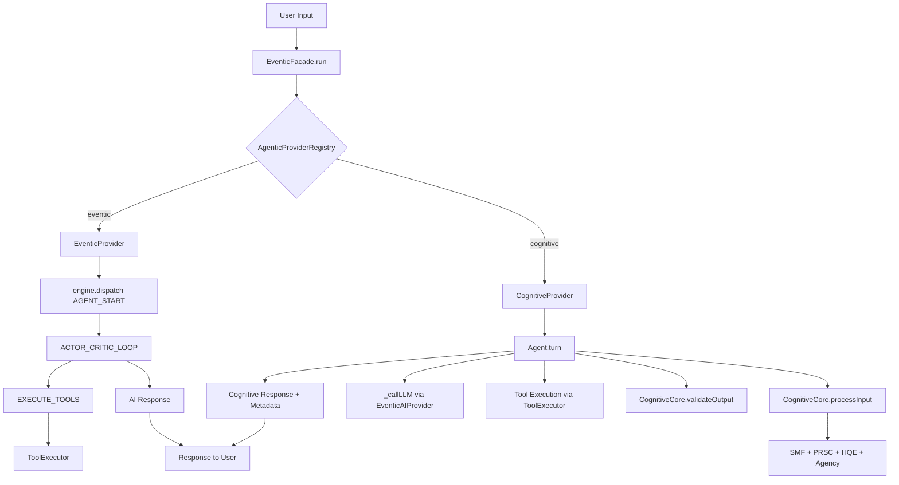

# Agentic Provider Modularization Plan

## Goal

Modularize the agentic loop functionality in ai-man so that different agentic providers can be plugged in. The current Eventic-based agent loop becomes the **default** provider. The tinyaleph `apps/agentic` cognitive agent becomes an **alternate** selectable provider.

## Current Architecture

### ai-man Agent Loop (Default)
- [`EventicAgentLoopPlugin`](../../src/core/eventic-agent-loop-plugin.mjs) — Eventic handler plugin implementing `AGENT_START → ACTOR_CRITIC_LOOP → EXECUTE_TOOLS` flow
- [`EventicFacade`](../../src/core/eventic-facade.mjs) — wires up the engine, registers the plugin at line 133
- [`AgentLoopController`](../../src/core/agent-loop-controller.mjs) — manages the autonomous background agent loop with play/pause/stop and briefing packets
- [`EventicAIProvider`](../../src/core/eventic-ai-plugin.mjs) — wraps `ai-provider.mjs` for LLM calls

**Key flow:** `EventicFacade.run()` → `engine.dispatch('AGENT_START')` → `EventicAgentLoopPlugin` handles it → calls AI, executes tools, loops.

### tinyaleph apps/agentic (Alternate)
- [`Agent`](apps/agentic/lib/agent.js) — 11-step cognitive loop: PERCEIVE → ENCODE → ORIENT → ATTEND → GUARD → RECALL → THINK → EXECUTE → VALIDATE → REMEMBER → EVOLVE
- [`CognitiveCore`](apps/agentic/lib/cognitive.js) — wraps tinyaleph observer layers (SMF, PRSC, HQE, Agency, Boundary, Safety, Temporal, Entanglement)
- [`tools.js`](apps/agentic/lib/tools.js) — standalone tool registry with read_file, write_file, list_files, run_command, cognitive_state, recall_memory
- [`config.js`](apps/agentic/lib/config.js) — configuration with env variable support

## Modular Architecture Design

### Interface: `AgenticProvider`

Every agentic provider must implement this interface:

```javascript
class AgenticProvider {
  /** Unique identifier */
  get id()          // → string, e.g. 'eventic', 'cognitive'
  
  /** Human-readable name */
  get name()        // → string, e.g. 'Eventic Agent Loop', 'Cognitive Agent'
  
  /** Description */
  get description() // → string
  
  /**
   * Initialize the provider. Called once when selected.
   * @param {Object} deps - Shared dependencies from EventicFacade
   * @param {EventicAIProvider} deps.aiProvider
   * @param {ToolExecutor} deps.toolExecutor
   * @param {HistoryManager} deps.historyManager
   * @param {AiManEventBus} deps.eventBus
   * @param {Object} deps.consciousness
   * @param {string} deps.workingDir
   */
  async initialize(deps)
  
  /**
   * Process a user input and return a response.
   * This is the main entry point — replaces engine.dispatch('AGENT_START').
   * @param {string} input
   * @param {Object} options - { signal, stream, onChunk, model }
   * @returns {Promise<{response: string, metadata?: Object}>}
   */
  async run(input, options)
  
  /**
   * Optional: Install Eventic handlers. Only used by providers that
   * integrate with the Eventic engine directly.
   * @param {Eventic} engine
   */
  install(engine)   // optional
  
  /**
   * Cleanup when switching away from this provider.
   */
  async dispose()
}
```

### Provider Registry: `AgenticProviderRegistry`

```javascript
class AgenticProviderRegistry {
  constructor()
  register(provider)          // Register an AgenticProvider instance
  get(id)                     // Get provider by ID
  list()                      // List all registered providers
  getActive()                 // Get the currently active provider
  async setActive(id, deps)   // Switch active provider, calls initialize/dispose
}
```

### File Structure (new files in ai-man)

```
src/core/agentic/
├── base-provider.mjs          # AgenticProvider base class
├── provider-registry.mjs      # AgenticProviderRegistry
├── eventic-provider.mjs       # Default: wraps EventicAgentLoopPlugin
└── cognitive-provider.mjs     # Alternate: wraps tinyaleph agentic Agent

src/core/agentic/cognitive/    # Copied + adapted from apps/agentic
├── agent.mjs                  # Adapted Agent class
├── cognitive.mjs              # CognitiveCore (adapted imports)
├── config.mjs                 # Config module
└── tools.mjs                  # Tool registry
```

## Implementation Steps

### Step 1: Create Base Provider Interface
Create `src/core/agentic/base-provider.mjs` with the `AgenticProvider` abstract base class.

### Step 2: Create Provider Registry
Create `src/core/agentic/provider-registry.mjs` with `AgenticProviderRegistry`.

### Step 3: Create Eventic Provider (Default)
Create `src/core/agentic/eventic-provider.mjs` that wraps the existing `EventicAgentLoopPlugin`. This provider:
- Uses the existing Eventic engine dispatch mechanism
- Installs `EventicAgentLoopPlugin` handlers on the engine
- Delegates `run()` to `engine.dispatch('AGENT_START')`
- Is the default provider — behavior is **identical** to current code

### Step 4: Copy and Adapt Cognitive Provider
Copy `apps/agentic/lib/*` into `src/core/agentic/cognitive/` and adapt:
- Convert `.js` → `.mjs` (ESM)
- Fix import paths (tinyaleph core → npm package or bundled)
- Replace direct `fetch()` LLM calls with ai-man's `EventicAIProvider.ask()` so it uses whatever LLM backend is configured
- Map ai-man's `ToolExecutor` tools into the cognitive agent's tool format so both providers share the same tool ecosystem
- Wrap the `Agent.turn()` method in the `AgenticProvider.run()` interface

### Step 5: Wire into EventicFacade
Modify `EventicFacade` constructor to:
1. Create an `AgenticProviderRegistry`
2. Register both providers
3. Set the active provider (from config or default)
4. In `run()` / `runStream()`, delegate to `registry.getActive().run()` instead of directly to `engine.dispatch()`

### Step 6: Add API/UI Selection
- Add a settings endpoint to switch agentic provider
- Emit the active provider info in status events
- UI can display a dropdown to select the provider

## Data Flow Diagram



## Key Integration Decisions

1. **LLM calls**: The cognitive provider will NOT use its own `fetch()` calls. Instead it will use ai-man's `EventicAIProvider.ask()` so it benefits from all configured providers (Gemini, OpenAI, LMStudio, Cloud, WebLLM).

2. **Tools**: The cognitive provider will use ai-man's `ToolExecutor` for file/command tools instead of its own basic tool implementations. However, it will ADD its own cognitive-specific tools (cognitive_state, recall_memory) on top.

3. **History**: The cognitive agent maintains its own conversation history internally, but syncs final responses back to ai-man's `HistoryManager` for persistence.

4. **tinyaleph dependency**: The `CognitiveCore` depends on tinyaleph's observer modules (SMF, PRSC, HQE, etc.). Since ai-man is a separate project, we have two options:
   - **Option A**: Bundle tinyaleph as an npm dependency in ai-man
   - **Option B**: Copy the needed tinyaleph core/observer files into ai-man
   
   **Recommendation: Option A** — add tinyaleph as a local dependency via `"tinyaleph": "file:../tinyaleph"` in ai-man's package.json. This avoids code duplication and keeps the cognitive core up-to-date.

5. **Configuration**: The cognitive provider's config is merged from ai-man's global config + cognitive-specific defaults. Environment variables like `GEMINI_API_KEY` work through ai-man's existing config system.
