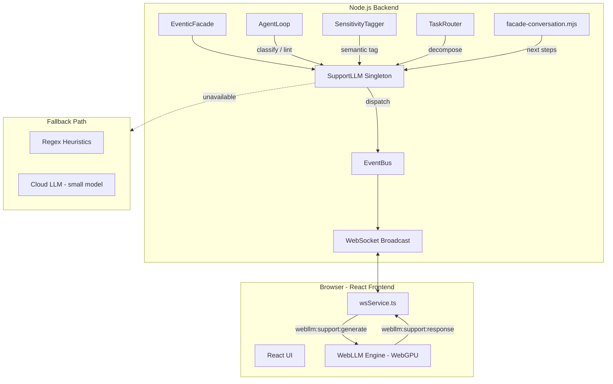
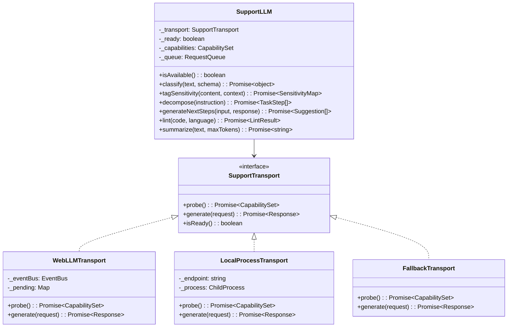
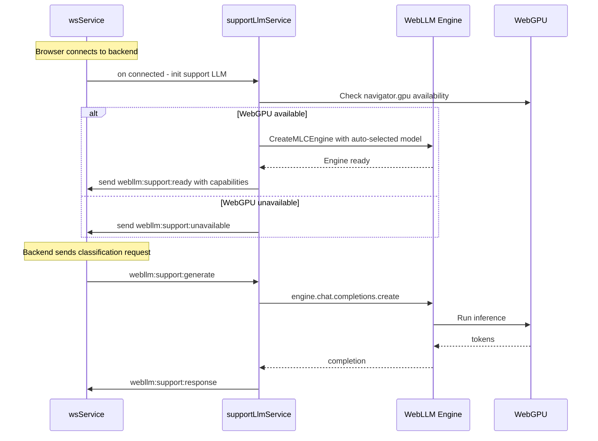
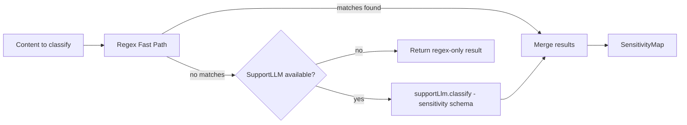
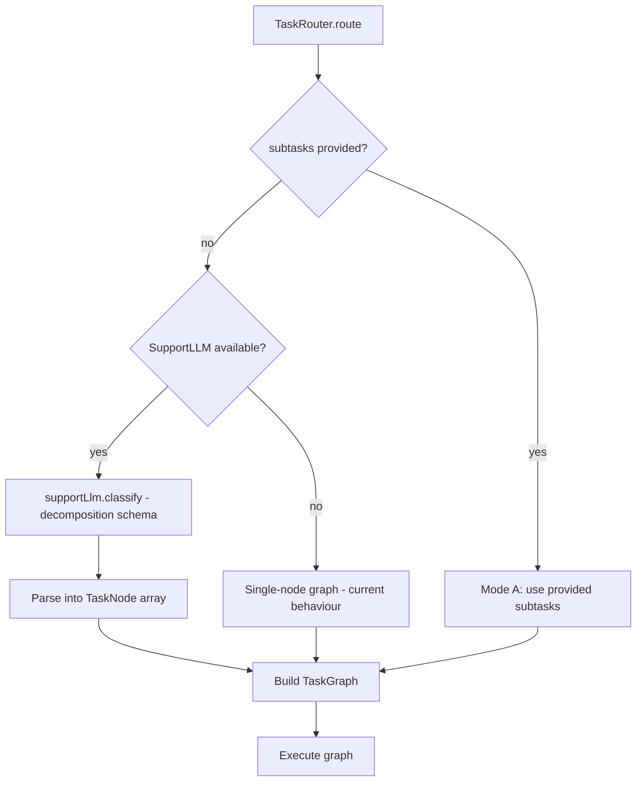
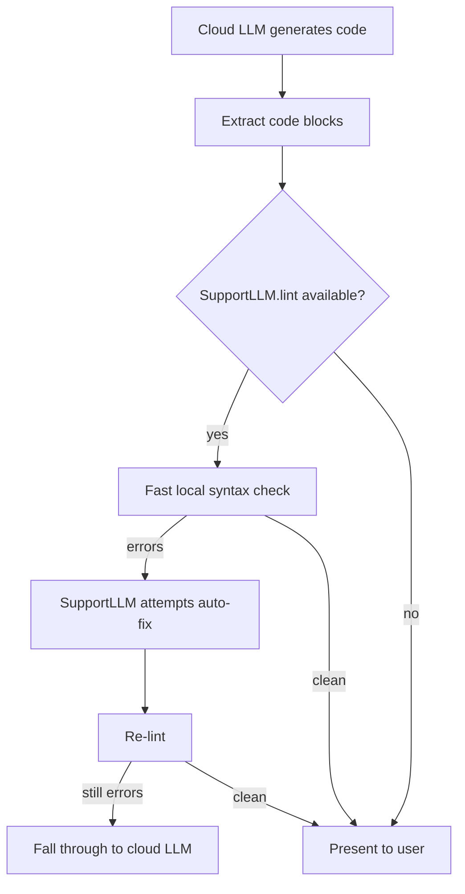
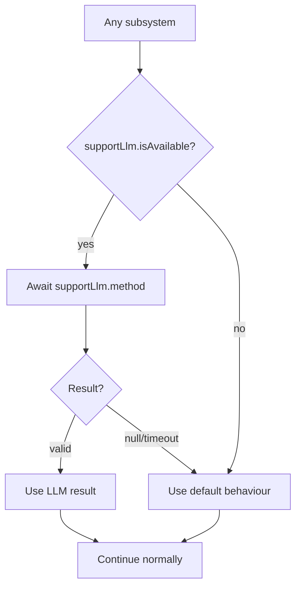
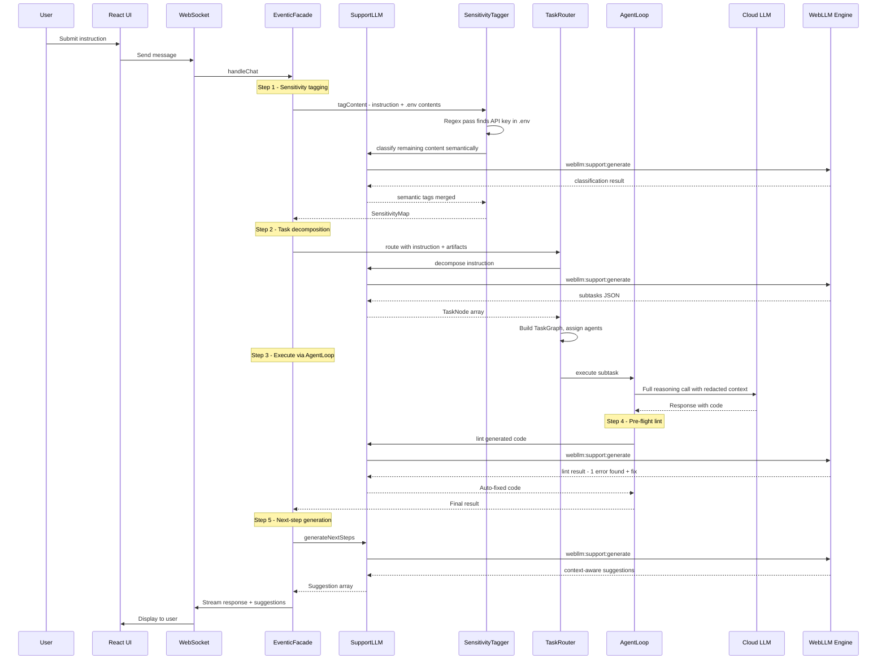

# Invisible Local LLM Integration — Architecture Design

> **Status:** Draft
> **Date:** 2026-03-30
> **Scope:** Transparent integration of a local "Support LLM" into the ai-man agent stack

---

## 0. Executive Summary

This document describes how to integrate a **local LLM** — running either in-browser via [WebLLM](https://github.com/mlc-ai/web-llm) (WebGPU) or as a lightweight backend process — into the existing ai-man architecture as an **invisible Support LLM**. The user never directly interacts with, selects, or configures this model. Instead, it operates transparently behind the scenes to:

1. **Reduce latency** — fast local inference for classification, tagging, and heuristic tasks that currently use regex or require a cloud LLM round-trip.
2. **Reduce cost** — offload high-frequency, low-complexity calls from expensive cloud providers.
3. **Enable continuous background processing** — context summarisation, sensitivity tagging, and proactive next-step generation happen asynchronously.
4. **Improve quality** — replace brittle regex heuristics with semantic understanding.

The design introduces a new abstraction layer — the **`SupportLLM`** — that is consumed by existing subsystems ([`SensitivityTagger`](src/core/confidentiality/sensitivity-tagger.mjs), [`TaskRouter`](src/core/confidentiality/task-router.mjs), [`buildHeuristicNextSteps()`](src/core/facade-conversation.mjs:29), [`AgentLoop`](src/core/agentic/unified/agent-loop.mjs)) without any change to user-facing workflows.

---

## 1. Guiding Principles

| Principle | Detail |
|---|---|
| **Invisible by default** | No UI toggle, no model picker, no loading screen. The Support LLM bootstraps silently and is only active when hardware supports it. |
| **Additive, not replacing** | The cloud LLM remains the primary reasoning engine. The Support LLM handles auxiliary tasks. If the local model is unavailable, the system degrades to current behaviour — regex heuristics or a small cloud call. |
| **Zero-config** | Model selection, quantisation level, and VRAM budget are auto-detected from the runtime environment. Power users may override via `config.ai.supportLlm.*` but this is never required. |
| **Privacy-positive** | Sensitive content classified locally never leaves the machine. This is a natural complement to the [confidentiality system](plans/confidentiality-routing-design.md). |

---

## 2. Current Architecture Snapshot

### 2.1 Relevant Components

| Component | File | Role in this design |
|---|---|---|
| [`EventicFacade`](src/core/eventic-facade.mjs) | `src/core/eventic-facade.mjs` | Top-level orchestrator. Will hold the singleton `SupportLLM` reference. |
| [`AgentLoop`](src/core/agentic/unified/agent-loop.mjs) | `src/core/agentic/unified/agent-loop.mjs` | ReAct cycle. Will use Support LLM for fast pre-classification and lint loops. |
| [`IntentRouter`](src/core/agentic/unified/intent-router.mjs) | `src/core/agentic/unified/intent-router.mjs` | Classifies user input. Currently uses regex heuristics and a fallback LLM call. |
| [`SensitivityTagger`](src/core/confidentiality/sensitivity-tagger.mjs) | `src/core/confidentiality/sensitivity-tagger.mjs` | Regex-only today. Phase 3 placeholder exists for LLM-assisted tagging. |
| [`TaskRouter`](src/core/confidentiality/task-router.mjs) | `src/core/confidentiality/task-router.mjs` | Decomposes tasks and routes to agents. Decomposition currently requires a cloud LLM call. |
| [`buildHeuristicNextSteps()`](src/core/facade-conversation.mjs:29) | `src/core/facade-conversation.mjs` | Generates next-step suggestions using hardcoded regex patterns. |
| [`callWebLLM()`](src/core/ai-provider/adapters/webllm.mjs:48) | `src/core/ai-provider/adapters/webllm.mjs` | Existing bridge: routes OpenAI-compatible requests to browser via EventBus. |
| [`event-broadcaster.mjs`](src/server/event-broadcaster.mjs) | `src/server/event-broadcaster.mjs` | Forwards `webllm:generate` events over WebSocket to browser clients. |
| [`cloud-handler.mjs`](src/server/ws-handlers/cloud-handler.mjs) | `src/server/ws-handlers/cloud-handler.mjs` | Receives `webllm:response` from browser and emits on EventBus. |
| [`wsService.ts`](ui/src/services/wsService.ts) | `ui/src/services/wsService.ts` | Frontend WebSocket client. Will host the WebLLM engine and respond to generate requests. |

### 2.2 Existing WebLLM Bridge

The codebase already has a working pattern for routing LLM requests to the browser:

```
  Backend                          WebSocket                       Browser
  ───────                          ─────────                       ───────
  callWebLLM()
    → eventBus.emit webllm:generate ──→ broadcast ──→ wsService receives
                                                         ↓
                                                    WebLLM engine.generate()
                                                         ↓
  eventBus.emit webllm:response ←──── ws.send ←──── result
    → resolve pending promise
```

This existing bridge in [`webllm.mjs`](src/core/ai-provider/adapters/webllm.mjs) is designed as a **primary provider** — the user explicitly selects WebLLM as their AI provider. The Support LLM design repurposes this bridge as an **invisible secondary channel** that operates alongside whatever primary provider the user has configured.

---

## 3. High-Level Architecture



### 3.1 New Abstraction: `SupportLLM`

A new module at `src/core/support-llm.mjs` exposes a high-level API that the rest of the system consumes. Internally it manages transport selection, capability probing, request queuing, and fallback.



### 3.2 Transport Selection Priority

When [`EventicFacade`](src/core/eventic-facade.mjs) initialises, it creates the `SupportLLM` singleton and probes available transports in order:

1. **WebLLMTransport** — preferred. Probes for a connected browser client with WebGPU support by sending a `webllm:support:probe` message and awaiting a capability response within 5 seconds.
2. **LocalProcessTransport** — if no browser is connected or WebGPU is unsupported, checks for a local inference server (e.g., `llama.cpp`, `ollama`) on a configured port.
3. **FallbackTransport** — wraps the existing cloud AI provider with a small/cheap model (e.g., `gpt-4o-mini`) for classification calls, or returns `null` to signal regex-only fallback.

The probe runs on startup and re-runs whenever a WebSocket client connects/disconnects. The `SupportLLM` can hot-swap transports at runtime.

---

## 4. Detailed Component Design

### 4.1 Module: `src/core/support-llm.mjs`

```js
// Conceptual API — not final implementation code

export class SupportLLM {
  constructor(eventBus, config) { ... }

  /**
   * Attempt to initialise the best available transport.
   * Called by EventicFacade on startup and on WS client connect.
   */
  async init() { ... }

  /** True when at least one transport is ready. */
  isAvailable() { return this._ready; }

  /**
   * Structured classification — returns a JSON object matching the schema.
   * Used by IntentRouter, SensitivityTagger, TaskRouter.
   *
   * @param {string} text — input text
   * @param {object} schema — JSON schema for the expected output
   * @param {string} systemPrompt — classification instructions
   * @returns {Promise<object|null>} parsed result, or null on failure
   */
  async classify(text, schema, systemPrompt) { ... }

  /**
   * Free-form generation with a tight token budget.
   * Used for next-step generation, summarisation.
   *
   * @param {string} prompt
   * @param {number} maxTokens
   * @returns {Promise<string|null>}
   */
  async generate(prompt, maxTokens = 256) { ... }
}
```

Key behaviours:

- **Request coalescing**: identical requests within a 500ms window are deduplicated (the [`RequestDeduplicator`](src/core/agentic/request-deduplicator.mjs) pattern).
- **Timeout**: all requests have a 10-second timeout. If the local model is too slow, the caller falls back.
- **Non-blocking**: all methods return `null` on failure rather than throwing. Callers treat `null` as "use current behaviour".
- **Priority queue**: requests are tagged with priority levels (`critical`, `normal`, `background`). Classification requests from the active user turn get `critical`; background summarisation gets `background`.

### 4.2 WebLLM Engine Lifecycle in the Browser

The browser-side WebLLM engine is managed by a new React service: `ui/src/services/supportLlmService.ts`.



**Model selection logic** (auto, no user input required):

| Available VRAM | Model | Quantisation | Context |
|---|---|---|---|
| >= 6 GB | Qwen2.5-3B-Instruct | q4f16_1 | 4096 |
| >= 4 GB | Qwen2.5-1.5B-Instruct | q4f16_1 | 2048 |
| >= 2 GB | SmolLM2-360M-Instruct | q4f16_1 | 1024 |
| < 2 GB | Disabled — fallback to cloud/regex | — | — |

The model loads in a Web Worker to avoid blocking the UI thread. Progress events are emitted but **not shown to the user** — they are only logged to console for debugging.

### 4.3 Namespace Separation

To avoid conflicts with the existing WebLLM-as-primary-provider bridge, the Support LLM uses a separate event namespace:

| Event | Direction | Purpose |
|---|---|---|
| `webllm:support:probe` | Server → Browser | Check if WebGPU + model are available |
| `webllm:support:ready` | Browser → Server | Report capabilities and model info |
| `webllm:support:unavailable` | Browser → Server | Report that WebGPU is not available |
| `webllm:support:generate` | Server → Browser | Send a classification/generation request |
| `webllm:support:response` | Browser → Server | Return the completion result |
| `webllm:support:status` | Browser → Server | Optional heartbeat and performance metrics |

This runs independently of the `webllm:generate` / `webllm:response` channel used when the user explicitly selects WebLLM as their primary AI provider.

---

## 5. Use Case Integration

### 5.1 Phase 3 Confidentiality: Semantic SensitivityTagger

**Current state:** [`SensitivityTagger`](src/core/confidentiality/sensitivity-tagger.mjs) uses `BUILTIN_PATTERNS` — a list of regex rules — plus `FILE_PATH_HEURISTICS`. The constructor accepts an `opts.aiProvider` placeholder for Phase 3 LLM-assisted classification, but this is not implemented.

**With Support LLM:**



**Integration points in [`sensitivity-tagger.mjs`](src/core/confidentiality/sensitivity-tagger.mjs):**

1. The `SensitivityTagger` constructor receives `opts.supportLlm` (the `SupportLLM` singleton).
2. After the regex pass in `tagContent()`, if the regex pass found no matches **and** `supportLlm.isAvailable()`, call:

   ```js
   const result = await this._supportLlm.classify(content, SENSITIVITY_SCHEMA, TAGGER_SYSTEM_PROMPT);
   ```

3. The classification schema asks the model to return `{ category, level, spans[] }` — the same structure the regex pass produces.
4. Results from both passes are merged via `maxSensitivity()`.
5. **If the Support LLM is unavailable or returns `null`, the tagger behaves exactly as it does today** — regex-only.

**Benefits:**
- Catches semantic sensitivity that regex misses (e.g., "my social is nine four three, two one, seven eight six five" — no digits to regex against).
- Runs locally — sensitive content never sent to cloud for classification.
- The latency budget is ~200ms for a 3B parameter model on a modern GPU, well within acceptable limits.

### 5.2 Fast Task Decomposition in TaskRouter

**Current state:** [`TaskRouter.route()`](src/core/confidentiality/task-router.mjs:95) accepts pre-decomposed subtasks (Mode A) or treats the whole instruction as a single node. There is no built-in decomposition step — the caller must provide subtasks.

**With Support LLM:**

The `TaskRouter` gains an internal decomposition step (Mode B) powered by the Support LLM:



**Decomposition prompt** (served to the local model):

```
You are a task decomposition engine. Given an instruction, break it into
2-6 independent subtasks. Each subtask should be a self-contained action.

Return JSON: { "subtasks": [{ "instruction": "...", "requires": [] }] }

The "requires" array lists indices of subtasks that must complete first.
```

**Benefits:**
- Decomposition runs in ~500ms locally vs 2-3s for a cloud round-trip.
- No API cost for what is essentially a planning/routing operation.
- The cloud LLM receives already-decomposed, focused subtasks — improving its output quality.

### 5.3 Heuristic Next-Step Generation

**Current state:** [`buildHeuristicNextSteps()`](src/core/facade-conversation.mjs:29) uses a cascade of regex tests against the combined user input + AI response to suggest up to 4 next actions. The suggestions are generic and keyword-driven.

**With Support LLM:**

```mermaid
flowchart LR
    Input[userInput + aiResponse] --> SL{SupportLLM available?}
    SL -- yes --> Gen[supportLlm.classify with next-steps schema]
    Gen --> Format[Format as Suggestion array]
    SL -- no --> Regex[Current regex heuristics]
    Regex --> Format
    Format --> Output[Suggestion[]]
```

**Integration in [`facade-conversation.mjs`](src/core/facade-conversation.mjs):**

The existing `buildHeuristicNextSteps()` function becomes the fallback. A new `buildSmartNextSteps()` function is added:

```js
async function buildSmartNextSteps(userInput, aiResponse, supportLlm) {
    if (!supportLlm?.isAvailable()) {
        return buildHeuristicNextSteps(userInput, aiResponse);
    }

    const result = await supportLlm.classify(
        `User: ${userInput}\nAssistant: ${aiResponse}`,
        NEXT_STEPS_SCHEMA,
        NEXT_STEPS_PROMPT
    );

    if (!result?.suggestions?.length) {
        return buildHeuristicNextSteps(userInput, aiResponse);
    }

    return result.suggestions.slice(0, 4).map(s => ({
        id: s.id,
        label: normalizeSuggestionLabel(s.label),
        icon: s.icon || 'arrow-right',
    }));
}
```

The schema instructs the model:

```
Given a conversation exchange, suggest 1-4 logical next actions the user
might want to take. Each suggestion must be specific to the conversation
content, not generic.

Return JSON: { "suggestions": [{ "id": "...", "label": "...", "icon": "..." }] }
```

**Benefits:**
- Context-aware suggestions instead of keyword matching.
- Can reference specific files, functions, or concepts mentioned in the conversation.
- Graceful fallback to the existing regex-based approach.

### 5.4 Rapid Iteration / Lint Loops

**Current state:** The [`AgentLoop`](src/core/agentic/unified/agent-loop.mjs) executes tool calls and returns results to the cloud LLM for evaluation. When the LLM produces code with syntax errors, the fix-iterate cycle requires additional cloud LLM calls (each with full context).

**With Support LLM — two optimizations:**

#### 5.4.1 Pre-flight Syntax Validation

Before presenting generated code to the user or inserting it via a tool call, the Support LLM performs a fast syntax/lint check:



The `lint()` method on `SupportLLM` uses a structured prompt:

```
Check this code for syntax errors, missing imports, and obvious bugs.
Return JSON: { "valid": boolean, "errors": [{ "line": N, "message": "..." }], "fixed": "..." }
```

If errors are found and the model can fix them, the fixed code replaces the original **before** the user ever sees it. This is invisible — the user receives cleaner output.

#### 5.4.2 Tool Result Pre-Evaluation

After a tool executes (e.g., `execute_command` returns linter output), the Support LLM can classify the result before the cloud LLM processes it:

```js
// In ToolExecutorBridge, after tool execution:
if (supportLlm?.isAvailable() && toolResult.includes('error')) {
    const evaluation = await supportLlm.classify(
        toolResult,
        TOOL_RESULT_SCHEMA,
        'Classify this tool output: success, partial-success, or failure. Extract key error messages.'
    );
    // Attach classification metadata to the tool result
    toolResult._supportEval = evaluation;
}
```

This metadata helps the cloud LLM skip re-analyzing the same error output, reducing token usage and latency in the iterative loop.

---

## 6. Fallback Strategy

The entire Support LLM subsystem is designed to be **absent-safe**. Every consumer follows this pattern:



### 6.1 Environment-Specific Fallback Matrix

| Environment | WebGPU | Local Server | Behaviour |
|---|---|---|---|
| Chrome/Edge on desktop with discrete GPU | Yes | Optional | WebLLMTransport — full Support LLM |
| Chrome/Edge on desktop with integrated GPU | Maybe | Optional | WebLLMTransport with smaller model, or LocalProcessTransport |
| Firefox / Safari | No | Optional | LocalProcessTransport if available, else FallbackTransport |
| Server-only mode (no browser) | No | Optional | LocalProcessTransport if available, else regex/cloud |
| CI / headless | No | No | Pure fallback — regex heuristics, no LLM classification |
| Mobile browser | No | No | Disabled — regex-only |

### 6.2 Graceful Degradation by Feature

| Feature | With Support LLM | Without Support LLM |
|---|---|---|
| Sensitivity tagging | Regex + semantic LLM classification | Regex-only (current behaviour) |
| Task decomposition | Local 500ms decomposition | Single-node graph or cloud LLM call |
| Next-step suggestions | Context-aware semantic suggestions | Regex keyword matching (current behaviour) |
| Code lint loop | Pre-flight local check + auto-fix | Direct cloud LLM iteration (current behaviour) |

### 6.3 Transient Unavailability

The Support LLM can become unavailable mid-session (browser tab closed, GPU memory pressure, Web Worker crash). The `SupportLLM` class handles this via:

1. **Heartbeat monitoring**: every 30 seconds, a `webllm:support:status` ping is expected. If two consecutive pings are missed, `_ready` is set to `false`.
2. **Per-request fallback**: each `classify()` / `generate()` call has an individual 10-second timeout. On timeout, the method returns `null` and the consumer uses its default path.
3. **Auto-reconnect**: when a new WebSocket client connects, the probe sequence re-runs automatically. If the new client has WebGPU, the Support LLM comes back online transparently.

---

## 7. Data Flow: End-to-End Example

**Scenario:** User sends a complex instruction that references a `.env` file.



---

## 8. New Modules & File Changes

### 8.1 New Files

| File | Purpose |
|---|---|
| `src/core/support-llm.mjs` | `SupportLLM` class — main abstraction, transport management, request routing |
| `src/core/support-llm-transports.mjs` | `WebLLMTransport`, `LocalProcessTransport`, `FallbackTransport` implementations |
| `ui/src/services/supportLlmService.ts` | Browser-side WebLLM engine management, Web Worker lifecycle, message handling |
| `ui/src/workers/supportLlmWorker.ts` | Web Worker that runs the WebLLM engine off the main thread |

### 8.2 Modified Files

| File | Change |
|---|---|
| [`src/core/eventic-facade.mjs`](src/core/eventic-facade.mjs) | Import and instantiate `SupportLLM` in constructor; pass to subsystems |
| [`src/core/confidentiality/sensitivity-tagger.mjs`](src/core/confidentiality/sensitivity-tagger.mjs) | Accept `supportLlm` in constructor; add LLM classification after regex pass |
| [`src/core/confidentiality/task-router.mjs`](src/core/confidentiality/task-router.mjs) | Accept `supportLlm` in constructor; add Mode B decomposition |
| [`src/core/facade-conversation.mjs`](src/core/facade-conversation.mjs) | Add `buildSmartNextSteps()` alongside existing `buildHeuristicNextSteps()` |
| [`src/core/agentic/unified/agent-loop.mjs`](src/core/agentic/unified/agent-loop.mjs) | Accept `supportLlm` in deps; add pre-flight lint after code generation |
| [`src/core/agentic/unified/tool-executor-bridge.mjs`](src/core/agentic/unified/tool-executor-bridge.mjs) | Add tool-result pre-evaluation metadata |
| [`src/server/event-broadcaster.mjs`](src/server/event-broadcaster.mjs) | Add `webllm:support:*` event forwarding |
| [`src/server/ws-handlers/cloud-handler.mjs`](src/server/ws-handlers/cloud-handler.mjs) | Add `webllm:support:response` and `webllm:support:ready` handlers |
| [`ui/src/services/wsService.ts`](ui/src/services/wsService.ts) | Register `webllm:support:*` message handlers; initialise `supportLlmService` |
| [`ui/src/App.tsx`](ui/src/App.tsx) | Import and initialise `supportLlmService` on mount |

---

## 9. Configuration

All Support LLM settings live under `config.ai.supportLlm` and are **entirely optional**:

```json
{
  "ai": {
    "supportLlm": {
      "enabled": true,
      "preferredTransport": "auto",
      "webllm": {
        "model": "auto",
        "maxVramMb": null,
        "contextLength": null
      },
      "localServer": {
        "endpoint": "http://localhost:11434",
        "model": "qwen2.5:3b"
      },
      "fallbackToCloud": true,
      "fallbackModel": "gpt-4o-mini",
      "timeoutMs": 10000,
      "heartbeatIntervalMs": 30000
    }
  }
}
```

When no configuration is provided, the system defaults to `enabled: true`, `preferredTransport: "auto"`, and auto-detection of everything else.

---

## 10. Security & Privacy Considerations

| Concern | Mitigation |
|---|---|
| **Sensitive data sent to browser** | The Support LLM is specifically used *for* sensitivity classification — it processes the same data the backend already has. No *additional* data crosses the WS boundary beyond what the frontend would normally see. For server-only-sensitive data, use `LocalProcessTransport` instead. |
| **Model integrity** | WebLLM models are loaded from the MLC model hub over HTTPS with integrity checks. Local server models are user-managed. |
| **WebGPU fingerprinting** | The probe only checks `navigator.gpu` existence and adapter info. No user-identifying data is sent to the backend. |
| **Resource exhaustion** | The Support LLM enforces a token budget per request (max 512 tokens for classification, 1024 for generation) and a concurrent request limit (max 3 in-flight). |

---

## 11. Performance Budget

| Operation | Target Latency | Model Size | Token Budget |
|---|---|---|---|
| Sensitivity classification | < 300ms | 1.5B–3B | 128 output tokens |
| Task decomposition | < 800ms | 1.5B–3B | 256 output tokens |
| Next-step generation | < 500ms | 1.5B–3B | 128 output tokens |
| Code lint check | < 1000ms | 1.5B–3B | 512 output tokens |
| Tool result evaluation | < 200ms | 1.5B–3B | 64 output tokens |

These targets assume a modern discrete GPU (RTX 3060 or better) with WebGPU. On integrated GPUs, latencies may be 2-3x higher; the timeout mechanism ensures we fall back before the user notices.

---

## 12. Implementation Phases

### Phase 1: Foundation

- Create `SupportLLM` class with transport abstraction.
- Implement `WebLLMTransport` using the existing EventBus bridge pattern.
- Create `supportLlmService.ts` in the browser with auto-model selection.
- Add `webllm:support:*` event namespace to server broadcasters.
- Wire `SupportLLM` singleton into `EventicFacade`.

### Phase 2: First Consumer — SensitivityTagger

- Integrate `SupportLLM` into `SensitivityTagger` for Phase 3 semantic classification.
- Add the classification schema and system prompt.
- Implement merge logic for regex + LLM results.
- Add tests with mock `SupportLLM`.

### Phase 3: Task Decomposition

- Add Mode B decomposition to `TaskRouter` using `supportLlm.classify()`.
- Define decomposition schema and prompt.
- Test with various instruction types.

### Phase 4: Smart Next Steps

- Add `buildSmartNextSteps()` to `facade-conversation.mjs`.
- Wire into the `generateNextSteps()` flow.
- A/B comparison with existing regex approach.

### Phase 5: Lint Loop Optimisation

- Add pre-flight lint to `AgentLoop` after code generation steps.
- Add tool-result pre-evaluation to `ToolExecutorBridge`.
- Measure reduction in cloud LLM iteration count.

### Phase 6: LocalProcessTransport

- Implement `LocalProcessTransport` for `ollama` / `llama.cpp` / `lmstudio`.
- Add auto-detection of running local servers.
- Ensure parity with `WebLLMTransport` API.

---

## 13. Testing Strategy

| Test Type | Scope |
|---|---|
| Unit tests | `SupportLLM` with mock transports; each consumer with mock `SupportLLM` |
| Integration tests | End-to-end WebSocket bridge with a test WebLLM model |
| Fallback tests | Verify every consumer works correctly when `supportLlm.isAvailable()` returns `false` |
| Performance tests | Measure real latency on reference hardware; validate against performance budget |
| Chaos tests | Kill browser tab mid-request; disconnect WebSocket; exhaust GPU memory — verify graceful degradation |

---

## 14. Open Questions

1. **Should the Support LLM be usable by plugins?** Exposing `supportLlm` via the plugin API would let plugins use fast local classification, but increases the API surface and potential for abuse.
2. **Streaming from the Support LLM?** Current design uses request/response. For longer generations (lint fix), streaming might improve perceived latency.
3. **Model download UX**: The first-time WebLLM model download (200-800 MB) happens invisibly. Should we show a one-time notification, or is truly silent better?
4. **Multi-tab coordination**: If multiple browser tabs are open, which one runs the Support LLM engine? Need a leader-election or first-come-first-serve strategy.
