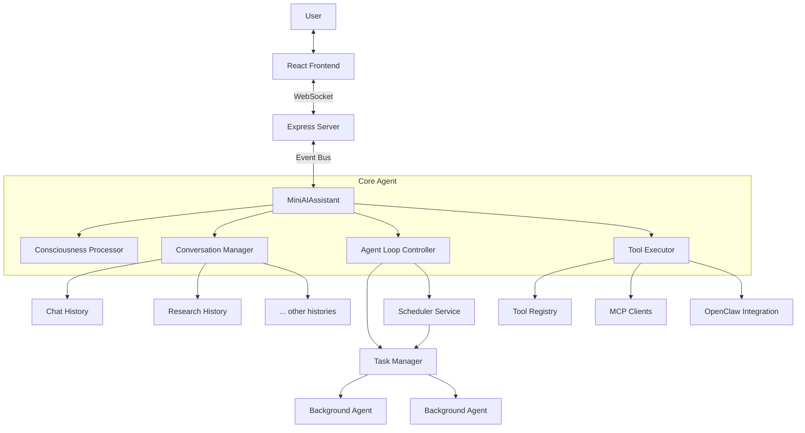

# System Architecture Overview

This document provides a high-level overview of the Oboto system architecture.

## 1. High-Level Architecture

Oboto is a modular AI assistant designed for autonomous software development. It consists of three main layers:

1.  **Frontend (UI)**: A React-based web interface for user interaction.
2.  **Backend (Server)**: A Node.js/Express server that hosts the AI agent and manages communication.
3.  **Core (Agent)**: The central intelligence that processes inputs, maintains state, and executes tools.

### Component Interaction

## 2. Core Components (`src/core`)

The core logic resides in `src/core`.

### `MiniAIAssistant` (`ai-assistant.mjs`)
The central orchestrator. It manages:
*   **Conversation Flow**: Handling user input, system prompts, and context.
*   **Multi-Conversation**: Switching between named conversations via `ConversationManager`.
*   **Token Budgeting**: Managing context window usage.
*   **Model Selection**: Routing requests to the appropriate AI model via `PromptRouter`.
*   **Tool Execution**: Delegating actions to the `ToolExecutor`.

### `ConversationManager` (`conversation-manager.mjs`)
Manages multiple named conversations per workspace. See [Multi-Agent Architecture](multi-agent.md) for details.
*   **CRUD**: Create, list, switch, and delete conversations.
*   **Parent-Child**: The default `chat` conversation is the master; others report back via `report_to_parent`.
*   **Shared State**: Workspace memory, persona, and consciousness persist across conversation switches.
*   **Persistence**: Each conversation stored as a JSON file in `.conversations/`.

### `AgentLoopController` (`agent-loop-controller.mjs`)
Manages the autonomous background loop. See [Multi-Agent Architecture](multi-agent.md) for details. It allows the agent to:
*   Periodically "wake up" and assemble a **dynamic briefing packet** with conversation history, task status, memory, and consciousness state.
*   Spawn background tasks via `TaskManager`.
*   Ask **blocking questions** to the user that pause the loop until answered.
*   Operate independently of direct user input, with foreground-safety guards.

### `TaskManager` (`task-manager.mjs`)
Manages one-shot background AI invocations. See [Multi-Agent Architecture](multi-agent.md) for details.
*   **Spawn**: Create background tasks with their own `MiniAIAssistant` instance.
*   **Track**: Monitor status, progress, output logs.
*   **Cancel**: Abort running tasks via `AbortController`.
*   **Concurrency**: Configurable concurrent task limit (default: 3).

### `SchedulerService` (`scheduler-service.mjs`)
Manages recurring task schedules. See [Multi-Agent Architecture](multi-agent.md) for details.
*   **Persistent**: Schedules survive server restarts (stored in `.ai-man/schedules.json`).
*   **Configurable**: Interval, max runs, skip-if-running.
*   **Integration**: Spawns tasks via `TaskManager` on each tick.

### `ConsciousnessProcessor` (`consciousness-processor.mjs`)
See [Consciousness Architecture](consciousness.md) for details. It unifies:
*   **Fact Inference**: Knowledge management.
*   **Somatic State**: Embodied cognition simulation.
*   **Semantic Collapse**: Ambiguity resolution.

## 3. Execution Layer (`src/execution`)

The execution layer handles the actual performance of tasks.

### `ToolExecutor` (`tool-executor.mjs`)
Responsible for:
*   Validating tool calls.
*   Checking security permissions (e.g., path access).
*   Routing calls to specific handlers (e.g., `FileTools`, `BrowserTools`).
*   Managing the tool registry.

### Handlers
Specialized modules for different domains:
*   `CoreHandlers`: Basic operations.
*   `FileTools`: File system operations.
*   `BrowserHandlers`: Web automation via Puppeteer.
*   `StructuredDevHandlers`: Software engineering workflows.

## 4. Frontend (`ui/`)

The user interface is a modern React application built with Vite.

### Key Features
*   **Chat Interface**: Real-time communication with the agent.
*   **File Editor**: Integrated code editor.
*   **Surface Renderer**: Dynamic UI component rendering (see [UI Surfaces](../guides/ui-surfaces.md)).
*   **Terminal**: Integrated Guake-style terminal.

### Communication
The frontend communicates with the backend via `wsService.ts`, which handles WebSocket events for:
*   Chat messages.
*   File operations.
*   Surface updates.
*   System status.

## 5. Backend (`src/server`)

The backend is an Express application (`web-server.mjs`) that:
*   Serves the static UI assets.
*   Hosts the WebSocket server.
*   Initializes the `MiniAIAssistant`.
*   Bridges the Chrome Extension (if installed) to the agent.
*   Manages MCP (Model Context Protocol) servers.
