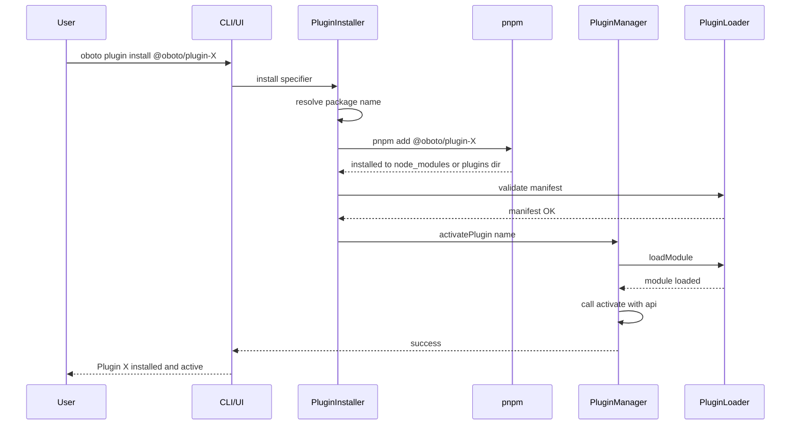
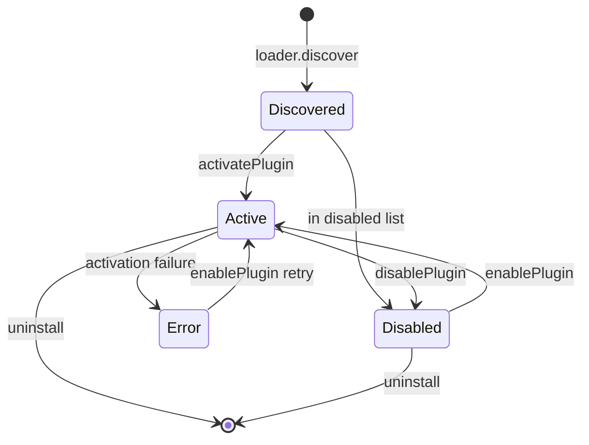
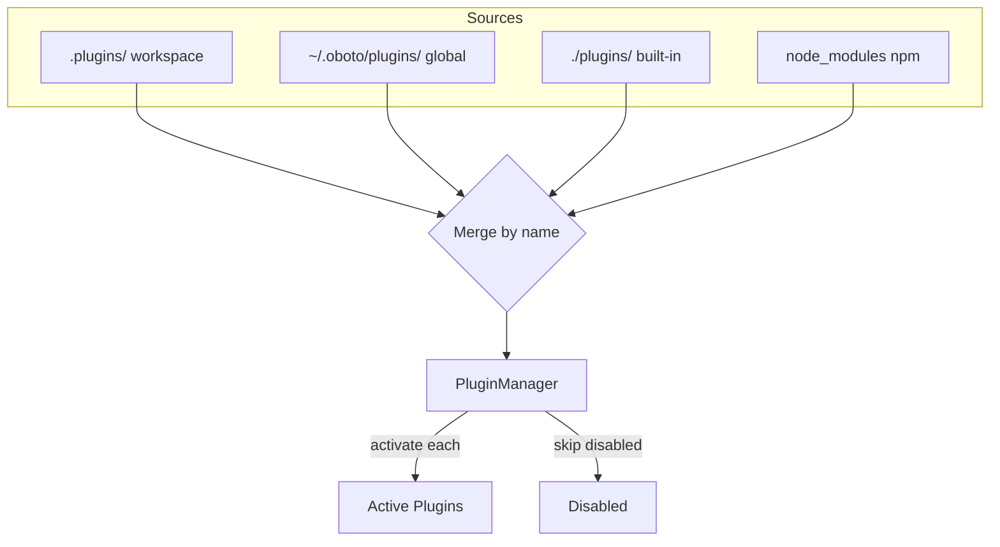

# Plugin Packaging & Management Design

## Overview

This document specifies how Oboto plugins are structured as npm packages,
managed within a pnpm monorepo workspace, and installed/uninstalled at runtime.

---

## 1. Monorepo Structure

Plugins live in `./plugins/` as pnpm workspace packages. Each plugin is an
independent npm package that can be published to a registry or used locally.

```
oboto/
├── plugins/
│   ├── hello-world/           # existing reference plugin
│   │   ├── package.json
│   │   ├── plugin.json
│   │   ├── index.mjs
│   │   └── components/
│   │       └── HelloTab.jsx
│   ├── oboto-plugin-firecrawl/
│   │   ├── package.json
│   │   ├── plugin.json
│   │   └── index.mjs
│   ├── oboto-plugin-math/
│   │   ├── package.json
│   │   ├── plugin.json
│   │   └── index.mjs
│   ├── oboto-plugin-embed/
│   ├── oboto-plugin-web-search/
│   ├── oboto-plugin-image/
│   ├── oboto-plugin-tts/
│   ├── oboto-plugin-browser/
│   ├── oboto-plugin-chrome-ext/
│   ├── oboto-plugin-openclaw/
│   ├── oboto-plugin-workflows/
│   ├── oboto-plugin-personas/
│   ├── oboto-plugin-ui-themes/
│   └── oboto-plugin-cloud-sync/
├── pnpm-workspace.yaml        # updated to include plugins/*
├── package.json               # root — heavy deps moved to plugins
└── src/
    └── plugins/               # plugin system infrastructure (stays in core)
```

### pnpm-workspace.yaml update

```yaml
packages:
  - '.'
  - 'plugins/*'
  - 'BubbleLab/packages/bubble-core'
  - 'BubbleLab/packages/bubble-runtime'
  - 'BubbleLab/packages/bubble-shared-schemas'
  - 'BubbleLab/packages/bubble-scope-manager'
  - 'ui'
```

---

## 2. Plugin Package Structure

### 2.1 Naming Convention

- **npm scope:** `@oboto/plugin-<name>` (for official plugins)
- **unscoped:** `oboto-plugin-<name>` (for community plugins)
- **keyword:** All plugin packages MUST include `"oboto-plugin"` in their
  `package.json` keywords for npm-based discovery.

### 2.2 package.json

```json
{
  "name": "@oboto/plugin-firecrawl",
  "version": "1.0.0",
  "type": "module",
  "description": "Firecrawl web scraping and crawling for Oboto",
  "main": "index.mjs",
  "keywords": ["oboto-plugin", "firecrawl", "web-scraping"],
  "author": "sschepis",
  "license": "MIT",
  "peerDependencies": {
    "@sschepis/oboto": ">=1.0.0"
  },
  "dependencies": {
    // Plugin-specific deps only
  },
  "obotoPlugin": {
    "capabilities": {
      "tools": true
    },
    "permissions": ["network"],
    "minVersion": "1.1.0"
  }
}
```

Key design decisions:
- **`peerDependencies`** on `@sschepis/oboto` — plugins don't bundle core, they
  declare compatibility. This prevents version conflicts.
- **`obotoPlugin`** field in package.json — metadata for discovery and capability
  declaration. Supplements `plugin.json`.
- **`type: "module"`** — all plugins use ESM.

### 2.3 plugin.json (Plugin Manifest)

The `plugin.json` file remains the primary plugin descriptor. If absent, the loader
synthesizes one from `package.json` fields.

```json
{
  "name": "firecrawl",
  "version": "1.0.0",
  "description": "Firecrawl web scraping and crawling",
  "main": "index.mjs",
  "capabilities": {
    "tools": true,
    "ws": false,
    "events": true,
    "ui": false,
    "middleware": false,
    "settings": true
  },
  "permissions": ["network"],
  "settings": {
    "schema": {
      "apiKey": {
        "type": "string",
        "label": "Firecrawl API Key",
        "secret": true,
        "required": true
      }
    }
  }
}
```

### 2.4 Entry Point (index.mjs)

```js
// @oboto/plugin-firecrawl/index.mjs

export async function activate(api) {
    const apiKey = await api.settings.get('apiKey') || process.env.FIRECRAWL_API_KEY;
    
    api.tools.register({
        name: 'scrape',
        description: 'Scrape a web page using Firecrawl',
        parameters: { /* ... */ },
        handler: async (args) => { /* ... */ }
    });
    
    api.tools.register({
        name: 'crawl',
        description: 'Crawl a website using Firecrawl',
        parameters: { /* ... */ },
        handler: async (args) => { /* ... */ }
    });
}

export async function deactivate(api) {
    // Cleanup is automatic, but custom shutdown logic goes here
}
```

---

## 3. Plugin Installation & Management

### 3.1 CLI Commands

Add a `plugin` subcommand to the Oboto CLI:

```bash
# Install from npm registry
oboto plugin install @oboto/plugin-firecrawl
oboto plugin install oboto-plugin-math

# Install from local path (for development)
oboto plugin install ./my-plugin

# Install from git
oboto plugin install github:username/oboto-plugin-example

# List installed plugins
oboto plugin list

# Uninstall
oboto plugin uninstall @oboto/plugin-firecrawl

# Enable/disable without uninstalling
oboto plugin enable firecrawl
oboto plugin disable firecrawl

# Update
oboto plugin update @oboto/plugin-firecrawl
oboto plugin update --all
```

### 3.2 Installation Mechanism

Plugin installation works differently for built-in vs external plugins:

#### Built-in Plugins (shipped in `./plugins/`)
- Workspace packages in the pnpm monorepo
- Always available; can be disabled but not uninstalled
- Dependencies resolved through pnpm workspace links

#### External Plugins (installed at runtime)
- Installed into `~/.oboto/plugins/<name>/` (global) or `.plugins/<name>/` (workspace)
- `pnpm` used under the hood:
  1. Create a temp package.json in the target directory
  2. Run `pnpm add <package>` to install the plugin and its deps
  3. Resolve the plugin's `plugin.json` or synthesize from `package.json`
  4. Register in the plugin discovery path

#### Implementation: PluginInstaller class

```
src/plugins/
├── plugin-installer.mjs    # NEW — handles install/uninstall/update
├── plugin-manager.mjs      # existing — lifecycle management
├── plugin-loader.mjs       # existing — discovery and loading
├── plugin-api.mjs          # existing — API surface for plugins
├── plugin-storage.mjs      # existing — KV storage
├── plugin-settings.mjs     # existing — settings persistence
└── index.mjs               # existing — public exports
```

### 3.3 PluginInstaller Design

```
┌─────────────┐      ┌──────────────────┐      ┌──────────────┐
│   CLI/UI     │─────▶│ PluginInstaller  │─────▶│ PluginLoader │
│ oboto plugin │      │                  │      │  .discover   │
│  install X   │      │ .install(spec)   │      │              │
│              │      │ .uninstall(name) │      │              │
└─────────────┘      │ .update(name)    │      └──────────────┘
                     │ .listInstalled() │             │
                     └──────┬───────────┘             ▼
                            │               ┌──────────────────┐
                            ▼               │  PluginManager   │
                     ┌──────────────┐       │  .initialize()   │
                     │ pnpm / npm   │       │  .enablePlugin() │
                     │  (exec)      │       └──────────────────┘
                     └──────────────┘
```

Key behaviors:
- **install(spec):** Resolves package name → downloads → validates manifest → 
  copies/links to install dir → signals PluginManager to hot-load
- **uninstall(name):** Deactivates via PluginManager → removes from disk → 
  cleans up storage/settings if requested
- **update(name):** Deactivates → `pnpm update` → reactivates
- **Hot-reload:** After install, the PluginManager can activate the new plugin
  without restarting the server

### 3.4 WS Handlers for UI-based Management

Extend `plugin-handler.mjs` with install/uninstall/update operations:

```
plugin:install    { spec: "@oboto/plugin-firecrawl" }
plugin:uninstall  { name: "firecrawl" }
plugin:update     { name: "firecrawl" }
plugin:search     { query: "web scraping" }  // future: npm registry search
```

These are long-running operations that stream progress via:
```
plugin:install-progress  { name, step, total, message }
plugin:install-complete  { name, success, error? }
```

---

## 4. Dependency Management Strategy

### 4.1 Moving Heavy Dependencies to Plugins

Currently, these heavy deps are in the root `package.json`:

| Dependency | Size | Target Plugin |
|------------|------|---------------|
| `puppeteer` | ~300MB (Chromium) | `oboto-plugin-browser` |
| `sharp` | ~25MB (native) | `oboto-plugin-image` |
| `mathjs` | ~2MB | `oboto-plugin-math` |
| `node-pty` | ~5MB (native) | stays in core (terminal) |
| `@nut-tree-fork/nut-js` | ~10MB | `oboto-plugin-desktop-automation` |
| `pdf-parse` | ~1MB | `oboto-plugin-pdf` (or stays) |

After extraction, the root `package.json` dependencies shrink significantly.
Plugins declare their own dependencies in their own `package.json`.

### 4.2 Shared Dependencies

Some utilities are used across plugins. These are provided by core:
- `consoleStyler` — available via import (plugins can import from core since
  it's a peerDependency)
- `eventBus` — provided via `api.events`
- `fetch` — native Node.js global

Plugins should NOT import internal core modules directly. All interaction
goes through the `PluginAPI` object passed to `activate()`.

### 4.3 Version Compatibility

The `obotoPlugin.minVersion` field in `package.json` declares the minimum
core version. The PluginManager checks this at activation:

```js
// In plugin-manager.mjs _activatePlugin()
const minVersion = instance.discovered.manifest.minVersion || 
    instance.discovered.manifest.obotoPlugin?.minVersion;
if (minVersion && !semver.gte(OBOTO_VERSION, minVersion)) {
    throw new Error(`Plugin requires Oboto >= ${minVersion}`);
}
```

---

## 5. Plugin Discovery Hierarchy (Updated)

Priority order (highest priority first — overrides lower):

1. **Workspace plugins** — `.plugins/<name>/` in current working dir
2. **Global plugins** — `~/.oboto/plugins/<name>/`
3. **Built-in plugins** — `./plugins/<name>/` (shipped with Oboto)
4. **npm plugins** — `node_modules/` packages with `"oboto-plugin"` keyword

This allows users to override any built-in plugin by placing a modified
version in their workspace or global plugin directory.

---

## 6. Built-in Plugin Template

Each extracted plugin follows this file structure:

```
plugins/oboto-plugin-firecrawl/
├── package.json          # npm package metadata
├── plugin.json           # Oboto plugin manifest
├── index.mjs             # entry point: activate() + deactivate()
├── README.md             # plugin documentation
├── lib/                  # internal implementation
│   └── firecrawl-client.mjs
└── components/           # optional: UI components (JSX)
    └── FirecrawlPanel.jsx
```

### Extraction Pattern

For each handler being extracted, the pattern is:

1. **Create plugin directory** in `plugins/`
2. **Move handler logic** from `src/execution/handlers/<name>-handlers.mjs`
   into `plugins/oboto-plugin-<name>/lib/`
3. **Create `index.mjs`** that calls `api.tools.register()` for each tool
   (replacing the tool definitions from `src/tools/definitions/<name>-tools.mjs`)
4. **Move dependencies** from root `package.json` to plugin `package.json`
5. **Remove handler instantiation** from `src/execution/tool-executor.mjs`
6. **Remove tool definitions** from `src/tools/definitions/<name>-tools.mjs`
7. **Remove handler dispatch** from the switch/if-else chain in `tool-executor.mjs`

---

## 7. Migration Strategy

### Phase 1: Infrastructure
- Update `pnpm-workspace.yaml` to include `plugins/*`
- Add `PluginInstaller` class
- Add CLI `plugin` subcommand
- Add install/uninstall WS handlers
- Ensure hello-world plugin works end-to-end

### Phase 2: Tier 1 Extractions (easy, zero coupling)
1. `oboto-plugin-firecrawl`
2. `oboto-plugin-math`
3. `oboto-plugin-embed`
4. `oboto-plugin-web-search`
5. `oboto-plugin-image`
6. `oboto-plugin-tts`

For each: extract → test → remove from core → verify core still works.

### Phase 3: Tier 2 Extractions (moderate coupling)
7. `oboto-plugin-browser`
8. `oboto-plugin-chrome-ext`
9. `oboto-plugin-openclaw`
10. `oboto-plugin-workflows`
11. `oboto-plugin-personas`
12. `oboto-plugin-ui-themes`
13. `oboto-plugin-cloud-sync`

### Phase 4: Cleanup
- Remove unused imports from `tool-executor.mjs`
- Remove heavy deps from root `package.json`
- Update documentation
- Publish official plugins to npm

---

## 8. Flow Diagrams

### Plugin Installation Flow



### Plugin Lifecycle



### Discovery Hierarchy


