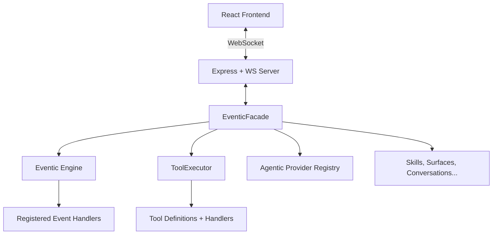
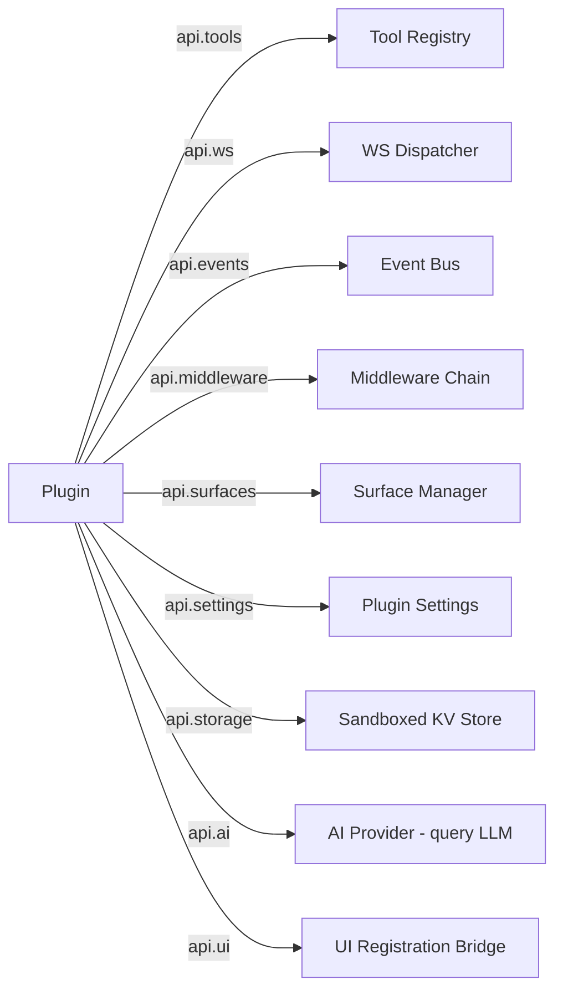
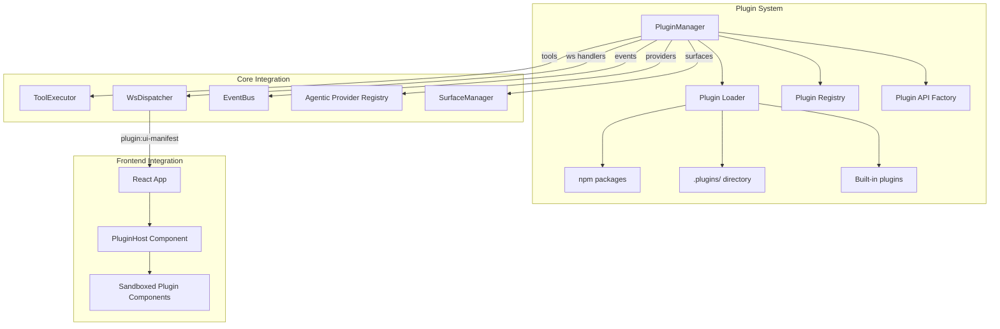

# Plugin System Architecture Design

## 1. Codebase Analysis Summary

### 1.1 Current Architecture

Oboto is a modular AI assistant with three layers:

| Layer | Technology | Entry Point |
|-------|-----------|-------------|
| **Frontend** | React + Vite + Tailwind | `ui/src/App.tsx` |
| **Backend** | Express + WebSocket | `src/server/web-server.mjs` |
| **Core** | Eventic engine + providers | `src/core/eventic-facade.mjs` |



### 1.2 Existing Extension Points

The codebase already has **six distinct plugin-like patterns**, but they are disconnected:

| Pattern | Location | What It Extends | Discovery |
|---------|----------|-----------------|-----------|
| **Eventic plugins** | `eventic.mjs` `.use()` | AI providers, tools, engine handlers | Manual `engine.use()` in EventicFacade constructor |
| **Agentic providers** | `src/core/agentic/` | Agent loop behavior | Manual registration in EventicFacade constructor |
| **Custom tools** | `custom-tools-manager.mjs` | Tool definitions + handlers | `.tools.json` file |
| **Skills** | `skills-manager.mjs` | System prompt context | `.skills/` directory + npm packages |
| **WS handlers** | `ws-dispatcher.mjs` | WebSocket message types | Manual import in `web-server.mjs` |
| **Dynamic routes** | `dynamic-router.mjs` | Express HTTP routes | `routes/` and `api/` directories |
| **Surfaces** | `surface-manager.mjs` | UI panels with JSX components | `.surfaces/` directory |

### 1.3 Key Observations

1. **Eventic already has a plugin protocol**: `engine.use(plugin)` supports `{ type: 'ai' }`, `{ type: 'tool' }`, and `{ install(engine) }` patterns. This is the foundation to build on.

2. **The Agentic Provider pattern is clean**: `AgenticProvider` base class with `initialize()`, `run()`, `install()`, `dispose()` lifecycle — directly usable for plugins.

3. **The WS Dispatcher is type-based**: `dispatcher.register(type, handler)` already supports dynamic registration. Plugins could register new WS message types.

4. **Surfaces are the closest thing to UI plugins**: They already render user-defined JSX in sandboxed components. Plugins could contribute surfaces.

5. **No unified plugin manifest**: Each extension point has its own discovery mechanism. There is no single `plugin.json` or entry point.

6. **No frontend plugin mounting**: The React `App.tsx` is monolithic — all components are statically imported. There is no mechanism for plugins to inject new tabs, sidebar sections, or settings panels.

---

## 2. Proposed Plugin Architecture

### 2.1 Design Principles

- **Single manifest, multiple capabilities**: One plugin declares what it provides — tools, WS handlers, agentic providers, UI components, etc.
- **Convention over configuration**: Plugins live in `.plugins/` or are npm packages with an `oboto-plugin` keyword.
- **Lifecycle-aware**: Plugins have `activate()` / `deactivate()` lifecycle hooks.
- **Sandboxed UI**: Plugin UI components use the existing Surface rendering infrastructure.
- **Backward compatible**: Existing skills, custom tools, and surfaces continue to work unchanged.

### 2.2 Plugin Manifest

Each plugin is either:
- A directory in `.plugins/<name>/` with a `plugin.json` manifest
- An npm package with `"oboto-plugin"` in `package.json` keywords

```json
{
  "name": "my-plugin",
  "version": "1.0.0",
  "description": "Adds weather tools and a weather dashboard",
  "main": "index.mjs",
  "capabilities": {
    "tools": true,
    "wsHandlers": true,
    "surfaces": true,
    "settings": true,
    "agenticProvider": false,
    "middleware": false
  },
  "ui": {
    "settingsPanel": "settings.jsx",
    "sidebarSection": "sidebar.jsx",
    "tabs": [
      { "id": "weather", "label": "Weather", "icon": "cloud", "component": "WeatherTab.jsx" }
    ]
  },
  "permissions": ["network", "filesystem.read"]
}
```

### 2.3 Plugin Entry Point Contract

```javascript
// index.mjs - Plugin entry point
export default {
  name: 'my-plugin',

  // Called when plugin is loaded. Receives the plugin API.
  async activate(api) {
    // Register tools
    api.tools.register({
      name: 'get_weather',
      description: 'Get current weather for a location',
      parameters: { location: { type: 'string' } },
      handler: async ({ location }) => { /* ... */ }
    });

    // Register WebSocket handlers
    api.ws.register('weather:fetch', async (data, ctx) => {
      const result = await fetchWeather(data.location);
      ctx.ws.send(JSON.stringify({ type: 'weather:result', payload: result }));
    });

    // Register event listeners
    api.events.on('conversation:message', (msg) => { /* ... */ });

    // Register middleware
    api.middleware.use('before:tool-execute', async (toolCall, next) => {
      console.log('Tool called:', toolCall.name);
      return next();
    });
  },

  // Called when plugin is unloaded
  async deactivate(api) {
    // Cleanup is mostly automatic, but custom cleanup goes here
  }
};
```

### 2.4 Plugin API Surface

The `api` object passed to `activate()` exposes controlled access to the core system:



| Namespace | Methods | Purpose |
|-----------|---------|---------|
| `api.tools` | `register()`, `unregister()`, `list()` | Add/remove AI-callable tools |
| `api.ws` | `register()`, `broadcast()` | Handle new WS message types |
| `api.events` | `on()`, `emit()`, `off()` | Subscribe to/emit system events |
| `api.middleware` | `use()` | Intercept tool calls, messages, etc. |
| `api.surfaces` | `create()`, `update()`, `delete()` | Manage UI surfaces programmatically |
| `api.settings` | `get()`, `set()`, `getSchema()` | Plugin-scoped persistent settings |
| `api.storage` | `get()`, `set()`, `delete()`, `list()` | Plugin-scoped key-value storage |
| `api.ai` | `ask()`, `stream()` | Query the configured LLM |
| `api.ui` | `registerTab()`, `registerSidebarSection()`, `registerSettingsPanel()` | Inject UI components |

### 2.5 Architecture Diagram



---

## 3. Implementation Plan

### Phase 1: Core Plugin Infrastructure

| Step | Task | Files to Create/Modify |
|------|------|----------------------|
| 1.1 | Create `PluginManager` class | `src/plugins/plugin-manager.mjs` |
| 1.2 | Create `PluginAPIFactory` | `src/plugins/plugin-api.mjs` |
| 1.3 | Create `PluginLoader` with local + npm discovery | `src/plugins/plugin-loader.mjs` |
| 1.4 | Create `PluginSettingsStore` for per-plugin config | `src/plugins/plugin-settings.mjs` |
| 1.5 | Create `PluginStorage` for sandboxed KV storage | `src/plugins/plugin-storage.mjs` |
| 1.6 | Wire `PluginManager` into `EventicFacade` constructor | Modify `src/core/eventic-facade.mjs` |
| 1.7 | Wire `PluginManager` into `startServer()` | Modify `src/server/web-server.mjs` |
| 1.8 | Add plugin lifecycle WS handlers | `src/server/ws-handlers/plugin-handler.mjs` |

### Phase 2: Backend Extension Points

| Step | Task | Files to Create/Modify |
|------|------|----------------------|
| 2.1 | Expose `api.tools` — wrap ToolExecutor registration | `src/plugins/plugin-api.mjs` |
| 2.2 | Expose `api.ws` — wrap WsDispatcher | `src/plugins/plugin-api.mjs` |
| 2.3 | Expose `api.events` — scoped EventBus proxy | `src/plugins/plugin-api.mjs` |
| 2.4 | Expose `api.middleware` — hook into tool execution chain | `src/plugins/plugin-api.mjs` |
| 2.5 | Expose `api.ai` — sandboxed AI query interface | `src/plugins/plugin-api.mjs` |
| 2.6 | Add `api.surfaces` — programmatic surface management | `src/plugins/plugin-api.mjs` |
| 2.7 | Support `AgenticProvider` registration from plugins | `src/plugins/plugin-api.mjs` |

### Phase 3: Frontend Plugin Support

| Step | Task | Files to Create/Modify |
|------|------|----------------------|
| 3.1 | Create `usePlugins` hook | `ui/src/hooks/usePlugins.ts` |
| 3.2 | Create `PluginHost` component for sandboxed rendering | `ui/src/components/features/PluginHost.tsx` |
| 3.3 | Add plugin tab type to `TabBar` | Modify `ui/src/components/layout/TabBar.tsx` |
| 3.4 | Add plugin sidebar sections to `Sidebar` | Modify `ui/src/components/layout/Sidebar.tsx` |
| 3.5 | Add plugin settings panel to `SettingsDialog` | Modify `ui/src/components/features/SettingsDialog.tsx` |
| 3.6 | Plugin UI manifest delivery via WS | Modify `src/server/web-server.mjs` |
| 3.7 | Create plugin management UI panel | `ui/src/components/features/PluginManagerPanel.tsx` |

### Phase 4: Developer Experience

| Step | Task | Files to Create/Modify |
|------|------|----------------------|
| 4.1 | Create plugin scaffold generator | `src/plugins/plugin-scaffold.mjs` |
| 4.2 | Add `create_plugin` tool for AI to create plugins | Tool definition + handler |
| 4.3 | Write plugin development guide | `docs/guides/plugins.md` |
| 4.4 | Create example plugins: hello-world, weather-dashboard | `examples/plugins/` |
| 4.5 | Add plugin enable/disable/install/uninstall WS commands | WS handlers |

---

## 4. Key Design Decisions

### 4.1 Plugin UI Rendering Strategy

**Chosen approach: Extend the existing Surface compiler**

The frontend already has `surfaceCompiler.ts` which transpiles JSX source into executable React components at runtime. Plugin UI components will use the same mechanism:

1. Plugin declares UI components in its manifest
2. Backend serves component source via WS on `plugin:get-component`
3. Frontend compiles and renders via `ComponentWrapper` + `SurfaceErrorBoundary`
4. Plugin components receive a `pluginApi` prop for calling back to the plugin

This avoids the need for a separate plugin UI build step and leverages proven infrastructure.

### 4.2 Plugin Isolation

Plugins run in the Node.js process — no VM sandboxing for server-side code. Security is enforced via:

- **Permission declarations** in `plugin.json` — the PluginManager enforces declared permissions
- **Scoped API surface** — plugins only access what the PluginAPI exposes
- **No direct imports** — plugins cannot `import` core modules directly
- **Storage isolation** — each plugin gets its own storage namespace

For UI components, the existing `SurfaceErrorBoundary` catches render errors, and the iframe-less approach is maintained since it allows rich integration.

### 4.3 Plugin Discovery Order

```
1. Built-in plugins (shipped with Oboto)
2. Global plugins (~/.oboto/plugins/)
3. Workspace plugins (.plugins/)
4. npm plugins (package.json "oboto-plugin" keyword)
```

Later sources override earlier ones if names collide.

### 4.4 Backward Compatibility

| Existing Feature | Migration Path |
|-----------------|----------------|
| Custom tools (`.tools.json`) | Continue working as-is. Optionally wrap as a plugin later. |
| Skills (`.skills/`) | Continue working as-is. Skills and plugins are complementary. |
| Surfaces (`.surfaces/`) | Continue working as-is. Plugins can also create surfaces. |
| Dynamic routes | Continue working as-is. Plugins can also register routes via `api.routes`. |

---

## 5. Example: Weather Plugin

```
.plugins/
  weather/
    plugin.json
    index.mjs
    WeatherDashboard.jsx
    settings.jsx
```

**plugin.json:**
```json
{
  "name": "weather",
  "version": "1.0.0",
  "description": "Weather tools and dashboard",
  "main": "index.mjs",
  "capabilities": { "tools": true, "surfaces": true, "settings": true },
  "ui": {
    "settingsPanel": "settings.jsx",
    "tabs": [
      { "id": "weather-dashboard", "label": "Weather", "icon": "cloud-sun", "component": "WeatherDashboard.jsx" }
    ]
  },
  "permissions": ["network"]
}
```

**index.mjs:**
```javascript
export default {
  name: 'weather',
  
  async activate(api) {
    const apiKey = await api.settings.get('apiKey');
    
    api.tools.register({
      name: 'get_weather',
      description: 'Get current weather for a city',
      parameters: {
        type: 'object',
        properties: {
          city: { type: 'string', description: 'City name' }
        },
        required: ['city']
      },
      handler: async ({ city }) => {
        const res = await fetch(
          `https://api.openweathermap.org/data/2.5/weather?q=${city}&appid=${apiKey}`
        );
        return await res.json();
      }
    });

    api.ws.register('weather:fetch', async (data, ctx) => {
      const weather = await api.tools.execute('get_weather', { city: data.city });
      ctx.ws.send(JSON.stringify({ type: 'weather:result', payload: weather }));
    });
  },

  async deactivate() {}
};
```

---

## 6. Risk Assessment

| Risk | Mitigation |
|------|-----------|
| Plugin crashes take down the server | Wrap `activate()` in try/catch; log and disable failing plugins |
| Plugin UI breaks the app | SurfaceErrorBoundary already handles this |
| Plugin name collisions | Namespace enforcement: `plugin-name:tool-name` |
| Circular dependencies between plugins | No inter-plugin imports; plugins communicate via events |
| Performance impact of many plugins | Lazy loading; plugins only activate when needed |
| Security: malicious plugins | Permission system + npm audit for published plugins |

---

## 7. Estimated Effort

| Phase | Effort | Priority |
|-------|--------|----------|
| Phase 1: Core Infrastructure | ~3-4 days | **Must have** |
| Phase 2: Backend Extensions | ~2-3 days | **Must have** |
| Phase 3: Frontend Support | ~3-4 days | **Should have** |
| Phase 4: Developer Experience | ~2 days | **Nice to have** |
| **Total** | **~10-13 days** | |

Phase 1 and 2 together deliver a working plugin system for backend functionality. Phase 3 adds UI extensibility. Phase 4 polishes the developer experience.
