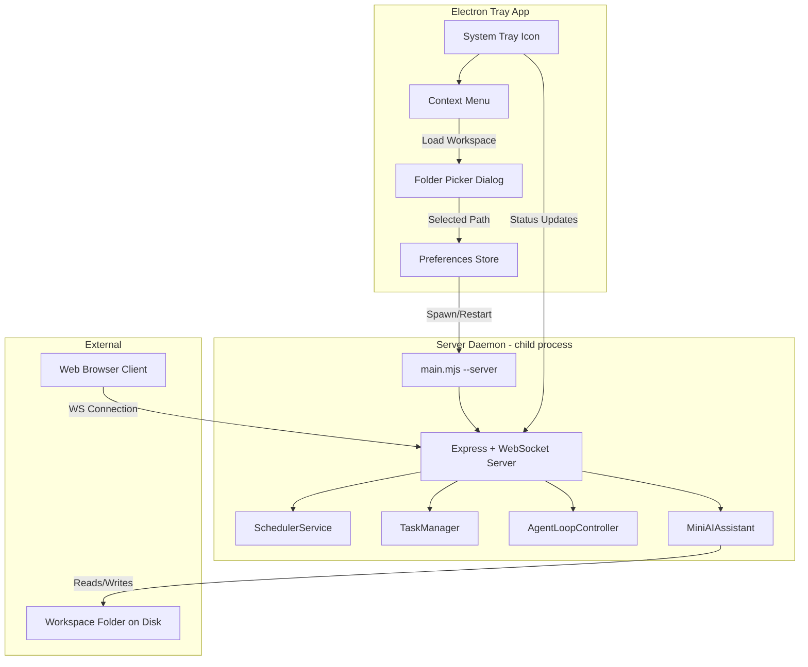
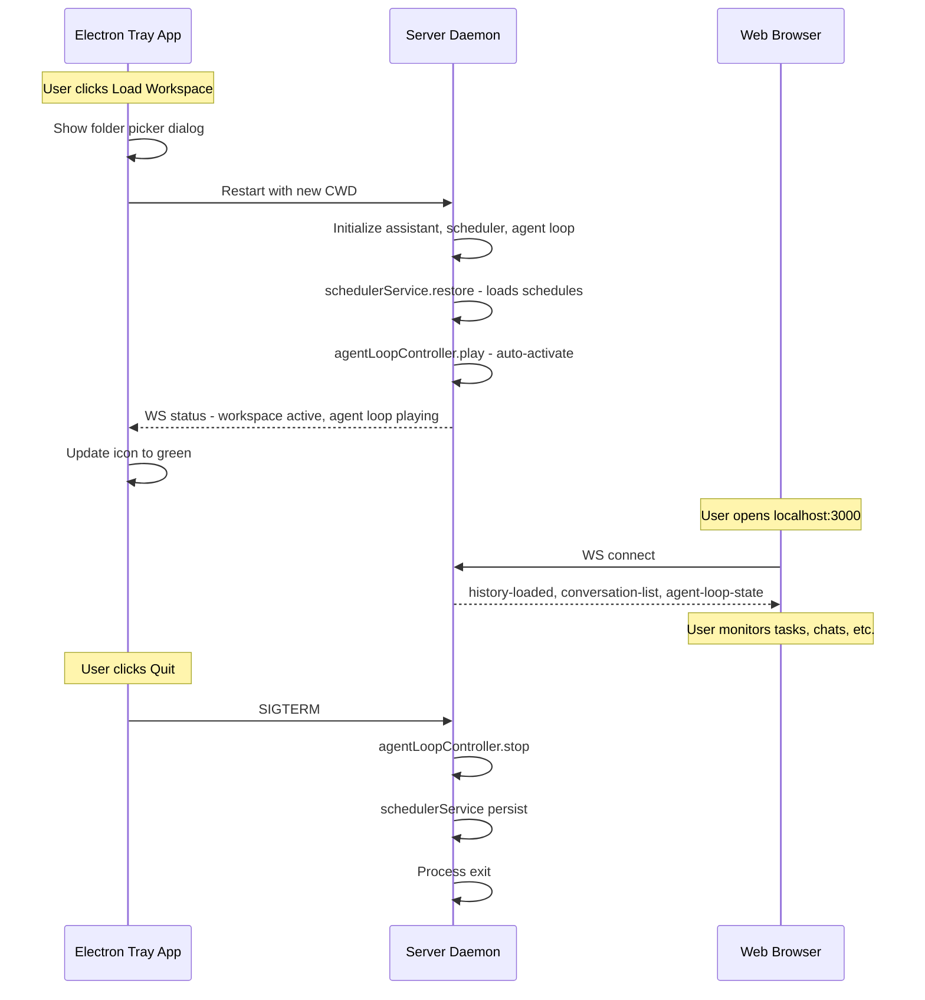

# Oboto Service + Tray App Architecture

## Overview

This design adds the ability to run Oboto as a **persistent background service** with a **system tray icon** on macOS and Windows. The tray provides workspace management (pick a folder), status indication (running/idle/error), and auto-start on login. When a workspace is loaded, the service acts as a **headless client** that opens the workspace, auto-activates all schedules and the agent loop, and keeps it running in the background. Users can then monitor via the web client in a browser.

---

## Architecture Diagram



---

## Component Design

### 1. Electron Tray App (`tray-app/`)

A minimal Electron app that runs **tray-only** (no visible window). It:

- Shows a system tray icon indicating service status:
  - 🟢 Green = Running, workspace active
  - 🟡 Yellow = Running, no workspace loaded  
  - 🔴 Red = Service error / stopped
- Provides a context menu with:
  - **Status**: "Running - /path/to/workspace" (disabled label)
  - **Load Workspace...**: Opens native folder picker dialog
  - **Open in Browser**: Opens `http://localhost:3000` in default browser
  - **Recent Workspaces**: Submenu of last 5 workspaces
  - **---** (separator)
  - **Auto-start on Login**: Toggle checkbox
  - **Port**: Shows current port (default 3000)
  - **---** (separator)
  - **Restart Service**: Kill and restart the daemon child process
  - **Quit**: Stop daemon and exit tray app

#### File Structure

```
tray-app/
  package.json          # Electron dependency, build scripts
  main.js               # Electron main process - tray logic
  preload.js            # Preload script if settings window needed
  assets/
    tray-icon-green.png   # 16x16, 32x32 template icons
    tray-icon-yellow.png
    tray-icon-red.png
    tray-icon-green@2x.png
    tray-icon-yellow@2x.png
    tray-icon-red@2x.png
  lib/
    daemon-manager.js    # Spawns/manages the Node.js server child process
    preferences.js       # Persists workspace path, recent list, auto-start, port
    auto-start.js        # Manages login item registration
```

#### Key Module: `daemon-manager.js`

```javascript
// Pseudocode
class DaemonManager extends EventEmitter {
  constructor(preferences) {
    this.serverProcess = null;
    this.preferences = preferences;
    this.wsClient = null; // WebSocket client to monitor daemon
  }

  async start(workspacePath, port) {
    // Fork ai.mjs --server with env PORT=port
    // Set CWD to workspacePath
    this.serverProcess = fork(aiMjsPath, ['--server'], {
      cwd: workspacePath,
      env: { ...process.env, PORT: port },
      stdio: ['pipe', 'pipe', 'pipe', 'ipc']
    });
    
    // Monitor stdout/stderr for readiness signal
    // Connect WS client to ws://localhost:{port} for status monitoring
    // Auto-activate workspace (send WS message)
  }

  async stop() {
    // Graceful SIGTERM, then SIGKILL after timeout
  }

  async restart(workspacePath, port) {
    await this.stop();
    await this.start(workspacePath, port);
  }

  async switchWorkspace(newPath) {
    // Option A: Restart with new CWD (simpler, chosen approach)
    await this.restart(newPath, this.preferences.get('port'));
  }
}
```

#### Key Module: `preferences.js`

Uses `electron-store` or simple JSON file at `~/.oboto-service/preferences.json`:

```json
{
  "currentWorkspace": "/Users/sschepis/automation-workspace",
  "recentWorkspaces": [
    "/Users/sschepis/automation-workspace",
    "/Users/sschepis/project-alpha"
  ],
  "port": 3000,
  "autoStart": true,
  "autoActivateOnStart": true
}
```

#### Key Module: `auto-start.js`

**macOS**: Uses `app.setLoginItemSettings({ openAtLogin: true })` (Electron built-in).

**Windows**: Uses `app.setLoginItemSettings({ openAtLogin: true })` (Electron built-in).

Both platforms are handled natively by Electron's login item API.

---

### 2. Server-Side Changes

#### 2a. Workspace Switch Support in `main.mjs`

Currently, `main.mjs` uses `process.cwd()` as the workspace directory and creates the assistant once. We need to support **workspace switching** via a WebSocket command without requiring a full process restart.

New function in [`main.mjs`](src/main.mjs:15):

```javascript
async function switchWorkspace(newWorkingDir, { assistant, schedulerService, agentLoopController }) {
  // 1. Stop agent loop
  agentLoopController.stop();
  
  // 2. Switch scheduler workspace (already supported)
  await schedulerService.switchWorkspace(newWorkingDir);
  
  // 3. Reinitialize assistant with new working dir
  assistant.workingDir = newWorkingDir;
  await assistant.loadConversation();
  
  // 4. Load secrets from new workspace
  const secretsManager = new SecretsManager(newWorkingDir);
  await secretsManager.load();
  secretsManager.applyToEnv();
}
```

#### 2b. Auto-Activation on Workspace Open

New behavior in [`web-server.mjs`](src/server/web-server.mjs:63): when the server starts with a workspace, it should optionally auto-start the agent loop and restore schedules. The [`SchedulerService.restore()`](src/core/scheduler-service.mjs:40) already handles schedule restoration. We need to add auto-play for the agent loop.

Add a `--auto-activate` flag or config option:

```javascript
// In startServer(), after all initialization:
if (process.env.OBOTO_AUTO_ACTIVATE === 'true') {
  agentLoopController.play();
  consoleStyler.log('system', '🤖 Auto-activated agent loop for headless service mode');
}
```

#### 2c. New WebSocket Handlers

Add to [`ws-handlers/misc-handler.mjs`](src/server/ws-handlers/misc-handler.mjs:1) or a new `workspace-handler.mjs`:

| Message Type | Direction | Payload | Description |
|---|---|---|---|
| `workspace:switch` | Client→Server | `{ path: string }` | Switch to a new workspace directory |
| `workspace:status` | Server→Client | `{ path: string, active: boolean, schedules: number, tasks: number }` | Current workspace state |
| `workspace:switched` | Server→Client | `{ path: string, success: boolean }` | Confirmation of workspace switch |
| `service:status` | Client→Server | `{}` | Request service health status |
| `service:status-response` | Server→Client | `{ uptime: number, workspace: string, agentLoop: string, ... }` | Full service status |

#### 2d. Headless Client Mode

The tray app's daemon manager connects to the server's WebSocket endpoint as a **headless client**. This connection:

1. Keeps the workspace "open" (the server already runs independently, but this client's presence signals "workspace is active")
2. Receives status updates (agent loop state, task completions, errors)
3. Can send control commands (workspace:switch, agent-loop:play/pause/stop)

The tray app forwards relevant events to the system tray icon (status color changes, notification badges).

---

### 3. Workspace Activation/Deactivation Protocol



---

### 4. Auto-Start on Login

#### macOS

Electron handles this via `app.setLoginItemSettings()`. Under the hood, this creates a Login Item in System Settings > General > Login Items.

For a packaged Electron app, this works out of the box. For development, you can also use a **launchd plist** as a fallback:

```xml
<!-- ~/Library/LaunchAgents/com.oboto.service.plist -->
<?xml version="1.0" encoding="UTF-8"?>
<!DOCTYPE plist PUBLIC "-//Apple//DTD PLIST 1.0//EN" "...">
<plist version="1.0">
<dict>
    <key>Label</key>
    <string>com.oboto.service</string>
    <key>ProgramArguments</key>
    <array>
        <string>/path/to/Oboto.app/Contents/MacOS/Oboto</string>
    </array>
    <key>RunAtLoad</key>
    <true/>
    <key>KeepAlive</key>
    <false/>
</dict>
</plist>
```

#### Windows

Electron's `app.setLoginItemSettings({ openAtLogin: true })` adds a registry entry under `HKCU\Software\Microsoft\Windows\CurrentVersion\Run`.

---

### 5. Project Structure Changes

```
ai-man/
  tray-app/                         # NEW - Electron tray application
    package.json
    main.js
    lib/
      daemon-manager.js
      preferences.js
      auto-start.js
    assets/
      tray-icon-green.png
      tray-icon-yellow.png
      tray-icon-red.png
      ... @2x variants
  src/
    server/
      ws-handlers/
        workspace-handler.mjs       # NEW - workspace switch WS handler
      web-server.mjs                # MODIFIED - auto-activate support
    main.mjs                        # MODIFIED - workspace switch function
  package.json                      # MODIFIED - add tray-app scripts
```

---

## Implementation Todo List

### Phase 1: Server-Side Workspace Management
1. Add `workspace:switch` WebSocket handler to server
2. Add `service:status` WebSocket handler
3. Add auto-activation support via `OBOTO_AUTO_ACTIVATE` env var
4. Add workspace switch function to `main.mjs` that re-initializes assistant, scheduler, and agent loop
5. Broadcast `workspace:status` on connect and on switch

### Phase 2: Electron Tray App Scaffold
6. Create `tray-app/` directory with `package.json` (Electron dependency)
7. Implement `main.js` - tray icon, context menu, folder picker dialog
8. Implement `daemon-manager.js` - spawn/stop/restart server child process
9. Implement `preferences.js` - persist workspace, recent list, port, auto-start flag
10. Create tray icon assets (green/yellow/red, @1x and @2x)

### Phase 3: Tray ↔ Daemon Integration
11. Connect tray app to daemon via WebSocket for status monitoring
12. Wire up "Load Workspace" menu item to folder picker + daemon restart
13. Wire up "Open in Browser" to launch default browser
14. Wire up "Recent Workspaces" submenu from preferences
15. Implement "Auto-start on Login" toggle using Electron login item API

### Phase 4: Build & Distribution
16. Add `electron-builder` config for macOS (.app) and Windows (.exe) packaging
17. Add npm scripts: `build:tray-mac`, `build:tray-win`, `dev:tray`
18. Test auto-start on both platforms
19. Test workspace switch flow end-to-end

---

## Feasibility Assessment

**This is fully achievable.** The existing codebase already has:

- ✅ Server mode (`--server` flag) with Express + WebSocket
- ✅ [`SchedulerService.switchWorkspace()`](src/core/scheduler-service.mjs:259) for workspace switching
- ✅ [`AgentLoopController`](src/core/agent-loop-controller.mjs:22) with play/pause/stop
- ✅ Task spawning and lifecycle management
- ✅ WebSocket dispatcher pattern for adding new message types
- ✅ Event bus for status broadcasting

What needs to be built:

- 🔨 Electron tray app (new package, ~4 files)
- 🔨 Daemon child process manager (~1 file)  
- 🔨 WebSocket handler for workspace switching (~1 file)
- 🔨 Auto-activation logic (small addition to existing code)
- 🔨 Tray icon assets (3 PNG files + retina variants)

**Estimated effort**: 2-3 days for a working prototype, 1 more day for polish and packaging.
