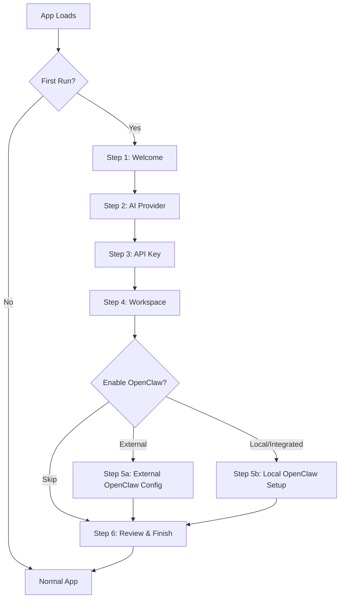
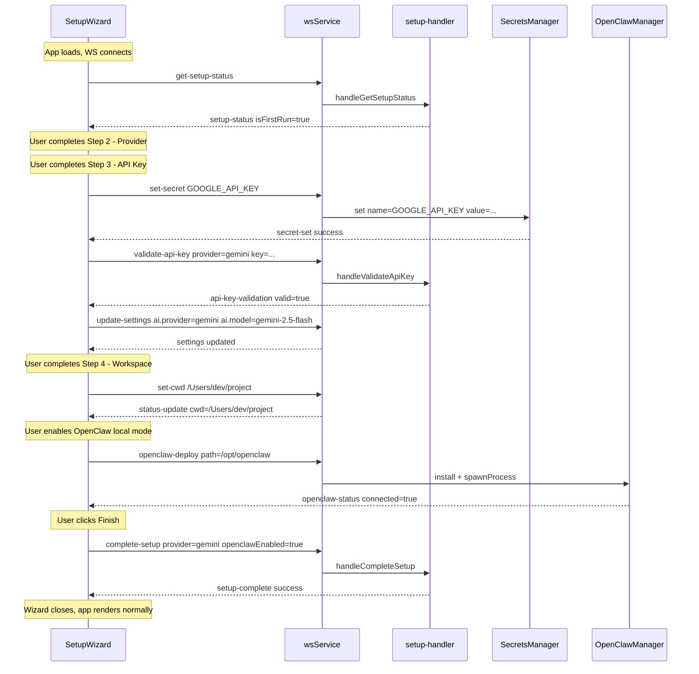
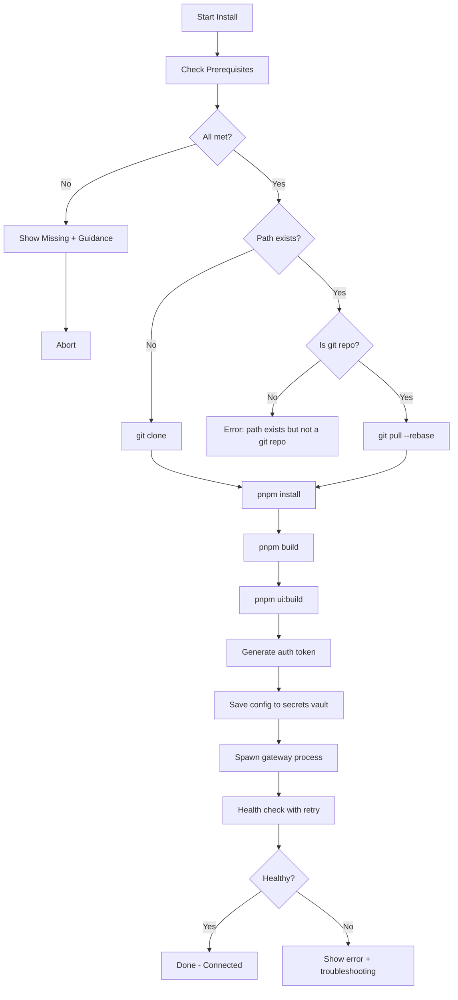

# First-Run Configuration Wizard — Design Document

## 1. Overview

The Setup Wizard provides a guided first-run onboarding experience for new RoboDev users. It walks users through essential configuration — selecting an AI provider, entering API keys, choosing a workspace, and optionally setting up OpenClaw integration — before they can start using the application.

### Goals
- **Zero-friction start**: A new user should be productive within 2 minutes
- **Progressive disclosure**: Only show advanced options when relevant (e.g., OpenClaw setup only if user opts for local mode)
- **Reusable**: The wizard can be re-launched from Settings at any time
- **Persist immediately**: Each step's data is saved to the secrets vault / config as the user completes it — no data loss on browser close

---

## 2. Architecture Analysis Summary

### Current Data Flow
```
┌─────────────┐   WebSocket    ┌─────────────────┐    ┌──────────────────┐
│  React UI   │ ◄────────────► │  web-server.mjs  │───►│  ai-assistant    │
│  (App.tsx)  │                │  WsDispatcher    │    │  SecretsManager  │
│             │                │                  │    │  OpenClawManager │
└─────────────┘                └─────────────────┘    └──────────────────┘
```

### Key Integration Points

| Component | File | Relevance |
|-----------|------|-----------|
| `SecretsManager` | `src/server/secrets-manager.mjs` | Stores API keys encrypted at rest (AES-256-GCM) |
| `secrets-handler.mjs` | `src/server/ws-handlers/secrets-handler.mjs` | WS handlers: `get-secrets`, `set-secret`, `delete-secret` |
| `settings-handler.mjs` | `src/server/ws-handlers/settings-handler.mjs` | WS handlers: `get-settings`, `update-settings` |
| `openclaw-handler.mjs` | `src/server/ws-handlers/openclaw-handler.mjs` | WS handlers: `openclaw-status`, `openclaw-config`, `openclaw-deploy` |
| `OpenClawManager` | `src/integration/openclaw/manager.mjs` | Manages OpenClaw lifecycle, install, config, spawn |
| `config.mjs` | `src/config.mjs` | Central config: AI model/provider/endpoint, keys, system |
| `wsService.ts` | `ui/src/services/wsService.ts` | Client WS abstraction with typed methods |
| `useChat.ts` | `ui/src/hooks/useChat.ts` | Main hook — handles connection, settings, OpenClaw status |
| `useSecrets.ts` | `ui/src/hooks/useSecrets.ts` | Hook for secrets vault CRUD |
| `SettingsDialog.tsx` | `ui/src/components/features/SettingsDialog.tsx` | Existing settings UI with PropertyGrid pattern |
| `KNOWN_SECRETS` | `src/server/secrets-manager.mjs:19-80` | Predefined secret definitions with categories |

### Existing WS Protocol Messages (reusable)
- `set-secret` → persists to encrypted vault, updates `process.env` immediately
- `get-secrets` → returns list with `isConfigured` status per key
- `update-settings` → updates AI provider/model/endpoint at runtime
- `openclaw-config` → configures OpenClaw mode/url/path/authToken with optional restart
- `openclaw-deploy` → installs + deploys OpenClaw in integrated mode
- `openclaw-status` → returns current OpenClaw connection state

---

## 3. Wizard Flow



### Step Details

#### Step 1 — Welcome
- Brief intro to RoboDev
- "Get started" CTA
- Option to skip wizard entirely (for advanced users who will configure manually)

#### Step 2 — AI Provider Selection
- Visual cards for: **OpenAI**, **Google Gemini**, **Anthropic**, **Local/Custom**
- Each card shows supported models and a brief description
- Selecting a provider auto-sets `AI_PROVIDER` and suggests a default `AI_MODEL`
- If "Local/Custom" is selected, show an endpoint URL field

#### Step 3 — API Key Entry
- Dynamic based on provider selection:
  - OpenAI → `OPENAI_API_KEY`
  - Google Gemini → `GOOGLE_API_KEY`
  - Anthropic → `ANTHROPIC_API_KEY`
  - Local → no key needed (skip or show optional endpoint)
- Input with masked/password field and reveal toggle
- "Test Connection" button that sends a lightweight API ping
- Visual feedback: success checkmark or error with guidance
- Key is saved to SecretsManager vault immediately via `set-secret`

#### Step 4 — Workspace Selection
- Shows current working directory
- Reuses existing `DirectoryPicker` component
- Brief explanation of what a "workspace" means in RoboDev context
- Creates `.ai-man/` directory if needed

#### Step 5 — OpenClaw Integration (Optional)
- Toggle: "Enable OpenClaw?" with brief explanation of what it provides
- If enabled, choose mode:
  - **External**: Enter gateway URL + auth token → test connection
  - **Local/Integrated**: Fully automated installation pipeline (see Section 15 for details)
- Uses existing `openclaw-config` and `openclaw-deploy` WS messages
- Shows connection status indicator during setup

#### Step 6 — Review & Finish
- Summary of all configured items with status indicators
- "Finish Setup" button that marks setup as complete
- Option to "Re-run Setup" from Settings menu later

---

## 4. First-Run Detection

### Backend: New WS message type

Add a new handler `setup-handler.mjs` that manages wizard state:

**WS Protocol:**
- `get-setup-status` → Returns `{ isFirstRun: boolean, completedSteps: string[], setupVersion: number }`
- `complete-setup` → Marks setup as done, persists flag
- `validate-api-key` → Tests an API key against its provider, returns `{ valid: boolean, error?: string }`

**Persistence:** Store setup completion state in a `.ai-man/setup.json` file at the robodev project root (alongside `.secrets.enc`). Structure:

```json
{
  "version": 1,
  "completedAt": "2026-02-18T18:00:00.000Z",
  "provider": "gemini",
  "openclawEnabled": false
}
```

### Frontend Detection

On WS `connected` event, after existing `getSettings()` and `getStatus()` calls, add:
```typescript
wsService.sendMessage('get-setup-status');
```

Listen for `setup-status` response. If `isFirstRun === true`, render the wizard overlay.

---

## 5. Component Architecture

### New Files

```
ui/src/
├── components/
│   └── features/
│       └── SetupWizard/
│           ├── SetupWizard.tsx          # Main wizard container with step navigation
│           ├── WelcomeStep.tsx           # Step 1: Welcome & intro
│           ├── ProviderStep.tsx          # Step 2: AI provider selection cards
│           ├── ApiKeyStep.tsx            # Step 3: API key entry + validation
│           ├── WorkspaceStep.tsx         # Step 4: Workspace selection
│           ├── OpenClawStep.tsx          # Step 5: OpenClaw configuration
│           ├── ReviewStep.tsx            # Step 6: Summary & finish
│           └── index.ts                 # Barrel export
├── hooks/
│   └── useSetupWizard.ts               # Hook for wizard state + WS communication
│
src/server/
├── ws-handlers/
│   └── setup-handler.mjs              # Backend handlers for setup state + validation
```

### Component Hierarchy

```
<App>
  {showWizard && (
    <SetupWizard onComplete={handleWizardComplete}>
      <WelcomeStep />
      <ProviderStep />
      <ApiKeyStep />
      <WorkspaceStep />
      <OpenClawStep />
      <ReviewStep />
    </SetupWizard>
  )}
  {/* ... existing app content ... */}
</App>
```

### SetupWizard.tsx — Main Container

Manages step progression, renders active step, provides navigation controls.

**Props:**
```typescript
interface SetupWizardProps {
  onComplete: () => void;
  onSkip: () => void;
  initialStep?: number;
}
```

**Internal State:**
```typescript
interface WizardState {
  currentStep: number;
  totalSteps: number;
  provider: string;          // 'openai' | 'gemini' | 'anthropic' | 'local'
  model: string;             // e.g., 'gpt-4o', 'gemini-2.0-flash'
  apiKey: string;            // transient — only held in memory until saved to vault
  apiKeyValid: boolean;
  endpoint: string;          // for local/custom providers
  workspace: string;
  openClawEnabled: boolean;
  openClawMode: string;      // 'external' | 'integrated'
  openClawUrl: string;
  openClawPath: string;
  openClawAuthToken: string;
  openClawConnected: boolean;
}
```

**Visual Design:**
- Full-screen overlay (same z-index pattern as `SettingsDialog` and `LockScreen`)
- Dark theme consistent with existing UI (`bg-[#080808]`, zinc color palette)
- Step indicator bar at top (dots or numbered pills)
- Content area in center
- Navigation buttons: Back / Next / Skip / Finish
- Animated transitions between steps (reuse existing `animate-fade-in-up` class)

### useSetupWizard.ts — Hook

```typescript
interface UseSetupWizardReturn {
  isFirstRun: boolean;
  isLoading: boolean;
  validateApiKey: (provider: string, key: string) => Promise<{ valid: boolean; error?: string }>;
  completeSetup: (config: WizardConfig) => void;
  skipSetup: () => void;
}
```

This hook:
1. Listens for `setup-status` WS event to determine `isFirstRun`
2. Requests setup status on mount via `wsService.sendMessage('get-setup-status')`
3. Provides `validateApiKey` that sends `validate-api-key` and returns a Promise
4. Provides `completeSetup` that sends `complete-setup`

---

## 6. Backend Changes

### New: `setup-handler.mjs`

```javascript
// Handles: get-setup-status, complete-setup, validate-api-key

import fs from 'fs';
import path from 'path';

const SETUP_FILE = '.ai-man/setup.json';

async function handleGetSetupStatus(data, ctx) {
    const { ws } = ctx;
    const setupPath = path.join(ctx.assistant?.workingDir || process.cwd(), '..'); 
    // Actually stored at project root level
    const projectRoot = path.resolve(path.dirname(fileURLToPath(import.meta.url)), '..', '..');
    const filePath = path.join(projectRoot, SETUP_FILE);
    
    let isFirstRun = true;
    let setupData = {};
    
    try {
        const content = await fs.promises.readFile(filePath, 'utf8');
        setupData = JSON.parse(content);
        isFirstRun = false;
    } catch {
        // File doesn't exist = first run
    }
    
    ws.send(JSON.stringify({
        type: 'setup-status',
        payload: { isFirstRun, ...setupData }
    }));
}

async function handleCompleteSetup(data, ctx) {
    const { ws } = ctx;
    const projectRoot = path.resolve(path.dirname(fileURLToPath(import.meta.url)), '..', '..');
    const dirPath = path.join(projectRoot, '.ai-man');
    const filePath = path.join(dirPath, 'setup.json');
    
    await fs.promises.mkdir(dirPath, { recursive: true });
    
    const setupData = {
        version: 1,
        completedAt: new Date().toISOString(),
        ...data.payload
    };
    
    await fs.promises.writeFile(filePath, JSON.stringify(setupData, null, 2));
    
    ws.send(JSON.stringify({
        type: 'setup-complete',
        payload: { success: true }
    }));
}

async function handleValidateApiKey(data, ctx) {
    const { ws, assistant } = ctx;
    const { provider, key } = data.payload;
    
    // Lightweight validation by attempting a small API call
    try {
        const result = await validateProviderKey(provider, key);
        ws.send(JSON.stringify({
            type: 'api-key-validation',
            payload: result
        }));
    } catch (err) {
        ws.send(JSON.stringify({
            type: 'api-key-validation',
            payload: { valid: false, error: err.message }
        }));
    }
}

async function validateProviderKey(provider, key) {
    // Minimal API calls to verify key validity
    switch (provider) {
        case 'openai': {
            const res = await fetch('https://api.openai.com/v1/models', {
                headers: { 'Authorization': `Bearer ${key}` }
            });
            if (res.ok) return { valid: true };
            return { valid: false, error: `OpenAI API returned ${res.status}` };
        }
        case 'gemini': {
            const res = await fetch(
              `https://generativelanguage.googleapis.com/v1beta/models?key=${key}`
            );
            if (res.ok) return { valid: true };
            return { valid: false, error: `Google API returned ${res.status}` };
        }
        case 'anthropic': {
            // Anthropic doesn't have a lightweight endpoint;
            // we can try listing models or just check auth header format
            const res = await fetch('https://api.anthropic.com/v1/messages', {
                method: 'POST',
                headers: {
                    'x-api-key': key,
                    'anthropic-version': '2023-06-01',
                    'content-type': 'application/json'
                },
                body: JSON.stringify({
                    model: 'claude-3-haiku-20240307',
                    max_tokens: 1,
                    messages: [{ role: 'user', content: 'hi' }]
                })
            });
            // 200 = valid, 401 = bad key, anything else = network issue
            if (res.ok || res.status === 200) return { valid: true };
            if (res.status === 401) return { valid: false, error: 'Invalid API key' };
            return { valid: true }; // Other errors likely mean the key is fine but model/quota issue
        }
        case 'local':
            return { valid: true }; // No validation needed for local
        default:
            return { valid: false, error: 'Unknown provider' };
    }
}
```

### Registration in `web-server.mjs`

Add to `buildDispatcher()`:
```javascript
import { handlers as setupHandlers } from './ws-handlers/setup-handler.mjs';
dispatcher.registerAll(setupHandlers);
```

### wsService.ts Extensions

```typescript
// Add to WSService class:

getSetupStatus() {
    this.sendMessage('get-setup-status');
}

completeSetup(config: { provider: string; openclawEnabled: boolean }) {
    this.sendMessage('complete-setup', config);
}

validateApiKey(provider: string, key: string): Promise<{ valid: boolean; error?: string }> {
    const id = `validate-${Date.now()}`;
    return new Promise((resolve) => {
        const unsub = this.on('api-key-validation', (payload: unknown) => {
            unsub();
            resolve(payload as { valid: boolean; error?: string });
        });
        // Timeout after 10s
        setTimeout(() => { unsub(); resolve({ valid: false, error: 'Timeout' }); }, 10000);
        this.sendMessage('validate-api-key', { provider, key });
    });
}
```

---

## 7. Step-by-Step UI Specifications

### Step 1: Welcome

```
┌─────────────────────────────────────────────────────────┐
│                                                         │
│                    🤖 Welcome to RoboDev                │
│                                                         │
│     Your AI-powered development assistant is almost     │
│     ready. Let us walk you through a quick setup.       │
│                                                         │
│              ┌──────────────────────┐                   │
│              │    Get Started →     │                   │
│              └──────────────────────┘                   │
│                                                         │
│           ┌─ Skip setup (I will configure manually) ─┐  │
│                                                         │
└─────────────────────────────────────────────────────────┘
```

### Step 2: AI Provider Selection

```
┌─────────────────────────────────────────────────────────┐
│  ● ○ ○ ○ ○ ○                    Step 1 of 5            │
│                                                         │
│  Choose Your AI Provider                                │
│  Select the AI service you would like to use.           │
│                                                         │
│  ┌─────────────┐  ┌─────────────┐  ┌─────────────┐     │
│  │   OpenAI    │  │   Gemini    │  │  Anthropic  │     │
│  │   GPT-4o    │  │  2.5 Flash  │  │   Claude    │     │
│  │             │  │             │  │             │     │
│  │  ● Selected │  │             │  │             │     │
│  └─────────────┘  └─────────────┘  └─────────────┘     │
│                                                         │
│  ┌─────────────┐                                        │
│  │ Local/Custom│                                        │
│  │  Endpoint   │                                        │
│  └─────────────┘                                        │
│                                                         │
│  Model: [gpt-4o            ▼]                           │
│                                                         │
│                        [Back]  [Next →]                 │
└─────────────────────────────────────────────────────────┘
```

**Provider Cards Data:**
- **OpenAI**: Models: `gpt-4o`, `gpt-4o-mini`, `o1`, `o3-mini`
- **Google Gemini**: Models: `gemini-2.5-pro`, `gemini-2.5-flash`, `gemini-2.0-flash`
- **Anthropic**: Models: `claude-sonnet-4-20250514`, `claude-3.5-haiku`
- **Local/Custom**: Shows endpoint URL input (`http://localhost:1234/v1/chat/completions`)

### Step 3: API Key

```
┌─────────────────────────────────────────────────────────┐
│  ● ● ○ ○ ○ ○                    Step 2 of 5            │
│                                                         │
│  Enter Your OpenAI API Key                              │
│  Your key is encrypted and stored locally.              │
│                                                         │
│  API Key:                                               │
│  ┌──────────────────────────────────┐  👁                │
│  │ sk-••••••••••••••••••••••••••   │                    │
│  └──────────────────────────────────┘                   │
│                                                         │
│  ┌──────────────┐                                       │
│  │ Test Key  ⚡ │   ✅ Valid — Connected successfully   │
│  └──────────────┘                                       │
│                                                         │
│  🔒 Keys are encrypted with AES-256-GCM and never      │
│     leave your machine.                                 │
│                                                         │
│                        [Back]  [Next →]                 │
└─────────────────────────────────────────────────────────┘
```

### Step 4: Workspace

```
┌─────────────────────────────────────────────────────────┐
│  ● ● ● ○ ○ ○                    Step 3 of 5            │
│                                                         │
│  Choose Your Workspace                                  │
│  This is where RoboDev will manage your project files.  │
│                                                         │
│  Current: /Users/dev/my-project                         │
│                                                         │
│  ┌──────────────────────────────────┐                   │
│  │ 📁 Browse...                     │                   │
│  └──────────────────────────────────┘                   │
│                                                         │
│  ℹ️  You can switch workspaces anytime from the header. │
│                                                         │
│                        [Back]  [Next →]                 │
└─────────────────────────────────────────────────────────┘
```

### Step 5: OpenClaw (Optional)

#### 5a: OpenClaw Mode Selection

```
┌─────────────────────────────────────────────────────────┐
│  ● ● ● ● ○ ○                    Step 4 of 5            │
│                                                         │
│  OpenClaw Integration                                   │
│  OpenClaw is a personal AI assistant gateway that adds  │
│  multi-channel messaging, tool execution, and sandboxed │
│  environments to your workflow.                         │
│                                                         │
│  ┌─ Enable OpenClaw ───────────────── [  toggle  ] ─┐   │
│                                                         │
│  Mode:                                                  │
│  ┌──────────────────┐  ┌──────────────────┐             │
│  │ 🌐 External      │  │ 💻 Local Install │             │
│  │ Connect to an    │  │ Auto-install &   │             │
│  │ existing gateway │  │ manage locally   │             │
│  │                  │  │ ● Selected       │             │
│  └──────────────────┘  └──────────────────┘             │
│                                                         │
│                        [Back]  [Next →]                 │
└─────────────────────────────────────────────────────────┘
```

#### 5b: External Mode — Connection Details

```
┌─────────────────────────────────────────────────────────┐
│  ● ● ● ● ○ ○                    Step 4 of 5            │
│                                                         │
│  Connect to External OpenClaw Gateway                   │
│                                                         │
│  Gateway URL:                                           │
│  ┌──────────────────────────────────────────────┐       │
│  │ ws://127.0.0.1:18789                         │       │
│  └──────────────────────────────────────────────┘       │
│                                                         │
│  Auth Token:                                            │
│  ┌──────────────────────────────────────────────┐       │
│  │ ••••••••••••••••••••••••••••                  │ 👁    │
│  └──────────────────────────────────────────────┘       │
│                                                         │
│  ┌──────────────────┐                                    │
│  │ Test Connection  │   ✅ Connected successfully        │
│  └──────────────────┘                                    │
│                                                         │
│                        [Back]  [Next →]                 │
└─────────────────────────────────────────────────────────┘
```

#### 5c: Local Mode — Automated Installation

```
┌─────────────────────────────────────────────────────────┐
│  ● ● ● ● ○ ○                    Step 4 of 5            │
│                                                         │
│  Install OpenClaw Locally                               │
│                                                         │
│  Install Path:                                          │
│  ┌────────────────────────────────────────┐  ┌────────┐ │
│  │ /Users/dev/.openclaw-gateway           │  │Browse  │ │
│  └────────────────────────────────────────┘  └────────┘ │
│                                                         │
│  ℹ  Requires: Node >= 22, git, pnpm                    │
│  ✅ Node 22.12.0   ✅ git 2.43.0   ✅ pnpm 10.23.0     │
│                                                         │
│  ┌───────────────────────────────────────────────┐      │
│  │  Install & Start OpenClaw ⚡                  │      │
│  └───────────────────────────────────────────────┘      │
│                                                         │
│  (After clicking Install:)                              │
│                                                         │
│  ┌───────────────────────────────────────────────┐      │
│  │ ✅ Prerequisites verified                     │      │
│  │ ✅ Repository cloned                          │      │
│  │ ✅ Dependencies installed                     │      │
│  │ ✅ Project built                              │      │
│  │ ✅ UI built                                   │      │
│  │ ✅ Gateway auth token generated               │      │
│  │ ⏳ Starting gateway...                        │      │
│  │ ░░░░░░░░░░░░░░░░░░░░░░░░░░░░░░░░░░░░░░  85% │      │
│  └───────────────────────────────────────────────┘      │
│                                                         │
│  (On completion:)                                       │
│                                                         │
│  ✅ OpenClaw gateway running at ws://127.0.0.1:18789    │
│  Gateway token saved to secrets vault                   │
│                                                         │
│                        [Back]  [Next →]                 │
└─────────────────────────────────────────────────────────┘
```

### Step 6: Review & Finish

```
┌─────────────────────────────────────────────────────────┐
│  ● ● ● ● ● ●                    Review                 │
│                                                         │
│  🎉 You are all set!                                    │
│                                                         │
│  Configuration Summary:                                 │
│                                                         │
│  ┌───────────────────────────────────────────────┐      │
│  │ AI Provider    │  Google Gemini    ✅          │      │
│  │ Model          │  gemini-2.5-flash ✅          │      │
│  │ API Key        │  Configured       ✅          │      │
│  │ Workspace      │  /Users/dev/proj  ✅          │      │
│  │ OpenClaw       │  Disabled         ⬜          │      │
│  └───────────────────────────────────────────────┘      │
│                                                         │
│  You can change any of these settings later from the    │
│  Settings panel (⌘,) or Secrets Vault (⌘K).            │
│                                                         │
│              ┌──────────────────────┐                   │
│              │   Finish Setup  ✨   │                   │
│              └──────────────────────┘                   │
└─────────────────────────────────────────────────────────┘
```

---

## 8. State Flow Diagram



---

## 9. Integration into App.tsx

### Changes to `App.tsx`

```tsx
import SetupWizard from './components/features/SetupWizard';
import { useSetupWizard } from './hooks/useSetupWizard';

function App() {
  // ... existing hooks ...
  const { isFirstRun, isLoading: setupLoading } = useSetupWizard();
  const [showWizard, setShowWizard] = useState(false);

  // Show wizard on first run
  useEffect(() => {
    if (isFirstRun && !setupLoading) {
      setShowWizard(true);
    }
  }, [isFirstRun, setupLoading]);

  return (
    <div className="flex h-screen ...">
      {showWizard && (
        <SetupWizard
          onComplete={() => setShowWizard(false)}
          onSkip={() => setShowWizard(false)}
          settings={settings}
          secrets={secrets}
        />
      )}
      {/* ... existing app JSX ... */}
    </div>
  );
}
```

### Re-launch from Settings

Add a "Run Setup Wizard" button in `SettingsDialog.tsx` general tab:
```tsx
<button onClick={() => { onClose(); setShowWizard(true); }}>
  Re-run Setup Wizard
</button>
```

---

## 10. Reusable Components

The wizard leverages existing UI components wherever possible:

| Wizard Need | Existing Component | Notes |
|---|---|---|
| Directory browsing | `DirectoryPicker.tsx` | Already used for workspace switching |
| Property inputs | `PropertyGrid.tsx` | Used in SettingsDialog for text/select/password inputs |
| Toggle switches | `surface-kit/primitives/Switch.tsx` | For OpenClaw enable/disable |
| Buttons | `surface-kit/primitives/Button.tsx` | Primary/secondary button variants |
| Cards | `surface-kit/layout/Card.tsx` | For provider selection cards |
| Progress indicators | Custom step dots | Simple div-based step indicator |
| Overlay/backdrop | Same pattern as `SettingsDialog` | `fixed inset-0 z-[100]` with backdrop blur |

---

## 11. Styling Guidelines

Follow existing design system observed in `SettingsDialog.tsx` and `App.tsx`:

- **Background**: `bg-[#080808]` or `bg-[#09090b]/95`
- **Borders**: `border-zinc-800/30` or `border-zinc-800/40`
- **Text primary**: `text-zinc-100`
- **Text secondary**: `text-zinc-400` / `text-zinc-500`
- **Text muted**: `text-zinc-600`
- **Accent**: `bg-indigo-600` / `text-indigo-400` (for CTAs and selections)
- **Success**: `bg-emerald-500` / `text-emerald-400`
- **Error**: `text-red-400`
- **Cards**: `bg-zinc-900/20 rounded-xl border border-zinc-800/30`
- **Selected state**: `bg-indigo-500/10 border-indigo-500/30`
- **Animations**: `animate-fade-in-up`, `animate-scale-in`, `transition-all duration-200`
- **Font sizes**: headers `text-lg`, body `text-xs` to `text-sm`, labels `text-[10px] uppercase tracking-[0.15em]`

---

## 12. Error Handling

| Scenario | Handling |
|---|---|
| Invalid API key | Show inline error under input, prevent advancing to next step |
| Network timeout during validation | Show "Could not verify — continue anyway?" with option to proceed |
| OpenClaw install failure | Show error message, allow user to skip OpenClaw or retry |
| Browser closes mid-wizard | Already-saved secrets persist; on next load, detect partially completed setup and resume or restart |
| WS disconnection during wizard | Show reconnection indicator; wizard state is in React memory so it survives reconnect |

---

## 13. Implementation Plan

### Phase 1: Backend (setup-handler.mjs)
1. Create `src/server/ws-handlers/setup-handler.mjs` with `get-setup-status`, `complete-setup`, `validate-api-key`
2. Register in `web-server.mjs` `buildDispatcher()`
3. Add setup state persistence to `.ai-man/setup.json`

### Phase 2: Frontend Hook (useSetupWizard.ts)
1. Create `ui/src/hooks/useSetupWizard.ts`
2. Add `getSetupStatus()`, `completeSetup()`, `validateApiKey()` to `wsService.ts`

### Phase 3: Wizard UI Components
1. Create `SetupWizard.tsx` — main container with step navigation
2. Create `WelcomeStep.tsx` — intro screen
3. Create `ProviderStep.tsx` — provider cards + model selector
4. Create `ApiKeyStep.tsx` — key input + validation
5. Create `WorkspaceStep.tsx` — directory picker integration
6. Create `OpenClawStep.tsx` — OpenClaw toggle + mode config
7. Create `ReviewStep.tsx` — summary + finish

### Phase 4: Integration
1. Add `useSetupWizard` to `App.tsx`
2. Wire wizard display logic
3. Add "Re-run Wizard" to Settings
4. Test end-to-end flow

---

## 14. Testing Strategy

- **Unit tests**: `useSetupWizard` hook — mock WS events, verify state transitions
- **Unit tests**: `setup-handler.mjs` — verify file I/O, API key validation responses
- **Unit tests**: OpenClaw installer — mock `child_process`, verify step sequence and error handling
- **Integration tests**: Full wizard flow with mock WS server
- **Manual testing**: End-to-end with real API keys on fresh install
- **Manual testing**: OpenClaw local install on a clean machine (no existing clone)
- **Manual testing**: OpenClaw local install on a machine with existing clone (update path)

---

## 15. Automated OpenClaw Local Installation — Deep Design

This section provides the detailed design for making OpenClaw's local/integrated installation seamless and fully automated within the wizard. Based on analysis of the OpenClaw codebase at `~/Development/openclaw`.

### 15.1 OpenClaw Technical Requirements

From analysis of [`package.json`](/Users/sschepis/Development/openclaw/package.json), [`openclaw.mjs`](/Users/sschepis/Development/openclaw/openclaw.mjs), [`docker-compose.yml`](/Users/sschepis/Development/openclaw/docker-compose.yml), and [`README.md`](/Users/sschepis/Development/openclaw/README.md):

| Requirement | Details |
|---|---|
| **Node.js** | >= 22.12.0 (enforced via `engines` in package.json) |
| **Package manager** | pnpm >= 10.23.0 (set via `packageManager` field); npm/bun also work for running |
| **Git** | Required for cloning the repository |
| **Repository** | `https://github.com/sschepis/openclaw.git` |
| **Entry point** | `openclaw.mjs` → imports `./dist/entry.js` (requires build) |
| **Build steps** | `pnpm install` → `pnpm build` (TypeScript compile + UI bundle) |
| **Build command** | `pnpm canvas:a2ui:bundle && tsc -p tsconfig.json --noEmit false && scripts/...` |
| **UI build** | `pnpm ui:build` (auto-installs UI deps on first run) |
| **Gateway start** | `node openclaw.mjs gateway run` or `node dist/index.js gateway` |
| **Default port** | 18789 (gateway WS), 18790 (bridge) |
| **Config dir** | `~/.openclaw/` (created automatically by OpenClaw) |
| **Workspace dir** | `~/.openclaw/workspace/` |
| **Onboard command** | `openclaw onboard` (interactive CLI wizard — but we bypass this) |
| **Monorepo** | Uses pnpm workspaces: root, `ui/`, `packages/*`, `extensions/*` |
| **Postinstall** | `scripts/postinstall.js` — sets up git hooks, shell completion, applies patches |

### 15.2 Installation Pipeline

The wizard executes a multi-stage pipeline. Each stage reports progress back to the UI via WebSocket messages. The pipeline is designed to be **idempotent** — re-running it on an existing installation will detect what's already done and skip ahead.



### 15.3 Prerequisite Checks

Before installation begins, the backend checks for required tools. This is done via a new WS message `openclaw-check-prereqs`.

```javascript
// In setup-handler.mjs or openclaw-handler.mjs

async function checkPrerequisites() {
    const results = {
        node: { installed: false, version: null, sufficient: false },
        git: { installed: false, version: null },
        pnpm: { installed: false, version: null, sufficient: false },
        docker: { installed: false, version: null }, // optional
    };

    // Check Node.js version
    try {
        const nodeVersion = process.version; // e.g., 'v22.12.0'
        const major = parseInt(nodeVersion.slice(1).split('.')[0]);
        results.node = {
            installed: true,
            version: nodeVersion,
            sufficient: major >= 22
        };
    } catch {}

    // Check git
    try {
        const { stdout } = await execAsync('git --version');
        const match = stdout.match(/git version (\S+)/);
        results.git = {
            installed: true,
            version: match ? match[1] : stdout.trim()
        };
    } catch {}

    // Check pnpm
    try {
        const { stdout } = await execAsync('pnpm --version');
        const version = stdout.trim();
        const major = parseInt(version.split('.')[0]);
        results.pnpm = {
            installed: true,
            version,
            sufficient: major >= 9 // pnpm 9+ works, 10+ preferred
        };
    } catch {}

    // Check Docker (optional, for alternative install path)
    try {
        const { stdout } = await execAsync('docker --version');
        results.docker = {
            installed: true,
            version: stdout.trim()
        };
    } catch {}

    return results;
}
```

**UI Display:**

Each prerequisite shows a status indicator:
- ✅ Green checkmark: installed and meets minimum version
- ⚠️ Yellow warning: installed but version may be too old
- ❌ Red X: not installed

If pnpm is missing, show a one-click install button:
```
⚠️ pnpm not found
[Install pnpm automatically] — runs: npm install -g pnpm@latest
```

If Node < 22, show guidance:
```
❌ Node 22+ required (found: v18.17.0)
Please update Node.js: https://nodejs.org or use nvm:
  nvm install 22 && nvm use 22
```

### 15.4 Auto-Detection of Existing Installations

Before prompting for an install path, the wizard probes common locations:

```javascript
const COMMON_OPENCLAW_PATHS = [
    path.join(os.homedir(), '.openclaw-gateway'),
    path.join(os.homedir(), 'openclaw'),
    path.join(os.homedir(), 'Development', 'openclaw'),
    path.join(os.homedir(), 'Projects', 'openclaw'),
    '/opt/openclaw',
    '/usr/local/openclaw',
];

async function detectExistingInstall() {
    for (const candidate of COMMON_OPENCLAW_PATHS) {
        if (fs.existsSync(path.join(candidate, 'openclaw.mjs'))) {
            // Verify it's a valid OpenClaw installation
            try {
                const pkg = JSON.parse(
                    fs.readFileSync(path.join(candidate, 'package.json'), 'utf8')
                );
                if (pkg.name === '@sschepis/openclaw') {
                    // Check if dist/entry.js exists (built)
                    const isBuilt = fs.existsSync(
                        path.join(candidate, 'dist', 'entry.js')
                    );
                    return {
                        found: true,
                        path: candidate,
                        version: pkg.version,
                        isBuilt,
                        hasNodeModules: fs.existsSync(
                            path.join(candidate, 'node_modules')
                        )
                    };
                }
            } catch {}
        }
    }
    
    // Also check OPENCLAW_PATH env var or vault secret
    const envPath = process.env.OPENCLAW_PATH;
    if (envPath && fs.existsSync(path.join(envPath, 'openclaw.mjs'))) {
        return { found: true, path: envPath, fromEnv: true };
    }
    
    return { found: false };
}
```

**UI behavior when existing install is found:**

```
┌───────────────────────────────────────────────┐
│ ✅ Existing OpenClaw found!                   │
│                                               │
│ Location: /Users/dev/Development/openclaw     │
│ Version:  2026.2.7                            │
│ Status:   Built and ready                     │
│                                               │
│ [Use this installation]  [Install fresh copy] │
└───────────────────────────────────────────────┘
```

### 15.5 Enhanced `OpenClawManager.install()` Method

The existing [`install()`](src/integration/openclaw/manager.mjs:109) method is too basic — it only does `git clone` + `npm install`. The enhanced version handles the full build pipeline with progress reporting.

```javascript
/**
 * Enhanced install method with progress reporting.
 * @param {function} onProgress - Callback: (step, status, detail) => void
 * @returns {Promise<{success: boolean, error?: string}>}
 */
async install(onProgress = () => {}) {
    if (!this.config.path) {
        throw new Error('OPENCLAW_PATH is required for installation');
    }

    const steps = [
        'prereqs',      // Check prerequisites
        'clone',         // Clone or update repository
        'install',       // Install dependencies
        'build',         // Build TypeScript
        'ui-build',      // Build UI
        'auth-token',    // Generate gateway auth token
        'config',        // Save configuration
        'start',         // Start gateway
        'health-check',  // Verify gateway is running
    ];

    try {
        // Step 1: Prerequisites
        onProgress('prereqs', 'running', 'Checking prerequisites...');
        const prereqs = await this.checkPrerequisites();
        if (!prereqs.node.sufficient) {
            throw new Error(`Node.js >= 22 required (found: ${prereqs.node.version || 'not installed'})`);
        }
        if (!prereqs.pnpm.installed) {
            onProgress('prereqs', 'running', 'Installing pnpm...');
            await this.runCommand('npm', ['install', '-g', 'pnpm@latest']);
        }
        if (!prereqs.git.installed) {
            throw new Error('git is required but not installed');
        }
        onProgress('prereqs', 'done', 'Prerequisites verified');

        // Step 2: Clone or update
        if (fs.existsSync(this.config.path)) {
            const isGitRepo = fs.existsSync(
                path.join(this.config.path, '.git')
            );
            if (isGitRepo) {
                onProgress('clone', 'running', 'Updating existing repository...');
                await this.runCommand('git', ['pull', '--rebase'], {
                    cwd: this.config.path
                });
            } else {
                // Path exists but isn't a git repo
                const hasOpenClaw = fs.existsSync(
                    path.join(this.config.path, 'openclaw.mjs')
                );
                if (!hasOpenClaw) {
                    throw new Error(
                        `Path ${this.config.path} exists but is not an OpenClaw repository`
                    );
                }
                // It's an npm-installed copy — skip clone
                onProgress('clone', 'skipped', 'Using existing installation');
            }
        } else {
            onProgress('clone', 'running', 'Cloning repository...');
            await this.runCommand('git', [
                'clone',
                '--depth', '1',  // Shallow clone for speed
                'https://github.com/sschepis/openclaw.git',
                this.config.path
            ]);
        }
        onProgress('clone', 'done', 'Repository ready');

        // Step 3: Install dependencies
        onProgress('install', 'running', 'Installing dependencies (this may take a few minutes)...');
        await this.runCommand('pnpm', ['install', '--frozen-lockfile'], {
            cwd: this.config.path,
            env: {
                ...process.env,
                // Skip postinstall completion setup during wizard install
                OPENCLAW_SKIP_COMPLETION_SETUP: '1'
            }
        });
        onProgress('install', 'done', 'Dependencies installed');

        // Step 4: Build
        onProgress('build', 'running', 'Building OpenClaw...');
        await this.runCommand('pnpm', ['build'], {
            cwd: this.config.path
        });
        onProgress('build', 'done', 'Build complete');

        // Step 5: Build UI
        onProgress('ui-build', 'running', 'Building UI...');
        await this.runCommand('pnpm', ['ui:build'], {
            cwd: this.config.path
        });
        onProgress('ui-build', 'done', 'UI built');

        // Step 6: Generate auth token
        onProgress('auth-token', 'running', 'Generating gateway auth token...');
        const crypto = await import('crypto');
        const authToken = crypto.randomBytes(32).toString('hex');
        this.config.authToken = authToken;
        onProgress('auth-token', 'done', 'Auth token generated');

        // Step 7: Save configuration
        onProgress('config', 'running', 'Saving configuration...');
        this.config.mode = 'integrated';
        this.config.url = 'ws://127.0.0.1:18789';
        
        if (this.secretsManager) {
            await this.secretsManager.set(
                'OPENCLAW_MODE', 'integrated',
                'Integrations', 'OpenClaw integration mode'
            );
            await this.secretsManager.set(
                'OPENCLAW_URL', this.config.url,
                'Endpoints', 'OpenClaw WebSocket URL'
            );
            await this.secretsManager.set(
                'OPENCLAW_AUTH_TOKEN', authToken,
                'Integrations', 'OpenClaw gateway authentication token'
            );
            await this.secretsManager.set(
                'OPENCLAW_PATH', this.config.path,
                'Endpoints', 'Path to OpenClaw installation'
            );
        }
        onProgress('config', 'done', 'Configuration saved to vault');

        // Step 8: Start gateway
        onProgress('start', 'running', 'Starting OpenClaw gateway...');
        await this.spawnProcess();
        onProgress('start', 'done', 'Gateway process started');

        // Step 9: Health check
        onProgress('health-check', 'running', 'Verifying gateway is healthy...');
        const healthy = await this.healthCheck(5, 2000);
        if (!healthy) {
            throw new Error('Gateway started but health check failed');
        }
        onProgress('health-check', 'done', 'Gateway is running and healthy');

        return { success: true };
    } catch (err) {
        return { success: false, error: err.message };
    }
}

/**
 * Enhanced runCommand that captures stdout/stderr for progress reporting.
 * Uses 'pipe' instead of 'inherit' so we can stream output to the UI.
 */
runCommandWithOutput(command, args, options = {}) {
    return new Promise((resolve, reject) => {
        const proc = spawn(command, args, {
            stdio: ['ignore', 'pipe', 'pipe'],
            ...options
        });
        
        let stdout = '';
        let stderr = '';
        
        proc.stdout?.on('data', (data) => {
            stdout += data.toString();
        });
        
        proc.stderr?.on('data', (data) => {
            stderr += data.toString();
        });
        
        proc.on('close', (code) => {
            if (code === 0) resolve({ stdout, stderr });
            else reject(new Error(
                `${command} exited with code ${code}\n${stderr || stdout}`
            ));
        });
        proc.on('error', reject);
    });
}

/**
 * Health check: attempt to connect to the gateway WS endpoint.
 */
async healthCheck(retries = 5, delay = 2000) {
    for (let i = 0; i < retries; i++) {
        try {
            const response = await fetch(
                `http://127.0.0.1:18789/health`,
                { signal: AbortSignal.timeout(3000) }
            );
            if (response.ok) return true;
        } catch {}
        
        if (i < retries - 1) {
            await new Promise(r => setTimeout(r, delay));
        }
    }
    return false;
}
```

### 15.6 WS Protocol for Installation Progress

New WS message types for streaming install progress to the UI:

**Request:** `openclaw-install` (replaces the simpler `openclaw-deploy` for wizard context)

```typescript
// Client → Server
{
    type: 'openclaw-install',
    payload: {
        path: string,           // Install path
        method: 'source' | 'npm' | 'docker',  // Install method
        skipBuild?: boolean,    // Skip build if dist/ already exists
    }
}
```

**Progress Events:** `openclaw-install-progress` (streamed as each step completes)

```typescript
// Server → Client (multiple times during install)
{
    type: 'openclaw-install-progress',
    payload: {
        step: string,           // 'prereqs' | 'clone' | 'install' | 'build' | ...
        status: 'running' | 'done' | 'error' | 'skipped',
        detail: string,         // Human-readable description
        progress?: number,      // 0-100 percentage (optional)
        stepsCompleted: number,
        totalSteps: number,
    }
}
```

**Completion:** `openclaw-install-complete`

```typescript
// Server → Client (once, when pipeline finishes)
{
    type: 'openclaw-install-complete',
    payload: {
        success: boolean,
        error?: string,
        gatewayUrl?: string,
        authToken?: string,     // Only sent once for UI display
    }
}
```

### 15.7 Alternative Install Methods

While "from source" is the primary method, support two alternatives:

#### npm global install (simpler but less control)

```javascript
async installViaNpm(onProgress) {
    onProgress('install', 'running', 'Installing OpenClaw via npm...');
    await this.runCommand('npm', [
        'install', '-g', '@sschepis/openclaw@latest'
    ]);
    
    // Find where it was installed
    const { stdout } = await this.runCommandWithOutput(
        'npm', ['root', '-g']
    );
    const globalRoot = stdout.trim();
    this.config.path = path.join(globalRoot, '@sschepis', 'openclaw');
    
    onProgress('install', 'done', 'Installed via npm');
    // npm install already builds via prepack, so skip build steps
}
```

#### Docker install (for isolation)

```javascript
async installViaDocker(onProgress) {
    onProgress('prereqs', 'running', 'Checking Docker...');
    
    try {
        await this.runCommand('docker', ['info']);
    } catch {
        throw new Error('Docker is not running. Please start Docker and try again.');
    }
    
    onProgress('build', 'running', 'Building Docker image...');
    await this.runCommand('docker', [
        'build', '-t', 'openclaw:local',
        '-f', path.join(this.config.path, 'Dockerfile'),
        this.config.path
    ]);
    
    onProgress('start', 'running', 'Starting Docker container...');
    // Use docker-compose.yml from the cloned repo
    await this.runCommand('docker', ['compose', '-f',
        path.join(this.config.path, 'docker-compose.yml'),
        'up', '-d', 'openclaw-gateway'
    ], {
        env: {
            ...process.env,
            OPENCLAW_CONFIG_DIR: path.join(os.homedir(), '.openclaw'),
            OPENCLAW_WORKSPACE_DIR: path.join(os.homedir(), '.openclaw', 'workspace'),
            OPENCLAW_GATEWAY_PORT: '18789',
            OPENCLAW_GATEWAY_BIND: 'lan',
            OPENCLAW_IMAGE: 'openclaw:local'
        }
    });
}
```

### 15.8 Install Path Smart Defaults

The wizard suggests a default install path based on the platform and existing directory structure:

```javascript
function getDefaultInstallPath() {
    const home = os.homedir();
    
    // Check if user has a Development directory
    const devDir = path.join(home, 'Development');
    if (fs.existsSync(devDir)) {
        return path.join(devDir, 'openclaw');
    }
    
    // Check for Projects directory
    const projDir = path.join(home, 'Projects');
    if (fs.existsSync(projDir)) {
        return path.join(projDir, 'openclaw');
    }
    
    // Default: ~/.openclaw-gateway (hidden, out of the way)
    return path.join(home, '.openclaw-gateway');
}
```

### 15.9 OpenClawStep Component — Detailed Design

The `OpenClawStep.tsx` component manages three sub-states:

```typescript
type OpenClawSubStep = 'mode-select' | 'external-config' | 'local-install';

interface OpenClawStepState {
    subStep: OpenClawSubStep;
    enabled: boolean;
    mode: 'external' | 'integrated';
    
    // External mode
    url: string;
    authToken: string;
    connectionTested: boolean;
    connectionError?: string;
    
    // Local mode
    installPath: string;
    installMethod: 'source' | 'npm' | 'docker';
    prereqs: PrereqResults | null;
    existingInstall: ExistingInstallInfo | null;
    
    // Installation progress
    installing: boolean;
    installSteps: InstallStepStatus[];
    installError?: string;
    installComplete: boolean;
}

interface InstallStepStatus {
    step: string;
    label: string;
    status: 'pending' | 'running' | 'done' | 'error' | 'skipped';
    detail?: string;
}

const INSTALL_STEPS: InstallStepStatus[] = [
    { step: 'prereqs',     label: 'Verify prerequisites',       status: 'pending' },
    { step: 'clone',       label: 'Clone repository',           status: 'pending' },
    { step: 'install',     label: 'Install dependencies',       status: 'pending' },
    { step: 'build',       label: 'Build project',              status: 'pending' },
    { step: 'ui-build',    label: 'Build UI',                   status: 'pending' },
    { step: 'auth-token',  label: 'Generate auth token',        status: 'pending' },
    { step: 'config',      label: 'Save configuration',         status: 'pending' },
    { step: 'start',       label: 'Start gateway',              status: 'pending' },
    { step: 'health-check',label: 'Verify connection',          status: 'pending' },
];
```

### 15.10 Error Recovery & Troubleshooting

Each installation step has specific error recovery guidance:

| Step | Common Error | Recovery Guidance |
|---|---|---|
| **prereqs** | Node < 22 | "Update Node.js: `nvm install 22` or visit nodejs.org" |
| **prereqs** | pnpm missing | Auto-install via `npm i -g pnpm` (one-click button) |
| **prereqs** | git missing | "Install git: `xcode-select --install` on macOS or visit git-scm.com" |
| **clone** | Permission denied | "Check write permissions on the target directory" |
| **clone** | Network error | "Check your internet connection. OpenClaw requires GitHub access." |
| **clone** | Path exists, not git repo | "The selected path contains files. Choose an empty directory or let us create a new one." |
| **install** | Native dependency build failure | "Try: `pnpm install --ignore-scripts` then `pnpm rebuild`. If sharp fails, see: sharp.pixelplumbing.com/install" |
| **install** | Disk space | "OpenClaw requires ~500MB of disk space. Free some space and retry." |
| **build** | TypeScript errors | "Try `git checkout main && git pull` to get the latest code, then retry." |
| **start** | Port 18789 in use | "Another process is using port 18789. Stop it with: `lsof -ti:18789 \| xargs kill`" |
| **health-check** | Timeout | "Gateway started but isn't responding. Check `~/.openclaw/` for logs." |

**Retry Mechanism:**

```tsx
// In OpenClawStep.tsx
const handleRetry = () => {
    // Reset failed steps to pending, keep completed steps
    setInstallSteps(prev => prev.map(s =>
        s.status === 'error' ? { ...s, status: 'pending' } : s
    ));
    // Re-trigger installation from the failed step
    wsService.sendMessage('openclaw-install', {
        path: installPath,
        method: installMethod,
        resumeFrom: failedStep, // Backend skips already-completed steps
    });
};
```

### 15.11 OpenClaw Gateway Configuration

After successful installation, the wizard auto-configures the gateway with sensible defaults matching how OpenClaw expects to be run:

```javascript
// Auto-generated openclaw.json for the gateway
const gatewayConfig = {
    agent: {
        // Use the same AI provider/model the user configured in Step 2
        model: `${wizardState.provider}/${wizardState.model}`,
    },
    gateway: {
        bind: 'loopback',  // Only accessible from localhost
        port: 18789,
    },
};

// Write to ~/.openclaw/openclaw.json
const configDir = path.join(os.homedir(), '.openclaw');
await fs.promises.mkdir(configDir, { recursive: true });
await fs.promises.writeFile(
    path.join(configDir, 'openclaw.json'),
    JSON.stringify(gatewayConfig, null, 2)
);
```

The AI provider API key is **not** duplicated — OpenClaw reads it from environment variables which RoboDev already sets via `process.env` when spawning the gateway child process. The [`spawnProcess()`](src/integration/openclaw/manager.mjs:164) method already passes `{ ...process.env }` to the child.

### 15.12 Spawn Process Enhancement

The existing [`spawnProcess()`](src/integration/openclaw/manager.mjs:151) needs enhancement to:
1. Use `dist/index.js` instead of `openclaw.mjs` (avoids tsx dependency in production)
2. Pass the generated auth token
3. Capture output for logging
4. Bind to loopback only for security

```javascript
async spawnProcess() {
    if (!this.config.path) {
        throw new Error('OPENCLAW_PATH is required for integrated mode');
    }

    // Prefer dist/index.js (production) over openclaw.mjs (development)
    const entryPoint = fs.existsSync(
        path.join(this.config.path, 'dist', 'index.js')
    )
        ? ['dist/index.js', 'gateway']
        : ['openclaw.mjs', 'gateway', 'run'];

    const gatewayEnv = {
        ...process.env,
        OPENCLAW_GATEWAY_TOKEN: this.config.authToken,
        // Forward the AI API keys from RoboDev's environment
        OPENAI_API_KEY: process.env.OPENAI_API_KEY,
        ANTHROPIC_API_KEY: process.env.ANTHROPIC_API_KEY,
        GOOGLE_API_KEY: process.env.GOOGLE_API_KEY,
    };

    this.process = spawn('node', [
        ...entryPoint,
        '--bind', 'loopback',
        '--port', '18789',
        '--verbose'
    ], {
        cwd: this.config.path,
        stdio: ['ignore', 'pipe', 'pipe'],
        env: gatewayEnv,
        detached: false, // Tied to parent process lifecycle
    });

    // Capture output for debugging
    this.process.stdout?.on('data', (data) => {
        console.log(`[OpenClaw] ${data.toString().trim()}`);
    });
    
    this.process.stderr?.on('data', (data) => {
        console.error(`[OpenClaw:err] ${data.toString().trim()}`);
    });

    this.process.on('error', (err) => {
        console.error('[OpenClawManager] Process spawn error:', err);
    });

    this.process.on('exit', (code, signal) => {
        console.log(
            `[OpenClawManager] Process exited: code=${code} signal=${signal}`
        );
        this.process = null;
    });

    // Wait for gateway to be ready (check /health endpoint)
    await this.waitForReady(10, 1500);
}

async waitForReady(retries = 10, delay = 1500) {
    for (let i = 0; i < retries; i++) {
        try {
            const res = await fetch('http://127.0.0.1:18789/health', {
                signal: AbortSignal.timeout(2000)
            });
            if (res.ok) {
                console.log('[OpenClawManager] Gateway is ready');
                return;
            }
        } catch {}
        
        if (i < retries - 1) {
            await new Promise(r => setTimeout(r, delay));
        }
    }
    console.warn('[OpenClawManager] Gateway may not be fully ready');
}
```

### 15.13 Updated OpenClaw Handler

The [`openclaw-handler.mjs`](src/server/ws-handlers/openclaw-handler.mjs) needs a new handler for the install pipeline:

```javascript
async function handleOpenClawInstall(data, ctx) {
    const { ws, openClawManager } = ctx;
    const { path: installPath, method = 'source', resumeFrom } = data.payload;

    // Set the path
    openClawManager.config.path = installPath;
    
    const sendProgress = (step, status, detail, extra = {}) => {
        ws.send(JSON.stringify({
            type: 'openclaw-install-progress',
            payload: { step, status, detail, ...extra }
        }));
    };

    try {
        const result = await openClawManager.install((step, status, detail) => {
            sendProgress(step, status, detail);
        });

        ws.send(JSON.stringify({
            type: 'openclaw-install-complete',
            payload: {
                success: result.success,
                error: result.error,
                gatewayUrl: openClawManager.config.url,
            }
        }));
    } catch (err) {
        ws.send(JSON.stringify({
            type: 'openclaw-install-complete',
            payload: {
                success: false,
                error: err.message
            }
        }));
    }
}

// Also add: openclaw-check-prereqs
async function handleCheckPrereqs(data, ctx) {
    const { ws } = ctx;
    const prereqs = await checkPrerequisites();
    const existing = await detectExistingInstall();
    const defaultPath = getDefaultInstallPath();
    
    ws.send(JSON.stringify({
        type: 'openclaw-prereqs',
        payload: { prereqs, existingInstall: existing, defaultPath }
    }));
}
```

### 15.14 Lifecycle Management

When RoboDev shuts down, the OpenClaw gateway child process must be cleaned up:

```javascript
// In main.mjs — add process cleanup
process.on('SIGTERM', async () => {
    if (openClawManager) {
        await openClawManager.stop();
    }
    process.exit(0);
});

process.on('SIGINT', async () => {
    if (openClawManager) {
        await openClawManager.stop();
    }
    process.exit(0);
});

// Also handle unexpected exits
process.on('exit', () => {
    if (openClawManager?.process) {
        openClawManager.process.kill('SIGTERM');
    }
});
```

### 15.15 Summary of All OpenClaw-Related WS Messages

| Message Type | Direction | Purpose |
|---|---|---|
| `openclaw-status` | → Server | Request current OpenClaw status |
| `openclaw-status` | ← Server | Status response: available, connected, mode, url |
| `openclaw-config` | → Server | Update OpenClaw config (mode, url, path, authToken) |
| `openclaw-deploy` | → Server | Legacy: simple install + deploy (kept for backward compat) |
| `openclaw-check-prereqs` | → Server | **NEW**: Check prerequisites + detect existing install |
| `openclaw-prereqs` | ← Server | **NEW**: Prerequisites check results |
| `openclaw-install` | → Server | **NEW**: Start full install pipeline |
| `openclaw-install-progress` | ← Server | **NEW**: Stream install progress updates |
| `openclaw-install-complete` | ← Server | **NEW**: Final install result |
