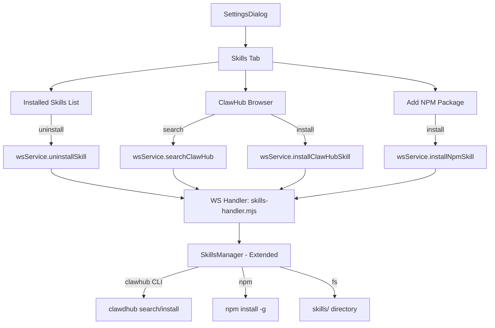
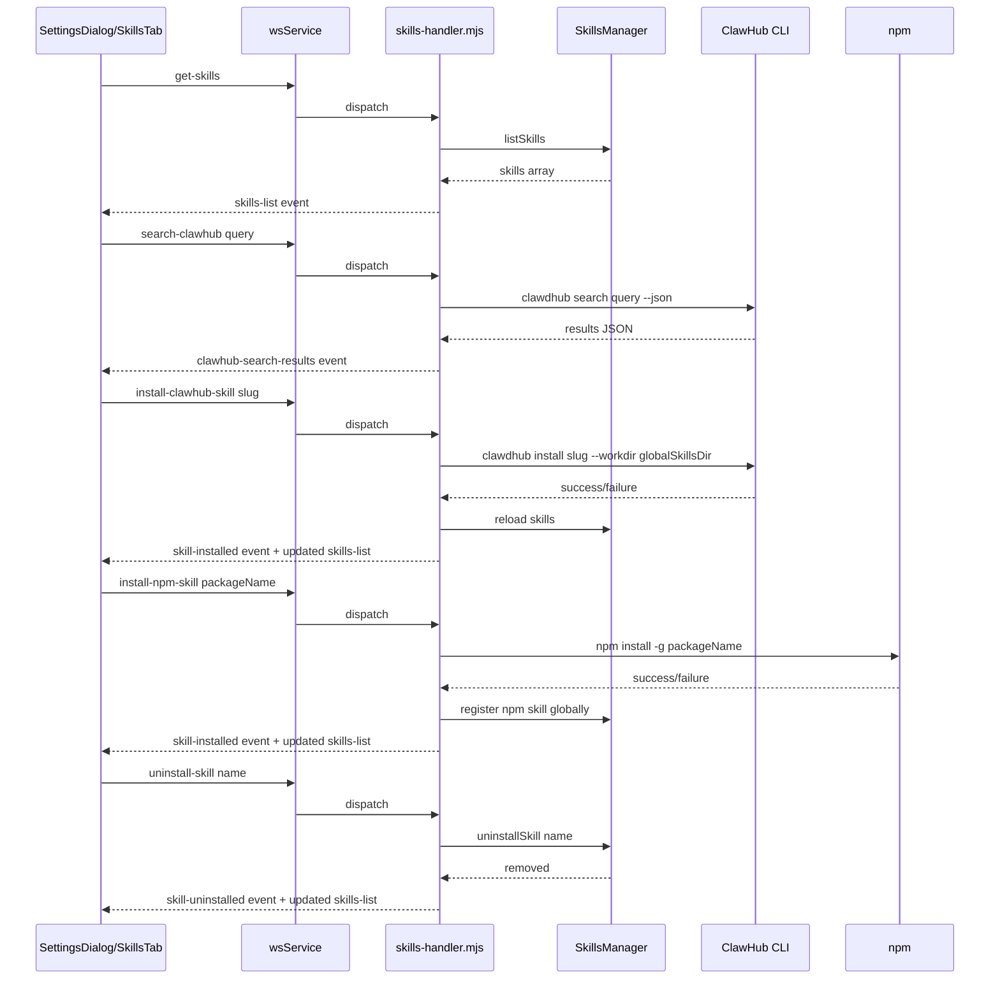

# Skills Settings Tab — Architecture Plan

## Overview

Add a **Skills** tab to the Settings dialog that allows users to:
1. View all installed skills (global only — skills available to all workspaces)
2. Browse and install skills from **ClawHub** (clawhub.com registry)
3. Install skills from **npm packages** by entering a package name
4. Uninstall skills

All skills installed through this UI are **global skills** — they live in the application-level `skills/` directory and are available across all workspaces.

## Architecture Diagram



## Data Flow



## Files to Create/Modify

### New Files

| File | Purpose |
|------|---------|
| `src/server/ws-handlers/skills-handler.mjs` | WS handler for skills CRUD operations |
| `ui/src/components/features/settings/SkillsSettings.tsx` | Skills tab UI component |
| `ui/src/hooks/useSkills.ts` | React hook for skills state management |

### Modified Files

| File | Change |
|------|--------|
| `src/skills/skills-manager.mjs` | Add `installFromClawHub`, `installNpmGlobal`, `uninstallSkill`, `searchClawHub` methods |
| `src/server/web-server.mjs` | Import and register skills handler |
| `ui/src/services/wsService.ts` | Add `getSkills`, `searchClawHub`, `installClawHubSkill`, `installNpmSkill`, `uninstallSkill` methods |
| `ui/src/components/features/SettingsDialog.tsx` | Add `skills` to `SettingsTab` union type, add tab entry, render `SkillsSettings` |
| `ui/src/hooks/useChat.ts` | Wire up skills events from wsService |
| `ui/src/App.tsx` | Pass skills-related props to `SettingsDialog` |

## Component Design

### SkillsSettings.tsx

Three-section layout within the settings content area:

1. **Installed Skills** — Card list showing:
   - Skill name, description, source badge (global/clawhub/npm)
   - Uninstall button per skill
   
2. **ClawHub Browser** — Search bar + results grid:
   - Search input with debounced search
   - Results show skill name, description, emoji, install button
   - Install button triggers `clawdhub install`
   
3. **Add NPM Package** — Simple form:
   - Text input for npm package name
   - Install button
   - Loading/status indicator

### SettingsDialog Tab Addition

In `SettingsDialog.tsx`:
- Add `skills` to the `SettingsTab` type: `type SettingsTab = 'general' | 'ai' | 'routing' | 'openclaw' | 'skills'`
- Add tab entry with `Puzzle` icon from lucide-react
- Add `case 'skills'` in `renderContent` switch

## Backend Design

### SkillsManager Extensions

```javascript
// New methods on SkillsManager:

async searchClawHub(query)
// Runs: clawdhub search "query" --json
// Returns: array of { slug, name, description, version, emoji }

async installFromClawHub(slug, version?)
// Runs: clawdhub install slug [--version version] --workdir <globalSkillsDir>
// Then reloads skills from globalSkillsDir
// Returns: installed skill info

async installNpmGlobal(packageName)
// Runs: npm install -g <packageName>
// Finds SKILL.md in global node_modules or package location
// Copies/symlinks SKILL.md content into globalSkillsDir/<packageName>/
// Reloads skills
// Returns: installed skill info

async uninstallSkill(name)
// Removes the skill directory from globalSkillsDir
// If npm-sourced, runs npm uninstall -g <packageName>
// Reloads skills
// Returns: success/failure
```

### WS Handler: skills-handler.mjs

```javascript
export const handlers = {
    'get-skills': handleGetSkills,          // List all installed skills
    'search-clawhub': handleSearchClawHub,  // Search ClawHub registry
    'install-clawhub-skill': handleInstallClawHub,  // Install from ClawHub
    'install-npm-skill': handleInstallNpm,  // Install from npm
    'uninstall-skill': handleUninstallSkill // Remove a skill
};
```

Each handler accesses `ctx.assistant.toolExecutor.skillsManager` to call the corresponding method.

### WS Events (server -> client)

| Event | Payload | Trigger |
|-------|---------|---------|
| `skills-list` | `SkillInfo[]` | After get-skills or any install/uninstall |
| `clawhub-search-results` | `ClawHubSkill[]` | After search-clawhub |
| `skill-install-progress` | `{ status, message }` | During install operations |
| `skill-installed` | `{ name, source }` | After successful install |
| `skill-uninstalled` | `{ name }` | After successful uninstall |
| `skill-error` | `{ message }` | On any error |

## Type Definitions

```typescript
// Skill info for installed skills
interface SkillInfo {
    name: string;
    description: string;
    source: 'global' | 'clawhub' | 'npm' | 'workspace';
    version?: string;
    emoji?: string;
    path?: string;
}

// ClawHub search result
interface ClawHubSkill {
    slug: string;
    name: string;
    description: string;
    version: string;
    emoji?: string;
    installed?: boolean;  // Cross-referenced with local skills
}
```

## Key Decisions

1. **Global-only scope**: Skills installed via Settings are always global (in `skills/` dir at app root). Workspace-specific skills (`.skills/`) are separate and managed per-workspace.

2. **ClawHub CLI dependency**: We shell out to `clawdhub` CLI. If not installed, the ClawHub section shows a prompt to install it via `npm i -g clawdhub`.

3. **NPM global install**: npm packages are installed globally (`npm install -g`), then their SKILL.md is symlinked or copied into the global skills directory.

4. **Real-time feedback**: Install operations can take time. Use `skill-install-progress` events to show loading states in the UI.

5. **No save button needed**: Skills operations are immediate (install/uninstall), not deferred like other settings that require "Save Configuration".
