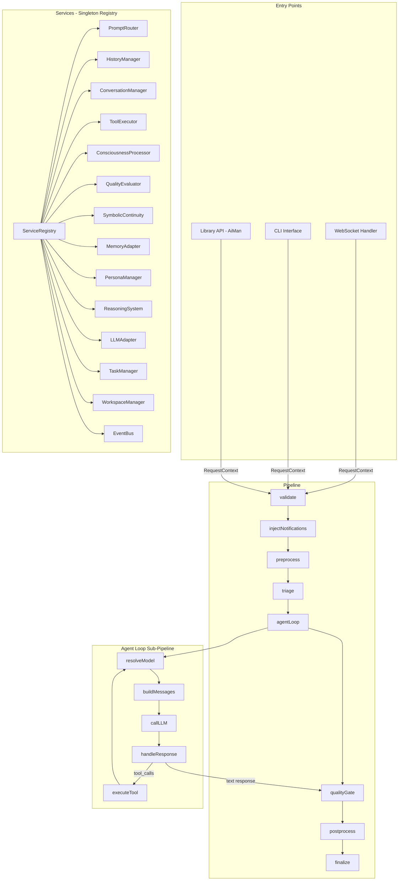

# AI Assistant Core Redesign: Event-Driven Pipeline Architecture

## 1. Problem Statement

The current [`MiniAIAssistant`](src/core/ai-assistant.mjs:42) class is a **1,319-line monolith** that:

- **Mixes concerns**: LLM orchestration, conversation management, tool execution, consciousness processing, quality evaluation, memory injection, triage, symbolic continuity, persona management, and UI notification are all entangled in a single `run()` method.
- **Cannot handle concurrency**: The `run()` loop is synchronous-sequential. A second request blocks until the first completes. The `historyManager` is shared mutable state across the entire instance.
- **Accumulates patches**: Comments like `REFACTORED`, `ENHANCED`, `CRITICAL FIX`, `P0 optimization`, `P2 optimization`, `P3 optimization` show successive band-aids rather than clean separation.
- **Has circular references**: The assistant passes `this` into `ToolExecutor`, which passes it back into handlers. The `_syncHistoryManagerRefs()` method manually patches references across 4+ sub-objects when conversations switch.
- **Duplicates logic**: `run()` and `runStream()` (via [`stream-handler.mjs`](src/core/stream-handler.mjs:20)) implement parallel-but-divergent agent loops with different feature sets (stream handler lacks triage, consciousness, quality gate, memory injection).

---

## 2. Design Goals

1. **Event-driven pipeline**: Each phase of request processing is an independent async handler. Handlers call the next handler asynchronously via an event/pipeline mechanism.
2. **Concurrent request support**: Multiple requests can be in-flight simultaneously, each carrying its own isolated context object.
3. **Single agent loop**: Eliminate the `run()` / `runStream()` split. One pipeline, with a streaming flag on the context.
4. **Clean dependency injection**: No circular `this` references. Each handler receives only the services it needs via a shared service registry.
5. **Preserve all capabilities**: Every feature of the current system must be accounted for in the new design.

---

## 3. Current Component Inventory

Every subsystem that the assistant currently touches, and must be preserved:

| Component | Current Location | Role |
|-----------|-----------------|------|
| PromptRouter | [`prompt-router.mjs`](src/core/prompt-router.mjs:71) | Model selection per task role |
| HistoryManager | [`history-manager.mjs`](src/core/history-manager.mjs:14) | Conversation history, checkpoints, token limits |
| ConversationManager | [`conversation-manager.mjs`](src/core/conversation-manager.mjs:1) | Multi-conversation switching, persistence |
| ToolExecutor | [`tool-executor.mjs`](src/execution/tool-executor.mjs:75) | Tool registry + dispatch + security |
| ConsciousnessProcessor | [`consciousness-processor.mjs`](src/core/consciousness-processor.mjs:18) | Fact engine, semantic collapse, somatic, archetypes |
| QualityGate | [`quality-gate.mjs`](src/core/quality-gate.mjs:7) | Response quality evaluation + retry |
| QualityEvaluator | [`quality-evaluator.mjs`](src/quality/quality-evaluator.mjs:1) | LLM-based quality scoring |
| SymbolicContinuity | [`symbolic-continuity.mjs`](src/core/symbolic-continuity.mjs:1) | Cross-session identity signatures |
| ResoLangService | [`resolang-service.mjs`](src/core/resolang-service.mjs:1) | Holographic memory (store/retrieve) |
| PersonaManager | [`persona-manager.mjs`](src/core/persona-manager.mjs:1) | Active persona, bootstrap, briefing |
| McpClientManager | [`mcp-client-manager.mjs`](src/core/mcp-client-manager.mjs:1) | MCP server connections + dynamic tools |
| ReasoningSystem | [`reasoning-system.mjs`](src/reasoning/reasoning-system.mjs:1) | Reasoning effort prediction |
| TaskManager | [`task-manager.mjs`](src/core/task-manager.mjs:1) | Background task spawning/tracking |
| SchedulerService | [`scheduler-service.mjs`](src/core/scheduler-service.mjs:1) | Recurring task scheduling |
| AgentLoopController | [`agent-loop-controller.mjs`](src/core/agent-loop-controller.mjs:22) | Autonomous agent loop (play/pause/stop) |
| WorkspaceManager | [`workspace-manager.mjs`](src/workspace/workspace-manager.mjs:1) | Workspace state tracking |
| SystemPrompt | [`system-prompt.mjs`](src/core/system-prompt.mjs:1) | System prompt generation |
| StreamHandler | [`stream-handler.mjs`](src/core/stream-handler.mjs:20) | Streaming response handling |
| StatusReporter | [`status-reporter.mjs`](src/core/status-reporter.mjs:1) | UI status emission |
| EventBus | [`event-bus.mjs`](src/lib/event-bus.mjs:6) | Application-wide event emission |
| AIProvider | [`ai-provider.mjs`](src/core/ai-provider.mjs:1) | LLM API calls (OpenAI, Gemini, Anthropic, etc.) |
| ModelRegistry | [`model-registry.mjs`](src/core/model-registry.mjs:1) | Model capability database |

---

## 4. New Architecture

### 4.1 Core Concept: The Request Pipeline

Instead of one giant `run()` method, we decompose request processing into a **pipeline of named stages**. Each stage is an async function that receives a `RequestContext` object and a `next()` callback. This is conceptually similar to Koa/Express middleware but purpose-built for LLM agent loops.

```
Request In ─► [Validate] ─► [Triage] ─► [Enrich] ─► [AgentLoop] ─► [QualityGate] ─► [Finalize] ─► Response Out
                                           │              │
                                           │         ┌────┴────┐
                                           │         │PerTurn  │
                                           │         │Pipeline │
                                           │         └────┬────┘
                                           │              │
                                           ▼              ▼
                                      [MemoryInject]  [LLMCall] ─► [ToolExec] ─► [Loop back]
```

### 4.2 RequestContext — The Isolated Per-Request State

Every request gets its own context object. No shared mutable state between concurrent requests.

```javascript
class RequestContext {
  constructor(options) {
    this.id = crypto.randomUUID();
    this.userInput = options.userInput;
    this.signal = options.signal;           // AbortSignal
    this.stream = options.stream || false;   // streaming mode flag
    this.onChunk = options.onChunk || null;  // streaming callback
    this.model = options.model || null;      // model override
    this.responseFormat = options.responseFormat || null;
    this.isRetry = options.isRetry || false;
    this.retryCount = options.retryCount || 0;
    this.dryRun = options.dryRun || false;
    this.surfaceId = options.surfaceId || null;

    // Per-request state (NOT shared across requests)
    this.turnNumber = 0;
    this.maxTurns = options.maxTurns || 100;
    this.finalResponse = null;
    this.toolCallCount = 0;
    this.errors = [];
    this.metadata = {};  // arbitrary per-request metadata

    // Timestamps
    this.startedAt = Date.now();
    this.completedAt = null;
  }
}
```

### 4.3 ServiceRegistry — Centralized Dependency Injection

Instead of the assistant holding 20+ instance variables and passing `this` around:

```javascript
class ServiceRegistry {
  constructor() {
    this._services = new Map();
  }

  register(name, instance) {
    this._services.set(name, instance);
    return this;
  }

  get(name) {
    const svc = this._services.get(name);
    if (!svc) throw new Error('Service not found: ' + name);
    return svc;
  }

  has(name) {
    return this._services.has(name);
  }
}
```

Registration at startup:

```javascript
const registry = new ServiceRegistry();
registry
  .register('eventBus', eventBus)
  .register('promptRouter', new PromptRouter())
  .register('historyManager', historyManager)          // per-conversation
  .register('conversationManager', conversationManager)
  .register('toolExecutor', toolExecutor)
  .register('consciousness', new ConsciousnessProcessor())
  .register('qualityGate', qualityGate)
  .register('symbolicContinuity', symbolicContinuity)
  .register('memoryAdapter', resoLangService)
  .register('personaManager', personaManager)
  .register('reasoningSystem', new ReasoningSystem())
  .register('llmAdapter', llmAdapter)
  .register('taskManager', taskManager)
  .register('workspaceManager', workspaceManager)
  // ... etc
```

### 4.4 Pipeline Stages

Each stage is a pure async function: `async (ctx, services, next) => { ... }`

#### Stage 1: `validate`
- Check `signal.aborted`
- Validate input is non-empty
- Load custom tools if not loaded

#### Stage 2: `injectNotifications`
- Inject completed background task notifications into history
- Inject symbolic continuity message
- **Only on non-retry requests**

#### Stage 3: `preprocess`
- Run `ConsciousnessProcessor.preProcess()` — archetype, semantic collapse, somatic state
- Inject consciousness messages into history
- Add user message to history
- Store user input in holographic memory
- Reset quality evaluator and reasoning system
- Predict reasoning effort

#### Stage 4: `triage`
- Run lightweight LLM triage call
- If `COMPLETED`: set `ctx.finalResponse`, skip to finalize
- If `MISSING_INFO`: set `ctx.finalResponse` with clarification question, skip to finalize
- If `READY`: proceed to agent loop
- **Only on non-retry requests**

#### Stage 5: `agentLoop`
- This is itself a sub-pipeline that runs up to `maxTurns` iterations:

  **Per-turn sub-stages:**

  5a. `resolveModel` — Use PromptRouter to select model + capabilities for this turn

  5b. `buildMessages` — Get history, inject memory context, inject fact context, apply token budget via `fitToBudget()`

  5c. `callLLM` — Send request to LLM adapter. Handle errors with recovery.

  5d. `handleResponse` — Branch:
  - **Tool calls present**: Execute tools (parallel if safe, sequential otherwise), push results to history, track in consciousness, loop back to 5a
  - **Text response**: Set `ctx.finalResponse`, exit loop

#### Stage 6: `qualityGate`
- Run `QualityGate.evaluateAndCheckRetry()`
- If retry needed: create new `RequestContext` with `isRetry=true`, feed it back through the pipeline
- If approved: proceed

#### Stage 7: `postprocess`
- Run `ConsciousnessProcessor.postProcess()`
- Store response in holographic memory
- Generate symbolic continuity signature if warranted

#### Stage 8: `finalize`
- Add assistant response to history
- Save conversation
- Emit UI events
- If streaming: flush final chunk
- Set `ctx.completedAt`

### 4.5 Pipeline Runner

```javascript
class AssistantPipeline {
  constructor(services) {
    this.services = services;
    this.stages = [
      validate,
      injectNotifications,
      preprocess,
      triage,
      agentLoop,
      qualityGate,
      postprocess,
      finalize,
    ];
  }

  async execute(ctx) {
    let index = 0;

    const next = async () => {
      if (ctx.signal?.aborted) {
        throw new DOMException('Cancelled', 'AbortError');
      }
      if (index >= this.stages.length) return;
      if (ctx.finalResponse !== null && index > 4) {
        // Skip to finalize if we already have a response
        // (e.g., from triage fast path)
      }
      const stage = this.stages[index++];
      await stage(ctx, this.services, next);
    };

    await next();
    return ctx.finalResponse;
  }
}
```

### 4.6 Concurrency Model

```
                    ┌─────────────────────┐
  Request A ──────►│  Pipeline Instance   │──── RequestContext A
                    │  (shared services)   │
  Request B ──────►│                      │──── RequestContext B
                    │  ServiceRegistry     │
  Request C ──────►│  (singleton)         │──── RequestContext C
                    └─────────────────────┘
```

Key insight: **The pipeline and services are shared (stateless singletons), but each request gets its own `RequestContext`.**

The `HistoryManager` is per-conversation, not per-request. Concurrent requests to the *same conversation* need serialization (queue). Concurrent requests to *different conversations* are fully parallel.

```javascript
class ConversationLock {
  constructor() {
    this._locks = new Map(); // conversationName -> Promise chain
  }

  async acquire(conversationName, fn) {
    const prev = this._locks.get(conversationName) || Promise.resolve();
    const next = prev.then(fn).catch(fn);
    this._locks.set(conversationName, next);
    return next;
  }
}
```

---

## 5. Architecture Diagram



---

## 6. File Structure

```
src/core/
├── assistant-pipeline.mjs          # Pipeline runner + stage orchestration
├── request-context.mjs             # RequestContext class
├── service-registry.mjs            # ServiceRegistry class
├── conversation-lock.mjs           # Per-conversation serialization
├── assistant-facade.mjs            # Public API (replaces MiniAIAssistant)
│
├── stages/
│   ├── validate.mjs                # Stage 1: Input validation + tool loading
│   ├── inject-notifications.mjs    # Stage 2: Background task + continuity injection
│   ├── preprocess.mjs              # Stage 3: Consciousness + memory + reasoning
│   ├── triage.mjs                  # Stage 4: Fast-path triage
│   ├── agent-loop.mjs              # Stage 5: The iterative LLM/tool loop
│   ├── quality-gate-stage.mjs      # Stage 6: Response quality check + retry
│   ├── postprocess.mjs             # Stage 7: Consciousness post + memory + continuity
│   └── finalize.mjs                # Stage 8: Persist + notify
│
├── agent-loop/
│   ├── resolve-model.mjs           # Sub-stage 5a
│   ├── build-messages.mjs          # Sub-stage 5b
│   ├── call-llm.mjs               # Sub-stage 5c
│   └── handle-response.mjs        # Sub-stage 5d (branches: tool exec vs text)
│
├── ai-provider.mjs                 # (unchanged) LLM API abstraction
├── prompt-router.mjs               # (unchanged) Model routing
├── history-manager.mjs             # (unchanged) History management
├── conversation-manager.mjs        # (unchanged) Multi-conversation
├── consciousness-processor.mjs     # (unchanged) Consciousness subsystems
├── quality-gate.mjs                # (unchanged) Quality evaluation
├── symbolic-continuity.mjs         # (unchanged) Cross-session identity
├── model-registry.mjs              # (unchanged) Model capability DB
├── system-prompt.mjs               # (unchanged) System prompt generation
├── agent-loop-controller.mjs       # (minimal changes - uses new facade)
└── ...other existing files...
```

---

## 7. AssistantFacade — The New Public API

The facade replaces `MiniAIAssistant` as the public interface. It is thin — all logic lives in pipeline stages.

```javascript
class AssistantFacade {
  constructor(workingDir, options = {}) {
    this.workingDir = workingDir;
    this.services = new ServiceRegistry();
    this._conversationLock = new ConversationLock();
    this._initialized = false;

    // Register all services (same as current constructor, but cleaner)
    this._registerServices(options);

    // Build the pipeline
    this.pipeline = new AssistantPipeline(this.services);
  }

  async initialize() {
    // One-time async init (replaces initializeCustomTools)
    await this.services.get('consciousness').initialize();
    await this.services.get('memoryAdapter').initialize();
    await this.services.get('personaManager').initialize();
    await this.services.get('mcpClient').initialize();
    await this._loadCustomTools();
    await this._loadConversation();
    this._initialized = true;
  }

  // ── Core API ──

  async run(userInput, options = {}) {
    if (!this._initialized) await this.initialize();

    const ctx = new RequestContext({
      userInput,
      signal: options.signal,
      model: options.model,
      responseFormat: options.responseFormat,
      dryRun: options.dryRun,
      isRetry: options.isRetry,
      maxTurns: this.maxTurns,
      surfaceId: options.surfaceId,
    });

    // Serialize per-conversation
    const convName = this.services.get('conversationManager').getActiveConversationName();
    return this._conversationLock.acquire(convName, () =>
      this.pipeline.execute(ctx)
    );
  }

  async runStream(userInput, onChunk, options = {}) {
    return this.run(userInput, { ...options, stream: true, onChunk });
  }

  // ── Conversation API (delegated, unchanged) ──

  async listConversations() { ... }
  async createConversation(name) { ... }
  async switchConversation(name) { ... }
  async deleteConversation(name) { ... }
  async renameConversation(oldName, newName) { ... }

  // ── Workspace API (delegated, unchanged) ──

  async changeWorkingDirectory(newDir) { ... }

  // ── Context / Debug API ──

  getContext() { ... }
  displaySessionMemory() { ... }
}
```

---

## 8. Migration Strategy

### Phase 1: Infrastructure (no behavior change)
1. Create `RequestContext`, `ServiceRegistry`, `ConversationLock`
2. Create `AssistantPipeline` runner
3. Create empty stage files with pass-through `next()` calls

### Phase 2: Extract stages from `MiniAIAssistant.run()`
4. Extract `validate` stage
5. Extract `injectNotifications` stage
6. Extract `preprocess` stage (consciousness, memory, reasoning)
7. Extract `triage` stage
8. Extract `agentLoop` stage + sub-stages
9. Extract `qualityGate` stage
10. Extract `postprocess` stage
11. Extract `finalize` stage

### Phase 3: Unify streaming
12. Merge `stream-handler.mjs` into the agent loop stage (streaming is just a flag on the context)

### Phase 4: Build facade
13. Create `AssistantFacade` wrapping the pipeline
14. Update `main.mjs` to use `AssistantFacade` instead of `MiniAIAssistant`
15. Update `chat-handler.mjs` and other WS handlers
16. Update `agent-loop-controller.mjs`

### Phase 5: Cleanup
17. Remove old `ai-assistant.mjs`
18. Remove `stream-handler.mjs`
19. Update `lib/index.mjs` exports
20. Update `lib/interfaces.d.ts`
21. Run existing tests, fix breakages

---

## 9. Key Benefits

| Before | After |
|--------|-------|
| 1,319-line god class | ~15 focused files, each <150 lines |
| `run()` and `runStream()` diverge | Single pipeline with streaming flag |
| Shared mutable state blocks concurrency | Isolated `RequestContext` per request |
| Circular `this` references everywhere | Clean `ServiceRegistry` DI |
| Manual `_syncHistoryManagerRefs()` | Services resolve from registry |
| Patches accumulate in one file | Each stage is independently testable |
| Quality gate + consciousness are deeply tangled in `run()` | Clean stage boundaries; skip/reorder stages easily |
| Adding a new capability = editing the god class | Adding a new capability = adding a stage file |

---

## 10. What Stays the Same

These components are **not being rewritten** — they are well-factored already:

- `ToolExecutor` + all handler files in `execution/handlers/`
- `ConsciousnessProcessor` and its sub-systems
- `PromptRouter` and `ModelRegistry`
- `HistoryManager` and `ConversationManager`
- `QualityGate` and `QualityEvaluator`
- `SymbolicContinuity`
- `ResoLangService`
- `PersonaManager`
- `McpClientManager`
- `AgentLoopController` (minor adapter changes only)
- All tool definitions in `tools/definitions/`
- All WebSocket handlers (minimal changes to use new facade)
- The entire UI

The rewrite targets **only the orchestration layer** — the glue that connects all these well-factored components.
