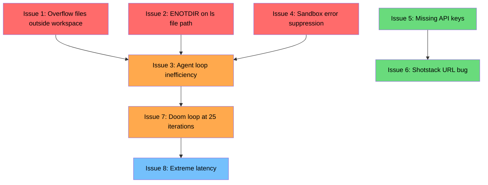

# Background Task Fixes — Comprehensive Plan

8 issues discovered from background task log analysis. Each section details the root cause, proposed fix, and files to modify.

---

## Issue 1: Tool Sandbox / Boundary Bug — Overflow Files Outside Workspace

### Symptom

The `run` tool writes command output to temporary files in `/var/folders/.../ai-man-overflow/cmd-*.txt` when output exceeds the 200-line / 50KB threshold. The agent is then instructed to read these files via `cat`, but the VFS workspace root restriction blocks access.

### Root Cause

[`handleOverflow()`](src/execution/output-presenter.mjs:145) saves overflow content to `OVERFLOW_DIR` which is defined as:

```js
const OVERFLOW_DIR = path.join(os.tmpdir(), 'ai-man-overflow');
```

This resolves to `/var/folders/.../ai-man-overflow/` on macOS. The overflow hint then tells the agent:

```
Full output: /var/folders/.../ai-man-overflow/cmd-1-1709312400000.txt
Explore: run_command({ command: "cat /var/folders/.../cmd-1-1709312400000.txt | grep <pattern>" })
```

When the agent follows this hint using the `cat` CLI command, it goes through [`fileTools.readFile()`](src/tools/file-tools.mjs:28) which calls [`validatePath()`](src/tools/file-tools.mjs:15). Since the overflow path is outside the workspace root, the validation throws `Access denied`.

Even if the agent uses `run_command`/`exec` instead, the real `cat` binary is invoked via [`ShellTools.runCommand()`](src/tools/shell-tools.mjs:101) which does work — but then the output is itself subject to the same overflow truncation, creating a recursive problem.

### Proposed Fix

**Strategy A — Store overflow files inside the workspace** (Recommended):

Change `OVERFLOW_DIR` to use a `.ai-man/overflow/` directory inside the workspace root. This keeps the files accessible to both the CLI commands and the file tools.

1. In [`output-presenter.mjs`](src/execution/output-presenter.mjs:27), accept the workspace root as a parameter or module-level setter:

   ```js
   let _workspaceRoot = process.cwd();
   export function setOverflowWorkspaceRoot(root) { _workspaceRoot = root; }
   const getOverflowDir = () => path.join(_workspaceRoot, '.ai-man', 'overflow');
   ```

2. Replace all references to `OVERFLOW_DIR` with `getOverflowDir()`.

3. In [`ToolExecutor` constructor](src/execution/tool-executor.mjs:167), call `setOverflowWorkspaceRoot(workspaceRoot)` after determining the workspace root.

4. Update the hint text in [`handleOverflow()`](src/execution/output-presenter.mjs:167) to use workspace-relative paths:

   ```js
   const relPath = path.relative(_workspaceRoot, overflowPath);
   `Explore: cat ${relPath} | grep <pattern>`
   ```

5. Add `.ai-man/overflow/` to `.gitignore`.

6. Update [`cleanupOverflowFiles()`](src/execution/output-presenter.mjs:345) to use the dynamic path.

**Strategy B — Whitelist temp directory in validatePath** (Alternative):

Add the `OVERFLOW_DIR` prefix to `validatePath()` as an allowed external path. Less clean but simpler:

```js
const ALLOWED_EXTERNAL_PREFIXES = [path.join(os.tmpdir(), 'ai-man-overflow')];
```

### Files to Modify

| File | Change |
|------|--------|
| [`src/execution/output-presenter.mjs`](src/execution/output-presenter.mjs) | Make OVERFLOW_DIR configurable; use workspace-relative paths in hints |
| [`src/execution/tool-executor.mjs`](src/execution/tool-executor.mjs) | Call `setOverflowWorkspaceRoot()` during initialization |
| [`.gitignore`](.gitignore) | Add `.ai-man/overflow/` |

---

## Issue 2: Tool Execution Misrouting — `ls` on a File Path Crashes with ENOTDIR

### Symptom

The `run` tool`s `ls` command attempts to use `list_files` directory-read logic on a file path like `data/something.json`, crashing with `ENOTDIR` because `fs.promises.readdir()` is called on a regular file.

### Root Cause

[`listFiles()`](src/tools/file-tools.mjs:121) checks `fs.existsSync(resolvedPath)` at line 129 but **never validates that the path is actually a directory** before calling `fs.promises.readdir(currentPath, { withFileTypes: true })` at line 143. When passed a file path:

1. `fs.existsSync()` returns `true` — the file exists
2. `scanDir()` calls `readdir()` on the file path
3. Node throws `ENOTDIR: not a directory`
4. The error is caught at line 178 but returns a generic error message without guiding the agent

Additionally, the [`ls` CLI command](src/execution/cli-commands/file-commands.mjs:65) in the non-`-l` path delegates directly to `fileTools.listFiles()` without its own file-vs-directory check. The `-l` long format path at line 96 does check `isDirectory()`, but the default path does not.

### Proposed Fix

1. In [`listFiles()`](src/tools/file-tools.mjs:121), add a directory check after the existence check:

   ```js
   const stat = await fs.promises.stat(resolvedPath);
   if (!stat.isDirectory()) {
       return `[error] list_files: '${dirPath}' is a file, not a directory. ` +
           `Use: cat ${dirPath} to read it, or ls ${path.dirname(dirPath)} to list its parent.`;
   }
   ```

2. In the [`ls` CLI command](src/execution/cli-commands/file-commands.mjs:65), add a pre-check before delegating to `fileTools.listFiles()`:

   ```js
   const resolvedDir = fileTools.validatePath(dirPath);
   if (fs.existsSync(resolvedDir) && !fs.statSync(resolvedDir).isDirectory()) {
       // Auto-redirect: ls on a file → cat
       const catResult = await fileTools.readFile({ path: dirPath });
       return { output: catResult, exitCode: catResult.startsWith('[error]') ? 1 : 0 };
   }
   ```

### Files to Modify

| File | Change |
|------|--------|
| [`src/tools/file-tools.mjs`](src/tools/file-tools.mjs) | Add `isDirectory()` check in `listFiles()` before calling `scanDir()` |
| [`src/execution/cli-commands/file-commands.mjs`](src/execution/cli-commands/file-commands.mjs) | Add file-vs-directory pre-check in `ls` command |

---

## Issue 3: Severe Agent Loop Inefficiency — 10-15+ Iterations for Simple File Reads

### Symptom

Due to the overflow file access bug (Issue 1) and the ENOTDIR crash (Issue 2), the agent wastes 10-15+ iterations trying to read a single function signature. It cycles through `grep`, `tail`, `sed`, and `cat` commands, constantly hitting access denials or truncation limits.

### Root Cause

This is a **cascading failure** caused by Issues 1 and 2. The cycle is:

1. Agent runs a command → output exceeds 200 lines → truncated
2. Agent told to `cat /var/folders/.../overflow.txt` → blocked by workspace restriction
3. Agent tries `exec cat /var/folders/...` → works but output is again truncated
4. Agent tries `grep` / `tail` / `head` on the overflow file → blocked again
5. Agent tries `ls` on a file path → ENOTDIR crash
6. Repeat until iteration limit

### Proposed Fix

Fixing Issues 1 and 2 eliminates the root causes. Additionally:

1. **Increase the overflow line limit for the `run` tool's own output**: The 200-line / 50KB limits in [`output-presenter.mjs`](src/execution/output-presenter.mjs:22) are conservative. For file reads specifically, the `cat` command could use a higher threshold since the agent explicitly requested that content.

   In [`file-commands.mjs`](src/execution/cli-commands/file-commands.mjs:25), the `cat` command could implement its own truncation with line-range hints:

   ```js
   // If file is large, show first 200 lines + tail 50 lines with line numbers
   // and suggest: cat file.txt | head 300 or cat file.txt | tail 100
   ```

2. **Add an inline overflow mode**: Instead of writing to a temp file, embed the truncated content directly with navigation hints:

   ```
   [lines 1-200 shown, 847 total]
   Use: cat file.txt | tail 200  or  grep <pattern> file.txt
   ```

   This avoids the temp file entirely for moderate-sized outputs.

3. **Add line-range support to `cat`**: Implement `cat file.txt:100-200` or `cat file.txt -L 100-200` for direct range access:

   ```js
   // In file-commands.mjs cat.execute():
   if (filePath.includes(':')) {
       const [actualPath, range] = filePath.split(':');
       const [start, end] = range.split('-').map(Number);
       // Read file, return lines[start-1..end-1]
   }
   ```

### Files to Modify

| File | Change |
|------|--------|
| [`src/execution/output-presenter.mjs`](src/execution/output-presenter.mjs) | Fix overflow storage per Issue 1; add inline overflow mode |
| [`src/execution/cli-commands/file-commands.mjs`](src/execution/cli-commands/file-commands.mjs) | Add line-range support to `cat`; improve truncation hints |

---

## Issue 4: Dangerous Sandbox Error Suppression — `execute_javascript` Silent Failures

### Symptom

`execute_javascript` fails with `Cannot find module`, but the VM sandbox catches and suppresses this error. The agent is told the code executed successfully when it actually failed.

### Root Cause

There are two suppression paths:

**Path A — `cli-interface.mjs` unhandledRejection handler**:

[`cli-interface.mjs:335`](src/cli/cli-interface.mjs:335) catches `unhandledRejection` and checks if the stack includes `vm.js` or `vm2/lib/`. If so, it logs `Sandbox error caught (non-fatal)` and **returns without propagating**. This means if a VM execution throws a `Cannot find module` error that escapes as an unhandled rejection, the process survives but the agent never sees the error.

**Path B — `main.mjs` unhandledRejection handler**:

[`main.mjs:297`](src/main.mjs:297) checks `reason instanceof VmSandboxError` and returns silently. This is correct for actual VM sandbox errors, but the `Cannot find module` error from `require()` inside the VM may escape as a plain `Error`, not a `VmSandboxError`.

**Path C — The `executeJavaScript` handler itself**:

[`core-handlers.mjs:236`](src/execution/handlers/core-handlers.mjs:236) correctly wraps VM errors in `VmSandboxError`. However, the `require()` function injected into the sandbox at line 196 can throw `Cannot find module` errors that may escape the `try/catch` if they occur during module initialization (after the initial `require()` call returns a promise).

The critical gap: when the error is caught at the process level but suppressed, the agent receives the `toolResult` from line 240 which is `Code executed successfully` — because `toolResult` was `undefined` (the code never completed) and line 240 falls through to the default message.

### Proposed Fix

1. **Fix the `executeJavaScript` error handling** in [`core-handlers.mjs`](src/execution/handlers/core-handlers.mjs:220):

   ```js
   let toolResult;
   try {
       const processedCode = codeToRun.replace(...);
       const wrappedCode = `(async () => { ${processedCode} })()`;
       toolResult = await Promise.resolve(vm.run(wrappedCode)).catch(err => {
           throw new VmSandboxError(`Execution error: ${err.message}`);
       });
   } catch (err) {
       if (err instanceof VmSandboxError) throw err;
       throw new VmSandboxError(`Execution error: ${err.message}`);
   }
   ```

   The key change is adding `.catch()` on the Promise before `await` — this catches async rejections from the IIFE that might otherwise escape.

2. **Ensure `VmSandboxError` propagates as a tool error, not a silent success**:

   In the tool executor, `VmSandboxError` should be caught and returned as a tool error string, not re-thrown as an unhandled rejection. Check [`tool-executor.mjs`](src/execution/tool-executor.mjs) tool dispatch logic to ensure errors are caught and formatted.

3. **Tighten the `cli-interface.mjs` suppression**:

   In [`cli-interface.mjs:335`](src/cli/cli-interface.mjs:335), change the condition to only suppress errors that are `VmSandboxError` instances:

   ```js
   if (reason instanceof VmSandboxError) {
       consoleStyler.log('warn', `Sandbox error caught: ${msg}`);
       process.emit('sandbox-error', { reason, promise });
       return;
   }
   ```

   This is more precise than the string-matching approach `stack.includes('vm.js')`.

4. **Add a `require` wrapper that converts module-not-found into clear errors**:

   In the sandbox setup, wrap `require` with error handling:

   ```js
   const safeRequire = (mod) => {
       try { return require(mod); }
       catch (e) {
           throw new Error(`Cannot find module '${mod}'. Install it first: npm_packages: ["${mod}"]`);
       }
   };
   ```

### Files to Modify

| File | Change |
|------|--------|
| [`src/execution/handlers/core-handlers.mjs`](src/execution/handlers/core-handlers.mjs) | Add `.catch()` on Promise.resolve before await; wrap require with error handler |
| [`src/cli/cli-interface.mjs`](src/cli/cli-interface.mjs) | Use `instanceof VmSandboxError` instead of stack string matching |
| [`src/main.mjs`](src/main.mjs) | Already handles VmSandboxError — verify no regressions |
| [`src/execution/tool-executor.mjs`](src/execution/tool-executor.mjs) | Ensure VmSandboxError is caught at the dispatch level and returned as error text |

---

## Issue 5: Silent Pipeline Failures — Missing `RUNWAYML_API_SECRET`

### Symptom

`RUNWAYML_API_SECRET` is missing from the environment. The animated ad pipeline silently produces empty video URLs, breaking the downstream Shotstack render.

### Root Cause

The pipeline files referenced in this issue (`src/animated-ad-pipeline.mjs`, `src/renderer.mjs`) **do not exist in the ai-man codebase**. They exist in the **workspace task's target project** — a child project spawned via `spawn_workspace_task`. The issue is in the target project's code, not in ai-man itself.

However, ai-man contributes to this problem in two ways:

1. **No environment variable validation**: When `spawn_workspace_task` or `spawn_background_task` creates a child AI instance, the child inherits a limited `process.env` from the sandbox. The pipeline code does not validate that required API keys are present before proceeding.

2. **Silent empty-string propagation**: The pipeline code likely does `const apiKey = process.env.RUNWAYML_API_SECRET || ''` and continues with an empty key, getting empty responses from RunwayML without throwing.

### Proposed Fix

Since the pipeline files are in the workspace task's target project, the fix is twofold:

**A. In ai-man — Add environment passthrough for workspace tasks**:

1. In [`async-task-handlers.mjs:spawnWorkspaceTask()`](src/execution/handlers/async-task-handlers.mjs:30), ensure that API keys from the parent environment are passed through to the child workspace. Currently the VM sandbox in `executeJavaScript` only passes `NODE_ENV`, `HOME`, `PATH`, and `LANG`. Background tasks likely have a similar restriction.

2. Add an `env_vars` parameter to [`spawn_workspace_task`](src/tools/definitions/workspace-task-tools.mjs:1) allowing explicit env var passthrough:

   ```js
   env_vars: {
       type: "object",
       description: "Environment variables to pass to the workspace task"
   }
   ```

**B. In the target project — Add API key validation**:

1. At pipeline startup, validate all required API keys and fail fast with a clear error:

   ```js
   const required = ['RUNWAYML_API_SECRET', 'SHOTSTACK_API_KEY'];
   const missing = required.filter(k => !process.env[k]);
   if (missing.length) throw new Error(`Missing required API keys: ${missing.join(', ')}`);
   ```

2. After API calls, validate that responses contain expected data before passing downstream.

**C. In ai-man — Add env validation guidance to the agent system prompt**:

Add a best practice to the agent's system prompt for workspace tasks:
> When working with APIs, always verify that required API keys are present in the environment before making calls.

### Files to Modify

| File | Change |
|------|--------|
| [`src/execution/handlers/async-task-handlers.mjs`](src/execution/handlers/async-task-handlers.mjs) | Pass environment variables through to workspace task instances |
| [`src/tools/definitions/workspace-task-tools.mjs`](src/tools/definitions/workspace-task-tools.mjs) | Add `env_vars` parameter to tool schema |
| Target project: `src/animated-ad-pipeline.mjs` | Add API key validation at startup (in the workspace project) |

---

## Issue 6: Codebase Configuration Bug — Shotstack API URL Hardcoded Incorrectly

### Symptom

The Shotstack API URL in `src/renderer.mjs` is incorrectly hardcoded to `/edit/sandbox/render` instead of `/v1/render`.

### Root Cause

Like Issue 5, the file `src/renderer.mjs` exists **in the workspace task's target project**, not in ai-man itself. The bug is a configuration error in the target project code.

The Shotstack API has two endpoints:
- **Sandbox**: `https://api.shotstack.io/edit/sandbox/render` — free tier, watermarked
- **Production**: `https://api.shotstack.io/v1/render` — paid tier, no watermark

The developer likely used the sandbox URL during development and forgot to switch to production, or the environment-based URL selection is missing.

### Proposed Fix

**In the target project**:

1. Make the Shotstack base URL configurable via environment variable:

   ```js
   const SHOTSTACK_ENV = process.env.SHOTSTACK_ENV || 'sandbox';
   const SHOTSTACK_BASE = SHOTSTACK_ENV === 'production'
       ? 'https://api.shotstack.io/v1'
       : 'https://api.shotstack.io/edit/sandbox';
   ```

2. Add `SHOTSTACK_ENV` to the required environment variables list from Issue 5.

**In ai-man — Defensive guidance**:

This is ultimately a target project issue. The ai-man fix is to ensure the background task agent has the tools and permissions to identify and fix such configuration bugs when running in a workspace task.

### Files to Modify

| File | Change |
|------|--------|
| Target project: `src/renderer.mjs` | Make Shotstack API URL environment-configurable |
| Target project: `.env` / `.env.example` | Add `SHOTSTACK_ENV` and `SHOTSTACK_API_KEY` |

---

## Issue 7: Task Abortion via Doom Loop — Iteration Limit of 25

### Symptom

The background task hits the hardcoded maximum iteration limit of 25 and triggers a `Doom loop detected` abort before completing its recovery attempts.

### Root Cause

Multiple agent loop implementations share a default `maxIterations` of 25:

- [`UNIFIED_CONFIG.loop.maxIterations: 25`](src/core/agentic/unified/config.mjs:42) — the unified provider default
- [`ReactLoop._maxIterations: 25`](src/core/agentic/megacode/react-loop.mjs:62) — the megacode provider default
- [`LmscriptProvider._config.maxIterations: 25`](src/core/agentic/lmscript/lmscript-provider.mjs:71) — the lmscript provider default

The [`SafetyLayer.checkDoom()`](src/core/agentic/unified/safety-layer.mjs:124) enforces this as a hard ceiling:

```js
if (iteration >= maxIterations) {
    return { doomed: true, reason: `Reached maximum iteration limit (${maxIterations})` };
}
```

For background/workspace tasks, 25 iterations is often insufficient because:
- Recovery tasks involve reading multiple files, diagnosing issues, and applying fixes
- Each file read/write/grep counts as an iteration
- Wasted iterations from Issues 1-3 consume the budget even faster

The [`AgentRunner`](src/core/agent/AgentRunner.mjs:15) uses a more generous default of 50.

### Proposed Fix

1. **Differentiate iteration limits by task type**:

   In [`UNIFIED_CONFIG`](src/core/agentic/unified/config.mjs:40), add a separate limit for background tasks:

   ```js
   loop: {
       maxIterations: 25,          // interactive turns
       maxBackgroundIterations: 75, // background/workspace tasks
       maxContinuations: 5,
       maxTotalLLMCalls: 100,       // raise from 50 for background tasks
   },
   ```

2. **Pass task type context to the agent loop**:

   In [`async-task-handlers.mjs`](src/execution/handlers/async-task-handlers.mjs:9), when spawning a background task, pass `maxIterations: 75` (or the configured value) to the AI assistant:

   ```js
   const task = this.taskManager.spawnTask(query, task_description, this.aiAssistantClass, {
       context,
       maxIterations: loopConfig.maxBackgroundIterations || 75,
   });
   ```

3. **Make the unified agent loop respect the override**:

   In [`agent-loop.mjs:128`](src/core/agentic/unified/agent-loop.mjs:128), this already respects `maxIterOverride`:

   ```js
   const maxIterations = maxIterOverride || loopCfg.maxIterations || 25;
   ```

   Ensure the override is threaded from the task spawner through to this point.

4. **Improve doom detection granularity**:

   The current doom detection in [`safety-layer.mjs`](src/core/agentic/unified/safety-layer.mjs:107) conflates the iteration ceiling with actual doom loops (repeated identical commands). These should be separate:
   - **Iteration ceiling**: return a synthesis response, not a doom error
   - **Actual doom loop**: return a doom error with the repeated pattern

   Update the return value to distinguish:
   ```js
   return {
       doomed: true,
       reason: `Reached maximum iteration limit (${maxIterations})`,
       pattern: 'max_iterations',  // ← not 'doom_loop'
   };
   ```

### Files to Modify

| File | Change |
|------|--------|
| [`src/core/agentic/unified/config.mjs`](src/core/agentic/unified/config.mjs) | Add `maxBackgroundIterations`; raise `maxTotalLLMCalls` |
| [`src/core/agentic/unified/agent-loop.mjs`](src/core/agentic/unified/agent-loop.mjs) | Respect the override; improve max-iterations vs doom-loop distinction |
| [`src/core/agentic/unified/safety-layer.mjs`](src/core/agentic/unified/safety-layer.mjs) | Separate iteration ceiling from doom loop in return values |
| [`src/core/agentic/megacode/react-loop.mjs`](src/core/agentic/megacode/react-loop.mjs) | Raise default; accept background task override |
| [`src/execution/handlers/async-task-handlers.mjs`](src/execution/handlers/async-task-handlers.mjs) | Pass higher iteration limit for background tasks |

---

## Issue 8: Extreme Latency / Polling Delays — AI Response Times up to 27 Seconds

### Symptom

AI response delays up to 27 seconds point to potential issues with API timeouts, provider orchestration, or local event loops blocking during tool executions.

### Root Cause

Multiple contributing factors:

**A. Sequential tool execution bottleneck**:
The `run` tool command chain executor in [`command-router.mjs`](src/execution/command-router.mjs:156) processes chains sequentially via `executeChain()`. Long-running shell commands (via `exec`) block the entire chain.

**B. VM sandbox creation overhead**:
[`core-handlers.mjs:192`](src/execution/handlers/core-handlers.mjs:192) creates a new `VM` instance for every `execute_javascript` call. As noted in the [`tool-executor.mjs` TODO at line 5`](src/execution/tool-executor.mjs:5):
> `TODO: Cache VM sandbox context across tool calls within a single turn`

**C. API provider latency**:
The actual LLM API call may take 5-15 seconds itself. When combined with tool execution overhead, the total round-trip for a single iteration easily reaches 20-27 seconds.

**D. Presentation layer overhead**:
[`handleOverflow()`](src/execution/output-presenter.mjs:145) performs synchronous file I/O (`fs.writeFileSync` at line 198) to save overflow files, which can block the event loop during large output processing.

**E. No parallelism in the output pipeline**:
The `presentToolOutput()` pipeline at [`output-presenter.mjs:290`](src/execution/output-presenter.mjs:290) runs binary detection → overflow → stderr attachment → footer sequentially. While individually fast, the binary detection samples 4KB of content, which adds up across many tool calls.

### Proposed Fix

1. **Cache VM sandbox across tool calls within a turn**:

   Implement the TODO in [`tool-executor.mjs:5`](src/execution/tool-executor.mjs:5):

   ```js
   // In ToolExecutor class:
   _vmCache = null;
   _vmCacheTurn = null;

   getOrCreateVM(turnId) {
       if (this._vmCache && this._vmCacheTurn === turnId) return this._vmCache;
       this._vmCache = new VM({ timeout: 30000, sandbox: { ... } });
       this._vmCacheTurn = turnId;
       return this._vmCache;
   }
   ```

   Thread a `turnId` through the tool execution path so the VM is reused within a single agent loop iteration.

2. **Make overflow file writes async**:

   In [`saveOverflowFile()`](src/execution/output-presenter.mjs:187), use `fs.promises.writeFile` instead of `fs.writeFileSync`:

   ```js
   async function saveOverflowFile(content) {
       await fs.promises.mkdir(overflowDir, { recursive: true });
       await fs.promises.writeFile(filePath, content, 'utf8');
       return filePath;
   }
   ```

   This requires making `handleOverflow()` async, which propagates to `presentToolOutput()`.

3. **Add timing instrumentation to identify the slowest phases**:

   Add structured timing to the agent loop to identify which phase contributes most latency:

   ```js
   // In agent-loop.mjs:
   const timing = {
       llmCall: 0,
       toolExecution: 0,
       presentation: 0,
       compaction: 0,
   };
   ```

   Emit these in the diagnostics so latency can be profiled and optimized.

4. **Add request-level timeouts for LLM API calls**:

   Ensure a per-request timeout (e.g., 60 seconds) is set on LLM API calls to prevent indefinite hangs. Check the API client configuration in the provider implementations.

5. **Consider streaming tool results**:

   For background tasks where the agent doesn't need to display progress, consider batching tool results to reduce the number of LLM round-trips.

### Files to Modify

| File | Change |
|------|--------|
| [`src/execution/tool-executor.mjs`](src/execution/tool-executor.mjs) | Implement VM sandbox caching across tool calls within a turn |
| [`src/execution/output-presenter.mjs`](src/execution/output-presenter.mjs) | Make overflow writes async; add timing instrumentation |
| [`src/execution/handlers/core-handlers.mjs`](src/execution/handlers/core-handlers.mjs) | Use cached VM from ToolExecutor instead of creating new instances |
| [`src/core/agentic/unified/agent-loop.mjs`](src/core/agentic/unified/agent-loop.mjs) | Add phase-level timing to diagnostics |

---

## Summary: Fix Priority and Dependency Order

The issues are interconnected. Fixing them in the right order prevents cascading failures:



### Recommended Fix Order

| Priority | Issue | Rationale |
|----------|-------|-----------|
| 1 | Issue 1 — Overflow file boundary | Root cause of cascading failures; simple fix |
| 2 | Issue 2 — ENOTDIR on file paths | Root cause of cascading failures; simple fix |
| 3 | Issue 4 — Sandbox error suppression | Security/correctness issue; agent makes wrong decisions on false success |
| 4 | Issue 7 — Iteration limit for background tasks | Direct enabler for background task completion |
| 5 | Issue 3 — Agent loop inefficiency | Largely resolved by Issues 1+2; additional improvements optional |
| 6 | Issue 5 — Missing API keys | Target project issue; ai-man changes are improvements |
| 7 | Issue 6 — Shotstack URL | Target project issue only |
| 8 | Issue 8 — Latency optimization | Performance improvement; not a correctness issue |

### Complete File Modification Index

| File | Issues |
|------|--------|
| [`src/execution/output-presenter.mjs`](src/execution/output-presenter.mjs) | 1, 3, 8 |
| [`src/execution/tool-executor.mjs`](src/execution/tool-executor.mjs) | 1, 4, 8 |
| [`src/tools/file-tools.mjs`](src/tools/file-tools.mjs) | 2 |
| [`src/execution/cli-commands/file-commands.mjs`](src/execution/cli-commands/file-commands.mjs) | 2, 3 |
| [`src/execution/handlers/core-handlers.mjs`](src/execution/handlers/core-handlers.mjs) | 4, 8 |
| [`src/cli/cli-interface.mjs`](src/cli/cli-interface.mjs) | 4 |
| [`src/main.mjs`](src/main.mjs) | 4 |
| [`src/core/agentic/unified/config.mjs`](src/core/agentic/unified/config.mjs) | 7 |
| [`src/core/agentic/unified/agent-loop.mjs`](src/core/agentic/unified/agent-loop.mjs) | 7, 8 |
| [`src/core/agentic/unified/safety-layer.mjs`](src/core/agentic/unified/safety-layer.mjs) | 7 |
| [`src/core/agentic/megacode/react-loop.mjs`](src/core/agentic/megacode/react-loop.mjs) | 7 |
| [`src/execution/handlers/async-task-handlers.mjs`](src/execution/handlers/async-task-handlers.mjs) | 5, 7 |
| [`src/tools/definitions/workspace-task-tools.mjs`](src/tools/definitions/workspace-task-tools.mjs) | 5 |
| [`.gitignore`](.gitignore) | 1 |
