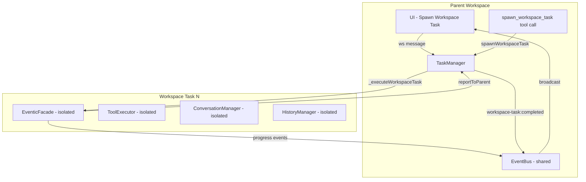
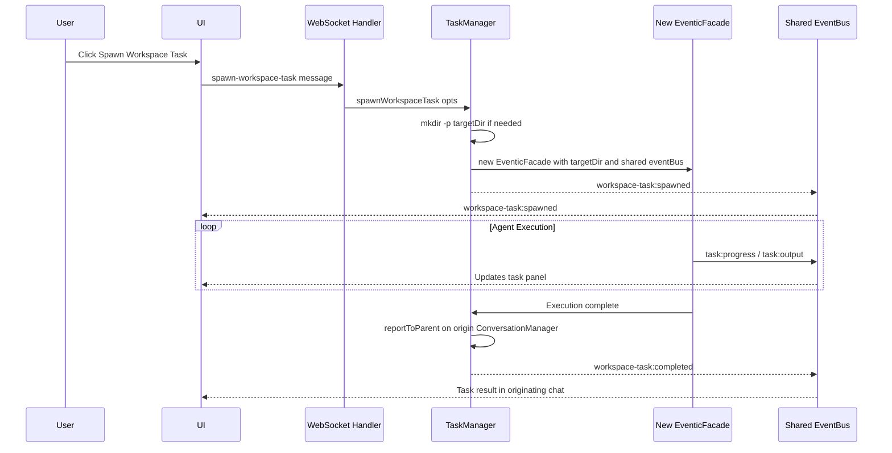

# Background Workspace Tasks — Design Document

## Overview

Background Workspace Tasks extend the existing background task system to allow spawning fully isolated AI agent instances that operate in different workspace directories — in parallel and in the background. Each workspace task gets its own `EventicFacade` instance with independent history, tools, plugins, and MCP servers, while sharing the parent's `eventBus` for progress reporting and cross-workspace result delivery.

## Requirements

1. **Dual creation paths**: Both UI (button) and AI tool call (`spawn_workspace_task`)
2. **Workspace creation**: Can create brand-new directories (mkdir + optional git init) or target existing ones
3. **Cross-workspace reporting**: Results report back to the originating workspace's conversation via `reportToParent`
4. **Isolation**: Full `EventicFacade` isolation per workspace task; shared `eventBus` for progress events
5. **Monitoring**: Visible in the existing background tasks list with workspace path metadata

## Architecture



## Key Design Decisions

### 1. Workspace Task vs Background Task

The existing `TaskManager.spawnTask()` creates a new `EventicFacade(workingDir)` at line 152 of `task-manager.mjs` — it already accepts `options.workingDir`. The key difference for workspace tasks:

| Aspect | Background Task | Workspace Task |
|--------|----------------|----------------|
| Working directory | Same as parent | Different directory |
| Workspace creation | No | Optional (mkdir + git init) |
| Conversation storage | Parent's `.conversations/` | Own `.conversations/` in target dir |
| Result reporting | `task:completed` event | `task:completed` + `reportToParent` to originating conversation |
| Metadata | `{ type: 'one-shot' }` | `{ type: 'workspace', workspacePath, originWorkspace, originConversation }` |
| Tools/Plugins | Shared executor | Own ToolExecutor + PluginManager |
| MCP Servers | Shared | Own MCP connections |

### 2. Extension Point: `TaskManager.spawnWorkspaceTask()`

Rather than modifying `spawnTask()`, we add a new method `spawnWorkspaceTask()` that:

1. Validates/creates the target workspace directory
2. Constructs a new `EventicFacade` with the target `workingDir` and the **shared** `eventBus`
3. Initializes the facade's conversation, plugins, MCP servers
4. Runs the query
5. On completion, calls `reportToParent()` on the originating workspace's `ConversationManager`

### 3. Workspace Lifecycle



### 4. New Tool: `spawn_workspace_task`

```javascript
{
    type: "function",
    function: {
        name: "spawn_workspace_task",
        description: "Spawn a background AI task in a different workspace directory. The task runs with full isolation - its own tools, plugins, and conversation history. Results are reported back to this conversation when complete.",
        parameters: {
            type: "object",
            properties: {
                workspace_path: {
                    type: "string",
                    description: "Absolute or relative path to the target workspace directory. Will be created if it does not exist."
                },
                task_description: {
                    type: "string",
                    description: "Brief human-readable description of the task"
                },
                query: {
                    type: "string",
                    description: "The detailed prompt/instructions for the workspace task"
                },
                context: {
                    type: "string",
                    description: "Additional context from the current conversation"
                },
                init_git: {
                    type: "boolean",
                    description: "If creating a new directory, initialize a git repository. Default: false"
                }
            },
            required: ["workspace_path", "task_description", "query"]
        }
    }
}
```

### 5. UI: WebSocket Handler for Workspace Tasks

A new WS message type `spawn-workspace-task` in `settings-handler.mjs` or a new `workspace-task-handler.mjs`:

```javascript
case 'spawn-workspace-task': {
    const { workspacePath, taskDescription, query, context, initGit } = msg;
    const result = taskManager.spawnWorkspaceTask({
        workspacePath,
        description: taskDescription,
        query,
        context,
        initGit,
        originWorkspace: assistant.workingDir,
        originConversation: assistant.getActiveConversationName(),
        aiAssistantClass: EventicFacade,
        eventBus: assistant.eventBus
    });
    send({ type: 'workspace-task-spawned', payload: result });
    break;
}
```

### 6. EventBroadcaster Extensions

New events to subscribe to in `event-broadcaster.mjs`:

```javascript
// Workspace Task Events
this._on('workspace-task:spawned', (data) => broadcast('workspace-task-spawned', data));
this._on('workspace-task:completed', (data) => broadcast('workspace-task-completed', data));
this._on('workspace-task:failed', (data) => broadcast('workspace-task-failed', data));
```

These are in addition to the existing `task:*` events which will still fire for workspace tasks (since they extend the task record).

### 7. Task Record Extension

The task record in `TaskManager` gains workspace-specific fields:

```javascript
const taskRecord = {
    id: taskId,
    description,
    query,
    status: 'queued',
    type: 'workspace',        // NEW — distinguishes from 'one-shot'
    workspacePath: resolvedWorkspacePath,  // NEW
    originWorkspace,           // NEW — where the task was spawned from
    originConversation,        // NEW — which conversation to report back to
    createdAt: new Date().toISOString(),
    // ... existing fields ...
};
```

### 8. Result Reporting via ConversationManager

When a workspace task completes, the `TaskManager` needs access to the origin workspace's `ConversationManager` to call `reportToParent()`. Two approaches:

**Option A — Pass origin ConversationManager reference** (simpler but couples):
```javascript
// Store reference during spawn
taskRecord.originConversationManager = originConversationManager;
// On complete:
await taskRecord.originConversationManager.reportToParent(
    `workspace-task-${taskId}`,
    resultSummary,
    { taskId, workspacePath, status: 'completed' }
);
```

**Option B — Event-based delivery** (decoupled, preferred):
```javascript
// On complete, emit event with origin info:
this.eventBus.emitTyped('workspace-task:completed', {
    taskId,
    workspacePath,
    originWorkspace,
    originConversation,
    result: resultSummary
});
// The web-server / settings-handler listens and routes to the right ConversationManager
```

**Recommendation**: Option B — event-based delivery. The web-server already has access to the active `assistant` and can route the report. This keeps `TaskManager` decoupled from `ConversationManager`.

### 9. Concurrency & Resource Management

- Workspace tasks count toward `TaskManager.maxConcurrent` (default 3)
- Each workspace task creates a full `EventicFacade` (~20 objects). On completion, the facade should be disposed (MCP connections closed, plugin manager shut down)
- The `AbortController` pattern already in `TaskManager._executeTask` works for workspace tasks too

### 10. Security Considerations

- The target workspace path is validated:
  - Must be an absolute path or resolved relative to the current workspace
  - Cannot be `/`, `/usr`, `/etc`, or other system directories
  - The user is warned if the directory is outside `$HOME`
- File tools within the workspace task are sandboxed to the target directory (via `WorkspaceManager.workspaceRoot`)
- The workspace task inherits the parent's AI provider config (model, API keys) since those are in the global config

## Files to Modify/Create

### New Files
1. **`src/tools/definitions/workspace-task-tools.mjs`** — Tool schema for `spawn_workspace_task`
2. **`src/server/ws-handlers/workspace-task-handler.mjs`** — WebSocket handler for UI-initiated workspace tasks

### Modified Files
3. **`src/core/task-manager.mjs`** — Add `spawnWorkspaceTask()` method + `_executeWorkspaceTask()` 
4. **`src/execution/handlers/async-task-handlers.mjs`** — Add `spawnWorkspaceTask()` handler
5. **`src/execution/tool-executor.mjs`** — Register `spawn_workspace_task` tool
6. **`src/tools/tool-definitions.mjs`** — Import and include workspace task tools
7. **`src/server/event-broadcaster.mjs`** — Subscribe to workspace-task events
8. **`src/server/web-server.mjs`** — Wire up workspace-task-handler
9. **`ui/src/hooks/useChat.ts`** — Listen for workspace-task events, display in task list
10. **`ui/src/services/wsService.ts`** — Add `spawnWorkspaceTask()` method

### Optional UI Enhancements
11. **`ui/src/components/features/WorkspaceTaskPanel.tsx`** — Dedicated workspace task panel (or extend existing task display)
12. **`ui/src/components/layout/Sidebar.tsx`** — Add workspace task spawn button

## Implementation Order

1. **`TaskManager.spawnWorkspaceTask()`** — Core logic, workspace creation, facade lifecycle
2. **Tool schema + handler** — `spawn_workspace_task` tool definition and `AsyncTaskHandlers.spawnWorkspaceTask()`
3. **Tool registration** — Wire into `ToolExecutor` and `tool-definitions.mjs`
4. **EventBroadcaster** — Subscribe to new workspace-task events
5. **WebSocket handler** — UI-initiated workspace task spawning
6. **UI listeners** — `useChat.ts` + `wsService.ts` for workspace task events
7. **UI components** — Workspace task spawn button + status display
8. **Cleanup & testing** — Facade disposal, error handling, edge cases
