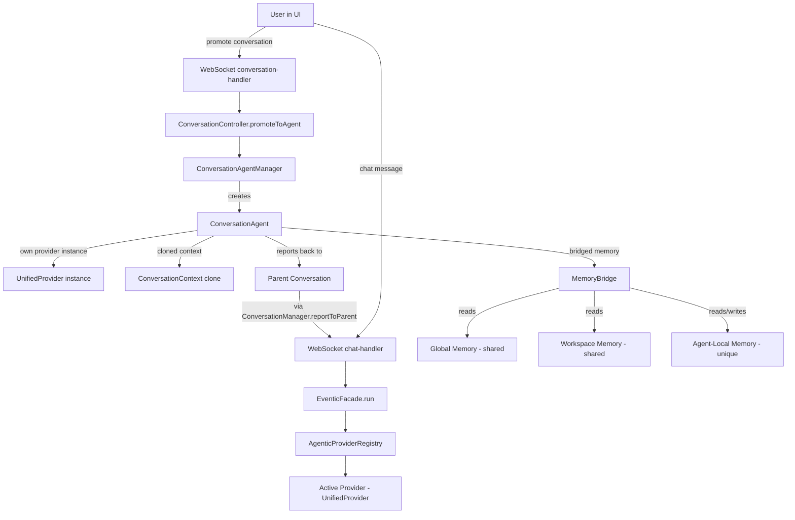
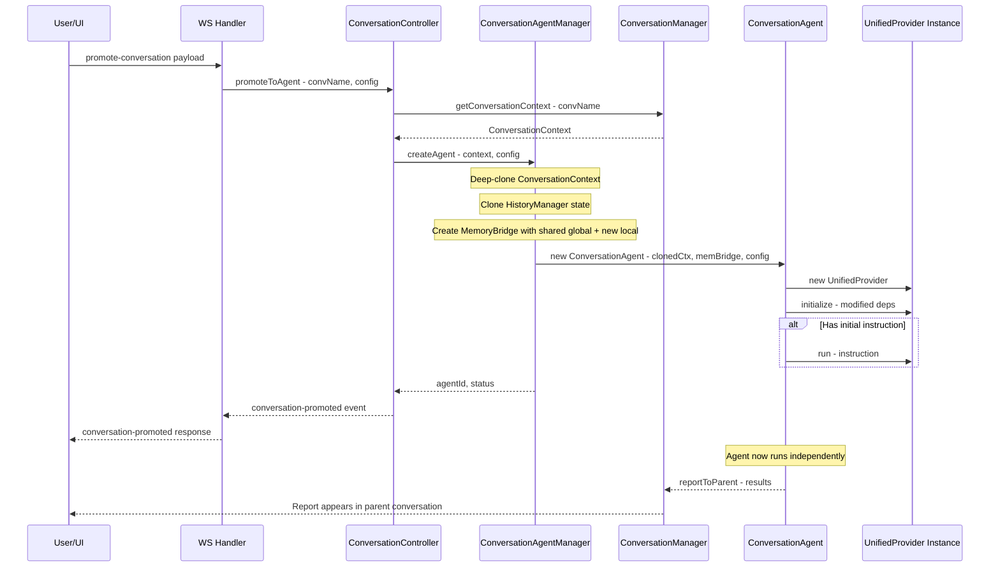
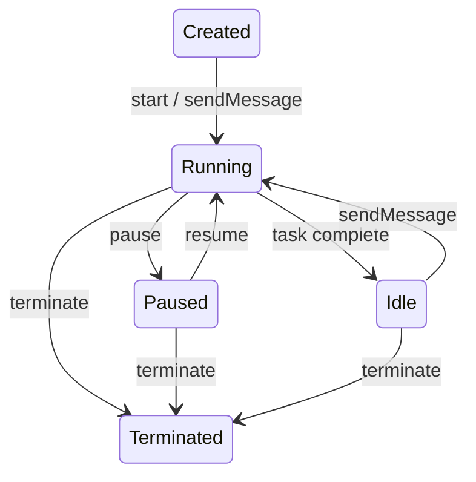
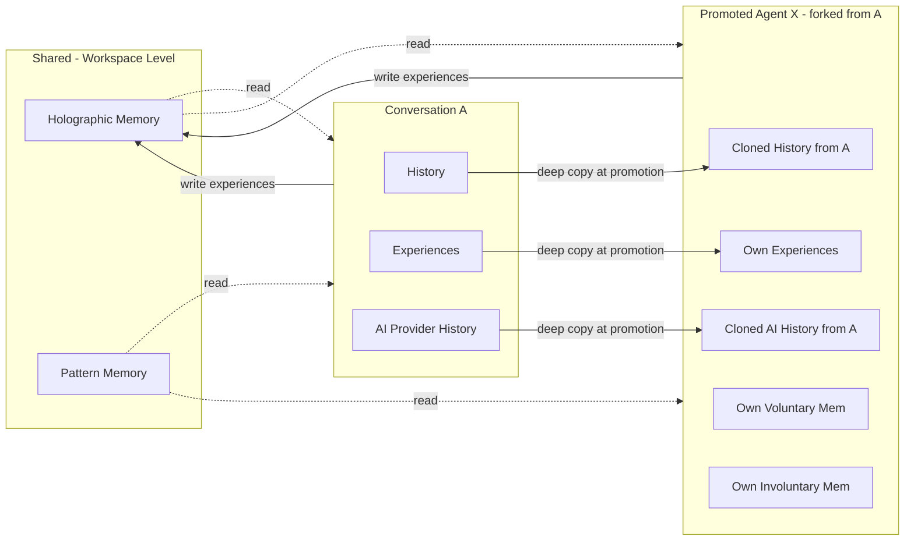

# Conversation-to-Agent Promotion — Architectural Design

## 1. Executive Summary

A conversation in ai-man already possesses three memory layers — **global** (workspace-level holographic/pattern memory), **workspace** (per-workspace experience memory), and **conversation-local** (per-conversation LLM history, experience buffer, and AI provider history within `ConversationContext`). As a conversation progresses, its unique memory overlay differentiates it from every other conversation. This document describes the architectural approach for **promoting a conversation to a standalone agent** — giving it a boundary, an interface, and the ability to operate autonomously or semi-autonomously within the existing agentic provider/loop architecture.

---

## 2. What "Promote to Agent" Means Functionally

### 2.1 Conceptual Model

Every conversation is already *implicitly* an agent: it has unique state, accumulated context, and access to shared memories. Promotion **formalizes** this by:

1. **Snapshotting** the conversation's current state (history, experiences, AI provider history) into a persistent agent definition.
2. **Creating a bounded execution context** — a dedicated `ConversationContext` + `MemoryBridge` + agentic provider instance that runs independently of the user's active conversation.
3. **Assigning an identity** — a name, optional persona/system-prompt overlay, and a unique agent ID.
4. **Exposing an interface** — the promoted agent can receive messages (tasks/instructions), send responses, and report results back to its parent conversation or to any other conversation.

### 2.2 Three-Memory Architecture of a Promoted Agent

```
┌─────────────────────────────────────────────────┐
│              Promoted Agent                      │
│                                                  │
│  ┌──────────────┐  ┌──────────────┐              │
│  │  Global Mem   │  │ Workspace   │  ◄── Shared  │
│  │  holographic  │  │ Mem pattern │     read-only │
│  │  + pattern    │  │ + experience│              │
│  └──────┬───────┘  └──────┬──────┘              │
│         │                 │                      │
│         ▼                 ▼                      │
│  ┌──────────────────────────────┐                │
│  │ Conversation-Local Memory   │ ◄── Unique     │
│  │ - aiProviderHistory         │     read/write  │
│  │ - experiences ring buffer   │                │
│  │ - accumulated LLM context   │                │
│  │ - conversation history      │                │
│  └──────────────────────────────┘                │
│                                                  │
│  ┌──────────────────────────────┐                │
│  │ Agent Boundary              │                │
│  │ - AgentRunner / AgentLoop   │                │
│  │ - own AbortController       │                │
│  │ - own busy state            │                │
│  │ - scoped tool access        │                │
│  └──────────────────────────────┘                │
└─────────────────────────────────────────────────┘
```

### 2.3 Promotion vs. Forking

Two sub-modes of promotion are supported:

| Mode | Description |
|------|-------------|
| **Promote-in-place** | The conversation *becomes* the agent. The original conversation is marked as `promoted` and its name becomes the agent's ID. The user can no longer interact with it as a normal conversation — it becomes a background agent. |
| **Fork-and-promote** | The conversation is **cloned** (history + experiences deep-copied) into a new agent. The original conversation remains usable. This is the default and safer option. |

---

## 3. Agent Boundary and Interface

### 3.1 New Class: `ConversationAgent`

A new class, [`ConversationAgent`](src/core/agent/conversation-agent.mjs), encapsulates the promoted agent. It sits alongside `AgentRunner` but is specifically designed for conversation-derived agents:

```
ConversationAgent
├── id: string                    // Unique agent ID (e.g., "agent-<convName>-<timestamp>")
├── name: string                  // Human-readable name
├── status: 'idle' | 'running' | 'paused' | 'terminated'
├── conversationContext: ConversationContext   // Cloned or transferred
├── memoryBridge: MemoryBridge    // Wired to global + workspace + local memories
├── provider: AgenticProvider     // Own instance (typically UnifiedProvider)
├── parentConversation: string    // Name of the originating conversation
├── agentConfig: Object           // Persona, system prompt overlay, tool restrictions
│
├── start(instruction?: string)   // Begin autonomous execution
├── sendMessage(input: string)    // Inject a message/instruction into the agent
├── pause()                       // Pause the agent loop
├── resume()                      // Resume the agent loop
├── terminate()                   // Stop the agent and clean up
├── getStatus()                   // Current status + diagnostics
├── getHistory()                  // Return the agent's conversation history
└── onReport(callback)            // Register callback for agent reports
```

### 3.2 How It Fits Into the Existing Architecture



### 3.3 Provider Instantiation Strategy

Each promoted agent gets its **own** `UnifiedProvider` instance (not shared with the user's active provider). This is critical because:

- The agent loop maintains per-turn state (stream controller, context manager).
- The agent operates concurrently with the user's foreground conversation.
- Tool execution must be scoped and not interfere with the user's active tools.

The agent's provider is initialized with a modified `deps` object where:
- `historyManager` → the agent's own cloned `HistoryManager`
- `aiProvider` → shared (stateless per-request; the model/key config is global)
- `toolExecutor` → shared, but tool calls are tagged with the agent's ID for audit
- `eventBus` → shared, but agent events are namespaced (e.g., `agent:<id>:status`)

---

## 4. User Interaction — How Promotion Is Triggered

### 4.1 UI: Conversation Context Menu

The conversation sidebar (where conversations are listed) gets a new context menu option:

- **"Promote to Agent"** — opens a modal with:
  - Agent name (defaults to conversation name)
  - Mode: "Fork & Promote" (default) or "Promote in Place"
  - Optional: initial instruction (what should the agent start doing)
  - Optional: persona overlay (custom system prompt additions)
  - Confirm / Cancel

### 4.2 WebSocket Protocol

New WS message types:

| Message Type | Direction | Payload |
|---|---|---|
| `promote-conversation` | Client → Server | `{ conversationName, agentName?, mode?: 'fork'\|'in-place', instruction?, persona? }` |
| `conversation-promoted` | Server → Client | `{ agentId, agentName, status, parentConversation }` |
| `list-agents` | Client → Server | `{}` |
| `agent-list` | Server → Client | `Array<{ id, name, status, parentConversation, messageCount }>` |
| `agent-message` | Client → Server | `{ agentId, message }` — send instruction to agent |
| `agent-status` | Server → Client | `{ agentId, status, lastActivity, diagnostics }` |
| `agent-report` | Server → Client | `{ agentId, report, timestamp }` — agent reporting results |
| `terminate-agent` | Client → Server | `{ agentId }` |
| `agent-terminated` | Server → Client | `{ agentId }` |
| `pause-agent` | Client → Server | `{ agentId }` |
| `resume-agent` | Client → Server | `{ agentId }` |

### 4.3 Natural Language Detection (Chat Handler)

Similar to the existing natural-language conversation creation in [`chat-handler.mjs`](src/server/ws-handlers/chat-handler.mjs:35), the chat handler will detect phrases like:
- "promote this conversation to an agent"
- "make this conversation an agent called researcher"
- "fork this chat as an agent"

### 4.4 API Endpoint (Future)

A REST endpoint `POST /api/agents/promote` can be added later for programmatic access, but the WS protocol is the primary interface for the initial implementation.

---

## 5. Detailed Promotion Flow

### 5.1 Sequence Diagram



### 5.2 Memory Cloning Strategy

When forking a conversation into an agent:

1. **History** — Deep-copied via `JSON.parse(JSON.stringify(historyManager.getHistory()))` (already used in [`facade-conversation.mjs:72`](src/core/facade-conversation.mjs:72)).
2. **AI Provider History** — Deep-copied from `conversationContext.aiProviderHistory`.
3. **Experiences** — The conversation's experiences from `MemorySystem` are filtered by `conversationId` and cloned into the agent's local experience store.
4. **Global/Workspace Memory** — **Not cloned**. The agent reads from the shared `MemorySystem` holographic and pattern stores. This means the agent benefits from all workspace learning, and its own experiences enrich the shared pool (tagged with its agent ID).

### 5.3 Agent Lifecycle States



---

## 6. Concrete Implementation Plan — Files to Create or Modify

### 6.1 New Files

| File | Purpose |
|------|---------|
| `src/core/agent/conversation-agent.mjs` | `ConversationAgent` class — wraps a cloned `ConversationContext`, its own `UnifiedProvider` instance, and a `MemoryBridge`. Exposes `start()`, `sendMessage()`, `pause()`, `resume()`, `terminate()`, `getStatus()`, `getHistory()`. |
| `src/core/agent/conversation-agent-manager.mjs` | `ConversationAgentManager` — registry of all promoted agents. Handles creation, lookup by ID, lifecycle management (pause/resume/terminate all), persistence of agent metadata to `.agents/` directory. |
| `src/server/ws-handlers/agent-handler.mjs` | WS handler for `promote-conversation`, `list-agents`, `agent-message`, `terminate-agent`, `pause-agent`, `resume-agent`. |
| `src/core/agent/__tests__/conversation-agent.test.mjs` | Unit tests for `ConversationAgent`. |
| `src/core/agent/__tests__/conversation-agent-manager.test.mjs` | Unit tests for `ConversationAgentManager`. |

### 6.2 Modified Files

| File | Changes |
|------|---------|
| [`src/core/conversation-context.mjs`](src/core/conversation-context.mjs) | Add `clone()` method for deep-copying context state. Add `promotedToAgentId` field to track promotion. Add `isPromoted` getter. |
| [`src/core/conversation-manager.mjs`](src/core/conversation-manager.mjs) | Add `promoteConversation(name, mode)` method that delegates to `ConversationAgentManager`. Add `getConversationForPromotion(name)` that returns a frozen snapshot. Update `listConversations()` to include `isPromoted` flag. |
| [`src/core/controllers/conversation-controller.mjs`](src/core/controllers/conversation-controller.mjs) | Add `promoteToAgent(name, config)` method that orchestrates the promotion flow. Wire up the `ConversationAgentManager`. |
| [`src/core/eventic-facade.mjs`](src/core/eventic-facade.mjs) | Instantiate `ConversationAgentManager` in constructor. Add delegate methods: `promoteConversation()`, `listAgents()`, `sendAgentMessage()`, `terminateAgent()`, etc. Wire agent manager into `_getAgenticDeps()`. |
| [`src/core/agentic/unified/memory-system.mjs`](src/core/agentic/unified/memory-system.mjs) | Add `cloneConversationExperiences(conversationId)` method that returns a deep copy of experiences for a specific conversation. Add `getExperiencesForConversation(conversationId)` accessor. |
| [`src/core/agent/memory-bridge.mjs`](src/core/agent/memory-bridge.mjs) | Add static factory method `MemoryBridge.forAgent(sharedMemorySystem, localVoluntary, localInvoluntary)` that creates a bridge where holographic/pattern memory is shared (read) and voluntary/involuntary are agent-local (read/write). |
| [`src/server/ws-handlers/conversation-handler.mjs`](src/server/ws-handlers/conversation-handler.mjs) | Register `promote-conversation` handler (or re-export from `agent-handler.mjs`). |
| [`src/server/web-server.mjs`](src/server/web-server.mjs) | Register the new `agent-handler.mjs` handlers in the WS dispatch table. |
| [`src/core/agent/index.mjs`](src/core/agent/index.mjs) | Export `ConversationAgent` and `ConversationAgentManager`. |

### 6.3 UI Changes (Future Phase)

| File | Changes |
|------|---------|
| `ui/src/services/wsService.ts` | Add WS message types for agent promotion/management. |
| `ui/src/hooks/useAgents.ts` | New hook for agent list, status, and management. |
| `ui/src/components/ConversationSidebar` | Add "Promote to Agent" context menu item. |
| `ui/src/components/AgentPanel` | New panel showing active agents, their status, and controls. |

---

## 7. Key Design Decisions

### 7.1 Own Provider Instance vs. Shared Provider

**Decision: Own instance.** Each promoted agent gets its own `UnifiedProvider`. This avoids contention on the shared agent loop's turn state, stream controllers, and context managers. The `aiProvider` (LLM adapter) is shared since it's stateless per-request.

### 7.2 Memory Isolation Model

**Decision: Layered isolation.**
- **Holographic memory** — shared (read/write). All agents and conversations contribute to and benefit from the workspace's holographic memory store.
- **Pattern memory** — shared (read-only for agents). Agents read patterns but don't directly write them; patterns are extracted from the shared experience pool by the `LearningEngine`.
- **Experience memory** — scoped by agent ID. Each agent's experiences are tagged with its ID and stored in the shared `MemorySystem`, but queries default to the agent's own experiences.
- **Voluntary/Involuntary memory** — agent-local. Each promoted agent gets its own `AssociativeStringStore` instances, seeded from the conversation's accumulated state.

### 7.3 Persistence

Promoted agents are persisted to `<workingDir>/.agents/<agentId>.json` containing:
- Agent metadata (name, ID, status, parent conversation, creation timestamp)
- Serialized history (same format as conversation JSON)
- Agent-local voluntary/involuntary memory snapshots

On server restart, persisted agents are restored to `idle` status and can be resumed.

### 7.4 Concurrency

Multiple promoted agents can run concurrently. Each has its own:
- `AbortController` (from `ConversationContext.markBusy()`)
- `UnifiedProvider` instance with its own `AgentLoop`
- Event namespace on the shared `eventBus`

The shared `aiProvider` serializes LLM requests naturally through its HTTP client.

### 7.5 Tool Access Control

By default, promoted agents have the **same tool access** as the conversation they were promoted from. An optional `toolRestrictions` config in the promotion payload allows scoping:
- `allowList: string[]` — only these tools are available
- `denyList: string[]` — these tools are blocked
- `readOnly: boolean` — blocks all write/execute tools (file write, command execution)

---

## 8. Example Usage Scenarios

### 8.1 Research Agent
A user has a conversation where they've been discussing a codebase. They promote it to a "researcher" agent with the instruction "Continue analyzing the test coverage gaps and report findings." The agent runs in the background, using the accumulated conversation context to guide its analysis, and reports results back to the parent conversation.

### 8.2 Monitoring Agent
A user promotes a DevOps-focused conversation to an agent with the instruction "Monitor the build pipeline and alert me if any stage fails." The agent periodically checks status and sends reports.

### 8.3 Specialist Fork
A user forks a general conversation into two agents: one focused on frontend work and one on backend, each starting with the shared context but diverging as they work on their respective areas.

---

## 9. Risks and Mitigations

| Risk | Mitigation |
|------|------------|
| Runaway agents consuming resources | Each agent inherits doom detection + iteration caps from `AgentRunner`. `ConversationAgentManager` enforces a global max-concurrent-agents limit. |
| Memory growth from many agents | Agent-local memory stores have configurable caps. Terminated agents can have their memory archived or purged. |
| Stale shared memory writes | Agent experiences are tagged with agent ID; conflicts are managed by the existing deduplication in `MemoryBridge._deduplicate()`. |
| LLM API cost explosion | Agents respect the same rate limits and model config as foreground conversations. A per-agent token budget can be configured in the promotion payload. |
| UI complexity | Agent management is a separate panel, not mixed into the conversation sidebar. Agents can be listed, paused, and terminated from a dedicated "Agents" tab. |

---

## 10. Implementation Phases

### Phase 1: Core Engine (Backend)
- Implement `ConversationAgent` class
- Implement `ConversationAgentManager`
- Add `clone()` to `ConversationContext`
- Add `cloneConversationExperiences()` to `MemorySystem`
- Add `MemoryBridge.forAgent()` factory
- Wire into `EventicFacade`

### Phase 2: WS Protocol & Basic Control
- Implement `agent-handler.mjs` WS handlers
- Register in web-server dispatch
- Add `promoteToAgent()` to `ConversationController`
- Natural language detection in chat handler

### Phase 3: Persistence & Recovery
- Agent state serialization to `.agents/` directory
- Server-restart recovery
- Agent-local memory persistence

### Phase 4: UI Integration
- Conversation context menu with "Promote to Agent"
- Agent management panel
- Real-time agent status updates via WS
- Agent report display in parent conversation

---

## 11. Appendix: Memory Flow Diagram


