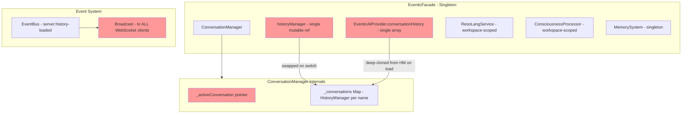
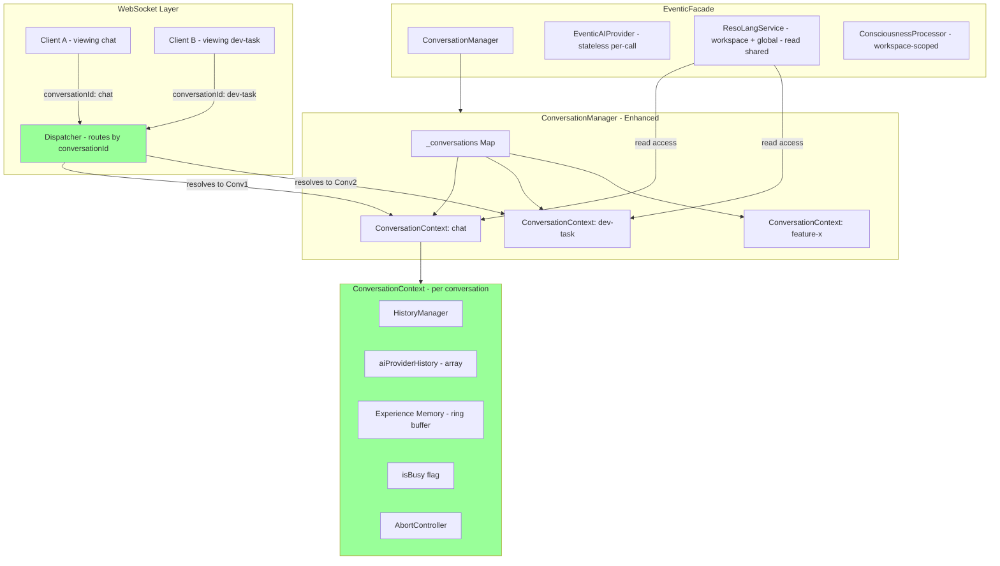
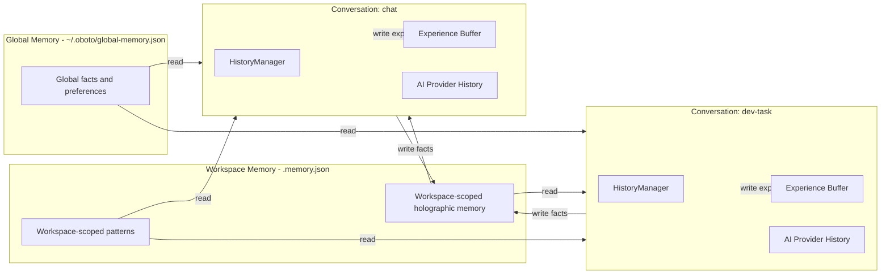

# Conversation Management Fix — Independent Conversations with Proper Memory Scoping

## Problem Summary

During long-running AI operations, unexpected conversation switching was observed in the logs:

```
chat → new-conversation-1 → chat
```

The root cause is a **design flaw in conversation management architecture**: conversations within a workspace are **not independent from conception**. Instead, they share mutable singleton state across:

1. **A single `EventicAIProvider.conversationHistory` array** — all conversations share the same LLM context
2. **A single `historyManager` reference on the facade** — mutated on switch rather than scoped per-conversation
3. **A single `activeConversation` pointer** — any switch (including internal operations, task-checkpoint queries, or auto-created conversations) globally mutates the facade's state
4. **Broadcast events with no conversation scoping** — `history-loaded` and `conversation-switched` events affect all connected clients regardless of which conversation they are viewing
5. **Memory systems not conversation-aware** — ResoLang, holographic memory, experience buffer, and consciousness are workspace-scoped singletons with no per-conversation isolation

---

## Architecture Overview — Current State



### Key Files Involved

| File | Role |
|------|------|
| [`eventic-facade.mjs`](src/core/eventic-facade.mjs) | Singleton facade — holds `historyManager`, `aiProvider`, all managers |
| [`conversation-manager.mjs`](src/core/conversation-manager.mjs) | CRUD for named conversations, stores `Map<string, HistoryManager>` |
| [`conversation-controller.mjs`](src/core/controllers/conversation-controller.mjs) | Orchestrates switch: mutates `facade.historyManager`, calls `refreshServices()` |
| [`facade-conversation.mjs`](src/core/facade-conversation.mjs) | `loadConversation()`, `switchConversation()` — sync facade state |
| [`eventic-ai-plugin.mjs`](src/core/eventic-ai-plugin.mjs) | `EventicAIProvider` — holds `conversationHistory[]` used for LLM calls |
| [`chat-handler.mjs`](src/server/ws-handlers/chat-handler.mjs) | WebSocket chat handler — uses `assistant.historyManager` directly |
| [`conversation-handler.mjs`](src/server/ws-handlers/conversation-handler.mjs) | WebSocket conversation CRUD — auto-switches on create |
| [`event-broadcaster.mjs`](src/server/event-broadcaster.mjs) | Broadcasts events to ALL connected clients |
| [`client-connection.mjs`](src/server/client-connection.mjs) | Sends initial state on connection — uses singleton `assistant.historyManager` |
| [`memory-system.mjs`](src/core/agentic/unified/memory-system.mjs) | Unified 3-layer memory — workspace-scoped, not conversation-scoped |
| [`resolang-service.mjs`](src/core/resolang-service.mjs) | ResoLang memory — workspace-scoped with global overlay |
| [`unified-provider.mjs`](src/core/agentic/unified/unified-provider.mjs) | Agentic provider — initialized once, holds references to shared deps |

---

## Root Cause Analysis

### Flaw 1: Singleton `historyManager` on the Facade

The [`EventicFacade`](src/core/eventic-facade.mjs:71) holds a single `this.historyManager` reference. When a conversation switch occurs, [`ConversationController.switchConversation()`](src/core/controllers/conversation-controller.mjs:58) **replaces** it:

```javascript
this.assistant.historyManager = this.manager.getActiveHistoryManager();
this.assistant.refreshServices();
```

This means:
- Any in-flight operation still holding a reference to the **old** `historyManager` will write to the wrong conversation.
- [`refreshServices()`](src/core/eventic-facade.mjs:395) propagates the new reference to `toolExecutor` and `coreHandlers`, but **not** to:
  - `EventicAIProvider.conversationHistory` — only synced during `loadConversation()`
  - `statePlugin.historyManager`
  - Active agentic provider's `_deps.historyManager`
  - `ContextManager` or `AgentLoop` subsystems

### Flaw 2: `EventicAIProvider.conversationHistory` Is a Disconnected Clone

In [`loadConversation()`](src/core/facade-conversation.mjs:69):

```javascript
facade.aiProvider.conversationHistory = JSON.parse(JSON.stringify(activeHm.getHistory()));
```

This creates a **deep clone** of the history. From this point forward, the `aiProvider`'s history and the `HistoryManager`'s history are **independent copies** that diverge:
- The `aiProvider` accumulates tool calls and results during agent execution
- The `HistoryManager` receives summarized messages via `addMessage()`
- Neither syncs to the other except at specific lifecycle moments

When conversations switch, the `aiProvider.conversationHistory` is **not** updated to the new conversation's history — it retains whatever state it had from the last `loadConversation()` call. This means a switch mid-operation continues using stale conversation context.

### Flaw 3: Auto-Switch on Conversation Create

[`handleCreateConversation()`](src/server/ws-handlers/conversation-handler.mjs:27) auto-switches to the newly created conversation unless `autoSwitch: false`:

```javascript
if (autoSwitch !== false) {
    await assistant.switchConversation(result.name);
}
```

If this happens while a long-running AI operation is in progress on the current conversation:
1. The facade's `historyManager` is swapped to the new conversation
2. The running operation's subsequent `addMessage()` calls go to the **new** conversation
3. When the operation completes and broadcasts `history-loaded`, it sends the **new** conversation's history
4. The result of the long-running operation is stranded in the new conversation instead of the original

### Flaw 4: Global Broadcast of Conversation Events

[`EventBroadcaster`](src/server/event-broadcaster.mjs:222) and the conversation controller emit `server:conversation-switched` and `server:history-loaded` via the global event bus, which broadcasts to **all** connected WebSocket clients:

```javascript
this.eventBus.emit('server:history-loaded', this.assistant.historyManager.getHistory());
this.eventBus.emit('server:conversation-switched', { name, isDefault });
```

There is no concept of per-client conversation context. If two browser tabs are open — one viewing `chat` and one viewing `dev-task` — a switch on one tab forces the other to switch too.

### Flaw 5: No Busy-State Guard on Conversation Switch

Nothing prevents a conversation switch while the agent is processing a request. The `isBusy()` check exists for workspace changes in [`changeWorkingDirectory()`](src/core/facade-conversation.mjs:148), but **not** for conversation switches. The agent loop reads `historyManager` during its multi-step ReAct cycle; if the reference changes mid-cycle, the agent writes results to the wrong conversation.

### Flaw 6: Memory Systems Are Not Conversation-Aware

The [`MemorySystem`](src/core/agentic/unified/memory-system.mjs:28) has three layers — holographic, experience, and pattern — but none are scoped to conversations:
- **Experience memory** is a single in-memory ring buffer shared across all conversations
- **Holographic memory** uses a single ResoLang hologram shared across the workspace
- **Pattern memory** is a single array of extracted patterns

The [`ResoLangService`](src/core/resolang-service.mjs:17) stores workspace-scoped `.memory.json` and global `~/.oboto/global-memory.json`, with no per-conversation partitioning.

This means:
- Memories created in one conversation bleed into another
- A conversation cannot have its own private working memory
- Clearing one conversation does not clear its associated memories

---

## Proposed Solution

### Design Principles

1. **Conversations are independent from conception** — each gets its own `HistoryManager`, and all operations against a conversation are scoped to it without mutating global singleton state.
2. **Global and workspace memory are read-accessible** — all conversations in a workspace can read from workspace-scoped and global memory, but conversation-specific experience/pattern memory is isolated.
3. **No implicit conversation switching** — the facade tracks which conversation is "foreground" for UI purposes, but operations always execute against a specific conversation by name/ID.
4. **Busy-state protection** — conversation switches are rejected or deferred while operations are in-flight.
5. **Per-client conversation context** — WebSocket messages include a `conversationId` so the server routes messages and responses to the correct conversation without global state mutation.

### Architecture — Target State



---

## Detailed Changes Required

### Change 1: Introduce `ConversationContext` class

**New file:** `src/core/conversation-context.mjs`

A `ConversationContext` encapsulates all per-conversation state:

```javascript
export class ConversationContext {
    constructor(name, historyManager) {
        this.name = name;
        this.historyManager = historyManager;
        this.aiProviderHistory = [];  // LLM conversation history for this conversation
        this.experiences = [];         // Per-conversation experience ring buffer
        this.isBusy = false;
        this.abortController = null;
        this.createdAt = new Date().toISOString();
    }
}
```

**Impact:** Each conversation carries its own busy-state, abort controller, LLM history, and experience buffer.

### Change 2: Refactor `ConversationManager` to use `ConversationContext`

**File:** [`src/core/conversation-manager.mjs`](src/core/conversation-manager.mjs)

Replace `Map<string, HistoryManager>` with `Map<string, ConversationContext>`:

```javascript
// Before:
this._conversations = new Map(); // Map<string, HistoryManager>

// After:
this._conversations = new Map(); // Map<string, ConversationContext>
```

Update [`_createHistoryManager()`](src/core/conversation-manager.mjs:555) → `_createConversationContext()`:

```javascript
_createConversationContext(name) {
    const hm = new HistoryManager(this.maxTokens, this.contextWindowSize);
    hm.setOnChange(() => {
        return this._saveToDisk(name).catch(e => { /* ... */ });
    });
    return new ConversationContext(name, hm);
}
```

Add methods:
- `getConversationContext(name)` — returns the `ConversationContext` for a named conversation
- `isConversationBusy(name)` — checks if a conversation has an active operation

### Change 3: Remove Mutable `historyManager` from Facade

**File:** [`src/core/eventic-facade.mjs`](src/core/eventic-facade.mjs)

Stop storing `this.historyManager` as a mutable singleton. Instead, provide accessors that resolve through the `ConversationManager`:

```javascript
// Remove:
this.historyManager = new HistoryManager();

// Add:
get historyManager() {
    return this.conversationManager.getActiveHistoryManager();
}
```

This is a backward-compatible change — callers that read `facade.historyManager` get the active conversation's history manager without the facade holding a stale reference.

### Change 4: Make `EventicAIProvider` Conversation-Aware

**File:** [`src/core/eventic-ai-plugin.mjs`](src/core/eventic-ai-plugin.mjs)

Instead of storing a single `conversationHistory` array, accept it as a parameter to `ask()`:

```javascript
// Before:
async ask(prompt, options = {}) {
    // ...
    messages.push(...this.conversationHistory);
    // ...
}

// After:
async ask(prompt, options = {}) {
    const history = options.conversationHistory || [];
    if (options.recordHistory !== false) {
        messages.push(...history);
    }
    // ...
}
```

The agent loop / agentic providers pass the conversation-specific history from the `ConversationContext.aiProviderHistory` array.

**Backward compat:** Keep `this.conversationHistory` as a fallback for any legacy callers, but prefer the per-call option.

### Change 5: Add `conversationId` to WebSocket Messages

**Files:**
- [`src/server/client-connection.mjs`](src/server/client-connection.mjs) — track per-client active conversation
- [`src/server/ws-handlers/chat-handler.mjs`](src/server/ws-handlers/chat-handler.mjs) — resolve conversation from message
- [`src/server/ws-handlers/conversation-handler.mjs`](src/server/ws-handlers/conversation-handler.mjs)
- [`src/server/event-broadcaster.mjs`](src/server/event-broadcaster.mjs)

**Client-side:**
- [`ui/src/hooks/useChat.ts`](ui/src/hooks/useChat.ts) — include `conversationId` in chat messages
- [`ui/src/services/wsService.ts`](ui/src/services/wsService.ts) — add `conversationId` to outgoing messages

WebSocket messages gain a `conversationId` field:

```javascript
// Client sends:
{ type: 'chat', payload: 'Hello', conversationId: 'dev-task' }

// Server responds to specific conversation:
{ type: 'message', payload: { ... }, conversationId: 'dev-task' }
```

The `handleChat()` function resolves the target conversation from `data.conversationId` and operates on that conversation's `ConversationContext` rather than the facade's singleton.

### Change 6: Per-Client Conversation Tracking

**File:** [`src/server/client-connection.mjs`](src/server/client-connection.mjs)

Track which conversation each WebSocket client is currently viewing:

```javascript
handleConnection(ws, req) {
    ws._activeConversation = 'chat'; // Default
    // ...
}
```

The `conversation-switched` event is sent only to the requesting client, not broadcast to all clients.

### Change 7: Busy-State Guard on Conversation Operations

**File:** [`src/core/controllers/conversation-controller.mjs`](src/core/controllers/conversation-controller.mjs)

Add busy-state checks:

```javascript
async switchConversation(name) {
    const currentCtx = this.manager.getConversationContext(this.manager.getActiveConversationName());
    if (currentCtx && currentCtx.isBusy) {
        return { switched: false, name, error: 'Cannot switch while the current conversation has an active operation.' };
    }
    // ... proceed with switch
}
```

### Change 8: Scoped Chat Handler

**File:** [`src/server/ws-handlers/chat-handler.mjs`](src/server/ws-handlers/chat-handler.mjs)

The `handleChat()` function must:

1. Resolve the target `ConversationContext` from `data.conversationId` or the client's `ws._activeConversation`
2. Set `ctx.isBusy = true` on the context, not on the global facade
3. Use the context's `abortController` instead of the global `activeController`
4. Pass `ctx.aiProviderHistory` to `provider.run()` and `aiProvider.ask()`
5. Write results to the context's `historyManager`, not the facade's
6. On completion, set `ctx.isBusy = false`

```javascript
async function handleChat(data, ctx) {
    const conversationId = data.conversationId || 'chat';
    const convCtx = ctx.assistant.conversationManager.getConversationContext(conversationId);
    if (!convCtx) { /* error: conversation not found */ }
    if (convCtx.isBusy) { /* queue as chime-in */ }

    convCtx.isBusy = true;
    convCtx.abortController = new AbortController();
    const hm = convCtx.historyManager;
    // ... use hm and convCtx.aiProviderHistory throughout ...
}
```

### Change 9: Agentic Provider Conversation Scoping

**File:** [`src/core/agentic/unified/unified-provider.mjs`](src/core/agentic/unified/unified-provider.mjs)

The `run()` method should accept a `conversationContext` in its options and pass it through to the `AgentLoop`, which in turn passes the conversation-specific history to `aiProvider.ask()`.

```javascript
async run(input, options = {}) {
    const convHistory = options.conversationHistory || this._deps?.historyManager?.getHistory() || [];
    // Pass convHistory to AgentLoop and ultimately to aiProvider.ask()
}
```

### Change 10: Memory Scoping — Shared Read, Isolated Write

**Files:**
- [`src/core/agentic/unified/memory-system.mjs`](src/core/agentic/unified/memory-system.mjs)
- [`src/core/resolang-service.mjs`](src/core/resolang-service.mjs)

**Read path (shared):**
- Holographic memory recall queries the workspace-scoped hologram — all conversations benefit
- Global memory is accessible from all conversations
- Pattern memory is read from the shared workspace store

**Write path (isolated):**
- Experience records are tagged with `conversationId` and stored per-conversation in `ConversationContext.experiences`
- When a conversation is cleared, its experience records are also cleared
- Pattern extraction runs per-conversation or globally as a background process

```javascript
// MemorySystem.storeInteraction() gains a conversationId parameter:
async storeInteraction(record, conversationId) {
    // Store in per-conversation experience buffer
    const convCtx = this._getConversationExperiences(conversationId);
    convCtx.push(record);
    // Also store in holographic memory (shared workspace-level)
    if (this._holographic) {
        await this._holographic.remember(record.summary, record);
    }
}
```

### Change 11: `refreshServices()` Overhaul

**File:** [`src/core/eventic-facade.mjs`](src/core/eventic-facade.mjs:395)

Since the facade no longer holds a mutable `historyManager`, `refreshServices()` no longer needs to propagate a new reference. Instead, services that need the history manager resolve it dynamically:

```javascript
refreshServices() {
    // No-op or minimal — services resolve historyManager dynamically via facade getter
    // Only update services that still cache references
    if (this.statePlugin) {
        this.statePlugin.historyManager = this.historyManager; // getter resolves active
    }
}
```

### Change 12: Auto-Switch Prevention During Active Operations

**File:** [`src/server/ws-handlers/conversation-handler.mjs`](src/server/ws-handlers/conversation-handler.mjs:27)

```javascript
async function handleCreateConversation(data, ctx) {
    const { ws, assistant, broadcast } = ctx;
    const { name, autoSwitch } = data.payload;
    const result = await assistant.createConversation(name);

    if (result.created && autoSwitch !== false) {
        // Only auto-switch if not busy
        if (!assistant.isBusy()) {
            await assistant.switchConversation(result.name);
        } else {
            // Conversation created but not switched — notify UI
            wsSend(ws, 'conversation-created', {
                ...result,
                autoSwitchDeferred: true,
                reason: 'Agent is currently busy'
            });
        }
    }
    // ...
}
```

---

## Migration Strategy

### Phase 1: Backward-Compatible Foundation

1. Create `ConversationContext` class
2. Refactor `ConversationManager` internally to use `ConversationContext`
3. Add `facade.historyManager` getter (replacing property)
4. Add busy-state guards to `switchConversation()`
5. Prevent auto-switch during active operations

**Risk:** Low — external API unchanged, internal restructuring only.

### Phase 2: Per-Conversation LLM History

1. Move `aiProviderHistory` into `ConversationContext`
2. Update `EventicAIProvider.ask()` to accept per-call history
3. Update agentic providers to pass conversation-scoped history
4. Update `loadConversation()` to sync per-context, not facade

**Risk:** Medium — touches the LLM call path.

### Phase 3: WebSocket Conversation Scoping

1. Add `conversationId` to WebSocket protocol
2. Track per-client active conversation on the server
3. Scope broadcasts to relevant clients
4. Update UI to send `conversationId` with all messages

**Risk:** Medium — touches client-server protocol.

### Phase 4: Memory Isolation

1. Tag experience records with `conversationId`
2. Scope experience/pattern queries to active conversation
3. Keep holographic/global memory shared (read)
4. Clear per-conversation memory on conversation clear

**Risk:** Low — additive change, no breaking API changes.

---

## Files Requiring Changes

| File | Phase | Change Type |
|------|-------|-------------|
| `src/core/conversation-context.mjs` | 1 | **NEW** |
| `src/core/conversation-manager.mjs` | 1 | Refactor to use `ConversationContext` |
| `src/core/eventic-facade.mjs` | 1 | Replace `historyManager` prop with getter |
| `src/core/controllers/conversation-controller.mjs` | 1 | Add busy guards, work with `ConversationContext` |
| `src/server/ws-handlers/conversation-handler.mjs` | 1 | Prevent auto-switch during busy |
| `src/core/eventic-ai-plugin.mjs` | 2 | Accept per-call history |
| `src/core/facade-conversation.mjs` | 2 | Update `loadConversation()` sync logic |
| `src/core/agentic/unified/unified-provider.mjs` | 2 | Pass conversation-scoped history |
| `src/core/agentic/unified/agent-loop.mjs` | 2 | Use conversation-scoped history |
| `src/core/agentic/newagent/newagent-provider.mjs` | 2 | Use conversation-scoped history |
| `src/server/client-connection.mjs` | 3 | Track per-client conversation |
| `src/server/ws-handlers/chat-handler.mjs` | 3 | Resolve conversation from message |
| `src/server/event-broadcaster.mjs` | 3 | Scope broadcasts by conversation |
| `ui/src/hooks/useChat.ts` | 3 | Send `conversationId` in messages |
| `ui/src/services/wsService.ts` | 3 | Add `conversationId` to protocol |
| `src/core/agentic/unified/memory-system.mjs` | 4 | Tag experiences with `conversationId` |
| `src/core/resolang-service.mjs` | 4 | No change needed — already workspace-scoped |

---

## Interaction Between Conversations and Memory — Target Model



**Key:** Conversations read from shared workspace and global memory, but write experiences to their own isolated buffer. Facts learned during a conversation are written to workspace memory so they benefit all conversations.

---

## Testing Strategy

### Unit Tests

1. **`ConversationContext` isolation** — verify that two contexts have independent history, experiences, and busy state
2. **Busy-state guard** — verify switch is rejected when conversation is busy
3. **History getter** — verify `facade.historyManager` returns the active conversation's history manager dynamically
4. **Per-conversation AI history** — verify `aiProvider.ask()` uses the passed history, not a stale singleton

### Integration Tests

1. **Concurrent chat messages on different conversations** — send chat to `chat` and `dev-task` simultaneously; verify messages land in correct conversations
2. **Create conversation during busy** — verify auto-switch is deferred
3. **Multiple clients** — two WebSocket clients on different conversations see only their own events
4. **Memory isolation** — experiences from `chat` are not visible in `dev-task`'s experience query

### Manual Tests

1. Open two browser tabs, switch to different conversations, verify independent operation
2. Send a long-running request, create a new conversation, verify the running request completes in the original conversation
3. Clear a conversation and verify the other conversation is unaffected

---

## Summary of Root Causes and Fixes

| Root Cause | Current Behavior | Fixed Behavior |
|------------|-----------------|----------------|
| Singleton `historyManager` on facade | Mutated globally on switch | Getter resolves per active conversation |
| Disconnected `aiProvider.conversationHistory` | Deep clone at load time, diverges | Passed per-call from `ConversationContext` |
| Auto-switch on create | Switches globally even during operations | Deferred when busy |
| Global broadcast of switch events | All clients see all switches | Scoped to requesting client |
| No busy guard on switch | Switch during agent execution | Rejected with error |
| Shared memory systems | All conversations pollute one buffer | Read-shared, write-isolated per conversation |
