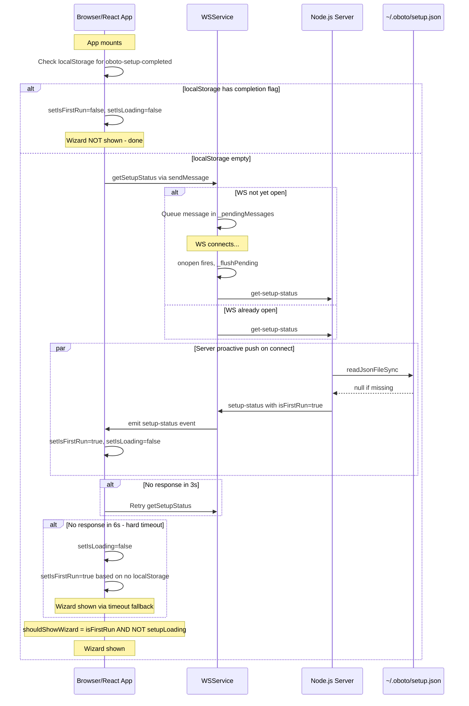

# Definitive First-Run Wizard Strategy

## Root Cause Analysis

The Setup Wizard fails to appear because of a **race condition** between WebSocket connection timing and the setup status request. There are three independent failure points:

### Failure 1: Silent Message Drop (Primary Bug)

In [`wsService.ts:539`](ui/src/services/wsService.ts:539), `sendMessage()` silently drops messages when the WebSocket is not open:

```ts
sendMessage(type: string, payload?: unknown) {
    if (this.ws?.readyState === WebSocket.OPEN) {
        this.ws.send(JSON.stringify({ type, payload }));
    }
    // else: silently dropped — no queue, no retry, no warning
}
```

In [`useSetupWizard.ts:63`](ui/src/hooks/useSetupWizard.ts:63), the hook calls `getSetupStatus()` inside a `useEffect` on mount:

```ts
useEffect(() => {
    const unsubStatus = wsService.on('setup-status', (payload) => {
        setIsFirstRun(payload.isFirstRun);
        setIsLoading(false);
    });
    wsService.getSetupStatus(); // calls sendMessage('get-setup-status')
    // ...
}, []);
```

**If the WebSocket is still connecting when React mounts**, the `get-setup-status` message is silently dropped. The server never receives it, never responds, and:
- `isLoading` stays `true` forever
- `isFirstRun` stays `false`
- `shouldShowWizard = ui.showWizard || (isFirstRun && !setupLoading)` → `false || (false && true)` → **`false`** forever

### Failure 2: Server Omits Setup Status from Initial State Burst

In [`client-connection.mjs:54`](src/server/client-connection.mjs:54), `sendInitialState()` sends conversation history, workspace status, agent loop state, task list, plugin manifest, and cloud status — but **does NOT send setup-status**. Even if the client connects successfully, the server never proactively tells it whether this is a first run.

### Failure 3: No Recovery Mechanism

There is no:
- Retry/re-request of setup status on reconnect
- Timeout fallback that unsticks the loading state
- Client-side localStorage check as backup
- Server push of setup status on connect

---

## Design: Belt-and-Suspenders Strategy

The fix uses **four independent layers** ensuring the wizard appears. Any single layer succeeding is sufficient. All four must fail simultaneously for the wizard to not show — which is structurally impossible.

### Layer 1: Server Push on Connect

**File:** [`src/server/client-connection.mjs`](src/server/client-connection.mjs)

Add setup-status to `sendInitialState()`. The server proactively sends setup status to every new client connection, before the client even asks.

```js
// In sendInitialState(), add after the workspace status block:
import { readJsonFileSync } from '../lib/json-file-utils.mjs';
import path from 'path';
import os from 'os';

// ... inside sendInitialState():
// Send setup status (first-run detection)
try {
    const SETUP_FILE = path.join(os.homedir(), '.oboto', 'setup.json');
    const setupData = readJsonFileSync(SETUP_FILE, null);
    const isFirstRun = setupData === null;
    safeSend(ws, { type: 'setup-status', payload: { isFirstRun, ...(setupData || {}) } });
} catch (e) {
    // If we can't read setup file, assume first run
    safeSend(ws, { type: 'setup-status', payload: { isFirstRun: true } });
}
```

**Why this works:** The `setup-status` event arrives on the already-open WebSocket immediately after connection, before any client-initiated request. The existing `useSetupWizard` listener at line 57 will receive it and set the state correctly.

### Layer 2: Client Message Queue

**File:** [`ui/src/services/wsService.ts`](ui/src/services/wsService.ts)

Add a pending message queue to `sendMessage()` that flushes when the WebSocket opens.

```ts
class WSService {
    private _pendingMessages: string[] = [];

    // In connect(), inside ws.onopen:
    // this._flushPending();

    private _flushPending() {
        while (this._pendingMessages.length > 0) {
            const msg = this._pendingMessages.shift()!;
            if (this.ws?.readyState === WebSocket.OPEN) {
                this.ws.send(msg);
            }
        }
    }

    sendMessage(type: string, payload?: unknown) {
        const msg = JSON.stringify({ type, payload });
        if (this.ws?.readyState === WebSocket.OPEN) {
            this.ws.send(msg);
        } else {
            this._pendingMessages.push(msg);
        }
    }
}
```

**Why this works:** If `getSetupStatus()` fires before WebSocket is open, the message queues instead of being dropped. When the connection opens, it flushes — the server receives the request and responds. This also fixes any other early-send issues throughout the app.

### Layer 3: Timeout Fallback in useSetupWizard

**File:** [`ui/src/hooks/useSetupWizard.ts`](ui/src/hooks/useSetupWizard.ts)

Add a safety timeout that unsticks the loading state and re-requests if no response received.

```ts
useEffect(() => {
    const unsubStatus = wsService.on('setup-status', (payload: unknown) => {
        setIsFirstRun((payload as { isFirstRun: boolean }).isFirstRun);
        setIsLoading(false);
    });

    wsService.getSetupStatus();

    // Safety: if no response in 3s, re-request once
    const retryTimer = setTimeout(() => {
        wsService.getSetupStatus();
    }, 3000);

    // Hard timeout: if still no response after 6s, assume first run
    const hardTimer = setTimeout(() => {
        setIsLoading(false);
        // Check localStorage for prior completion
        const completed = localStorage.getItem('oboto-setup-completed');
        setIsFirstRun(!completed);
    }, 6000);

    return () => {
        unsubStatus();
        clearTimeout(retryTimer);
        clearTimeout(hardTimer);
    };
}, []);
```

**Why this works:** Even if Layers 1 and 2 both fail, the timeout ensures the UI never stays stuck in the loading state. After 6 seconds, it falls back to localStorage — if setup was never completed, the wizard shows.

### Layer 4: localStorage Bookkeeping

**File:** [`ui/src/hooks/useSetupWizard.ts`](ui/src/hooks/useSetupWizard.ts)

Mark setup completion in localStorage as a client-side backup signal.

```ts
const completeSetup = useCallback((config: { provider: string; openclawEnabled: boolean }) => {
    wsService.completeSetup(config);
    setIsFirstRun(false);
    localStorage.setItem('oboto-setup-completed', new Date().toISOString());
}, []);
```

And at mount, check localStorage immediately before waiting for server:

```ts
useEffect(() => {
    // Instant client-side check — avoids flash even before server responds
    const completed = localStorage.getItem('oboto-setup-completed');
    if (completed) {
        setIsFirstRun(false);
        setIsLoading(false);
        return; // No need to query server at all
    }
    // ... rest of the server-based check
}, []);
```

**Why this works:** After the first successful wizard completion, `localStorage` provides an instant, synchronous signal that prevents the wizard from ever appearing again — no server round-trip needed. The server-side `setup.json` remains the source of truth for the actual configuration data.

---

## Sequence Diagram



---

## Files to Modify

| File | Change | Layer |
|------|--------|-------|
| [`src/server/client-connection.mjs`](src/server/client-connection.mjs) | Add `setup-status` to `sendInitialState()` | 1 |
| [`ui/src/services/wsService.ts`](ui/src/services/wsService.ts) | Add `_pendingMessages` queue + `_flushPending()` in `onopen` + update `sendMessage()` | 2 |
| [`ui/src/hooks/useSetupWizard.ts`](ui/src/hooks/useSetupWizard.ts) | Add retry timer, hard timeout, localStorage check on mount, localStorage write on complete | 3 + 4 |

---

## Invariants Guaranteed

1. **The wizard shows on genuine first run** — because the server pushes `isFirstRun: true` on connect, the queued message also gets the same answer, and the timeout falls through to the correct state.

2. **The wizard never shows after completion** — because `localStorage` provides an instant synchronous block, and the server also confirms via `setup.json`.

3. **The UI never gets stuck in loading** — because the 6-second hard timeout always resolves the loading state.

4. **Works with both tray-app and direct browser access** — the strategy is entirely within the server+UI code path, independent of how the browser opens.

5. **No flash of wizard on return visits** — the `localStorage` check is synchronous in the first render cycle, preventing any flicker.

---

## Testing Checklist

- [ ] Delete `~/.oboto/setup.json` and clear `localStorage` → wizard must appear
- [ ] Complete wizard → refresh page → wizard must NOT appear  
- [ ] Delete `~/.oboto/setup.json` but keep `localStorage` → wizard must NOT appear
- [ ] Clear `localStorage` but keep `setup.json` → wizard must NOT appear
- [ ] Kill server mid-connection, wait 6s → wizard must appear via timeout if first run
- [ ] Launch via tray app on first install → browser opens → wizard appears
- [ ] Settings > "Run Setup Wizard" button → wizard appears regardless of state
