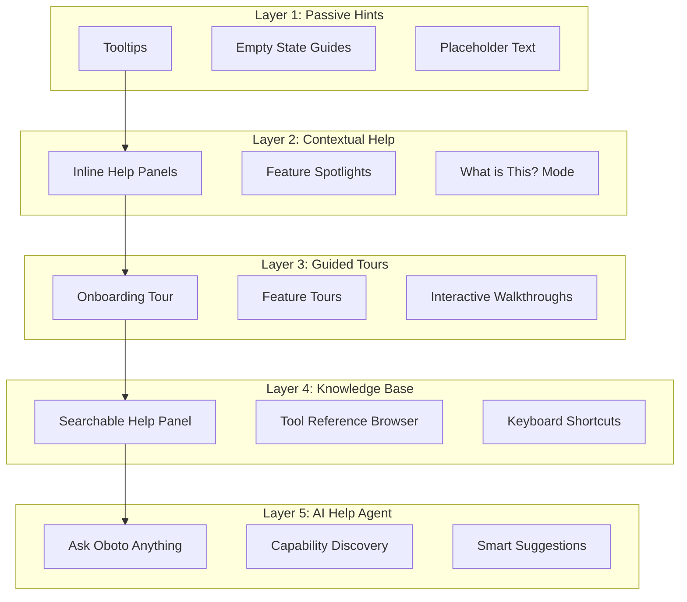
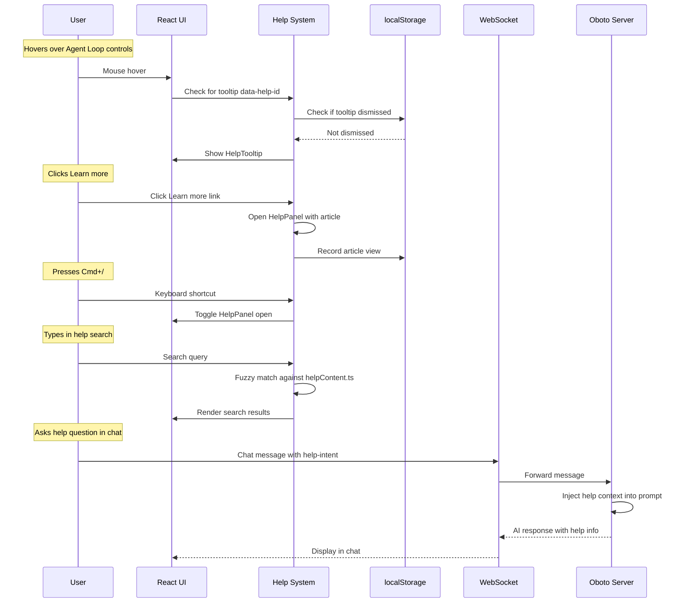

# Integrated Help System Design

## Overview

A comprehensive, multi-layered help system for Oboto that surfaces the right information at the right time — from contextual tooltips and guided tours to a searchable knowledge base and an AI-powered "help agent" that can answer questions about its own capabilities.

The system is designed around one core principle: **help should find you, not the other way around.**

---

## Current State Analysis

### Existing Help Infrastructure
- [`KeyboardShortcutsHelp.tsx`](ui/src/components/features/KeyboardShortcutsHelp.tsx) — A modal showing keyboard shortcuts, grouped by category
- [`GlobalPalette.tsx`](ui/src/components/features/GlobalPalette.tsx) — Command palette with searchable actions (⌘⇧P)
- [`SetupWizard/`](ui/src/components/features/SetupWizard/) — First-run onboarding flow (7 steps)
- Inline `title` attributes on a few header buttons
- No tooltips, no contextual help, no documentation browser, no onboarding beyond first run

### Gaps
1. **No discoverability** — Users must already know what Oboto can do to use it
2. **No contextual help** — No way to learn what a UI element does in-situ
3. **No progressive disclosure** — All 50+ tools, surfaces, skills, plugins are equally hidden
4. **No searchable help** — Documentation lives in markdown files on disk, inaccessible from the UI
5. **No help for the AI itself** — No way to ask "what can you do?" and get a structured answer

---

## Architecture

### Five Layers of Help



---

## Layer 1: Passive Hints

### 1.1 Enhanced Tooltips

Replace bare `title` attributes with rich, animated tooltip components.

**Component:** `HelpTooltip`

```
┌──────────────────────────────────┐
│ ⚡ Agent Loop Controls           │
│                                  │
│ Start, pause, or stop the        │
│ autonomous agent loop that runs  │
│ in the background.               │
│                                  │
│ ⌘⇧L — Toggle loop               │
│                                  │
│ Learn more →                     │
└──────────────────────────────────┘
```

**Behavior:**
- Appears on hover after 400ms delay (configurable)
- Supports title + description + keyboard shortcut + "Learn more" link
- Dark glass aesthetic matching existing UI (bg-[#0d0d0d]/95 with border-zinc-800/50)
- Positioning: auto-flip to stay in viewport
- Dismisses instantly on mouse leave
- "Learn more" opens the Knowledge Base to the relevant article

**Data model:**
```ts
interface HelpTooltipData {
  id: string;           // Unique identifier, e.g., 'header.agent-loop'
  title: string;        // Short title
  description: string;  // 1-2 sentence explanation
  shortcut?: string;    // Keyboard shortcut display string
  learnMoreId?: string; // Links to knowledge base article
}
```

### 1.2 Smart Empty States

Replace blank/loading states with helpful guidance when panels have no data.

**Locations:**
- Chat area on first load → "Try asking Oboto to..." with 3-4 example prompts
- Surfaces panel when empty → "Surfaces are live dashboards. Ask Oboto to create one, or type /surface"
- File tree before workspace set → "Set your workspace to see files here"
- Skills panel when empty → "Extend Oboto with modular skills. Browse available skills →"

### 1.3 Input Placeholder Intelligence

The chat input placeholder rotates through contextual hints:

```
"Ask me anything... (try: 'create a REST API')"
"Ask me anything... (try: 'generate a dashboard surface')"  
"Ask me anything... (try: 'run my test suite')"
"Ask me anything... (try: '/help' for all commands)"
```

Rotates every 8 seconds. Prioritizes hints about features the user hasn't used yet.

---

## Layer 2: Contextual Help

### 2.1 Inline Help Panels

Small, collapsible help sections inside complex UI areas.

**Component:** `InlineHelp`

```
┌─ Settings > AI Providers ─────────────────┐
│                                            │
│  ┌──────────────────────────────────────┐  │
│  │ 💡 How AI Providers Work              │  │
│  │                                      │  │
│  │ Oboto can use multiple AI providers  │  │
│  │ simultaneously. Set a primary for    │  │
│  │ chat, and route specific task types  │  │
│  │ to different models for cost/quality │  │
│  │ optimization.                        │  │
│  │                                      │  │
│  │ ▸ Routing Guide  ▸ Model Comparison  │  │
│  │                          [Dismiss]   │  │
│  └──────────────────────────────────────┘  │
│                                            │
│  [Provider config UI below...]             │
└────────────────────────────────────────────┘
```

**Behavior:**
- Shown automatically first time a user visits a complex section
- Can be dismissed; remembers dismissal in localStorage
- "Don't show again" checkbox to disable all inline help
- Compact: collapses to a single "💡" icon that expands on click

### 2.2 Feature Spotlight

Highlights a new or underused feature with a pulsing indicator.

**Component:** `FeatureSpotlight`

```
     ┌── Pulsing ring ──┐
     │                   │
     ▼                   │
   ┌───┐  ┌─────────────────────────────┐
   │ ⚡│──│ NEW: Agent Loop              │
   └───┘  │                             │
          │ Run the AI agent on a loop  │
          │ to continuously work on     │
          │ your project.               │
          │                             │
          │ [Try it] [Dismiss]          │
          └─────────────────────────────┘
```

**Behavior:**
- Attaches to a specific UI element with a pulsing ring animation
- Shown once per feature per user
- Connected popover with CTA button
- Tracks which spotlights have been shown in localStorage
- Max 1 spotlight visible at a time (queue system)

### 2.3 "What Is This?" Mode

A discoverable inspection mode. Activated via `⌘?` or from the help menu.

**Behavior:**
1. User presses `⌘?`
2. Cursor changes to `help` cursor, UI gets a subtle overlay tint
3. Status bar shows: "Click any element for help. Press ESC to exit."
4. Clicking any annotated element opens its help tooltip/article
5. Non-annotated elements show a generic "No help available for this element"
6. ESC exits the mode

**Implementation:** Elements opt-in via a `data-help-id="some.id"` attribute. The help system maps IDs to content.

---

## Layer 3: Guided Tours

### 3.1 Tour Engine

**Component:** `TourEngine`

A step-by-step guided walkthrough system.

```
Step highlight overlay:

┌──────────────────────────────────────────────────────────┐
│  ░░░░░░░░░░░░░░░░░░░░░░░░░░░░░░░░░░░░░░░░░░░░░░░░░░░░  │
│  ░░░░░░░░░░░░░░░░░░░░░░░░░░░░░░░░░░░░░░░░░░░░░░░░░░░░  │
│  ░░░░┌─────────────────────────────────┐░░░░░░░░░░░░░░░  │
│  ░░░░│   Highlighted Element           │░░░░░░░░░░░░░░░  │
│  ░░░░│   (clear cutout in overlay)     │░░░░░░░░░░░░░░░  │
│  ░░░░└─────────────────────────────────┘░░░░░░░░░░░░░░░  │
│  ░░░░                                   ░░░░░░░░░░░░░░░  │
│  ░░░░  ┌──────────────────────────────┐  ░░░░░░░░░░░░░░  │
│  ░░░░  │ Step 2 of 6                  │  ░░░░░░░░░░░░░░  │
│  ░░░░  │                              │  ░░░░░░░░░░░░░░  │
│  ░░░░  │ This is the command palette. │  ░░░░░░░░░░░░░░  │
│  ░░░░  │ Press ⌘⇧P to open it and    │  ░░░░░░░░░░░░░░  │
│  ░░░░  │ search for any action.       │  ░░░░░░░░░░░░░░  │
│  ░░░░  │                              │  ░░░░░░░░░░░░░░  │
│  ░░░░  │ [← Back]  ●●○○○○  [Next →]  │  ░░░░░░░░░░░░░░  │
│  ░░░░  │            [Skip Tour]       │  ░░░░░░░░░░░░░░  │
│  ░░░░  └──────────────────────────────┘  ░░░░░░░░░░░░░░  │
│  ░░░░░░░░░░░░░░░░░░░░░░░░░░░░░░░░░░░░░░░░░░░░░░░░░░░░  │
└──────────────────────────────────────────────────────────┘
```

**Tour Step Definition:**
```ts
interface TourStep {
  targetSelector: string;       // CSS selector for highlighted element
  title: string;
  content: string;              // Markdown supported
  placement: 'top' | 'bottom' | 'left' | 'right' | 'center';
  action?: 'click' | 'type' | 'wait';  // Required user action to proceed
  actionHint?: string;          // e.g., "Click the button to continue"
  beforeShow?: () => void;      // Setup callback - e.g., open a panel
  afterHide?: () => void;       // Cleanup callback
}

interface Tour {
  id: string;
  name: string;
  description: string;
  steps: TourStep[];
  prerequisite?: string;        // Another tour ID that must be completed first
  triggerCondition?: string;     // When to auto-suggest this tour
}
```

### 3.2 Built-in Tours

| Tour ID | Name | Steps | Trigger |
|---------|------|-------|---------|
| `onboarding` | Welcome to Oboto | 8 | After setup wizard completes |
| `chat-basics` | Chat & Commands | 5 | First message sent |
| `surfaces-intro` | Dynamic Surfaces | 6 | First surface created |
| `agent-loop` | Autonomous Agent | 4 | Never used agent loop |
| `tools-overview` | Tool Capabilities | 7 | On demand from help menu |
| `settings-tour` | Configuration Deep Dive | 6 | On demand |
| `keyboard-power-user` | Keyboard Shortcuts | 5 | After 10+ interactions |

### 3.3 Onboarding Tour Content

The primary tour, triggered after setup wizard:

1. **Chat Area** — "This is where you talk to Oboto. Type anything — questions, commands, code requests."
2. **Command Palette** — "Press ⌘⇧P to search through all available actions."
3. **Sidebar** — "Your project status, file explorer, and surfaces live here."
4. **Agent Loop** — "The agent loop lets Oboto work autonomously in the background."
5. **Workspace Indicator** — "This shows your current working directory. Click to change."
6. **Conversations** — "Start multiple conversations to work on different tasks in parallel."
7. **Settings** — "Configure AI providers, model routing, and integrations here."
8. **Help Button** — "Press ⌘/ anytime to open the help panel. You can also ask me directly!"

---

## Layer 4: Knowledge Base

### 4.1 Help Panel

**Component:** `HelpPanel`

A slide-out panel (right side) with searchable documentation.

```
┌── Help ─────────────────────────────────┐
│                                          │
│  🔍 [Search help topics...]         [×]  │
│                                          │
│  ┌────────────────────────────────────┐  │
│  │ 📖 Getting Started                 │  │
│  ├────────────────────────────────────┤  │
│  │ 🛠️ Tools Reference                │  │
│  ├────────────────────────────────────┤  │
│  │ 🖥️ Surfaces & Dashboards          │  │
│  ├────────────────────────────────────┤  │
│  │ 🤖 Agent Loop & Automation        │  │
│  ├────────────────────────────────────┤  │
│  │ 🔌 Plugins & Skills               │  │
│  ├────────────────────────────────────┤  │
│  │ ⚙️ Configuration                  │  │
│  ├────────────────────────────────────┤  │
│  │ ⌨️ Keyboard Shortcuts             │  │
│  ├────────────────────────────────────┤  │
│  │ 🎓 Interactive Tours              │  │
│  └────────────────────────────────────┘  │
│                                          │
│  ─── Recently Viewed ───                 │
│  • Setting up AI providers              │
│  • Creating a surface                    │
│                                          │
│  ─── What's New ───                      │
│  • v1.2: Cloud sync support             │
│  • v1.1: Plugin system                  │
│                                          │
└──────────────────────────────────────────┘
```

**Activation:**
- `⌘/` keyboard shortcut
- "Help" entry in command palette
- Help icon button in header (? icon)
- "Learn more" links from tooltips and inline help

**Article View:**
```
┌── Help > Tools Reference ───────────────┐
│                                          │
│  ← Back                            [×]  │
│                                          │
│  # Tools Reference                       │
│                                          │
│  Oboto has 50+ built-in tools across    │
│  multiple categories.                    │
│                                          │
│  ## File Operations                      │
│  Read, write, search, and diff files    │
│  in your workspace.                      │
│                                          │
│  **Example:**                            │
│  "Read the contents of package.json"     │
│                                          │
│  ## Shell Commands                       │
│  Execute terminal commands safely.       │
│                                          │
│  **Example:**                            │
│  "Run npm test"                          │
│                                          │
│  ─── Related ───                         │
│  • Keyboard Shortcuts                    │
│  • Agent Loop & Automation               │
│                                          │
│  ─── Was this helpful? ───               │
│  [👍 Yes]  [👎 No]                       │
│                                          │
└──────────────────────────────────────────┘
```

### 4.2 Help Content Model

```ts
interface HelpArticle {
  id: string;                    // e.g., 'tools.file-operations'
  title: string;
  category: string;              // Top-level grouping
  tags: string[];                // For search
  content: string;               // Markdown
  relatedArticles: string[];     // Other article IDs
  examples?: string[];           // Example prompts users can try
  lastUpdated: string;
}

interface HelpCategory {
  id: string;
  title: string;
  icon: string;                  // Lucide icon name
  description: string;
  articles: string[];            // Article IDs in display order
}
```

### 4.3 Help Content Source

Help content is defined as a static JSON/TS data file bundled with the UI:

**File:** `ui/src/data/helpContent.ts`

This contains all articles, categories, tooltip data, and tour definitions. Content is authored in Markdown within the TS file for type safety and co-location.

Future enhancement: the server can serve dynamic help content from the `docs/` directory, enabling plugin-contributed help articles.

### 4.4 Fuzzy Search

The search input uses client-side fuzzy matching against article titles, tags, and content snippets. No server round-trip needed.

**Algorithm:** Score-based matching with title matches weighted 3x, tag matches 2x, content matches 1x. Results sorted by score descending.

---

## Layer 5: AI Help Agent

### 5.1 "Ask Oboto" Mode

When a user types a question in the chat that's about Oboto itself — its features, capabilities, or how to do something — the system detects this and provides a structured help response instead of a generic AI response.

**Detection heuristics:**
- Message starts with `/help`
- Message contains phrases like "how do I", "can you", "what tools", "how to use"
- Message mentions Oboto feature names: "surface", "agent loop", "skill", "plugin"

**Response format:**
When help-mode is triggered, the AI receives injected context about Oboto's capabilities, tools list, and help content. This produces more accurate, specific answers than the base model alone.

### 5.2 Smart Suggestions

After certain events, Oboto proactively suggests helpful next steps:

| Event | Suggestion |
|-------|------------|
| First tool call fails | "💡 This tool requires X. Would you like help setting it up?" |
| User creates first surface | "💡 Surfaces can be pinned to the sidebar. Want a tour?" |
| Agent loop completes | "💡 The agent loop found N issues. Type /review to see them." |
| Settings saved | "💡 You can route different task types to different models for cost optimization." |

### 5.3 Capability Discovery

A dedicated help article that dynamically lists all available tools, skills, and capabilities:

```
┌── Help > What Can Oboto Do? ────────────┐
│                                          │
│  🤖 Oboto can help you with:            │
│                                          │
│  ┌─ Active Capabilities ──────────────┐  │
│  │ ✅ 52 tools available               │  │
│  │ ✅ 3 skills installed               │  │
│  │ ✅ 2 plugins active                 │  │
│  │ ✅ MCP servers: 1 connected         │  │
│  │ ✅ OpenClaw: connected              │  │
│  └────────────────────────────────────┘  │
│                                          │
│  Try saying:                             │
│  "Create a REST API for users"           │
│  "Search my codebase for TODO comments"  │
│  "Generate a dashboard showing tests"    │
│  "Set up CI/CD for this project"         │
│                                          │
└──────────────────────────────────────────┘
```

---

## UI Integration Points

### Header Modifications

Add a help button to the right side of [`Header.tsx`](ui/src/components/layout/Header.tsx):

```
  [OpenClaw Badge] [Connection] [Settings] [Help (?)] [Palette (⌘⇧P)]
```

The `?` button:
- Click → Opens Help Panel
- `⌘/` → Opens Help Panel
- `⌘?` → Enters "What Is This?" mode

### Command Palette Additions

New entries in [`GlobalPalette.tsx`](ui/src/components/features/GlobalPalette.tsx) command list:

| Command | Shortcut | Action |
|---------|----------|--------|
| Help: Open Help Panel | `⌘/` | Opens the help panel |
| Help: Start Tour | — | Opens tour selection |
| Help: What Is This? | `⌘?` | Enters inspection mode |
| Help: Keyboard Shortcuts | `⌘⇧/` | Opens shortcuts dialog |
| Help: What Can Oboto Do? | — | Opens capability discovery |
| Help: Reset All Help Tips | — | Clears dismissed help state |

### Status Bar

Add a contextual help hint to [`StatusBar.tsx`](ui/src/components/layout/StatusBar.tsx):

```
  [status info...]                           💡 Tip: Press ⌘/ for help
```

The tip rotates through contextual suggestions based on current state.

---

## Component Tree

```
ui/src/
├── components/
│   └── help/
│       ├── HelpButton.tsx           # Header help button with dropdown
│       ├── HelpPanel.tsx            # Slide-out help panel
│       ├── HelpArticle.tsx          # Article renderer with markdown
│       ├── HelpSearch.tsx           # Fuzzy search input + results
│       ├── HelpTooltip.tsx          # Rich tooltip component
│       ├── InlineHelp.tsx           # Collapsible contextual help block
│       ├── FeatureSpotlight.tsx     # Pulsing feature highlight
│       ├── TourEngine.tsx           # Step-by-step tour overlay
│       ├── TourStep.tsx             # Individual tour step popover
│       ├── WhatIsThisMode.tsx       # Inspection mode overlay
│       └── SmartSuggestion.tsx      # Proactive suggestion toast
├── data/
│   └── helpContent.ts              # All help articles, tooltips, tours
└── hooks/
    ├── useHelp.ts                   # Help panel state management
    ├── useTour.ts                   # Tour engine state management
    └── useHelpTracking.ts           # Tracks viewed articles, dismissed tips
```

---

## State Management

### Help State Hook: `useHelp`

```ts
interface HelpState {
  isPanelOpen: boolean;
  currentArticleId: string | null;
  searchQuery: string;
  navigationStack: string[];     // For back navigation
  isWhatIsThisMode: boolean;
}
```

### Help Tracking Hook: `useHelpTracking`

Persists to localStorage:

```ts
interface HelpTracking {
  viewedArticles: Set<string>;
  dismissedTooltips: Set<string>;
  dismissedInlineHelp: Set<string>;
  completedTours: Set<string>;
  shownSpotlights: Set<string>;
  helpfulRatings: Record<string, boolean>;  // articleId → thumbs up/down
  firstSeen: string;                         // ISO timestamp
  interactionCount: number;
}
```

This data drives progressive disclosure:
- Don't show spotlight for features user has already used
- Don't suggest tours user has completed
- Prioritize input placeholder hints for unused features
- "What's new" section based on what user hasn't seen

---

## Keyboard Shortcuts

| Shortcut | Action |
|----------|--------|
| `⌘/` | Toggle Help Panel |
| `⌘?` (⌘⇧/) | Enter "What Is This?" mode |
| `Escape` | Close Help Panel / Exit mode |
| `⌘⇧/` | Open Keyboard Shortcuts (existing) |

---

## Visual Design Principles

1. **Consistent with existing UI** — Same dark glass aesthetic: `bg-[#0d0d0d]/95`, `border-zinc-800/50`, `text-zinc-400` for body, `text-zinc-200` for titles
2. **Non-intrusive** — Help never blocks the primary workflow. Panel slides from right, tooltips are delayed, spotlights are dismissible
3. **Progressive** — New users see more help automatically; power users can dismiss everything
4. **Animated** — `animate-fade-in`, `animate-scale-in` matching existing Oboto motion language
5. **Accessible** — All help content keyboard-navigable, proper ARIA labels

---

## Data Flow



---

## Implementation Plan

### Phase 1: Foundation (Core Components)
1. Create `ui/src/data/helpContent.ts` with initial content
2. Build `HelpTooltip` component
3. Build `HelpPanel` with search and article rendering
4. Create `useHelp` and `useHelpTracking` hooks
5. Add help button to Header
6. Register `⌘/` shortcut

### Phase 2: Contextual Help
7. Add `InlineHelp` component
8. Add inline help to Settings dialog sections
9. Build `FeatureSpotlight` component
10. Add spotlights for key features
11. Improve empty states across all panels

### Phase 3: Guided Tours
12. Build `TourEngine` and `TourStep` components
13. Create `useTour` hook
14. Author onboarding tour content
15. Author feature-specific tours
16. Trigger onboarding tour after setup wizard

### Phase 4: Advanced Features
17. Build `WhatIsThisMode` overlay
18. Add `data-help-id` attributes to major UI elements
19. Build `SmartSuggestion` toast component
20. Implement proactive suggestion triggers
21. Add rotating placeholder hints to chat input
22. Implement AI help context injection on server

### Phase 5: Polish
23. Add help feedback ratings
24. Add "What's New" section
25. Add tour selection menu
26. Progressive disclosure tuning
27. Help content review and expansion

---

## Files to Create

| File | Purpose |
|------|---------|
| `ui/src/components/help/HelpButton.tsx` | Header help dropdown button |
| `ui/src/components/help/HelpPanel.tsx` | Slide-out help panel |
| `ui/src/components/help/HelpArticle.tsx` | Markdown article renderer |
| `ui/src/components/help/HelpSearch.tsx` | Fuzzy search component |
| `ui/src/components/help/HelpTooltip.tsx` | Rich tooltip |
| `ui/src/components/help/InlineHelp.tsx` | Contextual help block |
| `ui/src/components/help/FeatureSpotlight.tsx` | Feature highlight pulse |
| `ui/src/components/help/TourEngine.tsx` | Tour overlay engine |
| `ui/src/components/help/TourStep.tsx` | Tour step popover |
| `ui/src/components/help/WhatIsThisMode.tsx` | Inspection mode |
| `ui/src/components/help/SmartSuggestion.tsx` | Proactive suggestion |
| `ui/src/data/helpContent.ts` | All help content data |
| `ui/src/hooks/useHelp.ts` | Help panel state |
| `ui/src/hooks/useTour.ts` | Tour engine state |
| `ui/src/hooks/useHelpTracking.ts` | Persistence layer |

## Files to Modify

| File | Change |
|------|--------|
| [`ui/src/components/layout/Header.tsx`](ui/src/components/layout/Header.tsx) | Add HelpButton |
| [`ui/src/hooks/useKeyboardShortcuts.ts`](ui/src/hooks/useKeyboardShortcuts.ts) | Add ⌘/ and ⌘? shortcuts |
| [`ui/src/App.tsx`](ui/src/App.tsx) | Mount HelpPanel, TourEngine, WhatIsThisMode |
| [`ui/src/components/features/GlobalPalette.tsx`](ui/src/components/features/GlobalPalette.tsx) | Add help commands |
| [`ui/src/components/layout/StatusBar.tsx`](ui/src/components/layout/StatusBar.tsx) | Add rotating help tip |
| [`ui/src/components/features/SettingsDialog.tsx`](ui/src/components/features/SettingsDialog.tsx) | Add inline help to settings sections |
| [`ui/src/components/chat/InputArea.tsx`](ui/src/components/chat/InputArea.tsx) | Rotating placeholder hints |
| Various UI components | Add `data-help-id` attributes |

---

## Invariants

1. **Help is never blocking** — No help element prevents the user from performing their primary task
2. **Help is dismissible** — Every help element can be closed, and dismissals persist
3. **Help is progressive** — New users see more, experienced users see less
4. **Help is searchable** — Every help topic is findable via the search panel
5. **Help is consistent** — Same visual language as the rest of the Oboto UI
6. **Help is offline** — All help content is bundled; no network required
7. **Zero performance impact** — Help content lazy-loaded; tooltips use pure CSS animations where possible
