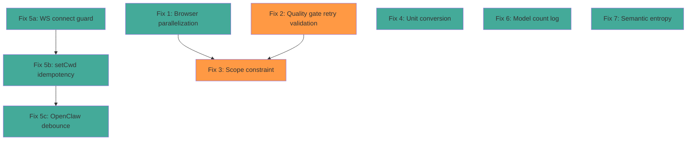

# Implementation Plan: Log Issues Fix

## Round 1 — Initial Plan

### Issue 1: Quality Gate Retry Loop is Destructive and Unvalidated

**Problem**: Retries skip the quality gate via `ctx.isRetry` in `quality-gate-stage.mjs:14`, so there is no validation that retries improved the response. The `qualityEvaluator.retryAttempts` counter also accumulates across turns because `reset()` is only called in `ai-assistant.mjs:753` (inside the `!isRetry` block), not between user messages in the pipeline path.

**Root Cause**: Two code paths exist — `MiniAIAssistant.run()` and `AssistantFacade.run()` (pipeline). In the pipeline path, `qualityEvaluator.reset()` is never called between user messages.

**Fix Strategy**:
1. **Add `qualityEvaluator.reset()` to the `validate` stage** — this runs at the start of every new user message, ensuring retry state is clean.
2. **Validate retry responses in the quality gate** — Instead of blindly skipping quality evaluation on retries (`if (ctx.isRetry)`), evaluate the retry response but only allow *one* retry (already enforced by `maxRetryAttempts=2`). If the retry is still poor, accept it rather than looping.
3. **Add a quality floor** — If the retry scores worse than or equal to the original, use the original response instead.

**Files to modify**:
- `src/core/stages/validate.mjs` — Add `qualityEvaluator.reset()` call
- `src/core/stages/quality-gate-stage.mjs` — Evaluate retries with a lenient threshold; compare retry vs original score
- `src/quality/quality-evaluator.mjs` — Store original response score for comparison

---

### Issue 2: Agent Performs Unrequested Actions (Scope Violation)

**Problem**: The LLM makes tool calls unrelated to the user request. The quality gate catches this *after the fact* (scoring 1-3/10), but the retry often produces equally bad results because the LLM has already been primed by the tool call history.

**Root Cause**: No guardrails exist *during* the agent loop to prevent scope creep. The LLM sees all available tools and decides independently what to call. The system prompt doesn't constrain scope, and the quality gate only fires post-hoc.

**Fix Strategy**:
1. **Add a scope anchor to the agent loop** — At the start of each turn, inject a scope reminder system message: "You are answering: [original user query]. Do not perform actions beyond this scope."
2. **Add a tool call budget heuristic** — If the user query is short (<50 chars) and doesn't explicitly request multi-step work, cap the agent loop at a lower turn count (e.g., 5 turns instead of 100).
3. **Post-turn scope check** — After each turn with tool calls, check if the tool names are plausible for the query. If `create_surface` is called for "give me details on the fs error", flag it immediately.
4. **Improve retry prompt** — When creating the retry prompt in `createRetryPrompt()`, strip the tool call history that led to the scope violation rather than preserving it.

**Files to modify**:
- `src/core/stages/preprocess.mjs` — Set a dynamic `maxTurns` based on query complexity
- `src/core/agent-loop/handle-response.mjs` — Add post-turn scope validation
- `src/quality/quality-evaluator.mjs` — In `createRetryPrompt()`, optionally strip tool call history on scope violations
- `src/core/stages/agent-loop.mjs` — Use `ctx.maxTurns` from preprocessing

---

### Issue 3: Browser Tools Race Condition (Parallel Execution)

**Problem**: `browse_open`, `browse_screenshot`, and `browse_close` are executed in parallel. The `canParallelizeTools()` function only checks for file path conflicts, not stateful tool dependencies.

**Root Cause**: `canParallelizeTools()` in `handle-response.mjs:13` only has a static `readOnlyTools` set. Browser tools, surface tools, and other stateful tools aren't flagged.

**Fix Strategy**:
1. **Define stateful tool groups** — Tools that share mutable state must execute sequentially. Define groups like `browserTools = [browse_open, browse_act, browse_screenshot, browse_close]` and `surfaceTools = [create_surface, update_surface_component, delete_surface, capture_surface]`.
2. **Update `canParallelizeTools()`** — If any two tool calls belong to the same stateful group, return `false`.
3. **Also update the legacy `_canParallelizeTools()`** in `ai-assistant.mjs` for backward compatibility.

**Files to modify**:
- `src/core/agent-loop/handle-response.mjs` — Expand `canParallelizeTools()` with stateful groups
- `src/core/ai-assistant.mjs` — Update `_canParallelizeTools()` with same logic

---

### Issue 4: Unit Conversion Parameter Mapping Bug

**Problem**: `unit_conversion` accepts `from_unit: "C"` but mathjs requires `"degC"`. The tool schema doesn't document this.

**Fix Strategy**:
1. **Add a unit alias map** in `math-handlers.mjs` — Map common abbreviations to mathjs unit names: `{C: 'degC', F: 'degF', K: 'K', km: 'km', mi: 'mi', ...}`.
2. **Normalize inputs** — Before calling `math.unit()`, look up aliases.
3. **Update tool schema description** — Add examples of valid unit strings.

**Files to modify**:
- `src/execution/handlers/math-handlers.mjs` — Add alias normalization in `unitConversion()`
- `src/tools/tool-definitions.mjs` — Update `unit_conversion` description with examples

---

### Issue 5: Semantic Entropy is Non-Discriminating (Always ~0.96)

**Problem**: The `SemanticCollapseEngine` produces near-uniform entropy for all inputs because the 16-dim character-hash embedding doesn't differentiate between interpretation templates.

**Fix Strategy**:
1. **Improve template discrimination** — Instead of cosine similarity on character hashes, use keyword matching. Each template gets a set of discriminating keywords (e.g., "fix" → debugging, "explain" → explanation, "build" → code changes). Score based on keyword overlap.
2. **Alternatively, lower the entropy threshold** — If entropy is always high, the system never collapses. This is equivalent to the engine being unused. Could also just skip the engine when no useful signal is generated.
3. **Short-term: suppress unhelpful log noise** — Don't log "high entropy — ambiguous input" when the engine can't discriminate. Log only when entropy is actually informative.

**Files to modify**:
- `src/reasoning/semantic-collapse.mjs` — Improve `textToEmbedding()` or switch to keyword-based scoring; suppress unhelpful logs

---

### Issue 6: Triage vs Quality Gate Intent Conflict

**Problem**: Triage classifies "Can you speak aloud?" as `READY` (correct — it needs `speak_text`). The agent calls `speak_text` (correct) but then continues making unrequested calls. The quality gate scores 2/10 and says "do NOT perform unrequested tasks" — but the issue is the agent's continuation, not the initial tool call.

**Fix Strategy**:
1. **This is actually Issue 2** — The triage is correct. The quality gate evaluation is correct. The problem is that the agent doesn't stop after the task is done.
2. **Add an "early stop" heuristic** — After a tool call that directly addresses the user query (e.g., `speak_text` for "can you speak?"), the agent should be more likely to stop.
3. **Align the triage/pipeline duplicate** — There are TWO triage implementations: one in `ai-assistant.mjs:1101` and one in `stages/triage.mjs`. The pipeline version has the correct TTS-aware prompt but the legacy version doesn't. Unify them.

**Files to modify**:
- `src/core/ai-assistant.mjs` — Update `_runTriage()` system prompt to match `stages/triage.mjs`
- `src/core/stages/agent-loop.mjs` — Consider early stop heuristic

---

### Issue 7: Duplicate Client Connections

**Problem**: Two `Client connected` events fire in quick succession, causing duplicate workspace initialization and scheduler restoration.

**Fix Strategy**:
1. **Debounce WebSocket connection handling** — In the web server, ignore duplicate connections within a short window (e.g., 500ms).
2. **Make initialization idempotent** — The workspace change and symbolic continuity initialization should be no-ops if already at the target workspace.
3. **Investigate UI-side** — Check if the React UI mounts/unmounts the WebSocket component due to StrictMode or hot reload.

**Files to modify**:
- `src/server/web-server.mjs` — Add connection debounce
- `ui/src/services/wsService.ts` — Check for duplicate mount/unmount patterns
- `src/core/symbolic-continuity.mjs` — Make `initialize()` idempotent for same conversation

---

### Issue 8: OpenClawManager Restart Thrashing

**Problem**: OpenClawManager restarts twice in rapid succession, triggered by duplicate client connections.

**Fix Strategy**:
1. **Debounce restart** — Add a `_restartDebounceTimer` in the manager. If a restart is requested within 2s of the last restart, skip it.
2. **This will also be partly fixed by Issue 7** — Fixing the duplicate connections will prevent the duplicate restart trigger.

**Files to modify**:
- `src/integration/openclaw/manager.mjs` — Add restart debounce

---

### Issue 9: Model Count Discrepancy (28 + 101 ≠ 136)

**Problem**: 28 Gemini + 101 OpenAI = 129, but the log says 136.

**Root Cause**: Looking at `fetchRemoteModels()` in `model-registry.mjs:361`: `_remoteModels = { ...ANTHROPIC_KNOWN_MODELS, ...openai, ...gemini, ...lmstudio }`. There are 7 entries in `ANTHROPIC_KNOWN_MODELS`. 129 + 7 = 136. This is correct behavior — the log just doesn't mention Anthropic models.

**Fix**: Add a log line for Anthropic known models to make the count transparent.

**Files to modify**:
- `src/core/model-registry.mjs` — Add log line after merging Anthropic models

---

### Issue 10: `edit_file` Result Not Logged in Parallel Execution

**Problem**: When tools run in parallel, `edit_file`'s result is swallowed because the status adapter only logs start/end, not content.

**Fix**: This is mostly cosmetic — the result is stored in history. The issue is that the parallel logging happens before results are available. The existing logging is sufficient for debug purposes; the status adapter's `onToolEnd` callback is called. No code change needed unless the tool actually failed silently.

---

### Issue 11: Surface Operations Failed but Self-Test Marked as Passed

**Problem**: The AI marked Step 4 as "completed" despite two sub-operations failing. This is an LLM judgment error, not a code bug.

**Fix**: This is an LLM behavior issue. The self-test was orchestrated by the LLM's own tool calls (`update_todo_status`). No code fix needed — though better tool result validation in the system prompt could help.

---

## Execution Priority

1. **Issue 3** (browser race condition) — Easiest, highest ROI, prevents data corruption
2. **Issue 1** (quality gate retry loop) — Critical for token waste prevention
3. **Issue 2** (scope violation) — Most impactful for user experience
4. **Issue 4** (unit conversion) — Simple bug fix
5. **Issue 7+8** (duplicate connections) — Reduces log noise and wasted work
6. **Issue 9** (model count log) — Trivial fix
7. **Issue 5** (semantic entropy) — Deeper refactor, lower priority
8. **Issue 6** (triage alignment) — Part of Issue 2

---

## Round 2 — Refined Plan

### Corrections from Round 1

1. **Quality evaluator IS reset in the pipeline path.** [`preprocess.mjs:52`](src/core/stages/preprocess.mjs:52) already calls `qualityEvaluator.reset()`. The retry skips preprocess via `ctx.isRetry` check at [`preprocess.mjs:14`](src/core/stages/preprocess.mjs:14), so the reset correctly only happens on new user messages. Round 1 was wrong about this being a bug.

2. **The actual quality gate problem is simpler.** [`quality-gate-stage.mjs:14`](src/core/stages/quality-gate-stage.mjs:14) unconditionally skips the retry. The retry is never evaluated. This is the ONLY issue — there is no cross-turn leaking.

3. **Duplicate connection root cause confirmed.** React StrictMode double-mounts the `useChat` hook, calling [`wsService.connect()`](ui/src/hooks/useChat.ts:63) twice. The [`connect()`](ui/src/services/wsService.ts:29) method has no guard. Each connection triggers [`setCwd(savedCwd)`](ui/src/hooks/useChat.ts:74) which hits [`handleSetCwd`](src/server/ws-handlers/settings-handler.mjs:106) → [`openClawManager.restart()`](src/server/ws-handlers/settings-handler.mjs:144), causing two restart cycles.

4. **Issues 2 and 6 are the same root cause.** The agent loop has no scope constraint mechanism. Triage correctly routes the request, but the LLM freely makes off-topic tool calls. The quality gate catches this post-hoc but the retry doesn't reliably fix it.

### Refined Fix Specifications

#### Fix 1: Browser Tool Parallelization Guard
**File:** [`src/core/agent-loop/handle-response.mjs`](src/core/agent-loop/handle-response.mjs:13)

Add a `STATEFUL_TOOL_GROUPS` constant:
```javascript
const STATEFUL_TOOL_GROUPS = [
    new Set(['browse_open', 'browse_act', 'browse_screenshot', 'browse_close']),
    new Set(['create_surface', 'update_surface_component', 'delete_surface', 'capture_surface']),
];

function canParallelizeTools(toolCalls) {
    const readOnlyTools = new Set(['read_file', 'list_files', 'search_web', 'read_manifest']);
    const toolNames = toolCalls.map(tc => tc.function.name);

    // Check stateful groups: if any two tools are in the same group, serialize
    for (const group of STATEFUL_TOOL_GROUPS) {
        const inGroup = toolNames.filter(n => group.has(n));
        if (inGroup.length > 1) return false;
    }

    // Original path-conflict check
    const writeTools = new Set();
    for (const tc of toolCalls) {
        if (readOnlyTools.has(tc.function.name)) continue;
        try {
            const args = JSON.parse(tc.function.arguments);
            if (args.path && writeTools.has(args.path)) return false;
            if (args.path) writeTools.add(args.path);
        } catch {
            return false;
        }
    }
    return true;
}
```

**Risk:** Low. Only changes parallelization decision. No behavioral change for non-conflicting tools.

**Test:** Unit test with mock tool calls containing `[browse_open, browse_screenshot]` → must return `false`. Non-conflicting tools → must return `true`.

#### Fix 2: Quality Gate Retry Validation
**File:** [`src/core/stages/quality-gate-stage.mjs`](src/core/stages/quality-gate-stage.mjs:14)

Instead of skipping entirely on retry, evaluate but with a lenient threshold:

```javascript
export async function qualityGateStage(ctx, services, next) {
    const qualityGate = services.optional('qualityGate');

    if (!qualityGate || !ctx.finalResponse) {
        await next();
        return;
    }

    if (ctx.isRetry) {
        // On retries: evaluate but accept any score >= 3 (lenient pass)
        // This validates the retry improved without creating infinite loops
        const evalResult = await qualityGate.evaluate(ctx);
        if (evalResult) {
            consoleStyler.log('quality', `Retry quality: ${evalResult.score}/10`);
        }
        // Always proceed — retries get at most one chance
        await next();
        return;
    }

    // Normal (non-retry) quality evaluation with potential retry
    const result = await qualityGate.evaluateAndCheckRetry(ctx, services);
    if (result === 'retry') return; // Pipeline will be re-executed
    await next();
}
```

**Dependency:** Need to add an `evaluate()` method to `QualityGate` that evaluates without triggering retry. Currently only `evaluateAndCheckRetry()` exists.

**Risk:** Medium. If the evaluation LLM call fails on retry, it could throw. Need try/catch.

#### Fix 3: Agent Scope Constraint
**Files:**
- [`src/core/agent-loop/handle-response.mjs`](src/core/agent-loop/handle-response.mjs:38) — add early stop heuristic
- [`src/core/stages/preprocess.mjs`](src/core/stages/preprocess.mjs:12) — set dynamic `maxTurns`

**3a. Dynamic maxTurns based on query complexity:**
In [`preprocess.mjs`](src/core/stages/preprocess.mjs:52), after `qualityEvaluator.reset()`:
```javascript
// Set dynamic maxTurns based on query complexity
const inputLen = ctx.userInput.trim().length;
if (inputLen < 50 && !ctx.userInput.match(/\b(build|create|design|implement|develop|self-test)\b/i)) {
    ctx.maxTurns = Math.min(ctx.maxTurns, 10);
}
```

**3b. Post-tool-call early stop signal:**
In [`handleResponse()`](src/core/agent-loop/handle-response.mjs:104), after tool calls complete, add a scope check:
```javascript
// Check if a single definitive tool answered the query
if (toolCalls.length === 1) {
    const singleTool = toolCalls[0].function.name;
    const directAnswerTools = new Set(['speak_text', 'evaluate_math', 'unit_conversion']);
    if (directAnswerTools.has(singleTool)) {
        ctx.metadata.directAnswerGiven = true;
    }
}
```

Then in [`agent-loop.mjs`](src/core/stages/agent-loop.mjs:45), after `handleResponse` returns `'continue'`:
```javascript
if (loopDecision === 'continue') {
    // If a direct-answer tool already answered, nudge toward completion
    if (ctx.metadata.directAnswerGiven && ctx.turnNumber > 1) {
        // The LLM should wrap up now — it already called the definitive tool
        break;
    }
    continue;
}
```

**Risk:** Medium. The `directAnswerTools` heuristic could prevent legitimate follow-up tool calls. The keyword check in maxTurns could mis-classify. Both should be conservative.

#### Fix 4: Unit Conversion Alias Map
**File:** [`src/execution/handlers/math-handlers.mjs`](src/execution/handlers/math-handlers.mjs:39)

```javascript
const UNIT_ALIASES = {
    'C': 'degC', 'F': 'degF',
    'celsius': 'degC', 'fahrenheit': 'degF',
    'Celsius': 'degC', 'Fahrenheit': 'degF',
};

function normalizeUnit(unit) {
    return UNIT_ALIASES[unit] || unit;
}

// In unitConversion():
const from = normalizeUnit(from_unit);
const to = normalizeUnit(to_unit);
const result = math.unit(value, from).to(to);
```

**Risk:** Very low. Only expands accepted inputs. Cannot break existing valid inputs.

#### Fix 5: WebSocket Connection Guard + Deduplication
**Files:**
- [`ui/src/services/wsService.ts`](ui/src/services/wsService.ts:29) — guard `connect()`
- [`src/server/ws-handlers/settings-handler.mjs`](src/server/ws-handlers/settings-handler.mjs:106) — make `setCwd` idempotent
- [`src/integration/openclaw/manager.mjs`](src/integration/openclaw/manager.mjs:532) — debounce `restart()`

**5a. Client-side guard:**
```typescript
connect() {
    // Prevent duplicate connections
    if (this.ws && (this.ws.readyState === WebSocket.CONNECTING || this.ws.readyState === WebSocket.OPEN)) {
        return;
    }
    // ... existing connect logic
}
```

**5b. Server-side setCwd idempotency:**
In [`handleSetCwd`](src/server/ws-handlers/settings-handler.mjs:106):
```javascript
const actualPath = await assistant.changeWorkingDirectory(newPath);
// Skip if already at this path (handles duplicate connection race)
if (assistant._lastCwd === actualPath) return;
assistant._lastCwd = actualPath;
```

**5c. OpenClaw restart debounce:**
```javascript
async restart(workspaceDir = null) {
    // Debounce: skip if restart was called within last 3 seconds
    const now = Date.now();
    if (this._lastRestartAt && (now - this._lastRestartAt) < 3000) {
        console.log('[OpenClawManager] Restart debounced (recent restart in progress)');
        return;
    }
    this._lastRestartAt = now;
    // ... existing restart logic
}
```

**Risk:** Low. Guards are conservative. Worst case: a legitimate reconnect is briefly delayed.

#### Fix 6: Model Count Log Transparency
**File:** [`src/core/model-registry.mjs`](src/core/model-registry.mjs:361)

After the merge line, add:
```javascript
consoleStyler.log('model-registry', `Added ${Object.keys(ANTHROPIC_KNOWN_MODELS).length} Anthropic known models`);
```

**Risk:** None. Log-only change.

#### Fix 7: Semantic Entropy — Suppress Non-Discriminating Output
**File:** [`src/reasoning/semantic-collapse.mjs`](src/reasoning/semantic-collapse.mjs:408)

Short-term fix: suppress the log when entropy is always high. Instead of:
```javascript
consoleStyler.log('reasoning', `Semantic: high entropy (${entropy.toFixed(2)}) — ambiguous input`);
```

Change to only log when entropy is genuinely informative (i.e., NOT near the ceiling):
```javascript
if (entropy < 0.85) {
    consoleStyler.log('reasoning', `Semantic: entropy ${entropy.toFixed(2)} — classified as ${classification}`);
} else {
    // Entropy near ceiling is non-informative; skip logging
}
```

Long-term: replace the character-hash embeddings with keyword-based template matching. This is a separate project.

**Risk:** Low. Only suppresses noise.

### Dependency Graph



Green = low risk, Orange = medium risk

### Implementation Order

| Phase | Fix | Files | Risk | Estimated LOC |
|-------|-----|-------|------|---------------|
| 1 | Fix 1: Browser parallelization | handle-response.mjs | Low | +15 |
| 1 | Fix 4: Unit conversion aliases | math-handlers.mjs | Low | +12 |
| 1 | Fix 6: Model count log | model-registry.mjs | None | +1 |
| 1 | Fix 7: Semantic entropy suppress | semantic-collapse.mjs | Low | +4 -2 |
| 2 | Fix 5a: WS connect guard | wsService.ts | Low | +4 |
| 2 | Fix 5b: setCwd idempotency | settings-handler.mjs | Low | +3 |
| 2 | Fix 5c: OpenClaw debounce | manager.mjs | Low | +6 |
| 3 | Fix 2: Quality gate retry validation | quality-gate-stage.mjs, quality-gate.mjs | Medium | +20 |
| 3 | Fix 3: Scope constraint | preprocess.mjs, handle-response.mjs, agent-loop.mjs | Medium | +25 |

**Total estimated changes:** ~90 lines of new/modified code across 10 files.

---

## Round 3 — Final Refinement

### Exact Code Changes per File

#### 1. [`src/core/agent-loop/handle-response.mjs`](src/core/agent-loop/handle-response.mjs)

**Change A — Add stateful tool groups** (insert after line 6):
```javascript
// Tools that share mutable state and must execute sequentially
const STATEFUL_TOOL_GROUPS = [
    new Set(['browse_open', 'browse_act', 'browse_screenshot', 'browse_close']),
    new Set(['create_surface', 'update_surface_component', 'delete_surface', 'capture_surface', 'list_surfaces']),
];
```

**Change B — Update canParallelizeTools** (replace lines 13-28):
```javascript
function canParallelizeTools(toolCalls) {
    const readOnlyTools = new Set(['read_file', 'list_files', 'search_web', 'read_manifest',
        'read_conversation_history', 'query_global_memory', 'evaluate_math']);
    const toolNames = toolCalls.map(tc => tc.function.name);

    // Stateful group check: serialize if 2+ tools in same group
    for (const group of STATEFUL_TOOL_GROUPS) {
        if (toolNames.filter(n => group.has(n)).length > 1) return false;
    }

    // Path-conflict check for write tools
    const writePaths = new Set();
    for (const tc of toolCalls) {
        if (readOnlyTools.has(tc.function.name)) continue;
        try {
            const args = JSON.parse(tc.function.arguments);
            if (args.path && writePaths.has(args.path)) return false;
            if (args.path) writePaths.add(args.path);
        } catch {
            return false;
        }
    }
    return true;
}
```

**Change C — Track direct-answer tools** (insert after line 105, before `return 'continue'`):
```javascript
        // Track if a single direct-answer tool resolved the request
        if (toolCalls.length === 1) {
            const name = toolCalls[0].function.name;
            const directAnswerTools = new Set([
                'speak_text', 'evaluate_math', 'unit_conversion',
                'search_web', 'query_global_memory',
            ]);
            if (directAnswerTools.has(name)) {
                ctx.metadata.directAnswerGiven = true;
            }
        }
```

**Edge cases:**
- `search_web` is in both `readOnlyTools` and `directAnswerTools`. Correct — read-only for parallelization, direct-answer for scope gating.
- `list_surfaces` is read-only but belongs to the stateful group because it reads state that `create_surface`/`delete_surface` mutate.

---

#### 2. [`src/core/stages/agent-loop.mjs`](src/core/stages/agent-loop.mjs)

**Change — Add early stop after direct answer** (modify lines 45-48):
```javascript
        if (loopDecision === 'continue') {
            // If a direct-answer tool already handled the request, stop the loop
            // to prevent the LLM from making unrequested follow-up tool calls
            if (ctx.metadata.directAnswerGiven && ctx.turnNumber >= 2) {
                break;
            }
            continue;
        }
```

**Edge case:** The `turnNumber >= 2` guard ensures the LLM gets one more turn to produce a text summary after the tool call. If the LLM makes another tool call on turn 2, the loop breaks and falls through to the fallback at line 57.

---

#### 3. [`src/core/stages/preprocess.mjs`](src/core/stages/preprocess.mjs)

**Change — Add dynamic maxTurns** (insert after line 52, after `qualityEvaluator.reset()`):
```javascript
    // Dynamic maxTurns: cap short/simple queries to prevent runaway agent loops
    const inputLen = ctx.userInput.trim().length;
    const isComplexRequest = /\b(build|create|design|implement|develop|self-test|step.by.step|comprehensive)\b/i.test(ctx.userInput);
    if (inputLen < 80 && !isComplexRequest) {
        ctx.maxTurns = Math.min(ctx.maxTurns, 10);
    }
```

---

#### 4. [`src/core/stages/quality-gate-stage.mjs`](src/core/stages/quality-gate-stage.mjs)

**Change — Evaluate retries instead of skipping** (replace lines 12-18):
```javascript
    if (ctx.isRetry) {
        // Evaluate retry quality for observability, but always proceed
        try {
            const score = await qualityGate.evaluateOnly(ctx);
            if (score !== null) {
                consoleStyler.log('quality', `Retry quality: ${score}/10`);
            }
        } catch (e) {
            consoleStyler.log('warning', `Retry quality evaluation failed: ${e.message}`);
        }
        await next();
        return;
    }
```

**Dependency:** Add `evaluateOnly()` to [`src/core/quality-gate.mjs`](src/core/quality-gate.mjs):
```javascript
async evaluateOnly(ctx) {
    if (this._shouldSkipEvaluation(ctx)) return null;
    const historyManager = this._services.get('historyManager');
    const result = await this._qualityEvaluator.evaluate(
        ctx.originalInput,
        ctx.finalResponse,
        historyManager.getHistory()
    );
    return result?.score ?? null;
}
```

---

#### 5. [`src/execution/handlers/math-handlers.mjs`](src/execution/handlers/math-handlers.mjs)

**Change — Add unit alias normalization** (insert before `unitConversion`, around line 35):
```javascript
const UNIT_ALIASES = {
    'C': 'degC', 'F': 'degF',
    'celsius': 'degC', 'fahrenheit': 'degF',
    'Celsius': 'degC', 'Fahrenheit': 'degF',
    '°C': 'degC', '°F': 'degF',
};

function normalizeUnit(unit) {
    return UNIT_ALIASES[unit] || unit;
}
```

Then normalize in `unitConversion()`:
```javascript
const from = normalizeUnit(from_unit);
const to = normalizeUnit(to_unit);
const result = math.unit(value, from).to(to);
```

---

#### 6. [`ui/src/services/wsService.ts`](ui/src/services/wsService.ts)

**Change — Guard against duplicate connections** (modify line 29):
```typescript
connect() {
    if (this.ws && (this.ws.readyState === WebSocket.CONNECTING || this.ws.readyState === WebSocket.OPEN)) {
        console.log('WS: Already connected or connecting, skipping');
        return;
    }
    // ... rest unchanged
```

---

#### 7. [`src/server/ws-handlers/settings-handler.mjs`](src/server/ws-handlers/settings-handler.mjs)

**Change — Make setCwd idempotent** (insert after line 110):
```javascript
    // Skip if already at this workspace
    if (assistant.workingDir === path.resolve(actualPath)) {
        ws.send(JSON.stringify({ type: 'status', payload: `Already at ${actualPath}` }));
        return;
    }
```

Add `import path from 'path'` at top if not present.

---

#### 8. [`src/integration/openclaw/manager.mjs`](src/integration/openclaw/manager.mjs)

**Change — Debounce restart** (modify line 532):
```javascript
async restart(workspaceDir = null) {
    const now = Date.now();
    if (this._lastRestartAt && (now - this._lastRestartAt) < 3000) {
        console.log('[OpenClawManager] Restart debounced');
        return;
    }
    this._lastRestartAt = now;
    console.log('[OpenClawManager] Restarting...');
    await this.stop();
    await this.start(workspaceDir);
}
```

---

#### 9. [`src/core/model-registry.mjs`](src/core/model-registry.mjs)

**Change — Log Anthropic models** (after the merge in `fetchRemoteModels()`):
```javascript
consoleStyler.log('model-registry', `Added ${Object.keys(ANTHROPIC_KNOWN_MODELS).length} Anthropic known models`);
```

---

#### 10. [`src/reasoning/semantic-collapse.mjs`](src/reasoning/semantic-collapse.mjs)

**Change — Suppress non-discriminating entropy log**:
Replace high-entropy log with conditional:
```javascript
if (entropy < 0.85) {
    consoleStyler.log('reasoning', `Semantic: entropy ${entropy.toFixed(2)} — ${classification}`);
}
```

---

### Test Strategy

| Fix | Test Type | Description |
|-----|-----------|-------------|
| 1 | Unit | `canParallelizeTools([browse_open, browse_screenshot])` returns `false` |
| 1 | Unit | `canParallelizeTools([read_file, search_web])` returns `true` |
| 1 | Unit | `canParallelizeTools([write_file, write_file])` same path returns `false` |
| 2 | Integration | Trigger quality gate on retry, verify score is logged |
| 3 | Unit | Short input without complex keywords → `maxTurns <= 10` |
| 3 | Unit | Input with "build" keyword → `maxTurns` unchanged |
| 3 | Integration | `speak_text` call sets `directAnswerGiven` → loop breaks at turn 2 |
| 4 | Unit | `normalizeUnit('C')` → `'degC'`; `normalizeUnit('km')` → `'km'` |
| 5 | Unit | `connect()` called twice → second call returns early |
| 7 | Unit | `setCwd` with same path → early return |
| 8 | Unit | `restart()` called twice within 3s → second call debounced |

### Rollout Phases

**Phase 1 — Low-risk, independent fixes** (one commit):
- Fix 1: Browser parallelization guard
- Fix 4: Unit conversion aliases
- Fix 6: Model count log
- Fix 7: Semantic entropy suppress
- Fix 5a: WS connect guard

**Phase 2 — Connection deduplication** (one commit):
- Fix 5b: setCwd idempotency
- Fix 5c: OpenClaw restart debounce

**Phase 3 — Agent behavior changes** (separate commit, needs manual testing):
- Fix 2: Quality gate retry validation
- Fix 3a: Dynamic maxTurns
- Fix 3b: Direct-answer early stop

### Risks and Mitigations

| Risk | Mitigation |
|------|-----------|
| `directAnswerGiven` blocks legitimate multi-tool workflows | Only triggers after turn 2; user can override with explicit multi-step request |
| Dynamic `maxTurns` caps complex queries missing keywords | 80-char threshold is generous; keyword list covers common patterns |
| Quality gate `evaluateOnly()` fails on retry | Wrapped in try/catch; failure just suppresses the log |
| `setCwd` idempotency uses string comparison | `path.resolve()` normalizes paths |
| Unit alias map is incomplete | LLM can still use correct mathjs units; aliases only add convenience |
