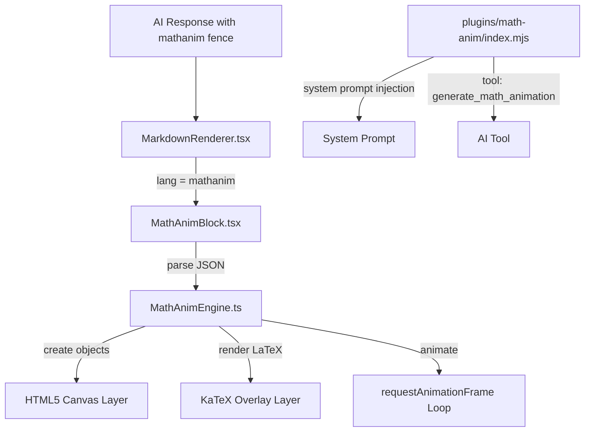
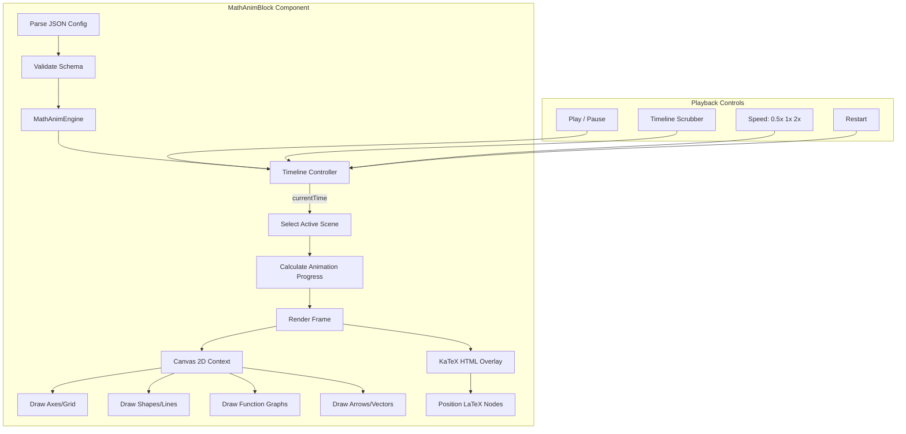

# Math Animation Plugin — Design Document

## Overview

A new plugin that enables the AI to produce **animated mathematical explanations** inline in chat responses. The AI outputs a declarative JSON DSL inside `` ```mathanim `` code fences. The UI renders these as interactive, animated mathematical visualizations using HTML5 Canvas + SVG + KaTeX — entirely client-side, no server dependency.

This follows the same pattern as the existing `chart` code fence → [`ChartBlock.tsx`](ui/src/components/chat/ChartBlock.tsx) and `html` code fence → [`HtmlSandbox.tsx`](ui/src/components/features/HtmlSandbox.tsx).

---

## Architecture



### Component Map

| Component | Location | Purpose |
|-----------|----------|---------|
| **Plugin backend** | `plugins/math-anim/index.mjs` | Registers tool, injects system prompt guidance |
| **Plugin manifest** | `plugins/math-anim/plugin.json` | Plugin metadata |
| **UI Block** | `ui/src/components/chat/MathAnimBlock.tsx` | React component that parses DSL and drives the animation engine |
| **Animation Engine** | `ui/src/components/chat/mathanim/MathAnimEngine.ts` | Core animation engine — scene graph, tweening, rendering |
| **Mobject Types** | `ui/src/components/chat/mathanim/mobjects.ts` | Mathematical objects: axes, graphs, vectors, shapes, text, LaTeX |
| **Animations** | `ui/src/components/chat/mathanim/animations.ts` | Animation types: FadeIn, Transform, Create, Write, etc. |
| **MarkdownRenderer patch** | `ui/src/components/chat/MarkdownRenderer.tsx` | Add `mathanim` code fence handler |
| **System Prompt update** | `src/core/system-prompt.mjs` | Add mathanim DSL schema documentation |

---

## DSL Schema — `mathanim` Code Fence

The AI outputs JSON inside a `` ```mathanim `` code fence. The schema is designed to be Manim-inspired but simplified for JSON serialization.

### Top-Level Structure

```json
{
  "title": "Pythagorean Theorem",
  "width": 600,
  "height": 400,
  "background": "#1a1a2e",
  "duration": 8,
  "scenes": [
    {
      "id": "scene1",
      "objects": [...],
      "animations": [...],
      "duration": 4
    }
  ]
}
```

### Mobject Types

Each object in the `objects` array has a `type` field:

#### `axes` — Coordinate Axes
```json
{
  "id": "myAxes",
  "type": "axes",
  "xRange": [-3, 3, 1],
  "yRange": [-2, 5, 1],
  "xLabel": "x",
  "yLabel": "y",
  "color": "#888888",
  "showGrid": true,
  "position": [300, 200]
}
```

#### `graph` — Function Graph (plotted on axes)
```json
{
  "id": "parabola",
  "type": "graph",
  "axesRef": "myAxes",
  "fn": "x^2",
  "xRange": [-3, 3],
  "color": "#4ecdc4",
  "strokeWidth": 2
}
```

#### `parametric` — Parametric Curve
```json
{
  "id": "circle",
  "type": "parametric",
  "axesRef": "myAxes",
  "fnX": "2*cos(t)",
  "fnY": "2*sin(t)",
  "tRange": [0, 6.283],
  "color": "#ff6b6b"
}
```

#### `vector` — Arrow/Vector
```json
{
  "id": "v1",
  "type": "vector",
  "from": [0, 0],
  "to": [3, 2],
  "color": "#ffd93d",
  "label": "v",
  "axesRef": "myAxes"
}
```

#### `dot` — Point
```json
{
  "id": "p1",
  "type": "dot",
  "position": [1, 1],
  "radius": 5,
  "color": "#ff6b6b",
  "label": "P",
  "axesRef": "myAxes"
}
```

#### `line` — Line Segment
```json
{
  "id": "line1",
  "type": "line",
  "from": [0, 0],
  "to": [3, 4],
  "color": "#4ecdc4",
  "strokeWidth": 2,
  "dashed": false
}
```

#### `rect` — Rectangle
```json
{
  "id": "square",
  "type": "rect",
  "position": [100, 100],
  "width": 80,
  "height": 80,
  "color": "#4ecdc4",
  "fill": "#4ecdc420",
  "label": "a^2"
}
```

#### `circle` — Circle
```json
{
  "id": "c1",
  "type": "circle",
  "center": [300, 200],
  "radius": 50,
  "color": "#ff6b6b",
  "fill": "none"
}
```

#### `polygon` — Polygon (triangle, etc.)
```json
{
  "id": "tri",
  "type": "polygon",
  "points": [[0, 0], [3, 0], [3, 4]],
  "color": "#4ecdc4",
  "fill": "#4ecdc420",
  "axesRef": "myAxes"
}
```

#### `latex` — LaTeX Expression
```json
{
  "id": "eq1",
  "type": "latex",
  "expression": "E = mc^2",
  "position": [300, 50],
  "fontSize": 24,
  "color": "#ffffff"
}
```

#### `text` — Plain Text
```json
{
  "id": "t1",
  "type": "text",
  "content": "Step 1: Define the function",
  "position": [300, 30],
  "fontSize": 16,
  "color": "#cccccc",
  "align": "center"
}
```

#### `brace` — Brace annotation
```json
{
  "id": "br1",
  "type": "brace",
  "from": [0, 0],
  "to": [3, 0],
  "label": "a",
  "direction": "down",
  "color": "#ffd93d"
}
```

#### `area` — Shaded area under a curve
```json
{
  "id": "area1",
  "type": "area",
  "graphRef": "parabola",
  "xRange": [0, 2],
  "fill": "#4ecdc420",
  "axesRef": "myAxes"
}
```

#### `numberLine` — Number Line
```json
{
  "id": "nl",
  "type": "numberLine",
  "range": [-5, 5, 1],
  "position": [300, 300],
  "length": 400,
  "color": "#888888",
  "highlights": [
    { "value": 2, "color": "#ff6b6b", "label": "x" }
  ]
}
```

### Animation Types

Each animation in the `animations` array references objects by ID and specifies timing:

```json
{
  "type": "<animation_type>",
  "target": "<object_id>",
  "startTime": 0,
  "duration": 1,
  "easing": "easeInOut",
  ...params
}
```

#### Available Animation Types

| Type | Description | Params |
|------|-------------|--------|
| `fadeIn` | Fade object from transparent to visible | — |
| `fadeOut` | Fade object to transparent | — |
| `create` | Draw object stroke progressively — like Manim Create | — |
| `write` | Animate LaTeX/text character by character | — |
| `transform` | Morph one object into another | `{ to: targetObjectId }` |
| `moveTo` | Animate position change | `{ position: [x, y] }` |
| `scale` | Animate scale change | `{ factor: 1.5 }` |
| `rotate` | Animate rotation | `{ angle: 3.14 }` |
| `traceGraph` | Animate graph drawing along its path | — |
| `growArrow` | Grow arrow/vector from origin to tip | — |
| `indicate` | Flash/pulse to draw attention | `{ color: '#ff0' }` |
| `circumscribe` | Draw a surrounding highlight shape | `{ shape: 'circle' or 'rect' }` |
| `showCreation` | Progressive stroke drawing | — |
| `uncreate` | Reverse of create | — |
| `shiftIn` | Slide in from off-screen | `{ direction: 'left'|'right'|'up'|'down' }` |
| `colorChange` | Animate color transition | `{ color: '#ff0000' }` |
| `traceDot` | Animate a dot along a path/graph | `{ graphRef: 'parabola', tRange: [0, 1] }` |

#### Easing Functions

`linear`, `easeIn`, `easeOut`, `easeInOut`, `easeInQuad`, `easeOutQuad`, `easeInOutQuad`, `easeInCubic`, `easeOutCubic`, `easeInOutCubic`, `easeInBack`, `easeOutBack`, `easeInOutBack`

### Full Example — Quadratic Function

```json
{
  "title": "The Parabola y = x^2",
  "width": 600,
  "height": 400,
  "background": "#0a0a1a",
  "scenes": [
    {
      "id": "intro",
      "duration": 6,
      "objects": [
        {
          "id": "axes",
          "type": "axes",
          "xRange": [-3, 3, 1],
          "yRange": [-1, 9, 1],
          "xLabel": "x",
          "yLabel": "y",
          "color": "#555",
          "showGrid": true
        },
        {
          "id": "parabola",
          "type": "graph",
          "axesRef": "axes",
          "fn": "x^2",
          "xRange": [-3, 3],
          "color": "#4ecdc4",
          "strokeWidth": 2.5
        },
        {
          "id": "equation",
          "type": "latex",
          "expression": "y = x^2",
          "position": [480, 50],
          "fontSize": 22,
          "color": "#4ecdc4"
        },
        {
          "id": "vertex",
          "type": "dot",
          "position": [0, 0],
          "radius": 6,
          "color": "#ffd93d",
          "label": "vertex",
          "axesRef": "axes"
        },
        {
          "id": "vertexLabel",
          "type": "latex",
          "expression": "vertex at (0, 0)",
          "position": [300, 370],
          "fontSize": 14,
          "color": "#ffd93d"
        }
      ],
      "animations": [
        { "type": "create", "target": "axes", "startTime": 0, "duration": 1.5, "easing": "easeInOut" },
        { "type": "traceGraph", "target": "parabola", "startTime": 1.5, "duration": 2, "easing": "easeInOut" },
        { "type": "write", "target": "equation", "startTime": 2, "duration": 1 },
        { "type": "fadeIn", "target": "vertex", "startTime": 3.5, "duration": 0.5 },
        { "type": "fadeIn", "target": "vertexLabel", "startTime": 4, "duration": 0.5 },
        { "type": "indicate", "target": "vertex", "startTime": 4.5, "duration": 1, "color": "#ff0" }
      ]
    }
  ]
}
```

---

## Implementation Plan

### Phase 1 — Backend Plugin (`plugins/math-anim/`)

**Files to create:**

1. **`plugins/math-anim/plugin.json`**
   ```json
   {
     "name": "math-anim",
     "version": "1.0.0",
     "description": "Animated mathematical explanations using a Manim-inspired DSL",
     "main": "index.mjs",
     "capabilities": { "tools": true }
   }
   ```

2. **`plugins/math-anim/index.mjs`**
   - Register `generate_math_animation` tool that:
     - Takes a `description` param (what to animate)
     - Uses `api.ai.ask()` to generate the `mathanim` JSON
     - Returns `{ __directMarkdown: '```mathanim\n...\n```' }`
   - Register settings: enabled, default duration, default theme
   - The AI can also output `mathanim` code fences directly without the tool

3. **`plugins/math-anim/package.json`**
   - Dependencies: none (pure DSL, rendering is UI-side)

### Phase 2 — UI Animation Engine (`ui/src/components/chat/mathanim/`)

**Files to create:**

4. **`ui/src/components/chat/mathanim/types.ts`**
   - TypeScript interfaces for the entire DSL schema
   - `MathAnimConfig`, `Scene`, `Mobject`, `Animation`, etc.

5. **`ui/src/components/chat/mathanim/easing.ts`**
   - All easing functions (linear, easeIn, easeOut, cubic, back, etc.)

6. **`ui/src/components/chat/mathanim/math-parser.ts`**
   - Lightweight safe math expression evaluator for `fn` fields
   - Supports: `x^2`, `sin(x)`, `cos(t)`, `sqrt(x)`, `abs(x)`, `log(x)`, `exp(x)`, `pi`, `e`
   - No `eval()` — uses a simple recursive descent parser

7. **`ui/src/components/chat/mathanim/mobjects.ts`**
   - Renderers for each mobject type
   - Each renderer takes a Canvas 2D context + mobject config → draws it
   - Axes renderer handles coordinate mapping (math coords → pixel coords)
   - Graph renderer evaluates `fn` string and plots points

8. **`ui/src/components/chat/mathanim/animations.ts`**
   - Animation controllers: given an animation config + progress `t` in [0,1], apply visual state
   - `fadeIn` → opacity interpolation
   - `create` → clip path / stroke dasharray progression
   - `traceGraph` → progressive path rendering
   - `write` → character reveal
   - `transform` → interpolate between two mobject states
   - etc.

9. **`ui/src/components/chat/mathanim/MathAnimEngine.ts`**
   - Core engine class:
     - Parses the JSON config
     - Builds scene graph (ordered layers of mobjects)
     - Runs `requestAnimationFrame` loop
     - Manages timeline: current time, play/pause, seek
     - For each frame: determine which animations are active, compute progress, render all objects

10. **`ui/src/components/chat/MathAnimBlock.tsx`**
    - React component wrapping the engine
    - Renders a `<canvas>` element with KaTeX overlays
    - Playback controls: play/pause, scrub bar, speed selector, restart
    - Error boundary for malformed JSON
    - Container chrome matching the existing chart/code block styling

### Phase 3 — Integration

11. **Patch [`MarkdownRenderer.tsx`](ui/src/components/chat/MarkdownRenderer.tsx:92)**
    - Add `mathanim` to the code fence dispatch:
    ```tsx
    if (lang === 'mathanim') {
      return <MathAnimBlock code={codeString} />;
    }
    ```

12. **Patch [`system-prompt.mjs`](src/core/system-prompt.mjs:82)**
    - Add `mathanim` DSL documentation to the Math & Data Visualization section
    - Provide the schema and a concise example so the AI knows how to produce it

---

## Rendering Architecture



### Layered Rendering Strategy

1. **Canvas layer** (bottom): Draws all geometric primitives — axes, lines, shapes, graphs, arrows
2. **KaTeX overlay** (top): Absolutely-positioned `<div>` elements rendered by KaTeX for LaTeX expressions, positioned over the canvas

This two-layer approach avoids rendering LaTeX to canvas (which is hard and ugly). KaTeX elements are positioned using the same coordinate system as the canvas.

### Animation Timeline

- Global time tracked in seconds
- Each scene has a start time (cumulative) and a duration
- Each animation within a scene has `startTime` (relative to scene start) and `duration`
- Progress `t` for each animation = `clamp((currentTime - animStart) / animDuration, 0, 1)`
- Apply easing to `t` before using it

---

## Math Expression Parser

For `graph.fn` fields like `"x^2"`, `"sin(x) + 1"`, etc., we need a safe evaluator:

- **No `eval()`** — security risk in a chat UI
- Simple recursive descent parser supporting:
  - Operators: `+`, `-`, `*`, `/`, `^`
  - Functions: `sin`, `cos`, `tan`, `sqrt`, `abs`, `log`, `ln`, `exp`, `floor`, `ceil`
  - Constants: `pi`, `e`
  - Variables: `x`, `t` (passed in at evaluation time)
  - Parentheses for grouping
  - Implicit multiplication: `2x` → `2*x`

---

## UI Component Design

The `MathAnimBlock` renders with this visual structure:

```
┌──────────────────────────────────────────────┐
│ ▪▪▪  Math Animation    ▶ title               │  ← Header bar
├──────────────────────────────────────────────┤
│                                              │
│            [Canvas + KaTeX overlay]          │  ← Animation viewport
│                                              │
├──────────────────────────────────────────────┤
│  ▶ ‖  ───────●──────────────  0:03 / 0:08   │  ← Playback controls
│                                    0.5x 1x 2x│
└──────────────────────────────────────────────┘
```

Styling matches the existing code block / chart block aesthetic from the app:
- Dark background (`#0a0a0a`)
- Zinc border (`border-zinc-800/30`)
- Rounded corners (`rounded-xl`)
- Subtle shadow

---

## System Prompt Addition

The following will be appended to the `Math & Data Visualization` section in [`system-prompt.mjs`](src/core/system-prompt.mjs:82):

```
3. Math Animations: To display an animated mathematical explanation, output a code block with language `mathanim`.
   - Use this for: function graphs, geometric proofs, vector operations, calculus concepts, transformations
   - Schema: JSON with scenes containing objects and timed animations
   - Object types: axes, graph, parametric, vector, dot, line, rect, circle, polygon, latex, text, brace, area, numberLine
   - Animation types: fadeIn, fadeOut, create, write, traceGraph, growArrow, moveTo, scale, rotate, indicate, circumscribe, traceDot, colorChange, shiftIn
   - Keep scenes focused — one concept per scene, 3-8 seconds each
   - Use coordinate axes for mathematical plots; use pixel positions for standalone shapes/labels
```

---

## Files Changed Summary

| Action | File | Description |
|--------|------|-------------|
| **CREATE** | `plugins/math-anim/plugin.json` | Plugin manifest |
| **CREATE** | `plugins/math-anim/package.json` | NPM metadata |
| **CREATE** | `plugins/math-anim/index.mjs` | Plugin activation — tool registration |
| **CREATE** | `ui/src/components/chat/mathanim/types.ts` | TypeScript interfaces for DSL |
| **CREATE** | `ui/src/components/chat/mathanim/easing.ts` | Easing functions |
| **CREATE** | `ui/src/components/chat/mathanim/math-parser.ts` | Safe math expression evaluator |
| **CREATE** | `ui/src/components/chat/mathanim/mobjects.ts` | Mobject renderers |
| **CREATE** | `ui/src/components/chat/mathanim/animations.ts` | Animation controllers |
| **CREATE** | `ui/src/components/chat/mathanim/MathAnimEngine.ts` | Core engine |
| **CREATE** | `ui/src/components/chat/MathAnimBlock.tsx` | React wrapper component |
| **MODIFY** | `ui/src/components/chat/MarkdownRenderer.tsx` | Add `mathanim` fence dispatch |
| **MODIFY** | `src/core/system-prompt.mjs` | Add DSL schema documentation |

No new npm dependencies required — uses existing `katex` and native Canvas API.

---

## Testing Strategy

1. **Unit test the math parser** with various expressions
2. **Render a static scene** (no animations) to verify coordinate mapping
3. **Animate a simple scene** — axes + graph trace — to verify timeline
4. **End-to-end**: Have the AI produce a `mathanim` fence and verify it renders
5. **Error handling**: Malformed JSON shows a graceful error instead of crashing
