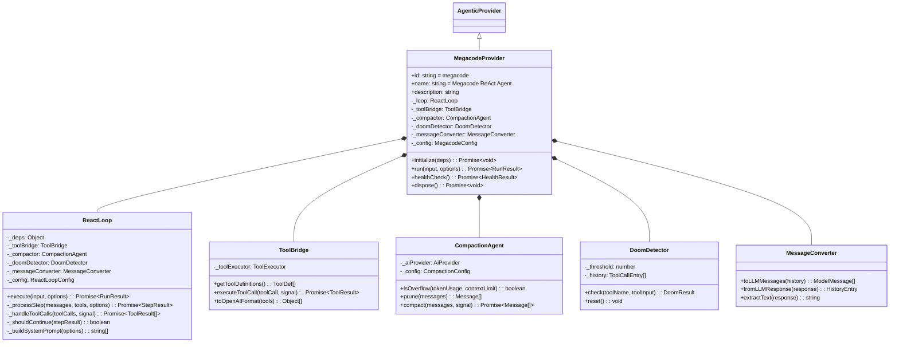
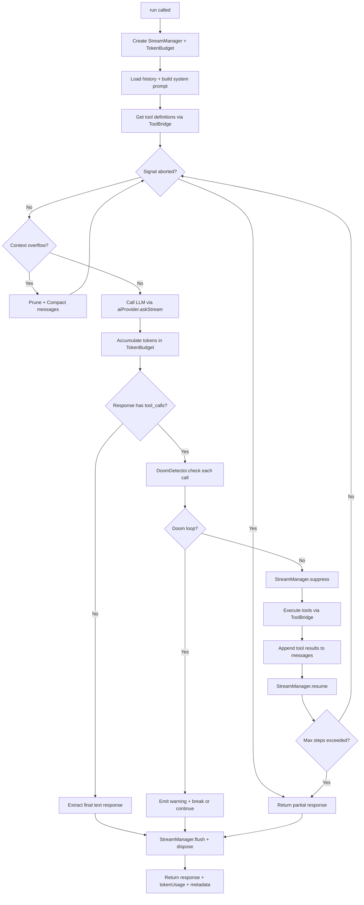
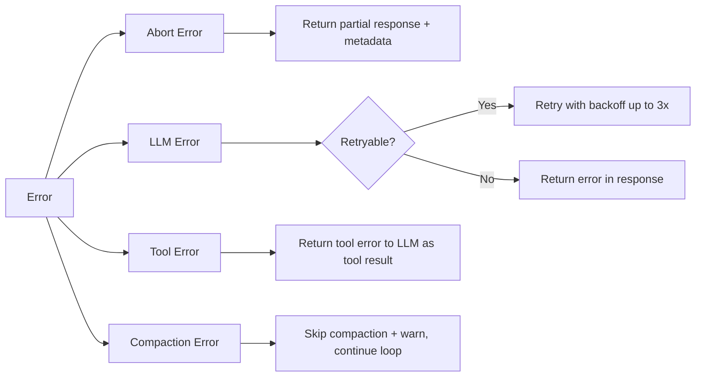

# Megacode Provider Design Document

## Overview

This document specifies the architecture for a **MegacodeProvider** — a new agentic provider in ai-man that ports the core ReAct agent loop from the megacode project into ai-man's [`AgenticProvider`](src/core/agentic/base-provider.mjs:12) system.

The megacode project implements a sophisticated multi-step agent loop using the Vercel AI SDK's `streamText()` with tool execution, context compaction, doom loop detection, and multi-agent spawning. This design translates those capabilities into ai-man's provider architecture, reusing ai-man's existing infrastructure ([`StreamManager`](src/core/agentic/stream-manager.mjs:24), [`TokenBudget`](src/core/agentic/token-budget.mjs:8), [`RequestDeduplicator`](src/core/agentic/request-deduplicator.mjs:14), `deps.aiProvider`, `deps.toolExecutor`) rather than importing megacode's dependencies directly.

---

## 1. File Structure

```
src/core/agentic/megacode/
├── index.mjs                    # Barrel export
├── megacode-provider.mjs        # Main MegacodeProvider class (extends AgenticProvider)
├── react-loop.mjs               # ReAct loop engine (while-true loop)
├── tool-bridge.mjs              # Maps ai-man ToolExecutor → LLM tool_call format
├── compaction-agent.mjs          # Context compaction via summarization
├── doom-detector.mjs             # Doom loop detection (identical tool calls)
├── message-converter.mjs         # Converts between ai-man history and LLM messages
├── system-prompt.mjs             # System prompt assembly
└── __tests__/
    ├── react-loop.test.mjs
    ├── tool-bridge.test.mjs
    ├── doom-detector.test.mjs
    └── compaction-agent.test.mjs
```

Update [`src/core/agentic/index.mjs`](src/core/agentic/index.mjs:1) to add:
```js
export { MegacodeProvider } from './megacode/index.mjs';
```

---

## 2. Concept Mapping: Megacode → ai-man

| Megacode Concept | ai-man Equivalent | Notes |
|---|---|---|
| [`SessionPrompt.loop()`](megacode: src/session/prompt.ts:286) | [`MegacodeProvider.run()`](src/core/agentic/megacode/megacode-provider.mjs) → `ReactLoop.execute()` | The outer while-true loop |
| [`SessionProcessor.create().process()`](megacode: src/session/processor.ts:47) | `ReactLoop._processStep()` | Single LLM call + stream processing |
| [`LLM.stream()`](megacode: src/session/llm.ts:53) via Vercel AI SDK `streamText()` | `deps.aiProvider.askStream()` | LLM streaming via ai-man's provider |
| [`ToolRegistry.tools()`](megacode: src/tool/registry.ts:126) | `deps.toolExecutor.getAllToolDefinitions()` / `executeTool()` | Tool resolution and execution |
| [`Tool.Context`](megacode: src/tool/tool.ts:16) | `deps.toolExecutor.executeTool(toolCall, options)` | Tool execution context |
| [`SessionCompaction.process()`](megacode: src/session/compaction.ts:101) | `CompactionAgent.compact()` | Context window management |
| [`SessionCompaction.isOverflow()`](megacode: src/session/compaction.ts:32) | `CompactionAgent.isOverflow()` | Context limit detection |
| [`SessionCompaction.prune()`](megacode: src/session/compaction.ts:58) | `CompactionAgent.prune()` | Old tool output pruning |
| Doom loop detection (processor.ts L154-178) | `DoomDetector.check()` | 3x identical tool call detection |
| [`MessageV2.toModelMessages()`](megacode: src/session/message-v2.ts) | `MessageConverter.toLLMMessages()` | History → LLM message format |
| `Agent.Info` agent definitions | Provider configuration options | Agent prompts, permissions, tools |
| `AbortController` / `AbortSignal` | `options.signal` | Cancellation propagation |
| Token tracking via `Session.getUsage()` | [`TokenBudget`](src/core/agentic/token-budget.mjs:8) | Accumulated token usage |
| Streaming via `fullStream` async iterator | [`StreamManager`](src/core/agentic/stream-manager.mjs:24) | Stream lifecycle management |

---

## 3. Class Design

### 3.1 MegacodeProvider



### 3.2 MegacodeProvider — File: `megacode-provider.mjs`

```js
import { AgenticProvider } from '../base-provider.mjs';
import { ReactLoop } from './react-loop.mjs';
import { ToolBridge } from './tool-bridge.mjs';
import { CompactionAgent } from './compaction-agent.mjs';
import { DoomDetector } from './doom-detector.mjs';
import { MessageConverter } from './message-converter.mjs';

export class MegacodeProvider extends AgenticProvider {
    get id()          { return 'megacode'; }
    get name()        { return 'Megacode ReAct Agent'; }
    get description() { return 'Multi-step ReAct agent loop with tool execution, context compaction, and doom loop detection. Ported from the megacode project.'; }

    async initialize(deps) {
        await super.initialize(deps);
        this._config = deps.megacodeConfig || {};
        this._toolBridge = new ToolBridge(deps.toolExecutor);
        this._compactor = new CompactionAgent(deps.aiProvider, this._config.compaction);
        this._doomDetector = new DoomDetector(this._config.doomLoopThreshold || 3);
        this._messageConverter = new MessageConverter();
        this._loop = new ReactLoop({
            deps,
            toolBridge: this._toolBridge,
            compactor: this._compactor,
            doomDetector: this._doomDetector,
            messageConverter: this._messageConverter,
            config: this._config,
        });
    }

    async run(input, options = {}) {
        if (!this._loop || !this._deps) {
            throw new Error('MegacodeProvider not initialized');
        }
        return this._deduplicatedRun(input, options, () =>
            this._loop.execute(input, options)
        );
    }

    async healthCheck() {
        const base = await super.healthCheck();
        if (!base.healthy) return base;
        if (!this._loop) return { healthy: false, reason: 'ReactLoop not created' };
        return { healthy: true };
    }

    async dispose() {
        this._loop = null;
        this._toolBridge = null;
        this._compactor = null;
        this._doomDetector = null;
        this._messageConverter = null;
        await super.dispose();
    }
}
```

---

## 4. Core Module Specifications

### 4.1 ReactLoop — `react-loop.mjs`

The heart of the provider. Implements the megacode-style `while(true)` loop that alternates between LLM calls and tool execution.

#### Method: `execute(input, options)`

**Signature:**
```js
async execute(input, options = {})
  → { response: string, streamed?: boolean, tokenUsage?: Object, metadata?: Object }
```

**Parameters:**
- `input` — user message string
- `options.signal` — `AbortSignal` for cancellation
- `options.stream` — boolean, enable streaming
- `options.onChunk` — callback for streaming chunks
- `options.onToken` — callback for streaming tokens
- `options.model` — model override

**Algorithm — The ReAct Loop:**

```
1. Create StreamManager from options
2. Create TokenBudget for this run
3. Reset DoomDetector
4. Get conversation history from deps.historyManager
5. Convert history to LLM message format via MessageConverter
6. Build system prompt via _buildSystemPrompt()
7. Get available tools via ToolBridge.getToolDefinitions()

8. LOOP:
   a. Check signal.aborted → break if true
   b. Check compaction needed via CompactionAgent.isOverflow()
      → If overflow: prune old tool outputs, then compact via LLM summarization
      → Replace messages with compacted version, continue loop
   c. Call LLM via deps.aiProvider.askStream() with:
      - system prompt
      - conversation messages
      - tool definitions
      - model override
      - StreamManager callbacks (suppressed during tool execution)
   d. Accumulate token usage into TokenBudget
   e. Parse LLM response:
      - If response contains tool_calls:
        i.   For each tool call: check DoomDetector.check()
             → If doom detected: emit warning, optionally break
        ii.  StreamManager.suppress() (hide tool JSON from user)
        iii. Execute tools via ToolBridge.executeToolCall()
        iv.  Append tool results to messages
        v.   StreamManager.resume()
        vi.  Continue loop (next LLM call with tool results)
      - If response is text-only (no tool calls):
        i.   Extract final text
        ii.  Break loop
   f. Check step count against maxSteps → break if exceeded

9. StreamManager.flush() and dispose()
10. Return { response, streamed, tokenUsage: tokenBudget.toJSON(), metadata }
```

**Flow Diagram:**



#### LLM Integration Detail

The provider uses `deps.aiProvider` rather than Vercel AI SDK directly. The key bridge point:

```js
// In ReactLoop._processStep():
const llmOptions = {
    model: options.model,
    tools: this._toolBridge.toOpenAIFormat(toolDefs),
    ...streamManager.getCallbacks(),  // { onToken, onChunk }
    signal: options.signal,
};
const response = await this._deps.aiProvider.askStream(messages, llmOptions);
```

The `askStream()` method on ai-man's aiProvider already handles:
- Provider selection (Gemini, OpenAI, Anthropic, LMStudio, etc.)
- Streaming protocol differences
- Authentication
- Rate limiting

What the ReactLoop adds on top:
- Multi-step orchestration (call → tools → call → tools → ...)
- Context management (compaction, pruning)
- Safety (doom detection, abort propagation)
- Token tracking across steps

### 4.2 ToolBridge — `tool-bridge.mjs`

Bridges ai-man's [`ToolExecutor`](src/execution/tool-executor.mjs:144) to the format expected by LLM tool calling.

```js
export class ToolBridge {
    constructor(toolExecutor) {
        this._toolExecutor = toolExecutor;
    }

    /**
     * Get all available tool definitions in OpenAI function-calling format.
     * Reads from ToolExecutor.getAllToolDefinitions().
     * @returns {Array<{type: string, function: {name, description, parameters}}>}
     */
    getToolDefinitions() {
        return this._toolExecutor.getAllToolDefinitions();
    }

    /**
     * Convert tool definitions to the format expected by aiProvider.askStream().
     * ai-man's aiProvider expects OpenAI-style tool definitions.
     * @param {Array} toolDefs
     * @returns {Array}
     */
    toOpenAIFormat(toolDefs) {
        return toolDefs; // Already in OpenAI format from ToolExecutor
    }

    /**
     * Execute a tool call returned by the LLM.
     * Translates from LLM tool_call format to ToolExecutor.executeTool() format.
     *
     * @param {Object} toolCall — { id, function: { name, arguments } }
     * @param {AbortSignal} signal
     * @returns {Promise<{role: 'tool', tool_call_id, name, content}>}
     */
    async executeToolCall(toolCall, signal) {
        return this._toolExecutor.executeTool(toolCall, { signal });
    }
}
```

**Key design decision:** ai-man's [`ToolExecutor.executeTool()`](src/execution/tool-executor.mjs:641) already accepts OpenAI-style tool calls (`{ id, function: { name, arguments } }`) and returns `{ role: 'tool', tool_call_id, name, content }`. This means the ToolBridge is a thin wrapper — the heavy lifting of tool resolution, security checks, MCP dispatch, and plugin dispatch is all handled by ToolExecutor. No need to re-implement megacode's tool system.

**What we port vs. what we reuse:**
- **Reuse entirely:** Tool definitions, tool execution, security checks, MCP tools, plugin tools
- **Port the concept:** The multi-step tool loop (LLM → tool → LLM → tool) orchestration

### 4.3 CompactionAgent — `compaction-agent.mjs`

Implements context window management, ported from megacode's [`SessionCompaction`](megacode: src/session/compaction.ts).

```js
export class CompactionAgent {
    /**
     * @param {Object} aiProvider — deps.aiProvider for LLM summarization calls
     * @param {Object} config
     * @param {number} [config.contextLimit=128000] — max tokens before compaction
     * @param {number} [config.reservedTokens=20000] — tokens reserved for output
     * @param {number} [config.pruneProtectTokens=40000] — tokens of recent context to protect
     * @param {number} [config.pruneMinimumTokens=20000] — minimum tokens to prune
     */
    constructor(aiProvider, config = {}) { ... }

    /**
     * Check if context window is overflowing.
     * Mirrors megacode's SessionCompaction.isOverflow().
     *
     * @param {Object} tokenUsage — { prompt_tokens, completion_tokens, total_tokens }
     * @param {number} [contextLimit] — override for model context limit
     * @returns {boolean}
     */
    isOverflow(tokenUsage, contextLimit) {
        const limit = contextLimit || this._config.contextLimit;
        const usable = limit - this._config.reservedTokens;
        const count = tokenUsage.total_tokens || tokenUsage.prompt_tokens + tokenUsage.completion_tokens;
        return count >= usable;
    }

    /**
     * Prune old tool outputs from messages to reclaim context space.
     * Mirrors megacode's SessionCompaction.prune():
     * - Walk backward through messages
     * - Skip the most recent 40k tokens of tool outputs (protect zone)
     * - Truncate older tool outputs to "[output pruned]"
     *
     * @param {Array} messages — conversation messages
     * @returns {Array} — messages with old tool outputs pruned
     */
    prune(messages) { ... }

    /**
     * Compact conversation via LLM summarization.
     * Mirrors megacode's SessionCompaction.process():
     * - Sends full conversation to a compaction LLM call
     * - Receives a structured summary
     * - Replaces old messages with the summary
     *
     * @param {Array} messages — full conversation messages
     * @param {AbortSignal} signal
     * @returns {Promise<Array>} — compacted message array
     */
    async compact(messages, signal) {
        const compactionPrompt = `Provide a detailed prompt for continuing our conversation above.
Focus on information that would be helpful for continuing the conversation, including what we did, what we're doing, which files we're working on, and what we're going to do next.

When constructing the summary, stick to this template:
---
## Goal
[What goals is the user trying to accomplish?]

## Instructions
- [What important instructions did the user give]
- [If there is a plan or spec, include information about it]

## Discoveries
[What notable things were learned during this conversation]

## Accomplished
[What work has been completed, in progress, or left?]

## Relevant files / directories
[List of relevant files that have been read, edited, or created]
---`;

        const compactionMessages = [
            ...messages,
            { role: 'user', content: compactionPrompt }
        ];

        const response = await this._aiProvider.ask(compactionMessages, {
            signal,
            // Use a lightweight model call — no tools needed
        });

        // Replace all messages with the summary as a system message
        return [
            { role: 'system', content: '[Previous conversation summary]\n\n' + response }
        ];
    }
}
```

**Compaction strategy (ported from megacode):**
1. **Pruning first:** Walk backward through tool outputs. Protect the most recent ~40k tokens. Truncate everything older. This is cheap (no LLM call).
2. **Summarization if still over limit:** Send full conversation to LLM with compaction prompt. Replace history with the summary.
3. **Continue loop:** After compaction, the ReAct loop continues with reduced context.

### 4.4 DoomDetector — `doom-detector.mjs`

Detects when the LLM is stuck in a doom loop — calling the same tool with identical arguments repeatedly.

```js
export class DoomDetector {
    /**
     * @param {number} [threshold=3] — number of identical calls before doom
     */
    constructor(threshold = 3) {
        this._threshold = threshold;
        this._history = []; // Array of { toolName, inputHash }
    }

    /**
     * Check if this tool call constitutes a doom loop.
     * Mirrors megacode's processor.ts L154-178.
     *
     * @param {string} toolName
     * @param {Object} toolInput
     * @returns {{ isDoom: boolean, count: number, toolName?: string }}
     */
    check(toolName, toolInput) {
        const inputHash = JSON.stringify(toolInput);
        this._history.push({ toolName, inputHash });

        // Check last N entries
        const lastN = this._history.slice(-this._threshold);
        if (lastN.length < this._threshold) {
            return { isDoom: false, count: 1 };
        }

        const allSame = lastN.every(
            entry => entry.toolName === toolName && entry.inputHash === inputHash
        );

        if (allSame) {
            return { isDoom: true, count: this._threshold, toolName };
        }

        return { isDoom: false, count: 1 };
    }

    /** Reset history (call at start of each run). */
    reset() {
        this._history = [];
    }
}
```

**Doom loop behavior options (configurable):**
- `'warn'` — Log warning, inject a system message telling the LLM to try a different approach, continue
- `'break'` — Stop the loop, return current response with doom loop metadata
- `'ask'` — (future) Pause and ask the user whether to continue

Default: `'warn'` — matches megacode's behavior of asking permission then continuing.

### 4.5 MessageConverter — `message-converter.mjs`

Converts between ai-man's history format (from `deps.historyManager`) and the OpenAI-style message arrays expected by `deps.aiProvider`.

```js
export class MessageConverter {
    /**
     * Convert ai-man conversation history to LLM message format.
     *
     * ai-man's historyManager stores messages as:
     *   { role: 'user'|'assistant'|'system', content: string, ... }
     *
     * The LLM expects OpenAI-format messages:
     *   { role: 'system'|'user'|'assistant'|'tool', content: string, tool_calls?: [...], tool_call_id?: string }
     *
     * @param {Array} history — from historyManager.getHistory()
     * @returns {Array} — OpenAI-format messages
     */
    toLLMMessages(history) { ... }

    /**
     * Extract the final text response from an LLM response.
     * Handles both streaming and non-streaming responses.
     *
     * @param {Object} response — LLM response
     * @returns {string}
     */
    extractText(response) { ... }

    /**
     * Estimate token count for a message array.
     * Uses rough heuristic: ~4 chars per token.
     *
     * @param {Array} messages
     * @returns {number}
     */
    estimateTokens(messages) {
        let chars = 0;
        for (const msg of messages) {
            chars += typeof msg.content === 'string' ? msg.content.length : JSON.stringify(msg.content).length;
        }
        return Math.ceil(chars / 4);
    }
}
```

### 4.6 System Prompt Assembly — `system-prompt.mjs`

Assembles the system prompt following megacode's layered approach.

```js
export function buildSystemPrompt(options = {}) {
    const parts = [];

    // 1. Core identity / soul prompt (if configured)
    if (options.soulPrompt) {
        parts.push(options.soulPrompt);
    }

    // 2. Agent-specific prompt (code, plan, debug, orchestrator, ask)
    if (options.agentPrompt) {
        parts.push(options.agentPrompt);
    }

    // 3. Environment context
    parts.push(buildEnvironmentContext(options));

    // 4. Custom instructions (from workspace config)
    if (options.customInstructions) {
        parts.push(options.customInstructions);
    }

    return parts.filter(Boolean);
}

function buildEnvironmentContext(options) {
    const lines = [];
    if (options.workingDir) {
        lines.push(`Working directory: ${options.workingDir}`);
    }
    lines.push(`Platform: ${process.platform}`);
    lines.push(`Current time: ${new Date().toISOString()}`);
    return lines.join('\n');
}
```

---

## 5. Configuration

The provider accepts configuration via `deps.megacodeConfig` during `initialize()`:

```js
const megacodeConfig = {
    // ReAct loop settings
    maxSteps: 50,              // Maximum LLM call steps per run (default: 50)
    maxToolCallsPerStep: 10,    // Maximum parallel tool calls per LLM response

    // Compaction settings
    compaction: {
        contextLimit: 128000,     // Token limit before compaction triggers
        reservedTokens: 20000,    // Tokens reserved for output generation
        pruneProtectTokens: 40000, // Recent tool outputs to protect from pruning
        pruneMinimumTokens: 20000, // Minimum tokens to actually prune
        auto: true,                // Enable automatic compaction (default: true)
    },

    // Doom loop detection
    doomLoopThreshold: 3,        // Identical calls before doom detection (default: 3)
    doomLoopAction: 'warn',      // 'warn' | 'break' | 'ask'

    // Agent persona
    agentPrompt: null,           // Custom agent system prompt
    soulPrompt: null,            // Core identity prompt

    // LLM parameters
    temperature: undefined,       // Temperature override (default: model default)
    topP: undefined,              // Top-P override
};
```

---

## 6. What Is Ported vs. What Uses ai-man Infrastructure

### Ported from Megacode (reimplemented in JS/ESM)
| Feature | Source | Target |
|---|---|---|
| ReAct while-true loop | `SessionPrompt.loop()` | `ReactLoop.execute()` |
| Step processing with stream parsing | `SessionProcessor.process()` | `ReactLoop._processStep()` |
| Doom loop detection | processor.ts L154-178 | `DoomDetector` |
| Context overflow detection | `SessionCompaction.isOverflow()` | `CompactionAgent.isOverflow()` |
| Context pruning strategy | `SessionCompaction.prune()` | `CompactionAgent.prune()` |
| Compaction via LLM summarization | `SessionCompaction.process()` | `CompactionAgent.compact()` |
| Compaction prompt template | compaction.ts L151-177 | `CompactionAgent` embedded constant |
| Multi-agent prompt assembly | `SystemPrompt.provider()` + agent prompts | `system-prompt.mjs` |

### Uses ai-man Infrastructure (NOT ported)
| Feature | ai-man Component | Why |
|---|---|---|
| LLM calls | `deps.aiProvider.ask()` / `askStream()` | Already supports 20+ providers |
| Tool definitions | `deps.toolExecutor.getAllToolDefinitions()` | Already has 40+ tools |
| Tool execution | `deps.toolExecutor.executeTool()` | Security, MCP, plugins already handled |
| Conversation history | `deps.historyManager` | Persistence layer already exists |
| Streaming lifecycle | `StreamManager` | Suppress/resume, buffering, abort |
| Token accumulation | `TokenBudget` | Cross-step token tracking |
| Request deduplication | `RequestDeduplicator` via `_deduplicatedRun()` | Inherited from base class |
| Event emission | `deps.eventBus` | Status updates to UI |
| Workspace management | `deps.workingDir` | Already resolved |
| Provider hot-swap | `AgenticProviderRegistry` | Registry handles lifecycle |

### NOT Ported (out of scope)
| Megacode Feature | Reason |
|---|---|
| Vercel AI SDK `streamText()` | Replaced by ai-man's `aiProvider.askStream()` |
| SQLite message persistence | ai-man uses `historyManager` instead |
| BusEvent pub/sub | ai-man uses `eventBus` instead |
| Snapshot / git tracking | Not part of the agent loop core |
| Permission system (`PermissionNext`) | ai-man has its own confirmation system |
| Plugin hooks (`Plugin.trigger`) | ai-man has its own plugin system |
| `ProviderTransform` (message format transforms) | Handled by ai-man's aiProvider |
| Kilocode-specific telemetry | Not applicable |
| Session title generation | Not part of the agent loop core |

---

## 7. Error Handling Strategy

### Error Categories



**Abort errors:** When `signal.aborted`, the loop breaks immediately. Any accumulated response text is returned with `metadata.aborted: true`.

**LLM errors:** Following megacode's `SessionRetry` pattern:
- Rate limit errors → retry with exponential backoff (up to 3 attempts)
- Context length errors → trigger immediate compaction, retry
- Auth errors → fail immediately with clear message
- Network errors → retry once after 1s delay

**Tool execution errors:** Tool errors are NOT fatal to the loop. Following megacode's pattern, tool errors are returned to the LLM as a tool result with the error message, letting the LLM decide how to proceed (retry, try a different approach, or report the error).

**Compaction errors:** If the compaction LLM call fails, skip compaction and continue with a warning. The loop may fail on the next step due to context overflow, which will be caught as an LLM error.

---

## 8. Complete Flow: `run()` to Response

```
1. User calls MegacodeProvider.run("Fix the bug in auth.mjs", { signal, onChunk })

2. _deduplicatedRun() wraps the call for dedup (streaming calls bypass dedup)

3. ReactLoop.execute():
   a. StreamManager created with { onChunk, signal }
   b. TokenBudget created (fresh)
   c. DoomDetector.reset()

   d. Load history: deps.historyManager.getHistory()
      → [{role:'user',content:'...'}, {role:'assistant',content:'...'}, ...]

   e. MessageConverter.toLLMMessages(history)
      → OpenAI format messages

   f. Add current user message: messages.push({role:'user', content:'Fix the bug in auth.mjs'})

   g. Save to history: deps.historyManager.addMessage('user', input)

   h. Build system prompt: ['You are a coding assistant...', 'Working dir: /project']

   i. Get tools: toolBridge.getToolDefinitions()
      → [{type:'function', function:{name:'read_file', ...}}, ...]

4. LOOP ITERATION 1:
   a. Signal not aborted ✓
   b. Compaction not needed (tokens < limit) ✓
   c. LLM call: deps.aiProvider.askStream(systemPrompt + messages, { tools, onToken, onChunk })
   d. TokenBudget.add(response.usage)
   e. Response: { text: "I'll read the auth file first.", tool_calls: [{name:'read_file', args:{path:'src/auth.mjs'}}] }
   f. StreamManager.suppress() — hide tool execution from stream
   g. DoomDetector.check('read_file', {path:'src/auth.mjs'}) → not doom
   h. ToolBridge.executeToolCall({name:'read_file', ...}) → "const auth = ..."
   i. Append tool result to messages
   j. StreamManager.resume()
   k. Continue loop

5. LOOP ITERATION 2:
   a-b. Same checks
   c. LLM call with tool result in context
   d. TokenBudget.add(response.usage)
   e. Response: { text: "I found the bug. I'll fix it.", tool_calls: [{name:'edit_file', args:{...}}] }
   f-j. Execute edit_file tool, append result
   k. Continue loop

6. LOOP ITERATION 3:
   a-b. Same checks
   c. LLM call
   d. TokenBudget.add(response.usage)
   e. Response: { text: "I've fixed the bug in auth.mjs. The issue was..." } — NO tool_calls
   f. Extract final text
   g. Break loop

7. StreamManager.flush() + dispose()

8. Save to history: deps.historyManager.addMessage('assistant', responseText)

9. Return:
   {
     response: "I've fixed the bug in auth.mjs. The issue was...",
     streamed: true,
     tokenUsage: { prompt_tokens: 15420, completion_tokens: 892, total_tokens: 16312, call_count: 3 },
     metadata: { steps: 3, toolCalls: 2, compacted: false, doomDetected: false }
   }
```

---

## 9. Integration Points

### 9.1 Registration

In the application bootstrap (likely [`src/main.mjs`](src/main.mjs) or the facade initializer):

```js
import { MegacodeProvider } from './core/agentic/megacode/index.mjs';

// Register alongside existing providers
registry.register(new MegacodeProvider());

// Activate (replaces current provider)
await registry.setActive('megacode', deps);
```

### 9.2 Configuration via Settings

The megacode provider configuration can be passed through `deps.megacodeConfig` during initialization. This can be sourced from:
- User settings file (`.ai-man/config.json`)
- Workspace-level override (`.ai-man/megacode.json`)
- Runtime API

### 9.3 Event Bus Integration

The provider emits events via `deps.eventBus` for UI updates:

```js
// During loop execution:
deps.eventBus.emitTyped('agentic:step-start', { step, toolName });
deps.eventBus.emitTyped('agentic:step-end', { step, result });
deps.eventBus.emitTyped('agentic:compaction', { reason, tokensBefore, tokensAfter });
deps.eventBus.emitTyped('agentic:doom-detected', { toolName, count });
deps.eventBus.emitTyped('agentic:megacode-metadata', { steps, toolCalls, ... });
```

---

## 10. Testing Strategy

Each module is designed for independent unit testing:

| Module | Test Focus |
|---|---|
| `ReactLoop` | Loop termination conditions, step counting, abort handling |
| `ToolBridge` | Format conversion, error propagation |
| `DoomDetector` | Threshold detection, different tools, reset |
| `CompactionAgent` | Overflow detection, pruning logic, prompt construction |
| `MessageConverter` | History ↔ LLM format roundtrip |
| `MegacodeProvider` | Integration: initialize → run → dispose lifecycle |

Mock dependencies:
- `aiProvider` — returns canned responses with/without tool_calls
- `toolExecutor` — returns canned tool results
- `historyManager` — in-memory history
- `eventBus` — event capture for assertions

---

## 11. Migration Path

1. **Phase 1:** Implement core modules (`react-loop.mjs`, `tool-bridge.mjs`, `doom-detector.mjs`)
2. **Phase 2:** Implement `compaction-agent.mjs` and `message-converter.mjs`
3. **Phase 3:** Implement `megacode-provider.mjs` and register in the provider system
4. **Phase 4:** Add unit tests for each module
5. **Phase 5:** Integration testing with real LLM calls
6. **Phase 6:** Performance tuning (streaming latency, compaction thresholds)
