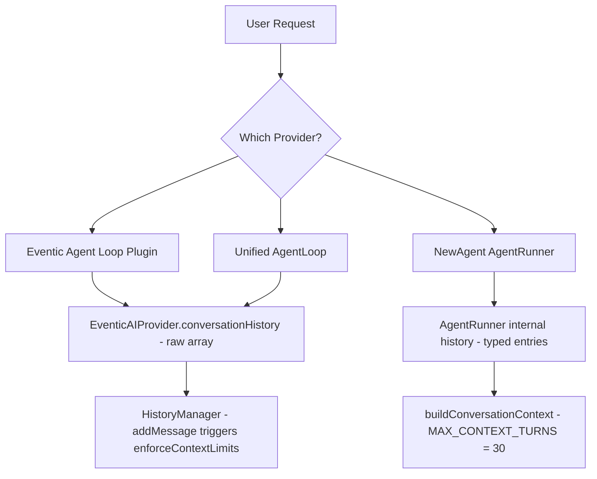
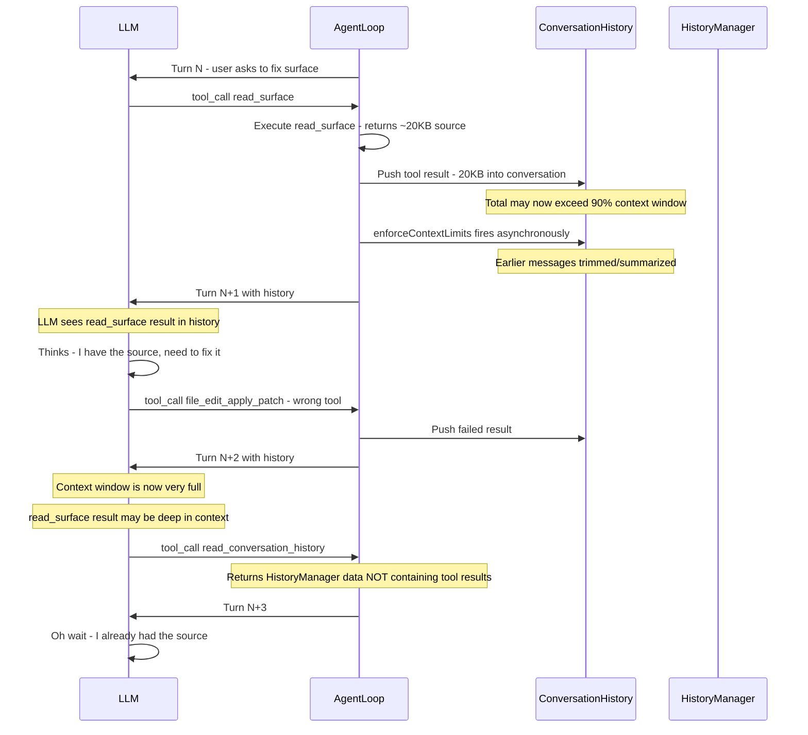

# Memory/Context Disconnection Analysis

## Symptom

During agent execution, the following sequence was observed:

1. Agent calls `read_surface` → receives full surface source code
2. Agent thinks: *"I need to use update_surface_component to fix the polling. I'll read the conversation history to get the full current source, then submit the fix with the interval removed."*
3. Agent calls `plugin_file-editor_file_edit_apply_patch` (fails — virtual file)
4. Agent calls `read_conversation_history`
5. Agent finally realizes: *"I already have the full source from the read_surface call."*

**Core question:** Why did the agent "forget" it had the source from `read_surface` just one turn later?

---

## Architecture Overview

The system has **three distinct agent loop implementations**, each with its own history/context management:



---

## Root Cause Analysis

### Finding 1: Dual History Systems With No Coordination

The system maintains **two parallel history stores** that can diverge:

1. **`EventicAIProvider.conversationHistory`** — a raw array of OpenAI-format messages used for LLM API calls. This is populated by [`ask()`](src/core/eventic-ai-plugin.mjs:238) which pushes user + assistant messages, and by the agent loop which pushes tool results.

2. **`HistoryManager`** — a separate system with token counting and [`enforceContextLimits()`](src/core/history-manager.mjs:322). This is used for persistence, `read_conversation_history`, and cross-conversation management.

**Critical gap:** When the Eventic or Unified agent loop pushes tool results into `engine.ai.conversationHistory` at [agent-loop.mjs:520](src/core/agentic/unified/agent-loop.mjs:520) or [agent-loop-tool-handler.mjs:248](src/core/agent-loop-tool-handler.mjs:248), the `HistoryManager` is **not notified**. Conversely, when `HistoryManager.enforceContextLimits()` trims history, it operates on **its own copy** — the `conversationHistory` array used for LLM calls may not be affected.

### Finding 2: HistoryManager.enforceContextLimits() Aggressive Trimming

[`enforceContextLimits()`](src/core/history-manager.mjs:322) triggers at **90% of `contextWindowSize`** (default 128K tokens) and trims to **70%**:

```javascript
// Line 326-327
if (currentTokens > this.contextWindowSize * 0.9) {
    // ...
    const targetTokens = Math.floor(this.contextWindowSize * 0.7);
```

When triggered, it removes entire exchanges (user + all following messages until the next user message) starting from the oldest. The trimming loop:

1. Tries LLM summarization first (preserving only the last 4 messages)
2. Falls back to deleting oldest exchanges wholesale

**Problem:** When summarization runs, it only preserves the content of messages via `(m.content || '').substring(0, 500)` — **tool results are truncated to 500 chars** in the summary prompt:

```javascript
// Line 336
const summaryPrompt = `Summarize these exchanges...
${messagesToSummarize.map(m => `[${m.role}]: ${(m.content || '').substring(0, 500)}`).join('\n')}`;
```

A `read_surface` result containing full component source code (often 5,000-50,000 chars) would be reduced to 500 chars in any summary — effectively "forgetting" the source code.

### Finding 3: enforceContextLimits() Called On Every addMessage()

Both [`addMessage()`](src/core/history-manager.mjs:92) and [`pushMessage()`](src/core/history-manager.mjs:112) call `enforceContextLimits()` **synchronously after every message**. Since `enforceContextLimits()` is `async` but called without `await`, the trimming may execute asynchronously and race with subsequent message additions:

```javascript
// Line 92-93
this.history.push(message);
this.enforceContextLimits(); // async but not awaited!
```

This creates a race condition: a large tool result is added, `enforceContextLimits()` begins trimming asynchronously, but the agent loop may already be preparing the next LLM call with a partially-trimmed history.

### Finding 4: read_surface Output Is Exempt From Truncation But Still Massive

The [`_truncateResult()`](src/core/agentic/unified/tool-executor-bridge.mjs:596) method in the tool executor bridge exempts `read_surface` from the standard 12K character truncation limit:

```javascript
// Line 600-601
const isSurfaceRead = toolName === 'read_surface' || toolName === 'list_surfaces';
const hardLimit = isSurfaceRead ? 256 * 1024 : 12000; // 256KB vs 12K
```

This means a `read_surface` result can inject **up to 256KB** into the conversation history. For a surface with multiple components containing complex JSX, the output can easily be 10,000-50,000+ characters (2,500-12,500+ estimated tokens).

When this large result enters the conversation history, it can push the total estimated tokens past the 90% threshold, **immediately triggering `enforceContextLimits()`** which then trims older messages — potentially including the very tool result that just triggered it, or shifting it into the "to be summarized" bucket.

### Finding 5: NewAgent/AgentRunner Has Independent Turn-Based Truncation

The [`AgentRunner.buildConversationContext()`](src/core/agent/AgentRunner.mjs:208) uses a **turn count limit** (`MAX_CONTEXT_TURNS = 30`) rather than token-based limits. Each loop iteration, it serializes the *entire* history into a flat text string.

The critical issue: tool results are embedded inside `[SYSTEM FEEDBACK]` blocks:

```javascript
// Line 214
else if (h.type === 'system') text = `[SYSTEM FEEDBACK]\n${h.error ? 'ERROR: ' + h.error : 'OUTPUT: ' + h.output}`;
```

The `batchOutput` from command execution accumulates ALL tool results for a turn:

```javascript
// Line 491-492
batchOutput += `\n--- [Command ${i + 1}: ${cmd.split(' ')[0]}] ---\n`;
batchOutput += cmdResult.error ? `ERROR: ${cmdResult.error}\n` : `OUTPUT: ${cmdResult.result}\n`;
```

When `MAX_CONTEXT_TURNS` (30) is exceeded, priority-aware truncation kicks in. System messages with output (but no errors) get a priority score of 2, while error messages get 3. This means **successful tool results** — including the `read_surface` output — are among the first to be dropped if the turn budget is exhausted.

### Finding 6: The "Two History" Disconnect in NewAgent Provider

The [`NewAgentProvider`](src/core/agentic/newagent/newagent-provider.mjs:429) maintains `this._conversationHistory` as a typed array of `{type, content, ...}` entries. After the runner finishes, it calls `this._deps.historyManager.addMessage()` to persist the final result — but **only the final response**, not the intermediate tool calls and results.

This means the `HistoryManager` (backing `read_conversation_history`) has **no record of intermediate tool results** — it only stores the user message and the final assistant response. When the agent calls `read_conversation_history`, the `read_surface` output is absent because it was never added to the HistoryManager.

---

## The "Amnesia" Sequence Explained

Here is what most likely happened:



The likely sequence of events:

1. **`read_surface` returns a large result** (10-50KB of component source code)
2. This pushes the conversation history close to or past the context limit
3. On the **next LLM call**, the model receives a very full context where the `read_surface` result is present but may be buried deep in the message array (after system prompt, pre-routed context, consciousness messages, prior turns...)
4. **The LLM's attention weakens** on content that is positioned in the "middle" of a very long context (the well-documented "lost in the middle" phenomenon)
5. The LLM reaches for `file_edit_apply_patch` — a pattern it may have seen in training — instead of recognizing it already has the source
6. After that fails, it tries `read_conversation_history` — but this reads from the **HistoryManager** which doesn't contain intermediate tool results
7. The LLM then re-examines its own prior output and realizes it already had the data

---

## Contributing Factors Summary

| Factor | Severity | Description |
|--------|----------|-------------|
| **Lost-in-the-middle attention** | HIGH | Large `read_surface` output pushes important context to the middle of a long prompt where LLM attention is weakest |
| **No tool result deduplication** | MEDIUM | The same surface source code may appear in pre-routed context AND the tool result, doubling context usage |
| **HistoryManager doesn't store tool results** | MEDIUM | `read_conversation_history` returns data from HistoryManager which lacks tool-level detail |
| **enforceContextLimits not awaited** | LOW-MEDIUM | Async trimming can race with message additions, leading to unpredictable state |
| **Summarization truncates to 500 chars** | LOW | When summarization runs, tool results are effectively discarded |
| **Turn-count truncation drops successful outputs first** | LOW | Priority scoring favors errors over successful outputs |

---

## Proposed Fixes

### Fix 1: Anchor Critical Tool Results in a Summary Block (HIGH PRIORITY)

When `read_surface` (or other source-reading tools) returns, inject a **compact summary** at the end of the tool result that restates the key facts:

```javascript
// In _truncateResult() or executeTool():
if (toolName === 'read_surface' && resultText.length > 2000) {
    // Extract component names from the output
    const componentNames = [...resultText.matchAll(/--- Component: (\S+)/g)]
        .map(m => m[1]);
    
    resultText += '\n\n[CONTEXT ANCHOR: You now have the FULL source code for ' +
        `surface components: ${componentNames.join(', ')}. ` +
        'Do NOT call read_surface or read_conversation_history again — ' +
        'use update_surface_component with the COMPLETE modified source.]';
}
```

This leverages the "recency bias" of LLMs — the anchor at the END of the tool result will be the last thing processed, improving recall.

### Fix 2: Deduplicate Pre-Routed and Tool-Fetched Surface Context (MEDIUM PRIORITY)

In [`agent-loop.mjs`](src/core/agentic/unified/agent-loop.mjs:334) and [`agent-loop-preroute.mjs`](src/core/agent-loop-preroute.mjs:186), surface data is pre-fetched and injected as a transient system message. If the agent then ALSO calls `read_surface`, the same data exists twice in the context.

**Fix:** When pushing a `read_surface` tool result into history, check if a transient surface context message already contains the same surface ID and remove it:

```javascript
// In the agent loop, after tool execution:
if (toolName === 'read_surface' && this._ai?.conversationHistory) {
    // Remove transient surface pre-route that's now superseded
    this._ai.conversationHistory = this._ai.conversationHistory.filter(m => {
        if (!m._transient) return true;
        if (m.content?.includes('SURFACE UPDATE WORKFLOW') && 
            m.content?.includes(args.surface_id)) return false;
        return true;
    });
}
```

### Fix 3: Await enforceContextLimits() or Make It Synchronous (MEDIUM PRIORITY)

The [`enforceContextLimits()`](src/core/history-manager.mjs:322) is declared `async` but called without `await` in [`addMessage()`](src/core/history-manager.mjs:92). This creates a subtle race condition.

**Fix:** Either:
- Make `addMessage()` async and await the call
- Or split `enforceContextLimits()` into a sync check + async compaction, only running the async part when truly needed

```javascript
addMessage(role, content, toolCalls = null, toolCallId = null, name = null) {
    // ... existing code ...
    this.history.push(message);
    
    // Synchronous quick check — only trigger async work if truly needed
    const stats = this.getStats();
    if (stats.utilizationPercent > 90) {
        // Queue for async processing rather than fire-and-forget
        this._pendingCompaction = this.enforceContextLimits();
    }
    
    if (this._onChange) {
        this._onChange(this).catch?.(() => {});
    }
}
```

### Fix 4: Increase Summary Fidelity for Tool Results (LOW PRIORITY)

When [`enforceContextLimits()`](src/core/history-manager.mjs:336) builds the summarization prompt, it truncates each message to 500 characters. For tool results, this is often too aggressive.

**Fix:** Increase the truncation limit for tool-role messages:

```javascript
const summaryPrompt = `Summarize these exchanges...
${messagesToSummarize.map(m => {
    const limit = m.role === 'tool' ? 2000 : 500;
    return `[${m.role}${m.name ? ` (${m.name})` : ''}]: ${(m.content || '').substring(0, limit)}`;
}).join('\n')}`;
```

### Fix 5: Bridge Tool Results to HistoryManager (LOW PRIORITY)

When tool results are pushed to `engine.ai.conversationHistory`, also record a summary in the `HistoryManager` so that `read_conversation_history` returns useful data:

```javascript
// In agent-loop-tool-handler.mjs or agent-loop.mjs, after pushing tool results:
if (ctx.historyManager || deps.historyManager) {
    const hm = ctx.historyManager || deps.historyManager;
    for (const res of results) {
        hm.addMessage('tool', res.content?.substring(0, 4000), null, res.tool_call_id, res.name);
    }
}
```

### Fix 6: Improve Turn Prompt to Reinforce Available Context (LOW PRIORITY)

In [`buildTurnPrompt()`](src/core/agentic/unified/prompt-builder.mjs), add a reminder about available tool results from the current turn:

```javascript
if (toolResults?.length > 0) {
    const toolSummary = toolResults
        .map(r => `${r.name}: ${r.content?.substring(0, 100)}`)
        .join('; ');
    prompt += `\n[AVAILABLE CONTEXT from this turn: ${toolSummary}]`;
}
```

---

## Risk Assessment

The proposed fixes are **additive and non-breaking**:

- **Fix 1** (context anchor) is the simplest and most impactful — it directly addresses the "lost in the middle" problem
- **Fix 2** (deduplication) reduces context waste without changing behavior
- **Fix 3** (async fix) removes a latent race condition
- **Fixes 4-6** are incremental improvements to context management fidelity

None of these changes modify the core LLM call path or tool execution semantics.

---

## Files Analyzed

| File | Role |
|------|------|
| [`src/core/history-manager.mjs`](src/core/history-manager.mjs) | Token estimation, enforceContextLimits, exchange-level trimming |
| [`src/core/eventic-ai-plugin.mjs`](src/core/eventic-ai-plugin.mjs) | LLM API calls, conversationHistory management, ask() |
| [`src/core/agentic/unified/agent-loop.mjs`](src/core/agentic/unified/agent-loop.mjs) | Unified agent ReAct loop, tool result injection into history |
| [`src/core/agentic/unified/tool-executor-bridge.mjs`](src/core/agentic/unified/tool-executor-bridge.mjs) | Tool execution, result truncation, _truncateResult() |
| [`src/core/agentic/unified/context-manager.mjs`](src/core/agentic/unified/context-manager.mjs) | Pre-routing, compaction, shouldCompact() |
| [`src/core/agent/AgentRunner.mjs`](src/core/agent/AgentRunner.mjs) | NewAgent loop, buildConversationContext, priority truncation |
| [`src/core/agent/config.mjs`](src/core/agent/config.mjs) | MAX_CONTEXT_TURNS = 30, agent response schema |
| [`src/core/agentic/newagent/newagent-provider.mjs`](src/core/agentic/newagent/newagent-provider.mjs) | Provider wrapper, dual history management |
| [`src/core/eventic-agent-loop-plugin.mjs`](src/core/eventic-agent-loop-plugin.mjs) | Eventic-based agent loop |
| [`src/core/agent-loop-tool-handler.mjs`](src/core/agent-loop-tool-handler.mjs) | Tool execution, result truncation, history push |
| [`src/core/agent-loop-helpers.mjs`](src/core/agent-loop-helpers.mjs) | purgeTransientMessages, patchOrphanedToolCalls |
| [`src/execution/handlers/surface-handlers.mjs`](src/execution/handlers/surface-handlers.mjs) | readSurface implementation — output format and size |
| [`src/execution/handlers/core-handlers.mjs`](src/execution/handlers/core-handlers.mjs) | readConversationHistory — reads from HistoryManager |
| [`src/core/conversation-manager.mjs`](src/core/conversation-manager.mjs) | Multi-conversation management via HistoryManager |
| [`src/core/agent-loop-preroute.mjs`](src/core/agent-loop-preroute.mjs) | Pre-routing surfaces and files |

---

## Conclusion

The "amnesia" is **not a bug** in the traditional sense — no data is being lost or corrupted. Instead, it is an emergent behavior arising from:

1. **LLM attention limitations** — the "lost in the middle" phenomenon causes the model to under-weight large tool results positioned in the middle of a very full context window
2. **Context pressure** — `read_surface` results are exempt from truncation (correctly, since the agent needs the full source), but this exemption can push total context near the limit, crowding out the model's effective attention budget
3. **History bifurcation** — the system maintains parallel history stores that diverge, so the agent's own context-recovery tool (`read_conversation_history`) returns incomplete data

The recommended approach is to implement **Fix 1 (context anchors)** as an immediate mitigation, followed by **Fix 2 (deduplication)** to reduce unnecessary context pressure, and **Fix 3 (async race fix)** to prevent latent state corruption.
