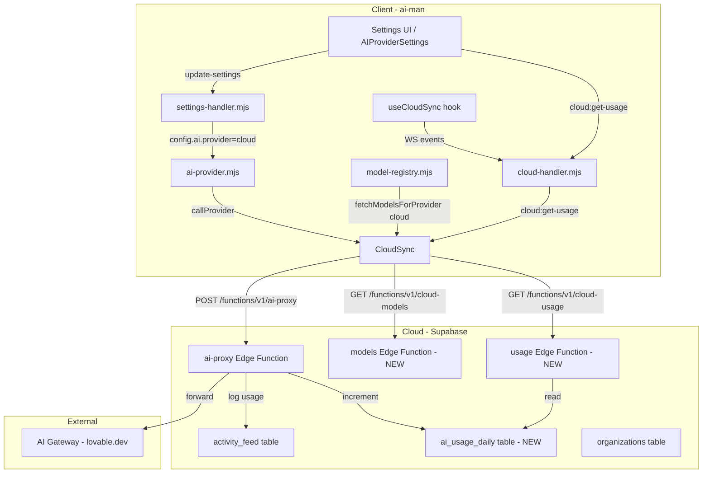

# Oboto Cloud AI Provider — Design Document

## Overview

The Oboto Cloud AI Provider is a first-class AI provider in the Oboto client that routes AI requests through Oboto Cloud's metered AI gateway. Unlike other providers (OpenAI, Gemini, LMStudio), the user needs **no API keys** — the cloud manages provider keys at the org level. When the user is registered and logged in, the "Oboto Cloud" provider becomes available alongside other configured providers. Usage is metered against the user's subscription tier, and the client displays real-time usage information.

## Current State Analysis

### What Already Exists

1. **Cloud AI Proxy** — The `ai-proxy` Supabase edge function (`/functions/v1/ai-proxy`) already handles:
   - Auth verification via JWT
   - Org membership + subscription tier lookup
   - Daily token limit tiers (free: 50K, pro: 500K, team: 2M, enterprise: 10M)
   - Routing to AI gateway (`ai.gateway.lovable.dev`)
   - Activity feed logging with token usage
   - Both streaming and non-streaming responses

2. **`AI_PROVIDERS.CLOUD` provider key** — Already registered in `ai-provider.mjs` with:
   - Provider detection in `detectProvider()` (from `config.ai.provider`)
   - `callProvider()` routing to `_cloudSync.aiProxyRequest()`
   - `callProviderStream()` routing to `_cloudSync.aiProxyStream()`
   - Fallback to local providers when cloud is unavailable

3. **`CloudSync.aiProxyRequest()` and `.aiProxyStream()`** — Already implemented, posting to `/functions/v1/ai-proxy`

4. **UI Cloud Tab** — `CloudSettings.tsx` already mentions `AI_PROVIDER=cloud` and shows tier token limits

### What's Missing

1. **Cloud as a proper provider in the settings UI** — The cloud provider isn't listed alongside OpenAI/Gemini/Anthropic/LMStudio in `AIProviderSettings.tsx`
2. **Cloud model registry** — No models are registered for the `cloud` provider, so the model selector shows nothing for cloud
3. **Cloud model list endpoint** — The server has no way to fetch available models from the cloud AI gateway
4. **Usage tracking on the client** — No usage information is displayed to the user (tokens used, daily limit, etc.)
5. **Usage tracking API** — The cloud server has no endpoint to return current usage data
6. **Auto-enable on login** — When a user logs into cloud, the cloud provider doesn't auto-enable
7. **Tool calling support** — The `ai-proxy` edge function doesn't forward `tools` parameter

## Architecture



## Implementation Plan

### Phase 1: Cloud as a Proper AI Provider (Client Side)

#### 1.1 Add `cloud` to `config.ai.providers` in `config.mjs`

Add the cloud provider to the `providers` map so it appears in settings:

```js
// In config.mjs, add to providers:
cloud: {
    enabled: false, // Enabled dynamically when cloud login succeeds
    model: 'auto',  // Default: let cloud decide
    label: 'Oboto Cloud',
},
```

#### 1.2 Register cloud provider in `AIProviderSettings.tsx`

Add `'cloud'` to the `AIProviderType` union and add its metadata to the `PROVIDERS` array. The cloud provider has unique characteristics:
- **No API key needed** — authentication is via cloud login
- **Auto-enabled** when cloud login succeeds
- **Cannot be disabled** when it's the only provider (graceful degradation)
- Shows usage meter instead of API key status

#### 1.3 Extend `model-registry.mjs` with cloud model fetching

Add `fetchCloudModels()` that calls `CloudSync.listCloudModels()` → `GET /functions/v1/cloud-models`:

```js
async function fetchCloudModels() {
    if (!_cloudSync || !_cloudSync.isLoggedIn()) return {};
    try {
        const models = await _cloudSync.listCloudModels();
        const result = {};
        for (const m of models) {
            result[m.id] = {
                provider: 'cloud',
                contextWindow: m.context_window || 128000,
                maxOutputTokens: m.max_output_tokens || 8192,
                supportsToolCalling: m.supports_tool_calling !== false,
                supportsStreaming: m.supports_streaming !== false,
                supportsReasoningEffort: false,
                costTier: m.cost_tier || 'medium',
                reasoningCapability: m.reasoning || 'medium',
                displayName: m.display_name || m.id,
                _fromAPI: true,
            };
        }
        return result;
    } catch (err) {
        console.warn('[model-registry] Failed to fetch cloud models:', err.message);
        return {};
    }
}
```

Include it in `fetchRemoteModels()` and `fetchModelsForProvider('cloud')`.

#### 1.4 Update `detectProvider()` to recognize cloud models

Cloud models from the gateway use prefixed IDs like `google/gemini-3-flash-preview`. Add detection:

```js
// In detectProvider():
if (m.startsWith('cloud/') || m.includes('/')) {
    return AI_PROVIDERS.CLOUD;
}
```

Actually — cloud models use the gateway's ID format (e.g., `google/gemini-3-flash-preview`). The better approach is: when the active provider is set to `cloud`, ALL model selections route through cloud regardless of model name pattern. This is already how it works — `detectProvider()` falls back to `config.ai.provider`, and if that's `cloud`, it returns `AI_PROVIDERS.CLOUD`.

#### 1.5 Fix `callProvider()` to pass tools through cloud proxy

Currently `CloudSync.aiProxyRequest()` only passes `messages`. It needs to also forward:
- `tools` (for tool calling)
- `temperature`
- `max_tokens`
- `response_format`

Update `aiProxyRequest()`:

```js
async aiProxyRequest(provider, model, messages, options = {}) {
    return this.client.post('/functions/v1/ai-proxy', {
        provider: provider || 'auto',
        model,
        messages,
        stream: false,
        workspace_id: wsId,
        tools: options.tools || undefined,
        temperature: options.temperature,
        max_tokens: options.max_tokens,
    });
}
```

And update `callProvider()` to pass the full request body to the proxy.

#### 1.6 Auto-enable cloud provider on login

In `cloud-handler.mjs` `cloud:login` handler and `CloudSync._createSubModules()`, emit an event that triggers:
1. Setting `config.ai.providers.cloud.enabled = true`
2. Fetching cloud models via `fetchModelsForProvider('cloud')`
3. Broadcasting updated settings to all clients

On logout, set `config.ai.providers.cloud.enabled = false` and remove cloud models.

### Phase 2: Cloud Usage Tracking (Server Side)

#### 2.1 Create `ai_usage_daily` table (new migration)

```sql
CREATE TABLE public.ai_usage_daily (
    id UUID PRIMARY KEY DEFAULT gen_random_uuid(),
    org_id UUID NOT NULL REFERENCES public.organizations(id) ON DELETE CASCADE,
    user_id UUID NOT NULL REFERENCES auth.users(id) ON DELETE CASCADE,
    usage_date DATE NOT NULL DEFAULT CURRENT_DATE,
    prompt_tokens BIGINT DEFAULT 0,
    completion_tokens BIGINT DEFAULT 0,
    total_tokens BIGINT DEFAULT 0,
    request_count INTEGER DEFAULT 0,
    models_used JSONB DEFAULT '{}',
    created_at TIMESTAMPTZ DEFAULT NOW(),
    updated_at TIMESTAMPTZ DEFAULT NOW(),
    UNIQUE(org_id, user_id, usage_date)
);

ALTER TABLE public.ai_usage_daily ENABLE ROW LEVEL SECURITY;

CREATE POLICY "Users can view own usage" ON public.ai_usage_daily
    FOR SELECT USING (auth.uid() = user_id);

CREATE POLICY "Org admins can view all usage" ON public.ai_usage_daily
    FOR SELECT USING (
        org_id IN (
            SELECT org_id FROM public.org_memberships
            WHERE user_id = auth.uid() AND role IN ('owner', 'admin')
        )
    );

-- Index for fast daily lookups
CREATE INDEX idx_ai_usage_daily_lookup ON public.ai_usage_daily(org_id, user_id, usage_date);
```

#### 2.2 Update `ai-proxy` edge function to track usage

After a successful AI call, upsert into `ai_usage_daily`:

```ts
// In ai-proxy/index.ts, after getting the response:
const today = new Date().toISOString().split('T')[0];
await serviceSupabase.rpc('increment_ai_usage', {
    p_org_id: memberships[0].org_id,
    p_user_id: userId,
    p_date: today,
    p_prompt_tokens: usage.prompt_tokens || 0,
    p_completion_tokens: usage.completion_tokens || 0,
    p_model: resolvedModel,
});
```

Create an RPC function for atomic upsert:

```sql
CREATE OR REPLACE FUNCTION public.increment_ai_usage(
    p_org_id UUID, p_user_id UUID, p_date DATE,
    p_prompt_tokens BIGINT, p_completion_tokens BIGINT, p_model TEXT
) RETURNS VOID LANGUAGE plpgsql SECURITY DEFINER AS $$
BEGIN
    INSERT INTO public.ai_usage_daily (org_id, user_id, usage_date, prompt_tokens, completion_tokens, total_tokens, request_count, models_used)
    VALUES (p_org_id, p_user_id, p_date, p_prompt_tokens, p_completion_tokens, p_prompt_tokens + p_completion_tokens, 1,
            jsonb_build_object(p_model, 1))
    ON CONFLICT (org_id, user_id, usage_date) DO UPDATE SET
        prompt_tokens = ai_usage_daily.prompt_tokens + p_prompt_tokens,
        completion_tokens = ai_usage_daily.completion_tokens + p_completion_tokens,
        total_tokens = ai_usage_daily.total_tokens + p_prompt_tokens + p_completion_tokens,
        request_count = ai_usage_daily.request_count + 1,
        models_used = ai_usage_daily.models_used || jsonb_build_object(
            p_model,
            COALESCE((ai_usage_daily.models_used ->> p_model)::int, 0) + 1
        ),
        updated_at = NOW();
END;
$$;
```

#### 2.3 Enforce daily limits in `ai-proxy`

Before making the AI gateway call, check current usage:

```ts
const { data: usageData } = await serviceSupabase
    .from('ai_usage_daily')
    .select('total_tokens')
    .eq('org_id', memberships[0].org_id)
    .eq('usage_date', today)
    .maybeSingle();

const usedToday = usageData?.total_tokens || 0;
if (usedToday >= dailyLimit) {
    return new Response(JSON.stringify({
        error: 'Daily token limit reached',
        usage: { used: usedToday, limit: dailyLimit, tier: org.subscription_tier },
    }), { status: 429, headers: { ...corsHeaders, 'Content-Type': 'application/json' } });
}
```

#### 2.4 Forward tools in `ai-proxy`

Update the AI gateway request to include tools:

```ts
body: JSON.stringify({
    model: resolvedModel,
    messages,
    stream: !!stream,
    tools: tools || undefined,
    temperature: temperature,
    max_tokens: max_tokens,
}),
```

### Phase 3: Cloud Usage API + Client Display

#### 3.1 Create `cloud-usage` edge function

New Supabase edge function: `supabase/functions/cloud-usage/index.ts`

Returns:
```json
{
    "today": {
        "tokens_used": 12345,
        "tokens_limit": 50000,
        "request_count": 42,
        "models_used": { "google/gemini-3-flash-preview": 30, "openai/gpt-4o": 12 }
    },
    "tier": "free",
    "subscription_status": "active",
    "period": {
        "start": "2026-02-26",
        "end": "2026-02-26"
    }
}
```

#### 3.2 Create `cloud-models` edge function

New Supabase edge function: `supabase/functions/cloud-models/index.ts`

Returns the list of models available through the AI gateway for the user's tier:

```json
{
    "models": [
        {
            "id": "google/gemini-3-flash-preview",
            "display_name": "Gemini 3 Flash",
            "context_window": 1048576,
            "max_output_tokens": 8192,
            "supports_tool_calling": true,
            "supports_streaming": true,
            "cost_tier": "cheap",
            "reasoning": "medium",
            "tier_required": "free"
        },
        {
            "id": "openai/gpt-4o",
            "display_name": "GPT-4o",
            "context_window": 128000,
            "max_output_tokens": 16384,
            "supports_tool_calling": true,
            "supports_streaming": true,
            "cost_tier": "medium",
            "reasoning": "high",
            "tier_required": "pro"
        }
    ]
}
```

#### 3.3 Add usage methods to `CloudSync`

```js
// CloudSync new methods:
async listCloudModels() {
    if (!this.isLoggedIn() || !this.client) return [];
    const result = await this.client.get('/functions/v1/cloud-models');
    return result?.models || [];
}

async getUsage() {
    if (!this.isLoggedIn() || !this.client) return null;
    return this.client.get('/functions/v1/cloud-usage');
}
```

#### 3.4 Add WS handlers for usage

In `cloud-handler.mjs`:

```js
'cloud:get-usage': async (data, ctx) => {
    if (!ctx.cloudSync?.isLoggedIn()) {
        return wsSend(ctx.ws, 'cloud:usage', null);
    }
    try {
        const usage = await ctx.cloudSync.getUsage();
        wsSend(ctx.ws, 'cloud:usage', usage);
    } catch (err) {
        sendCloudError(ctx.ws, `Failed to get usage: ${err.message}`);
    }
},

'cloud:list-models': async (data, ctx) => {
    if (!ctx.cloudSync?.isLoggedIn()) {
        return wsSend(ctx.ws, 'cloud:models', []);
    }
    try {
        const models = await ctx.cloudSync.listCloudModels();
        wsSend(ctx.ws, 'cloud:models', models);
    } catch (err) {
        sendCloudError(ctx.ws, `Failed to list cloud models: ${err.message}`);
    }
},
```

#### 3.5 Add usage display to `useCloudSync` hook

Extend `CloudState` with:
```ts
usage: {
    tokensUsed: number;
    tokensLimit: number;
    requestCount: number;
    tier: string;
} | null;
```

Add WS listener for `cloud:usage` events.

#### 3.6 Add usage meter to `AIProviderSettings.tsx` for cloud provider

When the cloud provider card is displayed, instead of an API key status, show:
- A usage progress bar (tokens used / daily limit)
- Tier label
- "Refresh" button to fetch latest usage

#### 3.7 Add usage meter to `CloudSettings.tsx`

Replace the static tier display with a live usage meter fetched from the cloud.

### Phase 4: Polish & Integration

#### 4.1 Usage reporting in response metadata

After each cloud AI call, include usage info in the response that gets displayed in the chat:
- Token count for the current request
- Remaining daily allowance

#### 4.2 Usage limit warnings

When usage approaches the daily limit (>80%), show a warning banner in the UI.
When limit is reached, show an error with upgrade CTA.

#### 4.3 Auto-refresh usage periodically

Poll usage every 60 seconds when the cloud provider is active.

## Files to Modify

### Client (ai-man)

| File | Changes |
|------|---------|
| `src/config.mjs` | Add `cloud` to `config.ai.providers` |
| `src/core/ai-provider.mjs` | Fix `callProvider` to pass full request body to cloud proxy |
| `src/core/model-registry.mjs` | Add `fetchCloudModels()`, include in `fetchRemoteModels()` and `fetchModelsForProvider()` |
| `src/cloud/cloud-sync.mjs` | Add `listCloudModels()`, `getUsage()` methods; auto-enable provider on login |
| `src/server/ws-handlers/cloud-handler.mjs` | Add `cloud:get-usage`, `cloud:list-models` handlers |
| `src/server/ws-handlers/settings-handler.mjs` | Auto-enable cloud provider on cloud login event |
| `ui/src/hooks/useCloudSync.ts` | Add `usage` state, `getUsage()` action, `cloud:usage` listener |
| `ui/src/components/features/settings/AIProviderSettings.tsx` | Add cloud provider card with usage meter |
| `ui/src/components/features/settings/CloudSettings.tsx` | Add live usage meter |

### Server (oboto-1fdb6109)

| File | Changes |
|------|---------|
| `supabase/functions/ai-proxy/index.ts` | Add usage tracking, limit enforcement, forward tools/temperature/max_tokens |
| `supabase/functions/cloud-models/index.ts` | **NEW** — Return available cloud models for user's tier |
| `supabase/functions/cloud-usage/index.ts` | **NEW** — Return current usage data |
| `supabase/migrations/YYYYMMDD_ai_usage.sql` | **NEW** — Create `ai_usage_daily` table + `increment_ai_usage` RPC |

## Risk Analysis

| Risk | Mitigation |
|------|------------|
| Cloud provider is selected but user not logged in | Already handled: `callProvider()` falls back to local provider |
| Daily limit hit mid-conversation | Return clear 429 with usage data; client shows upgrade CTA |
| AI gateway downtime | Existing retry + fallback logic in `ai-provider.mjs` |
| Token counting accuracy | Best-effort from gateway response; not a billing system |
| Cloud models endpoint unavailable | Fall back to hardcoded model list for cloud |
