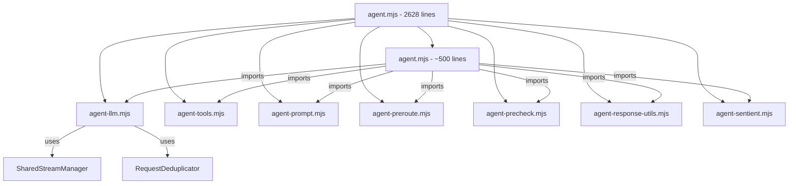
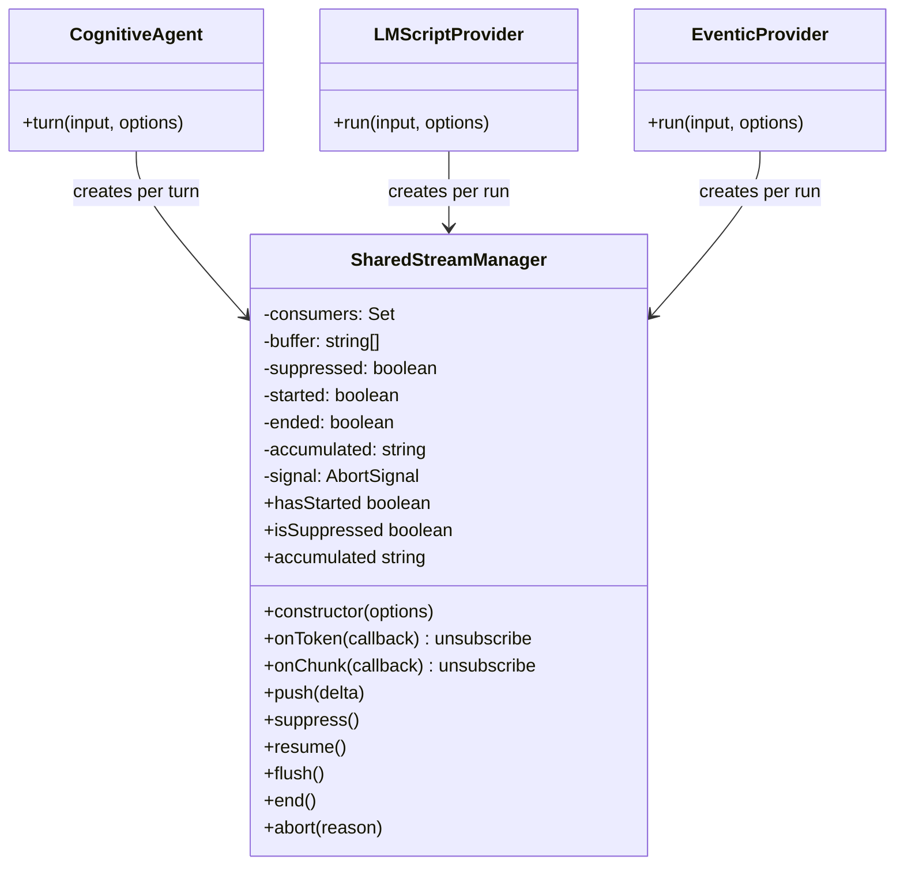
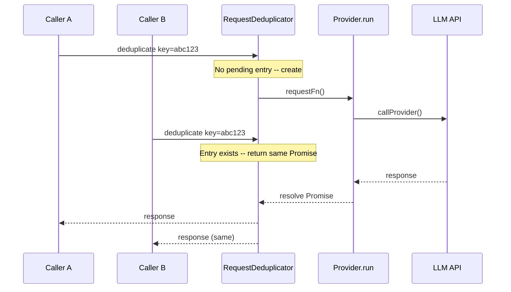
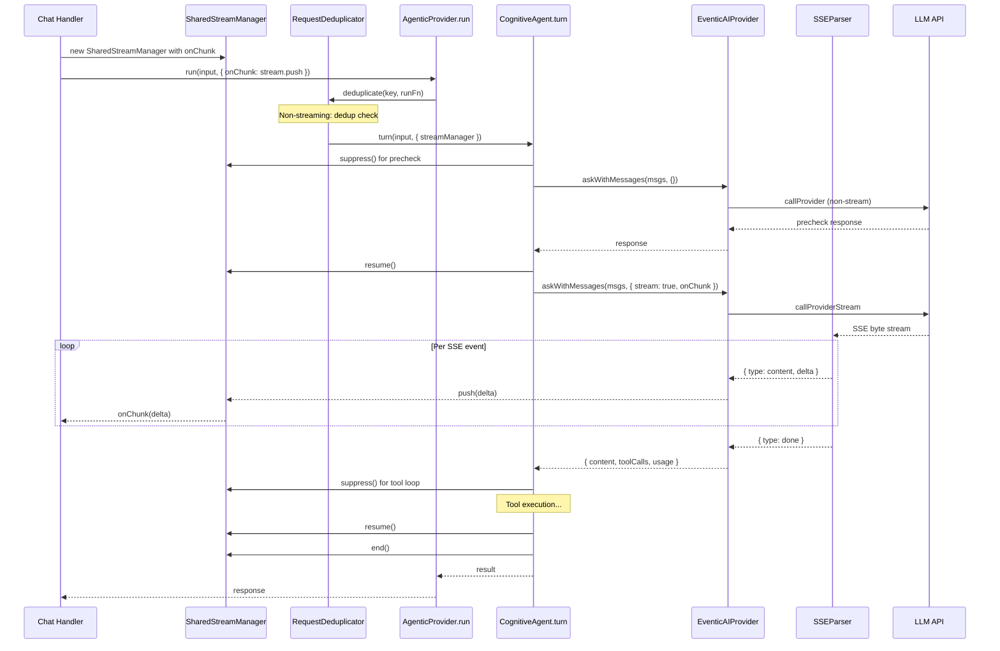

# SharedStreamManager, RequestDeduplicator, HTTP-Level Streaming — Design Document

> **Status:** Draft  
> **Date:** 2026-03-17  
> **Scope:** Three features plus agent.mjs decomposition  
> **Prerequisites:** 58 agent provider optimizations (complete)

---

## Table of Contents

1. [Current State Analysis](#1-current-state-analysis)
2. [Agent File Decomposition](#2-agent-file-decomposition)
3. [SharedStreamManager Design](#3-sharedstreammanager-design)
4. [RequestDeduplicator Design](#4-requestdeduplicator-design)
5. [HTTP-Level Streaming Design](#5-http-level-streaming-design)
6. [Integration Plan](#6-integration-plan)
7. [Implementation Order](#7-implementation-order)

---

## 1. Current State Analysis

### 1.1 File Size Problem

[`agent.mjs`](src/core/agentic/cognitive/agent.mjs) is **2,628 lines / 112 KB** — a monolith containing:
- The 11-step cognitive loop (`turn()`, `_turnLegacy()`)
- LLM call dispatch (`_callLLM()`)
- Tool execution loop (`_processToolCalls()`)
- Streaming callback stripping/forwarding
- Precheck cache
- Incomplete response detection
- System prompt construction
- History summarization
- Pre-routing (file auto-fetch)
- Tool definition building
- Sentient core lifecycle
- Fallback response synthesis

Other large files needing attention:
- [`eventic-agent-loop-plugin.mjs`](src/core/eventic-agent-loop-plugin.mjs) — 52,600 chars
- [`eventic-facade.mjs`](src/core/eventic-facade.mjs) — 37,288 chars

### 1.2 Streaming Architecture (Current)

Streaming flows through **four layers**, each re-implementing the pattern:

```
Layer 1: chat-handler.mjs
  ├─ Creates onChunk callback with batching (50ms timer)
  ├─ Sends message-stream-start/chunk/end via WebSocket
  └─ Calls assistant.run(input, { onChunk })

Layer 2: cognitive-provider.mjs / lmscript-provider.mjs / eventic-provider.mjs
  ├─ Forwards options.onChunk to agent.turn() or engine.dispatch()
  └─ No streaming logic of its own

Layer 3: agent.mjs (_callLLM)
  ├─ Sets askOptions.stream = true when options.onChunk present
  ├─ Strips onChunk for internal tool-loop calls
  ├─ Strips onChunk for precheck calls
  └─ Forwards to EventicAIProvider.askWithMessages()

Layer 4: eventic-ai-plugin.mjs (_sendRequest)
  ├─ Calls callProviderStream() when stream=true
  ├─ Parses SSE (OpenAI format only: data: {JSON}\n)
  ├─ Accumulates content + tool_calls
  └─ Invokes options.onChunk(delta) per parsed chunk
```

**Key observations:**
- Streaming SSE parsing in [`_sendRequest()`](src/core/eventic-ai-plugin.mjs:77) is OpenAI-specific — works only for `data: {JSON}` format
- The SSE parser already handles tool calls during streaming (lines 173-195)
- [`chat-handler.mjs`](src/server/ws-handlers/chat-handler.mjs:127) implements its own batching/buffering — this is WS-layer concern that should stay there
- [`LMScriptProvider`](src/core/agentic/lmscript/lmscript-provider.mjs:322) uses `options.onChunk(responseText)` as a one-shot (entire response), not token-by-token — this is a different streaming pattern
- CognitiveAgent strips `onChunk` for internal calls at [`_processToolCalls`](src/core/agentic/cognitive/agent.mjs:1650) and [`_turnLegacy`](src/core/agentic/cognitive/agent.mjs:1125)

### 1.3 Request Dispatch (Current)

The TODO in [`base-provider.mjs`](src/core/agentic/base-provider.mjs:11) explicitly calls for dedup:
```
// TODO: Add request deduplication - if identical requests arrive concurrently,
// return the same promise to avoid redundant LLM calls.
```

Currently, each call to `run()` creates a new `AbortController` and dispatches independently. Concurrent identical requests result in duplicate LLM API calls.

### 1.4 HTTP Transport (Current)

[`callProvider()`](src/core/ai-provider/index.mjs:54) dispatches to provider-specific adapters via a switch-on-provider pattern. Each adapter has both sync and stream variants (e.g., `callOpenAIREST` / `callOpenAIRESTStream`).

[`callProviderStream()`](src/core/ai-provider/index.mjs:130) returns a raw `Response` object. The caller ([`_sendRequest`](src/core/eventic-ai-plugin.mjs:148)) is responsible for SSE parsing.

---

## 2. Agent File Decomposition

Before implementing the three features, `agent.mjs` must be decomposed. The extraction of streaming and dedup logic is meaningless if it stays embedded in a 2,600-line file. This decomposition is **Phase 0** — the prerequisite.

### 2.1 Proposed Module Structure

```
src/core/agentic/cognitive/
  agent.mjs                    # 400-500 lines: orchestrator only
  agent-llm.mjs                # _callLLM, _processToolCalls (~200 lines)
  agent-tools.mjs              # _executeTool, _getToolDefinitions, _getLmscriptTools (~250 lines)
  agent-prompt.mjs             # _buildSystemPrompt, _summarizeHistory, _buildPluginTraitsBlock (~200 lines)
  agent-preroute.mjs           # _preRoute, _shouldSkipPrecheck, _isLikelyFilePath (~150 lines)
  agent-precheck.mjs           # precheck cache, _getPrecheckCached, _setPrecheckCached (~100 lines)
  agent-response-utils.mjs     # _isIncompleteResponse, _buildFallbackResponse, _humanizeToolName, _summarizeToolResult (~200 lines)
  agent-sentient.mjs           # initSentientCore, saveSentientState, _loadSentientState, _getSentientToolMetadata, _executeSentientTool (~250 lines)
  agent.mjs                    # CognitiveAgent class: constructor, turn(), _turnLegacy(), getStats(), reset(), dispose()
```

### 2.2 Extraction Strategy

Each extracted module exports **plain functions** that accept an agent context object (or individual params), not methods on a class. The agent class imports and delegates:

```javascript
// agent-llm.mjs
export async function callLLM(aiProvider, messages, tools, options) { ... }
export async function processToolCalls(agent, messages, response, toolDefs, ...) { ... }

// agent.mjs (after refactor)
import { callLLM, processToolCalls } from './agent-llm.mjs';

class CognitiveAgent {
  async _callLLM(messages, tools, options) {
    return callLLM(this.aiProvider, messages, tools, options);
  }
}
```

This preserves the public API while making internal logic independently testable and reusable.

### 2.3 Decomposition Flow



---

## 3. SharedStreamManager Design

### 3.1 Problem Statement

Streaming logic is duplicated across three points:
1. **CognitiveAgent** — strips `onChunk` for internal calls, forwards for user-facing calls
2. **LMScriptProvider** — uses `onChunk` as one-shot final delivery
3. **EventicAIProvider** — parses SSE and invokes `onChunk(delta)` per token

The duplication is not in the SSE parsing (which correctly lives in EventicAIProvider), but in the **stream lifecycle management**: when to start, when to suppress, buffering, abort handling, and the semantics of the callback.

### 3.2 API Design

```javascript
// src/core/agentic/stream-manager.mjs

/**
 * SharedStreamManager manages the lifecycle of a streaming response.
 * Providers create one per turn and wire it to the onChunk callback.
 * Internal tool-loop calls suppress streaming via stream.suppress().
 */
export class SharedStreamManager {
  /**
   * @param {Object} options
   * @param {Function} [options.onChunk] - External consumer callback
   * @param {number}   [options.highWaterMark=64] - Buffer size before backpressure
   * @param {AbortSignal} [options.signal] - Abort signal
   */
  constructor(options = {})

  /** Register a token consumer. Multiple consumers supported. */
  onToken(callback: (delta: string) => void): () => void  // returns unsubscribe

  /** Register a chunk consumer (same as onToken, alias for clarity). */
  onChunk(callback: (delta: string) => void): () => void

  /** Push a token/chunk into the stream. Respects suppress state. */
  push(delta: string): void

  /** Temporarily suppress output (for internal tool-loop calls). */
  suppress(): void

  /** Resume output after suppression. */
  resume(): void

  /** @returns {boolean} Whether streaming is currently suppressed. */
  get isSuppressed(): boolean

  /** Flush any buffered content to consumers. */
  flush(): void

  /** Signal that streaming is complete. */
  end(): void

  /** Abort the stream. Clears buffer, notifies consumers. */
  abort(reason?: string): void

  /** @returns {boolean} Whether any content has been pushed. */
  get hasStarted(): boolean

  /** @returns {string} All content pushed so far (accumulated). */
  get accumulated(): string
}
```

### 3.3 Backpressure Handling

When `push()` is called faster than consumers can process:
1. Buffer tokens internally up to `highWaterMark` count
2. When buffer exceeds `highWaterMark`, concatenate buffered tokens and deliver as a single chunk
3. This is a simple coalescing strategy — no blocking, no async backpressure
4. Rationale: LLM token delivery is already throttled by API speed; backpressure only matters for extremely slow WebSocket connections

### 3.4 Integration Points

**CognitiveAgent (after decomposition, in agent-llm.mjs):**
```javascript
export async function callLLM(aiProvider, messages, tools, options, streamManager) {
  const askOptions = { tools, signal: options.signal };
  if (streamManager && !streamManager.isSuppressed) {
    askOptions.stream = true;
    askOptions.onChunk = (delta) => streamManager.push(delta);
  }
  return aiProvider.askWithMessages(messages, askOptions);
}
```

**CognitiveAgent.turn():**
```javascript
async turn(input, options = {}) {
  const stream = new SharedStreamManager({
    onChunk: options.onChunk,
    signal: options.signal,
  });
  
  // Precheck: no streaming
  stream.suppress();
  const precheck = await callLLM(..., stream);
  stream.resume();
  
  // User-facing call: streaming
  const response = await callLLM(..., stream);
  
  // Tool loop: suppress streaming
  stream.suppress();
  await processToolCalls(...);
  stream.resume();
  
  // Final synthesis: streaming
  const synthesis = await callLLM(..., stream);
  
  stream.end();
}
```

**LMScriptProvider:** Uses `stream.push(entireResponse)` at the end — same API, different usage pattern.

### 3.5 Class Diagram



---

## 4. RequestDeduplicator Design

### 4.1 Problem Statement

When identical requests arrive concurrently (e.g., user double-clicks, multiple UI components fire the same query), each one triggers a separate LLM API call. This wastes tokens and money.

### 4.2 Dedup Key Algorithm

**What constitutes identical?**
```javascript
function computeDedupKey(input, model, systemPromptHash) {
  // Hash: input text + model name + truncated system prompt hash
  // System prompt is hashed separately (it's large but rarely changes)
  // Temperature is NOT included — same input at different temps is a different request
  // Tools are NOT included — tools change the response but users don't control this
  const crypto = await import('crypto');
  const payload = `${input}\x00${model}\x00${systemPromptHash}`;
  return crypto.createHash('sha256').update(payload).digest('hex').substring(0, 16);
}
```

**Excluded from key:**
- `signal` — abort state is per-caller, not per-request
- `temperature` — if same user sends same input, temperature is likely identical
- `tools` — tool definitions are provider-controlled, not user-controlled
- `onChunk` — callback is per-caller

**System prompt hash optimization:** Compute once per system prompt change, store on the provider. The system prompt is 5-20KB — hashing it per request is wasteful.

### 4.3 API Design

```javascript
// src/core/agentic/request-deduplicator.mjs

/**
 * Deduplicates concurrent identical LLM requests.
 * When the same request arrives while a previous one is in-flight,
 * returns the same Promise to the second caller.
 */
export class RequestDeduplicator {
  /**
   * @param {Object} options
   * @param {number} [options.ttlMs=30000] - Max time to cache a pending request
   * @param {number} [options.maxEntries=100] - Max concurrent dedup entries
   */
  constructor(options = {})

  /**
   * Wrap a request function with deduplication.
   * @param {string} key - Dedup key (from computeDedupKey)
   * @param {Function} requestFn - The actual request function () => Promise
   * @returns {Promise} - Shared promise if deduplicated, new promise otherwise
   */
  async deduplicate(key, requestFn): Promise

  /** Number of currently in-flight deduplicated requests */
  get pendingCount(): number

  /** Clear all pending entries (e.g., on provider dispose) */
  clear(): void
}
```

### 4.4 Edge Cases

#### First request fails
```javascript
async deduplicate(key, requestFn) {
  const existing = this._pending.get(key);
  if (existing) return existing.promise;
  
  const entry = {};
  entry.promise = requestFn()
    .then(result => {
      this._pending.delete(key);
      return result;
    })
    .catch(err => {
      this._pending.delete(key);  // Remove on failure — let retry attempt proceed
      throw err;                  // Propagate to ALL waiters
    });
  
  this._pending.set(key, entry);
  // TTL cleanup
  entry.timer = setTimeout(() => this._pending.delete(key), this._ttlMs);
  
  return entry.promise;
}
```

When the first request fails, **all callers sharing that Promise see the error**. The entry is removed, so a subsequent retry creates a fresh request. This is the correct behavior — if the API is down, all concurrent callers should know.

#### Streaming + Dedup
Streaming requests should **NOT be deduplicated** — each caller has its own `onChunk` callback and potentially different WebSocket connections. The dedup key check should skip when `options.stream === true`:

```javascript
// In base-provider.mjs or the provider's run() method:
if (!options.stream && !options.onChunk) {
  return this._deduplicator.deduplicate(key, () => this._doActualRun(input, options));
}
return this._doActualRun(input, options);
```

#### AbortSignal interaction
If caller A's signal aborts but caller B is still waiting on the shared Promise:
- The Promise continues to completion (caller B needs the result)
- Caller A receives an AbortError from their own signal handler, not from the shared Promise
- Implementation: callers wrap the dedup Promise with their own signal check

### 4.5 Placement

**Standalone utility** at `src/core/agentic/request-deduplicator.mjs` rather than embedded in `base-provider.mjs`:
- Keeps `base-provider.mjs` thin (it's currently 105 lines — good)
- Can be tested independently
- Can be used by non-agentic code (e.g., direct AI provider calls)

The `AgenticProvider` base class gets a composable integration point:

```javascript
// base-provider.mjs
import { RequestDeduplicator } from './request-deduplicator.mjs';

export class AgenticProvider {
  constructor() {
    this._deduplicator = new RequestDeduplicator();
  }
  
  async dispose() {
    this._deduplicator?.clear();
    this._deps = null;
  }
}
```

### 4.6 Dedup Flow



---

## 5. HTTP-Level Streaming Design

### 5.1 Problem Statement

The current architecture **already supports HTTP-level streaming** via [`callProviderStream()`](src/core/ai-provider/index.mjs:130) and the SSE parser in [`EventicAIProvider._sendRequest()`](src/core/eventic-ai-plugin.mjs:148). The SSE parser handles OpenAI-format SSE (`data: {JSON}\n`).

What's missing:
1. **Anthropic SSE format** — uses a different event structure (`event: content_block_delta`, `event: message_stop`)
2. **Token counting during streaming** — streaming chunks don't include `usage` until the final chunk (OpenAI) or `message_stop` event (Anthropic)
3. **Integration with SharedStreamManager** — the SSE parser currently calls `options.onChunk(delta)` directly; it should go through StreamManager
4. **Gemini streaming** — currently uses a synthetic stream wrapper (`callGeminiSDKStream`), not true SSE

### 5.2 SSE Format Handling

The format problem is **already solved at the adapter level**. Each provider adapter in `src/core/ai-provider/adapters/` has its own stream variant that normalizes the response into an OpenAI-compatible SSE stream. For example:
- [`callAnthropicRESTStream()`](src/core/ai-provider/adapters/anthropic.mjs) handles Anthropic's event format
- [`callGeminiSDKStream()`](src/core/ai-provider/adapters/gemini.mjs) wraps the Gemini SDK
- [`callCohereRESTStream()`](src/core/ai-provider/adapters/cohere.mjs) handles Cohere's format

All stream adapters return a `Response`-like object that the SSE parser in `_sendRequest()` can read with a consistent `data: {JSON}\n` format.

**Therefore, the design change is not in the adapters but in the SSE parsing layer** — making it more robust and integrated with SharedStreamManager.

### 5.3 SSE Parser Extraction

Extract the SSE parsing logic from `_sendRequest()` into a reusable utility:

```javascript
// src/core/agentic/sse-parser.mjs

/**
 * Parse an SSE stream and emit structured events.
 * Handles OpenAI-compatible format (data: {JSON}\n).
 * Provider-specific formats are normalized by adapters before reaching this parser.
 */
export class SSEParser {
  /**
   * @param {ReadableStream} stream - The response body stream
   * @param {Object} options
   * @param {AbortSignal} [options.signal]
   */
  constructor(stream, options = {})

  /**
   * Parse the stream, yielding events.
   * @yields {{ type: 'content', delta: string }}
   * @yields {{ type: 'tool_call', index: number, id?: string, name?: string, arguments?: string }}
   * @yields {{ type: 'usage', usage: Object }}
   * @yields {{ type: 'done' }}
   */
  async *parse(): AsyncGenerator
}
```

### 5.4 Integration with SharedStreamManager

```javascript
// In EventicAIProvider._sendRequest() (refactored):
if (options.stream && options.onChunk) {
  const response = await callProviderStream(requestBody, { signal, model });
  const parser = new SSEParser(response.body, { signal });
  
  let content = '';
  let toolCalls = null;
  let usage = null;
  
  for await (const event of parser.parse()) {
    switch (event.type) {
      case 'content':
        content += event.delta;
        options.onChunk(event.delta);  // or streamManager.push(event.delta)
        break;
      case 'tool_call':
        // accumulate tool calls...
        break;
      case 'usage':
        usage = event.usage;
        break;
      case 'done':
        break;
    }
  }
  
  return { content, toolCalls, rawMessage: { role: 'assistant', content, tool_calls: toolCalls }, usage };
}
```

### 5.5 Token Counting During Streaming

**OpenAI format:** The final SSE chunk (before `[DONE]`) may include `usage` field if `stream_options: { include_usage: true }` is set in the request.

**Anthropic format:** `message_stop` event includes the full `usage` object.

**Gemini format:** Usage is available in the final `GenerateContentResponse`.

**Design decision:** 
- Add `stream_options: { include_usage: true }` to the request body when streaming is enabled (OpenAI-compatible providers)
- The SSE parser emits a `usage` event when it encounters usage data
- If no usage data arrives (provider doesn't support it), the caller estimates from token count: `estimated_tokens = content.length / 4`

### 5.6 Data Flow with All Three Features



---

## 6. Integration Plan

### 6.1 Files Changed

| File | Change | Reason |
|------|--------|--------|
| `src/core/agentic/cognitive/agent.mjs` | **Decompose** into 7 sub-modules | Maintainability prerequisite |
| `src/core/agentic/stream-manager.mjs` | **New** | SharedStreamManager |
| `src/core/agentic/request-deduplicator.mjs` | **New** | RequestDeduplicator |
| `src/core/agentic/sse-parser.mjs` | **New** | Extracted SSE parsing |
| `src/core/agentic/base-provider.mjs` | **Modify** | Add deduplicator instance, remove TODO |
| `src/core/agentic/index.mjs` | **Modify** | Export new classes, remove TODO |
| `src/core/agentic/cognitive-provider.mjs` | **Modify** | Wire StreamManager |
| `src/core/agentic/lmscript/lmscript-provider.mjs` | **Modify** | Wire StreamManager |
| `src/core/agentic/eventic-provider.mjs` | **Modify** | Wire StreamManager |
| `src/core/eventic-ai-plugin.mjs` | **Modify** | Use SSEParser, pass through StreamManager |
| `src/core/agentic/token-budget.mjs` | **Modify** | Add streaming estimation method |

### 6.2 Migration Safety

All changes must be **backwards compatible**. The `onChunk` callback interface is preserved — `SharedStreamManager` wraps it, not replaces it. Providers that don't use `SharedStreamManager` continue to work via the existing `options.onChunk` passthrough.

### 6.3 Testing Strategy

Each new module gets unit tests:
- `stream-manager.test.mjs` — push/suppress/resume/abort/backpressure
- `request-deduplicator.test.mjs` — concurrent dedup, failure propagation, TTL
- `sse-parser.test.mjs` — OpenAI format, malformed chunks, tool calls in stream

Integration test: end-to-end streaming from mock LLM API → SSEParser → StreamManager → captured chunks.

---

## 7. Implementation Order

Dependencies dictate the sequence. Each phase is independently shippable.

### Phase 0: Agent File Decomposition (prerequisite)
1. Extract `agent-sentient.mjs` — most self-contained, lowest coupling
2. Extract `agent-response-utils.mjs` — pure functions, zero coupling
3. Extract `agent-precheck.mjs` — isolated cache logic
4. Extract `agent-preroute.mjs` — isolated file-fetch logic
5. Extract `agent-prompt.mjs` — system prompt construction
6. Extract `agent-tools.mjs` — tool definitions and execution
7. Extract `agent-llm.mjs` — LLM call dispatch and tool loop
8. Verify agent.mjs is ~500 lines, all tests pass

**Dependency:** None. Can start immediately.
**Risk:** Low — pure refactoring with preserved API surface.

### Phase 1: SharedStreamManager
1. Create `stream-manager.mjs` with full API
2. Write `stream-manager.test.mjs`
3. Wire into `agent-llm.mjs` (extracted in Phase 0)
4. Wire into `lmscript-provider.mjs`
5. Wire into `eventic-provider.mjs`
6. Verify streaming works end-to-end

**Dependency:** Phase 0 (agent-llm.mjs extraction).
**Risk:** Low — additive change, existing `onChunk` interface preserved.

### Phase 2: RequestDeduplicator
1. Create `request-deduplicator.mjs` with full API
2. Write `request-deduplicator.test.mjs`
3. Add to `base-provider.mjs`
4. Wire into each provider's `run()` method
5. Add dedup key computation utility

**Dependency:** None (can parallel with Phase 1).
**Risk:** Medium — need to handle the streaming exclusion correctly.

### Phase 3: SSE Parser Extraction + Streaming Token Counting
1. Extract SSE parsing from `eventic-ai-plugin.mjs` into `sse-parser.mjs`
2. Write `sse-parser.test.mjs`
3. Add `stream_options: { include_usage: true }` to request body
4. Add usage estimation fallback to `TokenBudget`
5. Wire SSEParser into `_sendRequest()`
6. Verify all provider adapters work with the new parser

**Dependency:** Phase 1 (StreamManager integration point).
**Risk:** Medium — touches the HTTP transport layer.

### Phase Summary

```mermaid
gantt
    title Implementation Phases
    dateFormat X
    axisFormat %s
    
    section Phase 0
    Agent Decomposition           :a0, 0, 8
    
    section Phase 1
    SharedStreamManager           :a1, 6, 4
    
    section Phase 2
    RequestDeduplicator           :a2, 4, 4
    
    section Phase 3
    SSE Parser + Token Counting   :a3, 8, 4
```



---

## Appendix: Key Design Decisions Summary

| Decision | Rationale |
|----------|-----------|
| Decompose agent.mjs first | 2,628-line monolith prevents reuse; streaming/dedup logic cannot be cleanly extracted from it |
| Extract as plain functions, not sub-classes | Easier to test, compose, and reuse across providers without inheritance coupling |
| StreamManager uses suppress/resume, not constructor flags | Same manager instance lives across a turn; suppress/resume is clearer than creating multiple instances |
| No async backpressure in StreamManager | LLM token rate is the bottleneck, not consumer speed; simple coalescing suffices |
| Streaming requests skip dedup | Each streaming caller has its own WebSocket and onChunk callback — sharing would corrupt delivery |
| Dedup failure propagates to all callers | Correct behavior — if API is down, all concurrent callers should know immediately |
| SSE parser as AsyncGenerator | Natural fit for streaming; enables `for await` composition; testable with mock streams |
| Dedup lives in standalone utility, not base class body | Keeps base class thin; utility is independently testable and usable outside provider hierarchy |
| Token counting uses stream_options when available | OpenAI-supported feature; fallback estimation for providers that don't support it |
