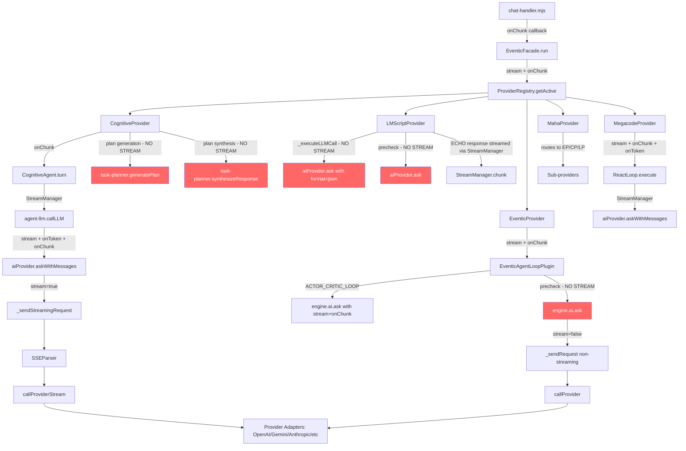

# Streaming Gaps Analysis — Agent Provider Pipeline

## Executive Summary

The agent provider pipeline has a well-designed streaming infrastructure at the top (chat-handler → WebSocket) and bottom (ai-provider adapters → SSE). However, **five significant streaming gaps** exist in the middle layers where LLM calls happen without streaming callbacks, causing the user to wait for full responses on calls that could stream incrementally.

**Current state**: ~60% of LLM calls in the pipeline are streamed. The gaps are concentrated in precheck calls, task planner operations, and the LMScript provider.

---

## Pipeline Architecture



**Red nodes** = LLM calls that currently do NOT stream.

---

## Streaming Gaps — Detailed Analysis

### Gap 1: EventicProvider Precheck (HIGH IMPACT)

**File**: [`eventic-agent-loop-plugin.mjs`](src/core/eventic-agent-loop-plugin.mjs:478)  
**Line**: 478  
**Call**: `engine.ai.ask(precheckInput, { recordHistory: false, model: ctx._requestModel })`

**What happens**: When the EventicProvider receives a simple question, it makes a precheck LLM call. If the model can answer directly, it returns the response — **without streaming**. The `stream` and `onChunk` parameters are available in the `payload` (line 349) but are not passed to the precheck `ask()` call.

**User impact**: For simple questions answered via precheck (estimated ~40-60% of all user queries), the user sees zero streaming — they wait for the full response, then it appears all at once.

**Fix complexity**: Low — forward `stream` and `onChunk` to the precheck `ask()` call.

**Fix**:
```javascript
// Line 478: Add streaming options
const preCheckResponse = await engine.ai.ask(precheckInput, { 
    recordHistory: false, 
    model: ctx._requestModel,
    stream,        // ADD
    onChunk,       // ADD
});
```

---

### Gap 2: LMScriptProvider LLM Calls (MEDIUM IMPACT)

**File**: [`lmscript-provider.mjs`](src/core/agentic/lmscript/lmscript-provider.mjs:453)  
**Line**: 450-465  
**Call**: `aiProvider.ask(userPrompt, { system, format: 'json', ... })`

**What happens**: The LMScript provider's core `_executeLLMCall()` uses `aiProvider.ask()` with `format: 'json'` and **no streaming callbacks**. The TODO on line 450 explicitly acknowledges this gap. A `StreamManager` is created per-run (line 162) but is only used to emit the final ECHO response text (line 336-338), not for the actual LLM calls.

**User impact**: LMScript users see no streaming for any LLM reasoning. The internal monologue, which could provide useful "thinking" feedback, is completely hidden.

**Complication**: The LLM is asked to return structured JSON (`format: 'json'`), which makes partial streaming of the JSON itself impractical. However, once the JSON is parsed and a final ECHO response is extracted, that response text IS streamed via StreamManager.

**Fix strategy**: 
1. **Internal monologue streaming** (new): Stream `action.internal_monologue` to the user as "thinking" commentary via `emitCommentary()` — not via `onChunk`.
2. **ECHO response token-level streaming**: Currently the ECHO response is emitted as a single chunk. We can't stream it token-by-token because it comes from parsed JSON, not from an LLM stream. The only way to get token-level streaming for the final response would be to make a second LLM call after the JSON response is parsed, using the ECHO text as a seed — but this adds latency.
3. **Alternative**: Use `askWithMessages()` with streaming for the LLM call, intercept the JSON as it streams, and emit partial tokens once we detect the response portion of the JSON structure. This is complex but possible.

**Recommended fix**: Forward streaming callbacks to `_executeLLMCall()` so that the raw LLM response is streamed at the HTTP/SSE level, then post-process the accumulated JSON. This gives the user real-time "tokens appearing" feedback even if the tokens are JSON structure. When an ECHO response is detected, stream it via the StreamManager.

---

### Gap 3: LMScriptProvider Precheck (MEDIUM IMPACT)

**File**: [`lmscript-provider.mjs`](src/core/agentic/lmscript/lmscript-provider.mjs:135)  
**Line**: 135  
**Call**: `aiProvider.ask(precheckPrompt, { signal, temperature: 0.3, recordHistory: false, model })`

**What happens**: Same pattern as Gap 1 — the LMScript precheck can answer simple questions directly but does not stream the response.

**User impact**: LMScript simple-answer queries show no streaming.

**Fix complexity**: Low — forward `onChunk` from options.

**Fix**:
```javascript
// Line 135: Add streaming options
const precheckResult = await aiProvider.ask(
    `Answer the following directly...`,
    { 
        signal: options.signal, 
        temperature: 0.3, 
        recordHistory: false, 
        model: options.model,
        stream: !!options.onChunk,    // ADD
        onChunk: options.onChunk,     // ADD
    }
);
```

---

### Gap 4: CognitiveProvider Task Planner (LOW-MEDIUM IMPACT)

**File**: [`cognitive-provider.mjs`](src/core/agentic/cognitive-provider.mjs:276)  
**Lines**: 278-280 (plan generation), 339 (synthesis)  
**Files also**: [`task-planner.mjs`](src/core/agentic/cognitive/task-planner.mjs:240) (generatePlan), [`task-planner.mjs`](src/core/agentic/cognitive/task-planner.mjs:422) (synthesizeResponse)

**What happens**: When the CognitiveProvider classifies a request as "complex", it enters the task planner path (`_runWithPlan()`). Three LLM calls in this path do NOT stream:

1. **`generatePlan()`** (task-planner.mjs:240): Calls `callLLM(messages, [], { signal })` — no streaming. Returns JSON, so streaming the plan itself is impractical. However, the plan generation LLM call could benefit from streaming feedback ("Planning...").

2. **`synthesizeResponse()`** (task-planner.mjs:422): Calls `callLLM(messages, [], { signal })` — this is the FINAL user-facing response and **should absolutely be streamed**. This is the synthesis of all plan step results.

3. **`executePlan()` → `executeTurn()`** (task-planner.mjs:345 → cognitive-provider.mjs:318): Each plan step calls `agent.turn()` with `options` which DOES include `onChunk` from the parent scope — so step execution IS streamed. However, the streaming goes to the main `onChunk` callback, meaning the UI will show streaming from each step mixed together without clear step boundaries.

**User impact**: The final synthesis response (which summarizes all work done) appears all at once instead of streaming. Plan generation also blocks with no feedback.

**Fix complexity**: Medium — need to thread `onChunk` through `callLLM` in `_runWithPlan()` for the synthesis call, and modify `synthesizeResponse()` to accept and forward streaming options.

**Fix for synthesis streaming**:
```javascript
// In cognitive-provider.mjs _runWithPlan(), line 339:
const callLLMWithStream = async (messages, tools, opts) => {
    return this._agent.callLLM(messages, tools, { 
        ...options, ...opts,
        onChunk: options.onChunk,  // Forward streaming
    });
};

const finalResponse = await synthesizeResponse(plan, stepResults, callLLMWithStream, {
    signal: options.signal,
});
```

**Note on plan step streaming**: Each plan step's `agent.turn()` already receives `onChunk` through the options spread, so individual step execution IS streamed. This is correct behavior — the user sees streaming output during each step.

---

### Gap 5: CognitiveProvider _runWithPlan Fallback (LOW IMPACT)

**File**: [`cognitive-provider.mjs`](src/core/agentic/cognitive-provider.mjs:289)  
**Line**: 290  
**Call**: `this._agent.turn(input, { signal: options.signal })`

**What happens**: When plan generation fails, the fallback calls `agent.turn()` but only passes `signal` — it drops `onChunk` and `model` from options.

**User impact**: If plan generation fails, the fallback response is not streamed.

**Fix complexity**: Trivial — pass full options.

**Fix**:
```javascript
// Line 290: Pass full options
const result = await this._agent.turn(input, { 
    signal: options.signal,
    onChunk: options.onChunk,  // ADD
    model: options.model,      // ADD
});
```

---

## What Already Works (Confirmed Streaming Paths)

| Path | Provider | Streaming Status |
|------|----------|-----------------|
| EventicProvider → ACTOR_CRITIC_LOOP → engine.ai.ask() | Eventic | ✅ Streams via `onChunk` param |
| EventicProvider → EXECUTE_TOOLS → ACTOR_CRITIC_LOOP | Eventic | ✅ Re-dispatches with `stream+onChunk` |
| CognitiveProvider → agent.turn() (simple path) | Cognitive | ✅ Streams via StreamManager |
| CognitiveAgent → callLLM → StreamManager → askWithMessages | Cognitive | ✅ SSE streaming with suppress/resume |
| CognitiveAgent → tool loop suppress/resume | Cognitive | ✅ Correctly suppresses during tools |
| CognitiveAgent → post-tool response | Cognitive | ✅ StreamManager resumed before synthesis |
| CognitiveAgent → continuation calls | Cognitive | ✅ StreamManager still active |
| MegacodeProvider → ReactLoop → StreamManager | Megacode | ✅ Full streaming with suppress/resume |
| MahaProvider → sub-provider delegation | Maha | ✅ Forwards options including onChunk |
| EventicAIPlugin → _sendStreamingRequest → SSEParser | All | ✅ Full SSE streaming pipeline |
| EventicAIPlugin → _stitchTruncatedResponse | All | ✅ Continuation tokens stream via same callbacks |
| LMScriptProvider → ECHO response | LMScript | ✅ StreamManager.chunk() for final response |

---

## Priority-Ordered Fix List

| # | Gap | Provider | Impact | Complexity | Fix Description |
|---|-----|----------|--------|------------|----------------|
| 1 | Precheck no-stream | EventicProvider | **HIGH** | Low | Forward `stream`+`onChunk` to precheck `ask()` call |
| 2 | Precheck no-stream | LMScriptProvider | **MEDIUM** | Low | Forward `onChunk` to precheck `ask()` call |
| 3 | Synthesis no-stream | CognitiveProvider | **MEDIUM** | Medium | Thread `onChunk` through `callLLM` wrapper to `synthesizeResponse()` |
| 4 | _runWithPlan fallback | CognitiveProvider | **LOW** | Trivial | Pass `onChunk` + `model` in fallback `turn()` call |
| 5 | LLM calls no-stream | LMScriptProvider | **LOW** | High | Add streaming to `_executeLLMCall()` (JSON format complication) |

---

## Implementation Plan

### Phase 1: Quick Wins (Gaps 1, 2, 4)

These are low-complexity fixes that enable streaming for the most common paths.

**Files to modify:**
- `src/core/eventic-agent-loop-plugin.mjs` — precheck streaming (Gap 1)
- `src/core/agentic/lmscript/lmscript-provider.mjs` — precheck streaming (Gap 2)  
- `src/core/agentic/cognitive-provider.mjs` — fallback streaming (Gap 4)

### Phase 2: Task Planner Synthesis (Gap 3)

Thread streaming through the task planner's synthesis path.

**Files to modify:**
- `src/core/agentic/cognitive-provider.mjs` — update `callLLM` wrapper in `_runWithPlan()`
- `src/core/agentic/cognitive/task-planner.mjs` — update `synthesizeResponse()` to accept streaming options

### Phase 3: LMScript LLM Streaming (Gap 5)

The most complex change — add streaming to the LMScript provider's core LLM calls.

**Files to modify:**
- `src/core/agentic/lmscript/lmscript-provider.mjs` — `_executeLLMCall()` streaming support

**Strategy**: Use `askWithMessages()` with streaming callbacks. The accumulated content is still parsed as JSON for the action schema, but individual tokens stream to the user during the LLM call. When the response is detected as an ECHO command, the StreamManager is used for the final response.

---

## Risk Assessment

| Risk | Likelihood | Mitigation |
|------|-----------|------------|
| Precheck streaming causes premature stream-start for responses that later go to agent loop | Medium | If precheck returns `___AGENT_PROCEED___`, the UI already received some streaming tokens. Chat-handler's fallback handles this — the `message-stream-end` event includes the full authoritative content. |
| LMScript JSON streaming shows raw JSON tokens to user | Low | StreamManager is suppressed during `_executeLLMCall()` — only ECHO responses are streamed. The streaming would only affect HTTP/SSE transport latency. |
| Task planner synthesis streaming conflicts with plan UI updates | Low | Synthesis streaming uses the same `onChunk` callback as regular responses — the chat-handler's batching handles this correctly. |
| Double-streaming if precheck streams tokens then falls through to agent loop | Medium | Need to ensure the chat-handler's `streamStarted` flag and `message-stream-end` reconciliation handle the case where precheck streams partial content, then the agent loop streams the real response. |

---

## Files Summary

| File | Changes Needed | Type |
|------|---------------|------|
| `src/core/eventic-agent-loop-plugin.mjs` | Forward `stream`+`onChunk` to precheck `ask()` | Minor |
| `src/core/agentic/lmscript/lmscript-provider.mjs` | Forward streaming to precheck; optionally to `_executeLLMCall()` | Minor → Moderate |
| `src/core/agentic/cognitive-provider.mjs` | Forward `onChunk`+`model` in `_runWithPlan` fallback; thread streaming to synthesis | Minor → Moderate |
| `src/core/agentic/cognitive/task-planner.mjs` | Accept streaming options in `synthesizeResponse()` | Minor |
