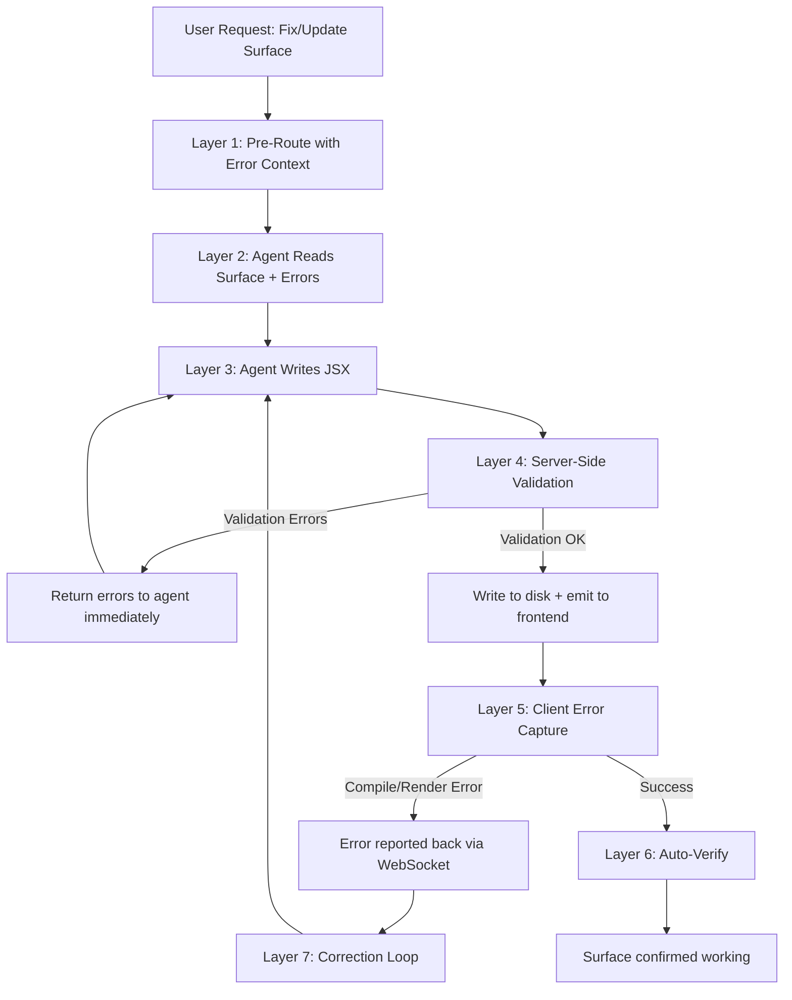

# Surface Debugging Overhaul: Root Cause Analysis & Bullet-Proof Solution

## Executive Summary

The surface debugging process fails repeatedly because **the agent operates blind** — it writes JSX to disk, receives a misleading "success" message, and has zero visibility into whether the component actually compiled and rendered in the browser. This document identifies 12 root causes and designs a 7-layer solution to make surface updates reliable.

---

## Root Cause Analysis

### 🔴 Critical: No Error Feedback Loop (The #1 Problem)

**File:** `src/execution/handlers/surface-handlers.mjs` (line 49)

When the agent calls `update_surface_component`, the handler writes the JSX to disk and returns:
```
"Updated component 'X' on surface 'Y' (3 total components, 1500 chars of JSX). The component is now live on the surface."
```

This is a **lie**. The component may fail to:
- Parse (syntax error in JSX)
- Compile (Babel transformation failure)
- Render (React Error #130 — undefined component type)
- Execute (runtime errors in hooks, missing state, etc.)

**The agent never learns about any of these failures.** It thinks everything worked. When the user says "it's broken," the agent has no error message to work from — it's guessing.

### 🔴 Critical: No JSX Validation Before Writing

**File:** `src/surfaces/surface-manager.mjs` (line 161-219)

The `updateComponent()` method blindly writes whatever string it receives as JSX. It performs zero validation:
- No syntax checking (bracket matching, valid JSX)
- No detection of known-bad patterns (`UI.AlertTitle`, `UI.Stack`, `import` statements)
- No structural validation (`export default function` required)
- No detection of non-existent `UI.*` components

### 🔴 Critical: Agent Never Verifies Its Work

**File:** `src/core/eventic-agent-loop-plugin.mjs` (line 251-261)

The surface update instructions tell the agent to `update_surface_component` with full source, but there is **no verification step**. The agent never:
1. Calls `capture_surface` to visually inspect
2. Waits for compilation feedback
3. Checks for client-side errors
4. Re-reads the component to verify it was written correctly

### 🟡 Significant: WRAPUP_TOOLS Prematurely Ends Surface Workflows

**File:** `src/core/agent-loop-helpers.mjs` (line 12-14)

```javascript
export const WRAPUP_TOOLS = new Set([
    'create_surface', 'attempt_completion'
]);
```

When `create_surface` succeeds, the evaluator injects: "Tool completed successfully. Provide a brief summary response to the user." This causes the agent to wrap up **before adding any components**, making the surface useless. The agent should continue to add components, not summarize.

### 🟡 Significant: Pre-Route Doesn't Include Client Errors

**File:** `src/core/agent-loop-preroute.mjs` (line 143-206)

The `preRouteSurfaces()` auto-fetches surface metadata and JSX source, but never includes:
- The latest compilation error from the frontend error boundary
- Console errors from the browser
- React error boundaries' messages

When the user says "the surface is broken," the agent gets the *source code* but not the *error message*. The agent has to guess what's wrong.

### 🟡 Significant: No Surface-Specific Error Detection

**File:** `src/core/agent-loop-helpers.mjs` (line 201-231)

The `evaluateToolResults()` function uses generic error patterns (`error:`, `ENOENT`, `TypeError`). When `update_surface_component` returns "Updated component..." — which is not an error pattern — the evaluator treats it as success and moves on. There's no understanding that a "successful" write may produce a broken component.

### 🟡 Significant: Tool Description Doesn't List Common Failure Modes

**File:** `src/tools/definitions/surface-tools.mjs` (line 32)

The `update_surface_component` tool description mentions using `UI.*` components but doesn't explicitly warn about the most common mistakes at the point of tool invocation. The system prompt's `COMPONENTS THAT DO NOT EXIST` section exists but is far removed from the actual tool call decision point.

### 🟠 Moderate: Pre-Route Detection is Fragile

**File:** `src/core/agent-loop-preroute.mjs` (line 96-129)

`detectSurfaceUpdateIntent()` uses regex patterns that miss valid requests:
- "the chart is not showing data" — "chart" isn't in the trigger regex
- "my app dashboard broke" — "app" may match but "dashboard" alone is ambiguous
- The `surfaceNameHint` extraction frequently fails to match against the actual surface name

### 🟠 Moderate: No Iterative Fix Mechanism

There's no mechanism to automatically:
1. Detect that a component render failed
2. Capture the specific error message
3. Re-read the component that was just written  
4. Fix the specific issue
5. Verify the fix worked
6. Repeat if still broken

The agent writes JSX and walks away. Each user retry starts from scratch.

### 🟠 Moderate: Context Confusion on Repeated Attempts

When the user asks to fix the same surface 20 times, the conversation grows with stale context. The transient messages are cleaned between requests, but the conversation history still accumulates old tool calls and results showing previous broken states. The agent may reference or be confused by prior failed attempts.

### 🟢 Minor: `capture_surface` Has 10-Second Timeout

**File:** `src/execution/handlers/surface-handlers.mjs` (line 285)

The screenshot capture uses a 10-second timeout which may not be enough if the surface has complex components that need time to render. Also, if the surface tab isn't active/visible, the screenshot may show the wrong thing.

### 🟢 Minor: No Component-Level Error Isolation

If one component on a surface crashes, the entire surface may white-screen. There's no per-component error boundary in the rendering system, meaning a small bug in one component destroys the whole surface view, making debugging harder.

---

## Solution Architecture: 7-Layer Bullet-Proof Surface Process



---

### Layer 1: Server-Side JSX Validation

**File to modify:** `src/surfaces/surface-manager.mjs`

Add a `validateJsxSource()` static method that catches the most common errors *before* writing to disk:

```javascript
static validateJsxSource(jsxSource) {
    const errors = [];
    const warnings = [];
    
    // 1. Must not be empty
    if (!jsxSource || !jsxSource.trim()) {
        errors.push('jsx_source is empty');
        return { valid: false, errors, warnings };
    }
    
    // 2. Must export a default function component
    if (!/export\s+default\s+function\b/.test(jsxSource)) {
        errors.push('Missing "export default function ComponentName". Every surface component must export a default function component.');
    }
    
    // 3. Must not use import statements (sandbox doesn't support them)
    const importMatch = jsxSource.match(/^import\s+.+from\s+['"].+['"]/m);
    if (importMatch) {
        errors.push(`Found import statement: "${importMatch[0]}". Surface components cannot use imports — React, useState, useEffect, UI.*, surfaceApi, and useSurfaceLifecycle are all globals.`);
    }
    
    // 4. Check for non-existent UI components
    const BAD_COMPONENTS = {
        'UI.AlertTitle': 'Use <div className="font-semibold"> inside UI.Alert',
        'UI.AlertDescription': 'Use <div className="text-sm"> inside UI.Alert',
        'UI.Stack': 'Use <div className="flex flex-col gap-2">',
        'UI.Icons.Atom': 'Use UI.Icons.Activity instead',
        'UI.Icons.Orbit': 'Use UI.Icons.RefreshCw instead',
        'UI.Icons.Cpu': 'Use UI.Icons.Terminal instead',
    };
    for (const [bad, fix] of Object.entries(BAD_COMPONENTS)) {
        if (jsxSource.includes(bad)) {
            errors.push(`"${bad}" does not exist and will cause React Error #130. Fix: ${fix}`);
        }
    }
    
    // 5. Check for balanced braces/brackets
    let braceCount = 0, parenCount = 0, bracketCount = 0;
    for (const ch of jsxSource) {
        if (ch === '{') braceCount++;
        else if (ch === '}') braceCount--;
        else if (ch === '(') parenCount++;
        else if (ch === ')') parenCount--;
        else if (ch === '[') bracketCount++;
        else if (ch === ']') bracketCount--;
    }
    if (braceCount !== 0) errors.push(`Unbalanced braces: ${braceCount > 0 ? braceCount + ' unclosed {' : Math.abs(braceCount) + ' extra }'}`);
    if (parenCount !== 0) errors.push(`Unbalanced parentheses: ${parenCount > 0 ? parenCount + ' unclosed (' : Math.abs(parenCount) + ' extra )'}`);
    if (bracketCount !== 0) warnings.push(`Unbalanced brackets: ${bracketCount > 0 ? bracketCount + ' unclosed [' : Math.abs(bracketCount) + ' extra ]'}`);
    
    // 6. Check for common React mistakes
    if (/\buseState\b/.test(jsxSource) && !/\bconst\s+\[/.test(jsxSource)) {
        warnings.push('useState called but no destructuring found. Pattern should be: const [value, setValue] = useState(initial)');
    }
    
    return {
        valid: errors.length === 0,
        errors,
        warnings,
    };
}
```

### Layer 2: Enhanced `updateSurfaceComponent` Handler with Validation

**File to modify:** `src/execution/handlers/surface-handlers.mjs`

The handler should run validation and return structured feedback:

```javascript
async updateSurfaceComponent(args) {
    try {
        const { surface_id, component_name, jsx_source, props, order } = args;

        // ── VALIDATION GATE ──
        const validation = SurfaceManager.validateJsxSource(jsx_source);
        if (!validation.valid) {
            return `[error] update_surface_component: JSX validation failed for '${component_name}':\n` +
                validation.errors.map(e => `  ❌ ${e}`).join('\n') +
                (validation.warnings.length > 0 ? '\n' + validation.warnings.map(w => `  ⚠️ ${w}`).join('\n') : '') +
                `\n\nFix these errors and re-submit the COMPLETE jsx_source.`;
        }

        // Check if the component already existed
        const existingSurface = await this.surfaceManager.getSurface(surface_id);
        const wasExisting = existingSurface?.components?.some(c => c.name === component_name);

        const surface = await this.surfaceManager.updateComponent(
            surface_id, component_name, jsx_source, props, order
        );

        const component = surface.components.find(c => c.name === component_name);
        
        if (this.eventBus) {
            this.eventBus.emit('surface:updated', {
                surfaceId: surface_id,
                component,
                source: jsx_source,
                layout: surface.layout
            });
        }

        const action = wasExisting ? 'Updated' : 'Created';
        const sourceLen = jsx_source ? jsx_source.length : 0;
        const compCount = surface.components.length;
        
        let result = `${action} component '${component_name}' on surface '${surface.name}' (${compCount} total components, ${sourceLen} chars of JSX).`;
        
        // Include validation warnings
        if (validation.warnings.length > 0) {
            result += '\n⚠️ Warnings:\n' + validation.warnings.map(w => `  - ${w}`).join('\n');
        }
        
        // ── KEY CHANGE: Don't say "live" — say "written, awaiting render" ──
        result += '\n\nComponent source written to disk and sent to the frontend for rendering.';
        result += '\nIMPORTANT: Use capture_surface to verify the component renders correctly, or ask the user if it looks right.';
        
        return result;
    } catch (error) {
        return `[error] update_surface_component: ${error.message}. Use list_surfaces to verify surface_id, or read_surface to check existing components.`;
    }
}
```

### Layer 3: Client-Side Error Capture and Report-Back

**Frontend changes needed** (conceptual — actual UI code would be in `ui/`):

The frontend's surface renderer should:
1. Wrap each component in an error boundary
2. Catch compilation errors from Babel/SWC
3. Report errors back via WebSocket: `surface:component-error`
4. Store the last error in a field the server can query

**Server-side:** Store the latest client error in the surface metadata:

```javascript
// In surface-manager.mjs
async setComponentError(surfaceId, componentName, error) {
    const surface = await this.getSurface(surfaceId);
    if (!surface) return;
    
    if (!surface._clientErrors) surface._clientErrors = {};
    surface._clientErrors[componentName] = {
        message: error.message,
        stack: error.stack?.substring(0, 500),
        timestamp: new Date().toISOString()
    };
    
    await fs.writeFile(
        path.join(this.surfacesDir, `${surfaceId}.sur`),
        JSON.stringify(surface, null, 2)
    );
}

async clearComponentError(surfaceId, componentName) {
    const surface = await this.getSurface(surfaceId);
    if (!surface || !surface._clientErrors) return;
    delete surface._clientErrors[componentName];
    await fs.writeFile(
        path.join(this.surfacesDir, `${surfaceId}.sur`),
        JSON.stringify(surface, null, 2)
    );
}
```

### Layer 4: Enhanced `read_surface` with Error Context

**File to modify:** `src/execution/handlers/surface-handlers.mjs`

Add client error context to the `readSurface` output:

```javascript
// After the component source lines, add error context:
if (surface._clientErrors && Object.keys(surface._clientErrors).length > 0) {
    lines.push('');
    lines.push('--- CLIENT-SIDE ERRORS (from last render) ---');
    for (const [compName, err] of Object.entries(surface._clientErrors)) {
        lines.push(`❌ ${compName}: ${err.message}`);
        if (err.stack) lines.push(`   Stack: ${err.stack}`);
    }
    lines.push('');
    lines.push('FIX THESE ERRORS by modifying the component source above and calling update_surface_component.');
}
```

### Layer 5: Pre-Route Injects Error Context

**File to modify:** `src/core/agent-loop-preroute.mjs`

Enhance `preRouteSurfaces()` to include client errors prominently:

```javascript
// After reading the surface, check for client errors
if (readStr.includes('CLIENT-SIDE ERRORS')) {
    return `[SURFACE CONTEXT — AUTO-FETCHED]\n` +
        `⚠️ THIS SURFACE HAS ACTIVE ERRORS — see CLIENT-SIDE ERRORS section below.\n\n${readStr}\n\n` +
        `[SURFACE FIX WORKFLOW]:\n` +
        `1. Read the CLIENT-SIDE ERRORS section above — these are the actual errors from the browser.\n` +
        `2. Find the component source code that's causing the error.\n` +
        `3. Fix ONLY the specific issue described in the error — do NOT rewrite the entire component.\n` +
        `4. Submit the COMPLETE fixed source via update_surface_component.\n` +
        `5. After updating, call capture_surface to verify the fix worked.\n`;
}
```

### Layer 6: Surface-Aware Tool Evaluation

**File to modify:** `src/core/agent-loop-helpers.mjs`

Add surface-specific evaluation logic:

```javascript
// In evaluateToolResults(), add surface-aware checks:

// After a surface update, prompt verification
const hasSurfaceUpdate = toolNames.includes('update_surface_component');
if (hasSurfaceUpdate && allSucceeded) {
    return 'You just updated a surface component. To verify it rendered correctly, either:\n' +
        '1. Call capture_surface with the surface_id to take a screenshot, OR\n' +
        '2. Call read_surface to check for any client-side errors.\n' +
        'Do NOT assume the update was successful — verify first, then report to the user.';
}
```

### Layer 7: Remove `create_surface` from WRAPUP_TOOLS

**File to modify:** `src/core/agent-loop-helpers.mjs`

```javascript
export const WRAPUP_TOOLS = new Set([
    'attempt_completion'
    // Removed 'create_surface' — creating a surface is step 1, not the final step.
    // The agent must continue to add components after creating the surface.
]);
```

---

## Enhanced System Prompt: Surface Section

**File to modify:** `src/core/system-prompt.mjs`

Replace the current surface update instructions with this more prescriptive version:

```
## Surfaces
Create dynamic UI pages with live React components.

**To build a NEW surface:**
1. `create_surface` — create blank surface page
2. `update_surface_component` — add React components one at a time
3. `capture_surface` — verify each component renders correctly

**To UPDATE/FIX an existing surface:**
1. `read_surface` — ALWAYS read the current source and errors FIRST
2. If CLIENT-SIDE ERRORS are shown, fix ONLY the specific error
3. `update_surface_component` — submit the COMPLETE modified source
4. `capture_surface` or `read_surface` — VERIFY the fix worked
5. If errors persist, read the new error and iterate

**⚠️ MANDATORY VERIFICATION:**
- After EVERY `update_surface_component` call, you MUST verify the result
- Call `capture_surface` to see the rendered output, OR
- Call `read_surface` to check for client-side errors
- NEVER assume an update was successful without verification
- If verification shows errors, fix them before moving on

**⚠️ CRITICAL UPDATE RULES:**
- NEVER update a surface component without first reading its current source
- NEVER submit partial source code — the entire component must be in jsx_source
- NEVER lose existing features when fixing a bug
- NEVER use import statements — all globals are pre-loaded
- NEVER use UI.AlertTitle or UI.AlertDescription — they don't exist
- NEVER use UI.Stack — use div with Tailwind flex classes
- If you see an error about undefined component, check the COMPONENTS THAT DO NOT EXIST list

**COMMON ERRORS AND FIXES:**
| Error | Cause | Fix |
|-------|-------|-----|
| React Error #130 | Using a UI component that doesn't exist | Check available UI.* list |
| Unexpected token | Syntax error in JSX | Check bracket/brace balance |
| X is not defined | Using import or undeclared variable | All UI/React globals are available without import |
| Cannot read property of undefined | State not initialized | Initialize useState with proper default |
| Maximum update depth exceeded | useEffect dependency loop | Check useEffect dependencies |
```

---

## Implementation Plan

### Phase 1: Server-Side Validation (Immediate Impact, Low Risk)
1. Add `validateJsxSource()` to `SurfaceManager`
2. Call validation in `updateSurfaceComponent` handler
3. Return validation errors as tool errors (agent can self-correct)
4. Remove `create_surface` from `WRAPUP_TOOLS`

### Phase 2: Enhanced Agent Loop Integration (Medium Impact, Low Risk)
5. Add surface-update verification guidance to `evaluateToolResults()`
6. Enhance `update_surface_component` tool response message
7. Update system prompt with mandatory verification workflow
8. Improve `update_surface_component` tool description with common errors

### Phase 3: Client Error Capture (High Impact, Medium Risk)
9. Add `setComponentError()` / `clearComponentError()` to SurfaceManager
10. Add client error display to `readSurface` handler output
11. Listen for `surface:component-error` events from frontend
12. Update `preRouteSurfaces()` to highlight errors prominently

### Phase 4: Frontend Error Boundaries (High Impact, Higher Risk)  
13. Add per-component error boundaries in the surface renderer
14. Report compilation errors back via WebSocket
15. Report render errors back via WebSocket
16. Show inline error UI on the surface itself

### Phase 5: Auto-Verification Loop (Highest Impact, Requires Phase 3-4)
17. After `update_surface_component`, wait 2 seconds for client error reports
18. If errors received, automatically inject them as tool result amendment
19. Trigger correction loop without user intervention
20. Cap correction loops at 3 attempts before asking user

---

## Files to Modify

| File | Changes | Phase |
|------|---------|-------|
| `src/surfaces/surface-manager.mjs` | Add `validateJsxSource()`, `setComponentError()`, `clearComponentError()` | 1, 3 |
| `src/execution/handlers/surface-handlers.mjs` | Validation gate, better response messages, error context in `readSurface` | 1, 2, 3 |
| `src/core/agent-loop-helpers.mjs` | Remove `create_surface` from WRAPUP_TOOLS, add surface-aware evaluation | 1, 2 |
| `src/core/system-prompt.mjs` | Enhanced surface instructions with mandatory verification | 2 |
| `src/tools/definitions/surface-tools.mjs` | Better tool descriptions with common errors | 2 |
| `src/core/agent-loop-preroute.mjs` | Include error context in pre-routed surface data | 3 |
| `src/core/agent-loop-tool-handler.mjs` | Post-update error wait and injection | 5 |
| `ui/src/components/surfaces/*` | Per-component error boundaries, error reporting | 4 |

---

## Expected Impact

| Failure Mode | Before | After |
|-------------|--------|-------|
| Non-existent UI component (e.g., UI.AlertTitle) | Agent writes it, no error feedback, user sees white screen | **Caught by validation, agent gets error before write** |
| Syntax error in JSX | Written to disk, renders blank, agent doesn't know | **Caught by validation (bracket check) or client error capture** |
| Import statements | Written, fails silently in sandbox | **Caught by validation** |
| Missing export default | Written, renders nothing | **Caught by validation** |
| Runtime hook error | Written, crashes on render, agent doesn't know | **Captured by error boundary, reported back** |
| Agent doesn't verify its work | Always — no prompt to verify | **evaluateToolResults forces verification step** |
| Agent wraps up after create_surface | WRAPUP_TOOLS causes premature finish | **Removed from WRAPUP_TOOLS** |
| Agent rewrites from scratch on fix | No instruction against it | **System prompt explicitly says "fix ONLY the specific error"** |
